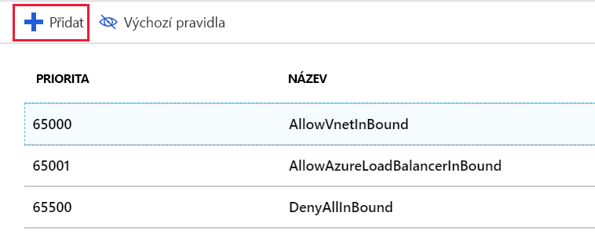
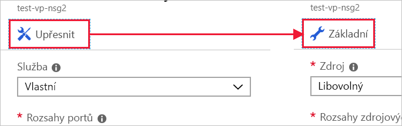
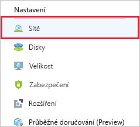
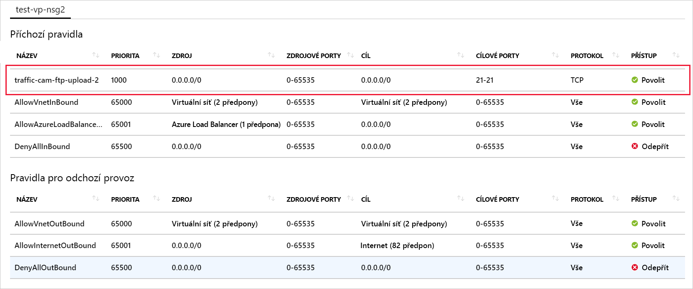

Náš server je připravený na zpracování video dat. Poslední, co musíme udělat, je otevřít porty, pomocí kterých budou dopravní kamery nahrávat video soubory na náš server.

## Vytvoření skupiny zabezpečení sítě

Služba Azure měla vytvořit skupinu zabezpečení, protože jsme uvedli, že chceme přístup přes Vzdálenou plochu. Pojďme vytvořit novou skupinu zabezpečení, abyste si prošli celý postup. To je zvlášť důležité, pokud se rozhodnete vytvořit virtuální síť _před_ virtuálními počítači. Jak už jsme zmínili dřív, skupiny zabezpečení jsou _volitelné_ a nemusí se nutně vytvořit se sítí.

> [!NOTE]
> Protože _má jít_ o druhý virtuální počítač, už bychom skupinu zabezpečení k použití na naši síť měli. Pojďme ale na chvíli předstírat, že ji nemáme nebo že se pravidla pro tento virtuální počítač liší.

1. Na portálu [Azure Portal](https://portal.azure.com/learn.docs.microsoft.com?azure-portal=true) kliknutím na tlačítko **Vytvořit prostředek** na bočním panelu v levém rohu začněte vytvářet nový prostředek.

1. Do pole filtru zadejte „Skupina zabezpečení sítě“ a ze seznamu vyberte odpovídající položku.

1. Ověřte, že je vybraný model nasazení **Správce prostředků**, a klikněte na **Vytvořit**.

1. Zadejte **název** skupiny zabezpečení. I tady je vhodné dodržovat zásady vytváření názvů. Pro „testovací skupinu zabezpečení sítě pro zpracování videa č. 2“ použijeme „test-vp-nsg2“.

1. Vyberte správné **Předplatné** a použijte stávající **skupinu prostředků**, „<rgn>[název sandboxové skupiny prostředků]</rgn>“.

1. Nakonec ji dejte do stejného **umístění** jako virtuální počítač / virtuální síť. Je to důležité, protože pokud je v jiném umístění, nebudete moct prostředek použít.

1. Vytvořte skupinu kliknutím na **Vytvořit**.

## Přidání nového příchozího pravidla do skupiny zabezpečení sítě

Nasazení by mělo proběhnout rychle.

1. Na webu Azure Portal vyhledejte prostředek nové skupiny zabezpečení a vyberte ho.

1. Na stránce přehledu zjistíte, že jsou v něm vytvořená výchozí pravidla, která zamknou síť.

    Na příchozí straně:

    - Veškerý příchozí provoz z jedné virtuální sítě do jiné je povolený. To znamená, že prostředky ve virtuální síti spolu můžou navzájem komunikovat.
    - Test paměti nástroje pro vyrovnávání zatížení Azure vyžaduje, aby byl virtuální počítač aktivní.
    - Veškerý ostatní příchozí provoz je zamítnutý.

    Na odchozí straně:
    - Veškerý provoz v rámci virtuální sítě je povolený.
    - Veškerý odchozí provoz do internetu je povolený.
    - Veškerý další odchozí provoz je zakázaný.

> [!NOTE]
> Tato výchozí pravidla mají nastavenu vysokou prioritu. To znamená, že se vyhodnocují _jako poslední_. Nelze je změnit ani odstranit, ale můžete je _přepsat_ vytvořením konkrétnějších pravidel, která odpovídají vašemu provozu a mají nižší prioritu.

1. Na panelu **Nastavení** skupiny zabezpečení klikněte na oddíl **Příchozí pravidla zabezpečení**.

1. Pokud chcete přidat nové pravidlo zabezpečení, klikněte na **+ Přidat**.

    

    Existují dva způsoby, jak zadat potřebné informace o pravidlu zabezpečení: základní a rozšířený. Můžete mezi nimi přepínat kliknutím na tlačítko nahoře na panelu pro přidání.

    

    V rozšířeném režimu můžete pravidlo zcela přizpůsobit. Pokud ale potřebujete jenom nakonfigurovat známý protokol, je práce v základním režimu jednodušší.

1. Panel se spustí v **rozšířeném** režimu. Kliknutím na tlačítko **Základní** v horní části stránky přepněte na základní režim, ve kterém se vyplňuje méně možností.

1. Přidejte informace o pravidlu FTP.

    - **Službu** nastavte na FTP. Tím se nastaví rozsah portů.
    - **Prioritu** nastavte na 1000. Číslo musí být nižší než má výchozí pravidlo **Odepřít**. Rozsah může začínat libovolnou hodnotou, doporučuje se ale nechat si místo pro případ, že byste později potřebovali vytvořit výjimku.
    - Pojmenujte pravidlo. My použijeme název „traffic-cam-ftp-upload-2“.
    - Zadejte popis pravidla.

1. Přepněte zpět na **rozšířený** režim kliknutím na tlačítko **Rozšířený** v horní části. Všimněte si, že naše nastavení tam pořád je. Na tomto panelu můžeme provést podrobnější nastavení. Pravděpodobně budeme chtít omezit **zdroj** na určitou IP adresu nebo jejich rozsah vyhrazený pro kamery. Pokud znáte aktuální IP adresu místního počítače, můžete ji vyzkoušet. Jinak nechte nastavení na hodnotě Jakýkoliv, abyste mohli pravidlo otestovat.

1. Kliknutím na **Přidat** vytvořte pravidlo. Tím se aktualizuje seznam příchozích pravidel. Všimněte si, že jsou seřazená podle priority a v tomto pořadí se také budou vyhodnocovat.

## Použití skupiny zabezpečení

Skupinu zabezpečení můžeme použít v síťovém rozhraní, pokud chcete chránit jeden virtuální počítač, nebo v podsíti, kde se použije pro všechny prostředky v dané podsíti. Druhý přístup je častější a použijeme ho i my. K tomuto prostředku se v Azure můžeme dostat buď přes prostředek virtuální sítě, nebo nepřímo přes virtuální počítač, který tuto virtuální síť používá.

1. Přepněte na panel **Přehled** příslušného virtuálního počítače. Virtuální počítač najdete v části **Všechny prostředky**.

1. V oddílu **Nastavení** vyberte položku **Sítě**.

    

1. Ve vlastnostech sítí najdete informace o sítích použitých pro virtuální počítač, včetně položky **Virtuální síť/podsíť**. Kliknutím na tento odkaz přejděte k prostředku. Kliknutím otevřete virtuální síť. Tento odkaz je _také_ na panelu **Přehled** virtuálního počítače. Oběma postupy otevřete panel **Přehled** virtuální sítě.

1. V části **Nastavení** vyberte položku **Podsítě**.

1. Měli bychom mít definovanou jednu podsíť (výchozí) vytvořenou dříve při vytváření virtuálního počítače a sítě. Po kliknutí na položku v seznamu se zobrazí podrobné informace.

1. Klikněte na položku **Skupina zabezpečení sítě**.

1. Vyberte novou skupinu zabezpečení: **test-vp-nsg2**.

1. Kliknutím na **Uložit** uložte změnu. Bude chvíli trvat, než se v síti projeví.

## Ověření pravidel

Pojďme změnu ověřit.

1. Přepněte zpět na panel **Přehled** virtuálního počítače. Virtuální počítač najdete v části **Všechny prostředky**.

1. V oddílu **Nastavení** vyberte položku **Sítě**.

1. Na panelu **Přehled** sítě je odkaz **Platná pravidla zabezpečení**, který vám rychle ukáže, jak se budou pravidla vyhodnocovat. Po kliknutí na odkaz se otevře analýza. Zkontrolujte, že se pravidlo FTP zobrazuje.

    

1. Toto pravidlo by vám umožnilo připojit se k serveru FTP. Pokud jsme přidali roli pracovního procesu FTP a nakonfigurovali složky, měli byste mít možnost připojit se k serveru pomocí klienta FTP.

## Ještě jedna věc

Správné nastavení pravidel zabezpečení vyžaduje trochu pozornosti. Při použití nové skupiny zabezpečení jsme ve skutečnosti udělali chybu, kvůli které jsme ztratili přístup přes Vzdálenou plochu. Opravíte to tak, že k této skupině zabezpečení přidáte další pravidlo, které podporuje přístup přes protokol RDP. Ujistěte se, že příchozí adresy TCP/IP pro toto pravidlo jsou omezené na vaše vlastní.

> [!WARNING]
> Vždy se ujistěte, že porty používané pro správu jsou zamčené. Ještě lepší je vytvořit síť VPN, která virtuální síť propojí s vaší soukromou sítí a povolí jenom požadavky protokolu RDP nebo SSH z daného rozsahu adres. Můžete také změnit port používaný protokolem RDP na jinou hodnotu než výchozí 3389. Mějte na paměti, že změna portů není dostatečným opatřením pro zastavení útoků, jen trochu znesnadňuje zjišťování portů.