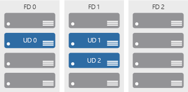
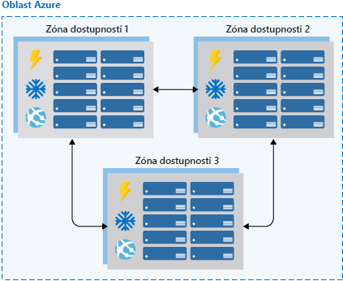

Vysoká dostupnost zajišťuje, že vaše architektura zvládne selhání. Představte si, že zodpovídáte za systém, který musí být vždy plně funkční. K selháním může docházet a také k nim docházet bude, takže jak zajistíte, aby váš systém zůstal online v případě, že se něco pokazí? Jak lze provést údržbu bez přerušení poskytování služeb? 

V tomto článku zjistíte, proč je vysoká dostupnost potřeba, vyhodnotíte požadavky aplikací na vysokou dostupnost a zjistíte, jak vám platforma Azure pomáhá splnit vaše cíle dostupnosti.

## Co je vysoká dostupnost?

> [!VIDEO https://www.microsoft.com/videoplayer/embed/RE2yEvc]

Vysoce dostupná služba vstřebává kolísání dostupnosti, zatížení a dočasných selhání závislých služeb a hardwaru. Aplikace zůstává online a dostupná (nebo to tak vypadá) a přitom přijatelně funguje. Tuto dostupnost často definují obchodní požadavky, cíle obchodních služeb (SLO) nebo smlouvy o úrovni služeb (SLA).

Účelem vysoké dostupnosti je hlavně schopnost zvládat ztrátu nebo výrazné snížení výkonu některé komponenty systému. Může se to stát třeba v případě, že virtuální počítač hostující aplikaci přejde kvůli selhání hostitele do offline režimu. Jindy může důvodem být plánovaná údržba, při níž je potřeba upgradovat systém. Důvodem může být dokonce i selhání služby v cloudu. Když identifikujete místa možného selhání systému a integrujete možnosti reakce na tato selhání, zajistíte, že služby, které nabízíte svým zákazníkům, zůstanou online.

Vysoká dostupnost služby obvykle vyžaduje vysokou dostupnost komponent, ze kterých se služba skládá. Představte si web, který nabízí online tržiště pro nákup zboží. Služba, kterou zákazníkům nabízíte, je možnost vypsat, koupit a prodat věci online. K poskytování této služby budete potřebovat několik komponent: databázi, webové servery, aplikační servery atd. Každá z těchto komponent může selhat, takže musíte identifikovat, jaké jsou vaše body selhání a kde se nacházejí, a určit, jak tyto body selhání opravit ve vaší architektuře.

## Posouzení vysoké dostupnosti architektury

Posouzení vysoké dostupnosti aplikace zahrnuje tři kroky:

1. Určení smlouvy SLA vaší aplikace
1. Posouzení možností zajištění vysoké dostupnosti aplikace
1. Posouzení možností zajištění vysoké dostupnosti závislých aplikací

Pojďme si tyto kroky popsat podrobněji.

### Určení smlouvy SLA vaší aplikace

Smlouva o úrovni služeb (SLA) je smlouva mezi poskytovatelem služeb a jejich příjemcem, ve které se poskytovatel služeb zavazuje k zajištění určité standardní úrovně služeb hodnocené na základě měřitelných metrik a definované odpovědnosti. Smlouvy SLA můžou být přesně vymezené a právně závazné nebo může jít o předpokládané očekávání dostupnosti ze strany zákazníků. Metriky služeb se obvykle zaměřují na propustnost, kapacitu a dostupnost služeb. Všechny tyto metriky se můžou měřit různými způsoby. Bez ohledu na konkrétní metriky uvedené ve smlouvě SLA může mít nedodržení smlouvy SLA pro poskytovatele služeb závažné finanční důsledky. Běžnou součástí smluv SLA je záruka finanční náhrady v případě neplnění smlouvy.

Cílové úrovně služeb (SLO – Service Level Objective) jsou hodnoty cílové metriky, které se používají k měření výkonu, spolehlivosti nebo dostupnosti. Může se jednat o metriky, které definují výkon zpracování žádostí v milisekundách, dostupnost služeb v minutách za měsíc nebo počet požadavků zpracovaných za hodinu. Vyhodnocením metrik, kterým je vaše aplikace vystavená, a pochopením toho, co zákazníci používají jako míru kvality, můžete definovat přijatelné a nepřijatelné rozsahy pro tyto cílové úrovně služeb (SLO). Definováním těchto cílů jasně nastavíte cíle a očekávání týmům, kteří podporují tyto služby, i zákazníkům, kteří je využívají. Tyto cílové úrovně služeb (SLO) pomůžou určit, jestli celkově splňujete podmínky smlouvy SLA.

V následující tabulce jsou uvedeny potenciální kumulativní výpadky pro různé úrovně SLA. 

| SLA | Výpadek za týden | Výpadek za měsíc | Výpadek za rok |
| --- | --- | --- | --- |
| 99 % |1,68 hodiny |7,2 hodiny |3,65 dne |
| 99,9 % |10,1 minuty |43,2 minuty |8,76 hodiny |
| 99,95 % |5 minut |21,6 minuty |4,38 hodiny |
| 99,99 % |1,01 minuty |4,32 minuty |52,56 minuty |
| 99,999 % |6 sekund |25,9 sekund |5,26 minuty |

Je samozřejmé, že pokud je všechno ostatní stejné, je vyšší dostupnost lepší. Ale při snaze o dosažení dalších devítek zjistíte, že významně rostou náklady a složitost dosažení dané úrovně dostupnosti. Dostupnost 99,99 % znamená asi 5 minut celkového součtu výpadků za měsíc. Stojí vyšší složitost a náklady za získání páté devítky? Odpověď závisí na obchodních požadavcích. 

Při definování SLA je dobré vzít v úvahu ještě další věci:

* Chcete-li dosáhnout čtyř devítek (99,99 %), pravděpodobně už nemůžete spoléhat na ruční zásah při zotavení po selhání. Aplikace musí mít schopná se sama monitorovat a opravovat. 
* Nad hranicí čtyř devítek už není snadné rozpoznat výpadek dostatečně rychle, aby mohla být smlouva SLA dodržena.
* Vezměte si třeba časový interval, ve kterém se vaše smlouva SLA měří. Čím menší interval, tím těsnější je tolerance. Pravděpodobně nemá smysl definovat vaše smlouvy SLA na základě dostupnosti v intervalu několika hodin nebo dnů. 

Identifikace smluv SLA je důležitým prvním krokem při určování možností zajištění vysoké dostupnosti, který bude vaše architektura vyžadovat. Pomůžou vám rozhodnout, jakým způsobem zajistíte vysokou dostupnost vaší aplikace.

### Posouzení možností zajištění vysoké dostupnosti aplikace

Pokud chcete posoudit možnosti zajištění vysoké dostupnosti vaší aplikace, proveďte další analýzu. Zaměřte se na kritické prvky způsobující selhání a důležité komponenty, jejichž nedostupnost, chybná konfigurace nebo neočekávané chování by měly na aplikaci velký vliv. V oblastech, kde dochází k redundanci, určete, jestli aplikace dokáže rozpoznat chybové stavy a sama se opravit.

Bude potřeba pečlivě posoudit všechny komponenty vaší aplikace, včetně částí určených k poskytování funkcí vysoké dostupnosti, jako jsou nástroje pro vyrovnávání zatížení. Kritické prvky způsobující selhání bude potřeba upravit a integrovat do nich možnosti zajištění vysoké dostupnosti, nebo je bude nutné nahradit službami, které poskytují možnosti zajištění vysoké dostupnosti.

### Posouzení možností zajištění vysoké dostupnosti závislých aplikací

Budete muset porozumět nejen požadavkům, které je podle smlouvy SLA k vaší aplikaci třeba zajistit příjemci, ale také požadavkům poskytnutých smluv SLA všech prostředků, na kterých může vaše aplikace záviset. Pokud se zákazníkům zavazujete k zajištění 99,9% dostupnosti, ale služba, na které vaše aplikace závisí, má závazek pouze na 99% dostupnost, můžete se vystavit riziku neplnění vaší smlouvy SLA se zákazníky. Pokud závislá služba nedokáže nabídnout dostatečnou smlouvu SLA, možná budete muset upravit vlastní smlouvu SLA, nahradit závislý prostředek nějakým jiným nebo najít způsob, jak zajistit plnění vaší smlouvy SLA v případě nedostupnosti závislého prostředku. Podle konkrétního scénáře a povahy závislosti je možné dočasně obejít selhávající závislé prostředky s využitím řešení, jako jsou mezipaměti a pracovní fronty.

## Vysoce dostupná platforma Azure

Cloudová platforma Azure je navržená tak, aby poskytovala vysokou dostupnost pro všechny své služby. Stejně jako jakýkoli systém můžou být i aplikace ovlivňovány událostmi hardwarové i softwarové platformy. Potřeba navrhnout architekturu aplikace tak, aby zvládla selhání, je klíčová, a cloudová platforma Azure poskytuje nástroje a možnosti, které k zajištění vysoké dostupnosti aplikací potřebujete. Při zvažování vysoké dostupnosti pro vaši architekturu v Azure je potřeba znát několik základních konceptů:

* Skupiny dostupnosti
* Zóny dostupnosti
* Vyrovnávání zatížení
* Možnosti vysoké dostupnosti PaaS (platforma jako služba)

### Skupiny dostupnosti

Skupiny dostupnosti představují způsob, jak můžete Azure sdělit, že se virtuální počítače patřící do stejné úlohy aplikace mají distribuovat, aby se zabránilo dopadu selhání hardwaru a plánované údržby na všechny z nich. Skupiny dostupnosti se skládají z *aktualizačních domén* a *domén selhání*.

Aktualizační domény zajišťují, aby vždy zůstala v provozu podmnožina serverů vaší aplikace, když je z důvodu údržby potřeba vypnout hostitele virtuálních počítačů v datacentru Azure. Většinu aktualizací je možné provést bez ovlivnění virtuálních počítačů, které jsou na nich spuštěné, ale existují situace, kdy to možné není. Aby se zajistilo, že nedojde k aktualizaci v celém datacentru najednou, je datacentrum Azure logicky rozdělené na aktualizační domény. V případě události údržby, jako je například aktualizace výkonu a instalace důležité opravy zabezpečení na hostiteli, se aktualizace provede postupně v jednotlivých aktualizačních doménách. Rozdělením aktualizací pomocí aktualizačních domén se zajistí, že během aktualizací a oprav platformy nebude celé datacentrum nedostupné.

Zatímco aktualizační domény představují logickou část datacentra, domény selhání představují fyzické části datacentra, které zajišťují rozdělení serverů ve skupině dostupnosti do různých rackových skříní. Domény selhání odpovídají fyzickému rozdělení sdíleného hardwaru v datacentru. To zahrnuje napájení, chlazení a síťový hardware, který podporuje fyzické servery umístěné v serverových rackových skříních. V případě, že bude hardware serverové rackové skříně nedostupný, výpadek ovlivní pouze příslušnou serverovou rackovou skříň. Umístění virtuálních počítačů do skupiny dostupnosti je automaticky rozdělí napříč několika doménami selhání tak, aby případné selhání hardwaru ovlivnilo pouze část vašich virtuálních počítačů.

Díky skupinám dostupnosti můžete zajistit, že vaše aplikace zůstane online i v případě, že je nutné provést údržbu s velkým dopadem, nebo při selhání hardwaru.

### Zóny dostupnosti

Zóny dostupnosti jsou nezávislá umístění fyzických datacenter v rámci oblasti, která zahrnují vlastní napájení, chlazení a sítě. Když při nasazování prostředků vezmete v úvahu skupiny dostupnosti, můžete ochránit úlohy před výpadky datacentra a současně si zachovat přítomnost v konkrétní oblasti. Služby jako virtuální počítače jsou *zónové služby*, které můžete nasadit do konkrétních zón v rámci oblasti. Ostatní služby jsou *zónově redundantní služby*, které se budou replikovat napříč skupinami dostupnosti v konkrétní oblasti Azure. Oba typy zajišťují, aby v rámci oblasti Azure nebyly žádné kritické prvky způsobující selhání.

Podporované oblasti obsahují minimálně tři zóny dostupnosti. Při vytváření prostředků zónových služeb v těchto oblastech budete mít možnost vybrat zónu, ve které se mají prostředky vytvořit. To vám umožní navrhnout svou aplikaci tak, aby odolala výpadkům zón a dál fungovala v příslušné oblasti Azure, než ji budete muset přesunout do jiné oblasti Azure.

Zóny dostupnosti jsou nejnovější službou pro konfiguraci vysoké dostupnosti pro oblasti Azure a v současné době jsou k dispozici pouze v určitých oblastech. Pokud chcete zvážit uplatnění této funkce, je důležité ověřit dostupnost této služby v oblasti, kam plánujete svou aplikaci nasadit. Zóny dostupnosti jsou podporovány při použití virtuálních počítačů a také několika služeb PaaS. Zóny dostupnosti se vzájemně vylučují se skupinami dostupnosti. Při použití zón dostupnosti již nebudete muset pro své systémy definovat skupinu dostupnosti. Na úrovni datového centra budete mít rozmanitost a nikdy nebudou provedeny aktualizace do více zón dostupnosti ve stejnou dobu.

### Vyrovnávání zatížení

Nástroje pro vyrovnávání zatížení řídí distribuci síťového provozu v rámci aplikace. Nástroje pro vyrovnávání zatížení jsou důležité pro zajištění odolnosti aplikace vůči selhání jednotlivých komponent a její dostupnosti ke zpracovávání požadavků. U aplikací bez integrovaného zjišťování služeb se vyrovnávání zatížení vyžaduje ve skupinách dostupnosti i zónách dostupnosti.

Azure disponuje třemi službami s technologií vyrovnávání zatížení, které se liší ve schopnostech směrování provozu:

* **Azure Traffic Manager** poskytuje globální vyrovnávání zatížení DNS. Nasazení služby Traffic Manager byste měli zvážit, pokud chcete vyrovnávat zatížení koncových bodů DNS v rámci oblastí Azure i mezi nimi. Traffic Manager bude distribuovat požadavky na dostupné koncové body, pomocí monitorování koncových bodů objeví ty, které selhaly, a odebere je ze zatížení.
* **Azure Application Gateway** nabízí možnosti vyrovnávání zatížení vrstvy 7, jako je kruhové dotazování na distribuci příchozích přenosů, spřažení relací na základě souborů cookie, přesměrování založené na cestách URL a možnost hostování několika webů za jedinou aplikační bránou. Ve výchozím nastavení služba Application Gateway monitoruje stav všech prostředků v backendovém fondu a automaticky z fondu odebere všechny prostředky, které podle ní nejsou v pořádku. Služba Application Gateway bude v monitorování instancí, které nejsou v pořádku, pokračovat, a jakmile budou opět k dispozici a začnou reagovat na sondy stavu, přidá je zpět do backendového fondu.
* **Azure Load Balancer** je nástroj pro vyrovnávání zatížení vrstvy 4. Pokud chcete spravovat dostupnost služby, můžete nakonfigurovat veřejné a interní koncové body s vyrovnáváním zatížení a definovat pravidla pro mapování příchozích připojení na cíle v backendovém fondu s využitím možností monitorování stavu protokolů TCP a HTTP.

Jedna z těchto tří technologií vyrovnávání zatížení Azure nebo jejich kombinace může zajistit, abyste měli k dispozici možnosti potřebné k návrhu vysoce dostupného řešení pro směrování provozu napříč aplikací.

![Možnosti vyrovnávání zatížení AzureObrázek zobrazující různé technologie vyrovnávání zatížení v Azure. Traffic Manager vyrovnává zatížení mezi dvěma oblastmi. V každé oblasti je brána Application Gateway, která distribuuje zatížení mezi různé virtuální počítače ve webové vrstvě v závislosti na typu požadavku. Všechny žádosti o image jsou směrovány na serverovou farmu imagí a všechny ostatní žádosti jsou směrovány do výchozí serverové farmy. Další požadavky přicházející z výchozích serverových farem zpracovává Azure Load Balancer a distribuuje je mezi virtuální počítače v databázové vrstvě.](../media/AzLBOptions.png)

### Možnosti vysoké dostupnosti PaaS

Služby PaaS mají vysokou dostupnost integrovanou. Služby jako Azure SQL Database, Azure App Service a Azure Service Bus obsahují funkce vysoké dostupnosti, které zajišťují, aby selhání jednotlivých komponent služby nemělo negativní vliv na vaši aplikaci. Použití služeb PaaS je jedním z nejlepších způsobů, jak zajistit vysokou dostupnost vaší architektury.

Při navrhování s ohledem na vysokou dostupnost budete muset porozumět smlouvě SLA, kterou poskytujete zákazníkům. Pak posoudíte možnosti zajištění vysoké dostupnosti vaší aplikace a možnosti zajištění vysoké dostupnosti a smlouvy SLA závislých systémů. Jakmile si ujasníte tyto aspekty, pomocí funkcí Azure, jako jsou skupiny dostupnosti, zóny dostupnosti a různé technologie vyrovnávání zatížení, přidáte možnosti zajištění vysoké dostupnosti do své aplikace. Všechny služby PaaS, které možná budete chtít použít, mají možnosti zajištění vysoké dostupnosti integrované.
