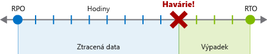
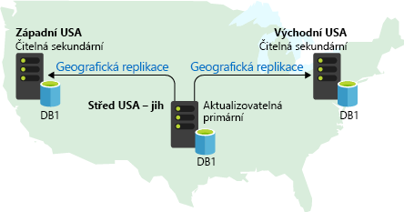
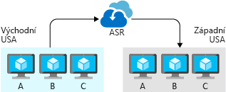
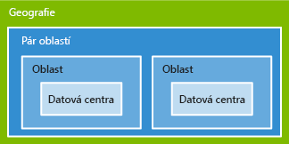

Navrhování s ohledem na vysokou dostupnost pomáhá udržet aplikaci nebo proces v provozu nehledě na nepříznivé události a podmínky. Ale co dělat, když se stane něco tak závažného, že ztratíte data a nebude možné zabránit vypnutí aplikací a procesů? V případě náhlé havárie musíte mít plán na opětovné zprovoznění služeb. Měli byste znát své cíle a očekávání v oblasti zotavení, náklady a omezení související s vaším plánem a vědět, jak podle něj postupovat.

## Co je zotavení po havárii?

Při zotavení po havárii jde o *zotavení z událostí s vysokým dopadem*, které způsobují výpadky a ztrátu dat. Havárie je ojedinělá významná událost s mnohem větším a delším dopadem, než aplikace dokáže s ohledem na svůj návrh zajištění vysoké dostupnosti zmírnit.

Slovo „havárie“ často vyvolává myšlenky na *přírodní* pohromy a vnější okolnosti (zemětřesení, záplavy, tropické bouře atd.), existuje však celá řada dalších druhů havárií. Nepovedené nasazení nebo upgrade může aplikaci zanechat v nerozpoznatelném stavu. Hackeři se zlými úmysly můžou zašifrovat nebo odstranit data a způsobit další druhy škod, které způsobí přechod aplikace do režimu offline nebo odstranění některých jejích funkcí.

Bez ohledu na příčinu je nejlepším řešením v případě havárie dobře definovaný a otestovaný plán zotavení po havárii a aplikace, jejíž návrh aktivně podporuje snahy o zotavení po havárii.

## Jak vytvořit plán zotavení po havárii

Plán zotavení po havárii je jediný dokument, který podrobně popisuje postupy potřebné k zotavení ze ztráty dat a výpadku, ke kterým došlo v důsledku havárie, a určuje, kdo je zodpovědný za řízení těchto postupů. Operátoři by měli být schopní tento plán použít jako návod k obnovení připojení aplikace a dat v případě, že dojde k havárii. Podrobně sepsaný plán věnovaný zotavení po havárii je klíčový pro zajištění uspokojivých výsledků. Proces vytváření plánu vám pomůže získat celkový přehled o aplikaci. Výsledné sepsané postupy podpoří po havárii, když vládne panika a chaos, správné rozhodování a pomůžou dotáhnout postupy do konce.

Vytvoření plánu zotavení po havárii vyžaduje odborné znalosti pracovních postupů, dat, infrastruktury a závislostí aplikace.

### Posouzení rizik a inventář procesů

Prvním krokem při vytváření plánu zotavení po havárii je provedení analýzy rizik, při které se zkoumá dopad různých druhů havárií na aplikaci. Přesná povaha havárie není pro analýzu rizik tak důležitá jako potenciální dopad v podobě ztráty dat a výpadku aplikace. Prozkoumejte různé druhy hypotetických havárií a zkuste být při přemýšlení o jejich dopadech konkrétní. Například cílený škodlivý útok může upravit kód nebo data, což může vést k jinému druhu dopadu než zemětřesení, při kterém se naruší síťová připojení a dostupnost datacenter.

Při posuzování rizik je potřeba zvážit *každý* proces, u kterého si nemůžete dovolit neomezený výpadek, a každou kategorii dat, jejichž neomezenou ztrátu si nemůžete dovolit. Když dojde k havárii, která má dopad na více komponent aplikace, je důležité, aby vlastníci plánu dokázali podle plánu sestavit úplný inventář položek vyžadujících pozornost a určit jejich prioritu.

Některé aplikace můžou tvořit jenom jeden proces nebo klasifikaci dat. To je potřeba mít neustále na paměti, protože taková aplikace pravděpodobně bude jednou ze součástí většího plánu zotavení po havárii, který zahrnuje více aplikací v rámci organizace.

### Cíle obnovení

Celkový plán musí pro každý proces, který aplikace implementuje, určovat dva klíčové obchodní požadavky:

* **Cíl bodu obnovení (RPO):** Maximální přijatelná doba trvání ztráty dat. RPO se měří v jednotkách času, ne objemu, například: „30 minut dat“, „čtyři hodiny dat“ atd. Účelem RPO je omezování *ztráty* dat a zotavení z ní, *krádež* dat neřeší.
* **Plánovaná doba obnovení (RTO):** Maximální přijatelná doba trvání výpadku, kde „výpadek“ je potřeba definovat ve specifikaci. Pokud je třeba v případě havárie přijatelná doba trvání výpadku 8 hodin, pak je plánovaná doba obnovení 8 hodin.

Všechny důležité procesy a úlohy, které aplikace implementuje, by měly mít samostatné hodnoty RPO a RTO. I když u různých procesů dojdete ke stejným hodnotám, měly by být výsledkem samostatné analýzy, která posoudí rizika katastrofického scénáře a potenciální strategie obnovení u každého procesu zvlášť.

Proces určení hodnot RPO a RTO je v podstatě vytvářením požadavků na zotavení po havárii pro vaši aplikaci. Vyžaduje nastavení priorit jednotlivých úloh a kategorií dat a provedení analýzy nákladů a přínosů. V analýze se zohlední různé aspekty, jako jsou náklady na implementaci a údržbu, provozní náklady, režie související s procesy, dopad na výkon a dopad výpadku a ztráty dat. Budete muset přesně definovat, co „výpadek“ znamená pro vaši aplikaci. V některých případech dokonce můžete pro různé úrovně funkcí nastavit odlišné hodnoty RPO a RTO. Určení hodnot RPO a RTO by mělo proběhnout pečlivěji než jen výběrem libovolných hodnot. Velká část hodnoty plánu zotavení po havárii vychází z průzkumu a analýzy za účelem zjištění potenciálního dopadu havárie a nákladů na zmírnění rizik.

### Podrobný popis postupu obnovení

Konečný plán by měl podrobně popisovat, jaké konkrétní kroky je potřeba provést k obnovení ztracených dat a připojení aplikace. Kroky často zahrnují následující informace:

* **Zálohy:** jak často se vytvářejí, kde se nacházejí, jak z nich obnovit data.
* **Repliky dat:** počet a umístění replik, povaha a vlastnosti konzistence replikovaných dat, jak přepnout na jinou repliku.
* **Nasazení:** jak se nasazení provádí, jak probíhá vracení zpět a scénáře selhání nasazení.
* **Infrastruktura:** místní a cloudové prostředky, síťová infrastruktura a inventář hardwaru.
* **Závislosti:** externí služby, které aplikace využívá, včetně smluv SLA a kontaktních údajů.
* **Konfigurace a oznámení:** příznaky nebo možnosti, které je možné nastavit pro degradaci aplikace bez výpadku, a služby sloužící k upozornění uživatelů na dopad aplikace.

Konkrétní požadované kroky budou ve velké míře záviset na podrobnostech implementace aplikace, a proto je důležité zajistit aktualizace plánu. Pravidelné testování plánu vám pomůže identifikovat nedostatky a zastaralé části.

## Navrhování s ohledem na zotavení po havárii

Zotavení po havárii není automatické. Je potřeba ho navrhnout, sestavit a otestovat. Aplikaci, která potřebuje podporu spolehlivé strategie zotavení po havárii, je nutné od začátku vytvářet s ohledem na zotavení po havárii. Azure nabízí služby, funkce a pokyny, které vám pomůžou vytvářet aplikace podporující zotavení po havárii. Jejich zahrnutí do návrhu je však na vás.

Při navrhování s ohledem na zotavení po havárii jsou nejdůležitější dva aspekty:

* **Obnovení dat:** Použití záloh a replikace k obnovení ztracených dat.
* **Obnovení procesů:** Obnovení služeb a nasazení kódu za účelem zotavení z výpadků.

### Obnovení dat a replikace

Replikace duplikuje uložená data mezi několik replik úložiště dat. Na rozdíl od *zálohování*, které vytváří dlouhodobé snímky dat jen pro čtení pro použití při obnovení, vytváří replikace kopie živých dat v reálném nebo téměř reálném čase. Cílem replikace je zajistit synchronizaci replik s minimální možnou latencí při současném zachování rychlosti odezvy aplikace. Replikace je klíčovou součástí navrhování s ohledem na vysokou dostupnost a zotavení po havárii a jako taková se běžně využívá v produkčních aplikacích.

Replikace slouží ke zmírnění dopadu v případě selhání nebo nedostupnosti úložiště dat prostřednictvím *převzetí služeb při selhání*: změní konfiguraci aplikace tak, aby směrovala požadavky na data do fungující repliky. Převzetí služeb při selhání je často automatizované a aktivuje se detekcí chyb integrovanou do produktu úložiště dat nebo detekcí, kterou implementujete prostřednictvím svého řešení monitorování. V závislosti na implementaci a scénáři může převzetí služeb při selhání vyžadovat ruční spuštění systémovými operátory.

Replikace není něco, co byste implementovali od začátku. Většina plnohodnotných databázových systémů a dalších služeb a produktů úložiště dat zahrnuje určitý druh replikace jako úzce integrovanou funkci kvůli požadavkům na funkce a výkon. Zahrnutí těchto funkcí do návrhu vaší aplikace a jejich vhodné využití je však na vás.

Různé služby Azure podporují různé úrovně a koncepty replikace. Příklad:

* Možnosti replikace **Azure Storage** závisí na typu replikace vybrané pro účet úložiště. Tato replikace může být lokální (v rámci datového centra), zónová (mezi datovými centry v rámci oblasti) nebo místní (mezi oblastmi). Vaše aplikace ani operátoři s ní nepřijdou přímo do styku. Převzetí služeb při selhání probíhá automaticky a transparentně a vám stačí vybrat úroveň replikace s požadovaným poměrem nákladů a rizika.
* Replikace služby **Azure SQL Database** probíhá automaticky v malém měřítku, ale zotavení z úplného výpadku datacentra nebo oblasti Azure vyžaduje geografickou replikaci. Nastavení geografické replikace se provádí ručně, ale jedná se prvotřídní funkci služby, která je dobře zdokumentovaná.
* **Cosmos DB** je globálně distribuovaný databázový systém a replikace je zásadním prvkem jeho implementace. U služby Azure Cosmos DB nekonfigurujete přímo replikaci, ale možnosti související s dělením a konzistencí dat.

Existuje řada návrhů replikace z různou prioritou konzistence dat, výkonu a nákladů. *Aktivní* replikace vyžaduje, aby aktualizace probíhaly na několika replikách současně, a tak zaručuje vyšší konzistenci za cenu nižší propustnosti. *Pasivní* replikace naopak provádí synchronizaci na pozadí. Díky tomu replikace neomezuje výkon aplikace, ale zvyšuje hodnotu RPO. Replikace typu *aktivní-aktivní* neboli *multi-master* umožňuje současné používání několika replik. Díky tomu umožňuje vyrovnávání zařízení za cenu komplikování konzistence dat, zatímco replikace typu *aktivní-pasivní* rezervuje repliky pro aktivní použití pouze během přebírání služeb při selhání.

> [!IMPORTANT]
> **Samotná replikace ani zálohování nepředstavují ucelená řešení zotavení po havárii**. Obnovení dat tvoří pouze jednu část zotavení po havárii a replikace dat nebude plně vyhovovat různým druhům scénářů zotavení po havárii. Například ve scénáři poškození dat může povaha poškození umožňovat rozšíření z primárního úložiště dat do replik. Repliky tak budou nepoužitelné a k obnovení bude potřeba záloha.

### Obnovení procesů

Po havárii je potřeba obnovit nejen firemní data, ale i další prostředky. Scénáře havárií také často povedou k výpadku, ať už kvůli problémům se síťovým připojením, výpadkům datacenter nebo poškozeným instancím virtuálních počítačů nebo nasazením softwaru. Návrh aplikace vám musí umožnit její obnovení do fungujícího stavu.

Ve většině případů zahrnuje obnovení procesů převzetí služeb při selhání do odděleného funkčního nasazení. V závislosti na scénáři může být klíčovým aspektem i zeměpisné umístění. Například rozsáhlá přírodní katastrofa, která znepřístupní celou oblast Azure, si vyžádá obnovení služby v jiné oblasti. Váš návrh by se měl řídit požadavky aplikace na zotavení po havárii, zejména hodnotou RTO, a tyto požadavky by vám měly pomoct při rozhodování, kolik replikovaných prostředí byste měli mít, kde by se měla nacházet a jestli by se měla udržovat ve stavu připraveném ke spuštění nebo jestli by měla být připravená k přijetí nasazení v případě havárie.

V závislosti na návrhu vaší aplikace existuje několik různých strategií a služeb a funkcí Azure, pomocí kterých můžete zlepšit podporu obnovení procesů po havárii.

#### Azure Site Recovery

Azure Site Recovery je služba vyhrazená pro správu obnovení procesů pro úlohy spuštěné na virtuálních počítačích nasazených v Azure, virtuálních počítačích na fyzických serverech a úloh spuštěných přímo na fyzických serverech. Site Recovery replikuje úlohy do alternativních umístění, pomáhá s převzetím služeb při selhání v případě výpadku a podporuje testování plánu zotavení po havárii.

Site Recovery podporuje replikaci celých imagí virtuálních počítačů a fyzických serverů i jednotlivých *úloh*, přičemž úlohou může být samostatná aplikace, celý virtuální počítač nebo operační systém i s aplikacemi. Replikovat můžete libovolnou úlohu aplikace, ale Site Recovery nabízí prvotřídní integrovanou podporu řady serverových aplikací Microsoftu, jako je SQL Server a SharePoint, a také několika aplikací třetích stran, jako je SAP.

Využití služby Azure Site Recovery byste měli alespoň zvážit u aplikací běžících na virtuálních počítačích nebo fyzických serverech. Jedná se o skvělý způsob, jak odhalit a prozkoumat scénáře a možnosti obnovení procesů.

#### Funkce specifické pro službu

U aplikací využívajících nabídek Azure PaaS, jako je služba App Service, nabízí většina těchto služeb funkce a pokyny pro zajištění podpory zotavení po havárii. Pro určité scénáře můžete použít funkce specifické pro službu, které podpoří rychlé obnovení. Například Azure SQL Server podporuje geografickou replikaci umožňující rychlé obnovení služby v jiné oblasti. Azure App Service obsahuje funkci zálohování a obnovení a v dokumentaci najdete pokyny k použití služby Azure Traffic Manager pro zajištění podpory směrování provozu do sekundární oblasti.

## Testování plánu zotavení po havárii

Plánování zotavení po havárii nekončí ve chvíli, kdy máte v ruce hotový plán. Zásadním aspektem zotavení po havárii je testování plánu, abyste ověřili srozumitelnost a aktuálnost pokynů a vysvětlení.

Zvolte intervaly provádění různých typů a rozsahů testů, například testování záloh a mechanismů převzetí služeb při selhání každý měsíc nebo provedení kompletní simulace zotavení po havárii každých šest měsíců. Vždy postupujte podle kroků a podrobností přesně tak, jak jsou zdokumentované v plánu, a zvažte zapojení někoho, kdo plán nezná a kdo by vám mohl poskytnout nový pohled na nejasnosti. Při provádění testu identifikujte nedostatky, oblasti zlepšování a místa pro automatizaci a přidejte tato vylepšení do svého plánu.

Nezapomeňte do testování zahrnout také svůj systém monitorování. Pokud vaše aplikace například podporuje automatizované převzetí služeb při selhání, zaveďte chyby do nějaké závislosti nebo jiné důležité komponenty, abyste se ujistili, že se aplikace po celou dobu chová správně, včetně zjištění chyby a aktivace automatizovaného převzetí služeb při selhání.

 Díky pečlivému určení vašich požadavků a vytvoření plánu budete schopni identifikovat, jaké typy služeb budete ke splnění cílů obnovení muset použít. Azure poskytuje několik služeb a funkcí, které vám tyto cíle pomůžou splnit.
