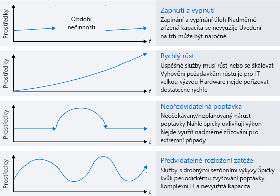
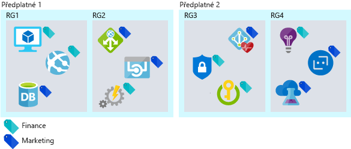
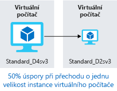
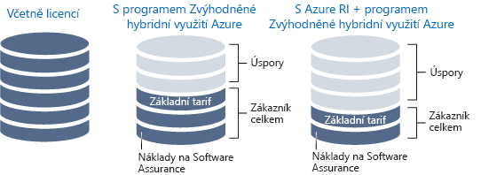
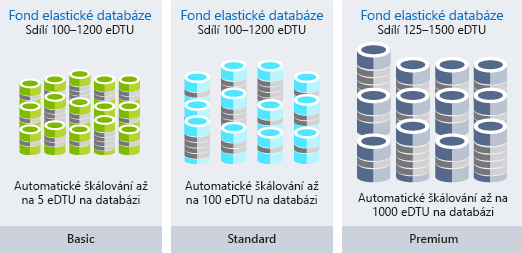

Jste autorem architektury řešení. Vaše organizace Lamna Healthcare přesunula své úlohy do cloudu. Nedávno se účet za tyto prostředky a pracovní postupy zvýšil víc, než organizace předpokládala. Proto vás požádali o posouzení situace. Máte zjistit, jestli je nárůst přirozený a jde o efektivní růst, nebo je možné náklady snížit efektivnějším využíváním cloudových prostředků organizace.

#### Maximalizace efektivity útraty v cloudu

> [!VIDEO https://www.microsoft.com/videoplayer/embed/RWjTgy]

## Jak cloud mění vaše výdaje

Jedním z rozdílů mezi veřejným cloudem a místní infrastrukturou je to, jak platíte za využívané služby. V místním datovém centru je pořízení hardwaru časově náročné, vybírá se podle nejvyšší požadované kapacity a firemní jednotka, která prostředky využívá, nemusí mít vůbec představu o některých nákladech, třeba o ceně spotřebované energie a využitého prostoru. Při zakoupení fyzické infrastruktury je vaše investice vázaná na dlouhodobé aktivum a omezuje vás tak v pružném využívání dostupných prostředků.

Přechodem na cloud přecházíte na nákladový model, kde platíte za to, co spotřebujete. Už nemusíte investovat do aktiv, a pokud se změní vaše požadavky na prostředky, můžete je přidat, přesunout nebo odebrat podle potřeby. Vytížení je u každé služby jiné a může se různit i v rámci jedné služby, poptávka nemusí být předvídatelná a tempo vašeho růstu se časem mění. Vzhledem k tomu, že v cloudu platíte jen za to, co používáte, může se struktura vašich nákladů měnit podle toho, jak se mění prostředky.

Cloudová infrastruktura si umí poradit se scénáři kolísavého využití prostředků. Prostředky s dlouhými obdobími nečinnosti můžete vypnout, když je právě nepoužíváte, aby vám nevznikaly žádné náklady. Prostředky můžou růst společně s růstem úspěšné služby – není potřeba čekat na další cyklus požadavků na nákup. A v případě předvídatelného i nepředvídatelného nárůstu poptávky můžete zase prostředky dynamicky přidávat a odebírat. Následující obrázek ukazuje, proč místní infrastruktura nedokáže zvládnout všechny tyto proměnlivé scénáře.

V efektivní architektuře korespondují zřízené prostředky s poptávkou po těchto prostředcích. Pokud se virtuální počítač většinu času využívá na méně než 10 %, pak je to plýtvání prostředky jak v oblasti výpočetní kapacity, tak v oblasti nákladů. Pokud je naopak virtuální počítač využitý na 90 %, znamená to, že se využívá většina dostupných prostředků a tato investice je tedy efektivní. Pokud se systém využívá na 100 %, hrozí riziko problémů s výkonností. Je důležité dbát na to, aby maximální efektivita využití neměla negativní vliv na výkonnost systému. Poptávka je jen málokdy konstantní a pro zajištění efektivního využití je tedy důležité přizpůsobovat prostředky poptávce, kdykoli je to možné.

## Sledování útraty v cloudu

Abyste se mohli správně rozhodnout, potřebujete data. Když budete vědět, na co vynakládáte peníze, můžete tyto informace porovnat s využitím a případně zjistit, kde se ve vašem prostředí plýtvá s prostředky.

Fakturační data si můžete kdykoli exportovat. S jejich pomocí pak můžete sledovat, kam putují vaše výdaje a jak jsou rozdělené mezi jednotlivé prostředky. Problém je v tom, že fakturační data ukazují náklady, ale ne využití. Podle dat budete vědět, že platíte za výkonný virtuální počítač, nakolik ho ale opravdu využíváte?

Azure Cost Management vám poskytuje přehled o tom, na co vynakládáte finance a které prostředky jsou nedostatečně využité. Azure Cost Management sleduje celkové výdaje, náklady na konkrétní službu a náklady v průběhu času. Umožňuje vám procházet k podrobnostem o typech a instancích prostředků. Můžete také náklady rozdělit podle částí organizace nebo nákladových středisek, když prostředky označíte pomocí těchto kategorií.

Komponenta nákladovosti je obsažená i v Azure Advisoru. Ten vám doporučí změnu velikosti virtuálního počítače a pořízení rezervovaných instancí, pokud je to výhodnější, než průběžné platby za instance. Najde nevyužité okruhy ExpressRoute a nečinné brány virtuálních sítí. Advisor nabízí i další doporučení ohledně výkonnosti, vysoké dostupnosti a zabezpečení.

Důležité je udělat si čas na to, abyste své výdaje prošli a zjistili, do čeho investujete. Nalezení oblastí, kde se plýtvá penězi, vám umožní zajistit co nejefektivnější provoz.

## Uspořádáním k optimalizaci

Uspořádání prostředků vám pomůže sledovat, na co vynakládáte peníze. Existují možnosti, jak prostředky seskupit a vytvořit mezi nimi relace, takže budete vědět, které náklady spolu souvisí. Z hlediska fakturace můžete prostředky snadno seskupit pomocí následujících postupů:

- Přiřazení prostředků různým předplatným.
- Přiřazení prostředků různým skupinám prostředků.
- Použití značek k rozlišení prostředků.

Předplatná a skupiny prostředků představují jednoduchý způsob, jak prostředky logicky seskupit a uspořádat, a umožní vám získat lepší představu o situaci při procházení fakturačních dat. Značky přicházejí na řadu ve chvíli, kdy vztahy mezi prostředky překračují hranice předplatných a skupin prostředků. Značky jsou páry klíčů a hodnot, které můžete přidat k libovolnému prostředku a které uvidíte ve fakturačních datech, takže budete moct ke konkrétnímu prostředku přiřadit oddělení nebo nákladové středisko. Díky značkám budete moct vytvářet lepší sestavy o nákladech a každé oddělení ve vaší organizaci ponese odpovědnost za náklady na svůj provoz. Následující obrázek ukazuje, jak můžete stejnou značku použít pro prostředky v různých skupinách prostředků, a dokonce i v různých předplatných.

Pokud své prostředky uspořádáte, mnohonásobně se vám to vrátí a pomůže vám to udělat si lepší představu o tom, na co vynakládáte peníze. Teď se podíváme na možnosti, jak náklady optimalizovat.

## Optimalizace nákladů na IaaS

Pokud organizace používá virtuální počítače, představují s nimi spojené náklady často největší procento výdajů. Nejvyšší částku obvykle představují náklady na výpočetní prostředky a dále potom na úložiště. Pokud investujete čas do optimalizace prostředků, kde platíte za použití, může to mít velký vliv na to, kolik každý měsíc zaplatíte.

Proto se teď podíváme na osvědčené postupy, jak snížit náklady na výpočetní prostředky a úložiště.

### Výpočetní prostředky

Existuje hned několik možností, jak snížit náklady na virtuální počítače:

- Vyberte menší velikost instance virtuálního počítače.
- Snižte počet hodin, po které virtuální počítač běží.
- Využijte slevy na výpočetní prostředky.

#### Správná velikost virtuálního počítače

Nastavení správné velikosti virtuálního počítače je proces, kdy se velikost virtuálního počítače slaďuje s požadavky na prostředky. Pokud virtuální počítač běží 25 % času naprázdno, snížením jeho velikosti dosáhnete okamžitého snížení nákladů. Náklady na virtuální počítač jsou v rámci řady instancí lineární: každá další velikost, o kterou se virtuální počítač zvětší, zdvojnásobí vaše náklady. Platí to i naopak, takže snížením velikosti virtuálního počítače o velikost jediné instance snížíte náklady na polovinu. Následující obrázek ukazuje 50% úspory dosažené přechodem na nižší velikost v rámci stejné řady.

Azure Advisor zjistí, které virtuální počítače se nedostatečně využívají. Tento nástroj 14 dní monitoruje využití vašich virtuálních počítačů a potom identifikuje ty, které nejsou plně využité. Za virtuální počítače s nízkým využitím se považují ty, které mají po dobu nejméně čtyř dnů využití procesoru do 5 procent a využití sítě do 7 MB.

#### Implementace plánů na vypínání virtuálních počítačů

Pokud máte virtuální počítače, které zpracovávají úlohy jen jednou za čas, ale běží nepřetržitě, pak plýtváte penězi. Tyto virtuální počítače můžete vypnout, když se nepoužívají. Uvolněné virtuální počítače šetří náklady na výpočetní prostředky. Vhodným kandidátem je třeba vývojové prostředí, protože vývoj se obvykle provádí jenom během pracovní doby.

K uvolnění virtuálního počítače máte několik možností. Můžete využít Azure Automation, aby virtuální počítače běžely jenom v časech, kdy je vaše úlohy potřebují. Můžete využít funkci automatického jednorázového vypnutí virtuálního počítače k naplánování automatického vypnutí. Nakonec můžete virtuální počítač ručně vypnout na portálu Azure Portal. Virtuální počítače byste měli vždy vypínat pomocí ovládacích prvků Azure. Při vypnutí operačního systému z virtuálního počítače se neuvolní jeho prostředky Azure, takže vám budou dál nabíhat náklady.

#### Využití slevy na výpočetní prostředky

S programem Zvýhodněné hybridní využití Azure můžete optimalizovat náklady jak na Windows Server, tak na SQL Server. Tento program vám umožní využít vaše místní licence Software Assurance pro Windows Server a SQL Server jako slevu na náklady na výpočetní kapacitu těchto virtuálních počítačů. U povolených instancí tak eliminujete náklady na Windows a SQL Server.

Některé virtuální počítače musí být v provozu nepřetržitě. Možná máte serverovou farmu webové aplikace pro produkční úlohu nebo řadič domény, který podporuje více serverů ve virtuální síti. Pokud víte s jistotou, že budete tyto virtuální počítače provozovat celý další rok nebo ještě déle, můžete snížit náklady zakoupením rezervované instance. Rezervované instance Azure Reserved Virtual Machine Instances si můžete koupit na jeden rok nebo na tři roky a získáte výpočetní kapacitu za nižší cenu, než byste zaplatili při průběžných platbách za výpočetní prostředky. Pomocí Azure Reserved Virtual Machine Instances můžete při závazku na jeden nebo na tři roky dopředu výrazně snížit náklady na virtuální počítače, a to až o 72 procent oproti cenám při průběžných platbách. Následující obrázek ukazuje úspory dosažené kombinací místní licence s programem zvýhodněného hybridního využití Azure nebo kombinací místní licence s rezervovanými instancemi Azure s programem zvýhodněného hybridního využití Azure.

### Optimalizace nákladů na úložiště pro disky virtuálních počítačů

Pro úlohy, které nevyžadují vysoce spolehlivé a výkonné disky, můžete využít standardní úložiště za sníženou cenu. Standardní úložiště si můžete vybrat například pro testovací a vývojová prostředí, která nemusí přesně odpovídat prostředí produkčních úloh.

Zkontrolujte, že ve svém prostředí nemáte žádné nepřidružené disky. Za disky, které nejsou přidružené k virtuálnímu počítači, stále platíte poplatky za úložiště. Pokud jste odebrali virtuální počítač, ale ne přidružené disky, pak můžete jejich odebráním dále snížit náklady na úložiště.

Stejně tak platí, že pokud máte nepřidružené snímky disků, stojí za to udělat si čas na jejich vymazání. Poplatky za snímky jsou nižší než za samotné disky, stejně je ale dobré se nákladů za tyto nevyužívané prostředky zbavit.

## Optimalizace nákladů na PaaS

Se službami PaaS se typicky pojí nižší náklady, než se službami IaaS, přesto ale můžete i tady najít oblasti, kde se plýtvá prostředky, optimalizovat je, a snížit tak náklady. Podíváme se teď na možnosti, jak snížit náklady na Azure SQL Database a Azure Blob Storage.

### Optimalizace nákladů na Azure SQL Database

Při vytváření služby Azure SQL Database musíte vybrat Azure SQL Server a rozhodnout se, jakou úroveň výkonu požadujete. Každá úroveň poskytuje specifický výkon, buď v jednotkách databázové transakce (DTU), nebo ve virtuálních jádrech. Pokud je zatížení databáze stabilní, je optimalizace snadná: stačí vybrat úroveň o správné velikosti pro potřebný výkon. Co když se ale vaše databáze musí vyrovnat s nepředvídatelnými výkyvy a skokovými nárůsty aktivity? Pro snížení nákladů na nepředvídatelné vytížení můžete použít elastické fondy.

Elastické fondy SQL Database představují jednoduché a cenově výhodné řešení pro správu a škálování několika databází s proměnlivými a nepředvídatelnými požadavky na využití. Databáze v elastickém fondu se nachází na jednom serveru Azure SQL Database a sdílí stanovený počet prostředků za stanovenou cenu. Fondy jsou vhodné pro velký počet databází se specifickými vzory využití. Pro každou konkrétní databázi se tento vzor vyznačuje nízkou průměrnou mírou využití s relativně málo častými špičkami.
Čím více databází můžete do fondu přidat, tím více ušetříte. Následující obrázek ukazuje možnosti tří typů fondů elastické databáze: Basic, Standard a Premium.  Úroveň Basic se automaticky škáluje až na 5 eDTU na databázi, úroveň Standard se automaticky škáluje až na 100 eDTU na databázi a úroveň Premium se automaticky škáluje až na 1000 eDTU na databázi.

Elastické fondy představují skvělý způsob, jak rozdělit náklady mezi více databází. Tyto fondy mohou výrazně snížit vaše náklady na službu Azure SQL Database.

### Optimalizace nákladů na Blob Storage

Služba Blob Storage představuje cenově výhodný způsob ukládání dat, ale při jejich rostoucím objemu můžete dále ušetřit optimalizací toho, jak jsou data uložená.

Vraťme se teď k organizaci Lamna Healthcare. Řekněme, že organizace má aplikaci pro lékařské zobrazovací systémy, která v úložišti objektů blob ukládá snímky. Vzhledem ke kvalitě a velikosti snímků představuje úložiště výrazný podíl nákladů na tuto aplikaci. Poté, co se snímek pacienta pořídí, bude pravděpodobně během prvního týdne několikrát zobrazen, a očekává se proto vysoká výkonnost načítání snímků. Snímek pořízený před dvěma lety se ale nejspíš tak často nevyužívá a neočekává se u něj tak rychlé načítání. Pokud při výběru úrovní úložiště zohledníte, že požadavek na výkonnost se po pořízení snímku v průběhu času snižuje, můžete tak optimalizovat náklady na načítání snímků.

Azure Storage nabízí pro ukládání objektů blob tři úrovně úložiště. Horká úroveň úložiště Azure je optimalizovaná pro ukládání dat, která se využívají často. Studená úroveň úložiště Azure je optimalizovaná pro ukládání dat, která se nevyužívají často a ukládají se nejméně na 30 dnů. Archivní úroveň úložiště Azure je optimalizovaná pro ukládání zřídka používaných dat, která se ukládají nejméně na 180 dnů a vyžadují flexibilní latenci.

- **Horká úroveň přístupu** má nejvyšší náklady na úložiště, ale nejnižší náklady na přístup.
- **Studená úroveň přístupu** má v porovnání s horkou úrovní nižší náklady na uložení a vyšší náklady na přístup. Tato úroveň je určená pro data, která zůstanou na studené úrovni nejméně 30 dnů.
- **Archivní úroveň přístupu** má nejnižší náklady na úložiště a v porovnání s horkým a studeným úložištěm nejvyšší náklady na načítání dat. Tato úroveň je určená pro data, u kterých se toleruje latence načtení několik hodin a která zůstanou na archivní úrovni nejméně 180 dnů.

Pro organizaci Lamna Healthcare je rozumné mít nové snímky první měsíc na horké úrovni přístupu, aby se nejnovější snímky zobrazovaly co nejrychleji. Snímky starší než jeden rok je pak možné přesunout do archivní úrovně, protože není pravděpodobné, že bude potřeba je načíst. Tím by se snížily náklady na uložení těchto snímků.

### Využití cenových modelů podle spotřeby

Přechodem na služby modelu PaaS se také může model s průběžnými platbami posunout ještě více k cenovému modelu podle skutečné spotřeby. Služby jako Azure Functions můžou využívat _plány Spotřeba_. Pokud používáte plán Spotřeba, instance hostitele Azure Functions se dynamicky přidávají nebo odebírají na základě počtu příchozích událostí. Tento bezserverový plán se automaticky škáluje a výpočetní prostředky se vám účtují, jenom když vaše funkce běží. V plánu Spotřeba po nastavené době vyprší časový limit spuštění funkce.

Fakturace vychází z počtu spuštění, doby spuštění a použité paměti. Fakturace se agreguje napříč všemi funkcemi v rámci aplikace funkce.

Přechod na služby, které používají cenový model na základě spotřeby, může do vaší architektury vnést nový přístup k úsporám nákladů.

## Optimalizace nákladů v Lamna Healthcare

Organizaci Lamna Healthcare se daří dosahovat ve snižování nákladů velkých pokroků. Jednou měsíčně probíhá revize nákladů a každé oddělení má přístup do služby Azure Cost Management, kde může své náklady sledovat průběžně během celého měsíce. Organizace našla řadu případů, kdy se jim vyplatí využít slevu na rezervované instance, a několik jich zakoupila. Zavedla také automatizované procesy na vypnutí vývojářských prostředí mimo pracovní dobu, což jim ušetřilo další peníze z rozpočtu zbytečně vynakládané na tyto prostředky v době, kdy se nepoužívaly. 

Díky těmto změnám a také optimalizaci úložiště objektů blob pro ukládání snímků se jim během posledních několika měsíců podařilo náklady výrazně snížit.

## Shrnutí

Pokud chcete optimalizovat náklady na cloudovou infrastrukturu, sledujte, kam putují vaše výdaje, a zajistěte, aby využití prostředků odpovídalo tomu, co vyžadují vaše úlohy. Další optimalizace nákladů na cloud dosáhnete, pokud vyberete tu správnou kvalitu a úroveň výkonu.