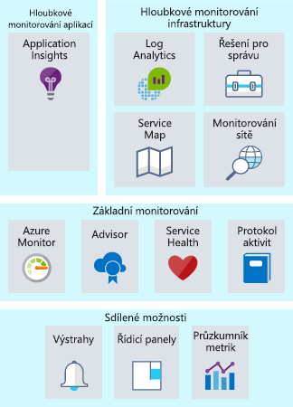
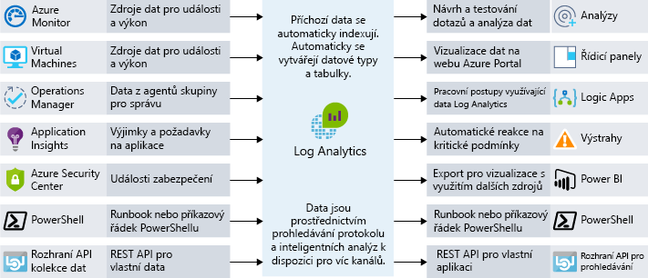
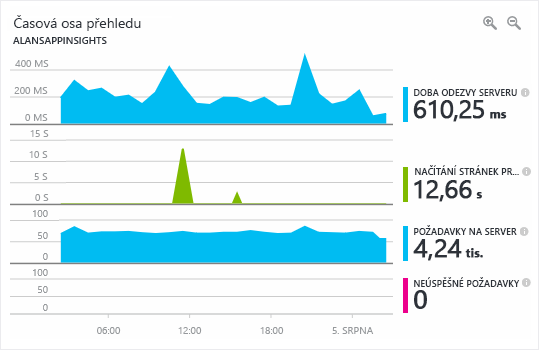

Sledování je shromažďování a analýza dat s cílem určit výkon, stav a dostupnost podnikové aplikace a prostředků, na kterých závisí. Co když jste vytvořili provozní tým odpovědný za prostředky běžící v Azure? Jak budete postupovat, pokud chcete mít jistotu, že máte přehled o stavu systémů? Když se něco stane, kdo to zjistí jako první – váš tým nebo koncoví uživatelé? Efektivní strategie monitorování vám pomůže zaměřit se na stav aplikace. Pomůže vám také prodloužit dobu provozu díky proaktivnímu upozorňování na kritické problémy, abyste je mohli vyřešit předtím, než začnou způsobovat potíže. 

Pokud jde o monitorování a analýzu v Azure, můžeme služby seskupit do tří konkrétních oblastí zájmu: hloubkové monitorování aplikací, hloubkové monitorování infrastruktury a základní monitorování. V této lekci se podíváme na jednotlivé skupiny a na to, jak služby Azure umožňují využít tyto funkce ve vaší architektuře. I když jsme tyto služby seskupili dohromady, existuje mezi nimi několik integračních bodů, které umožňují vzájemné sdílení důležitých datových bodů monitorování. Následující obrázek ukazuje dostupné služby monitorování sestavené do logických skupin.

## Základní monitorování

Základní monitorování poskytuje nezbytné elementární monitorování prostředků Azure. Když mluvíme o základním monitorování, můžete si ho představit jako monitorování toho, co se děje s vašimi prostředky na úrovni platformy Azure. Tato oblast zaměření vám poskytuje přehled například o stavu platformy Azure, změnách prostředků a metrikách výkonu. Použití služeb z této oblasti vám umožňuje monitorovat základní části, které jsou nezbytné pro funkčnost aplikace.

Azure poskytuje služby, které vám umožňují vhled do čtyř klíčových oblastí základního monitorování: protokolování aktivit, stav služeb, metrik a diagnostiky a doporučení týkajících se osvědčených postupů. Tyto služby jsou integrovány v Azure a jejich povolení a nastavení nevyžaduje žádnou nebo téměř žádnou konfiguraci. Podívejme se na ně podrobněji.

### Protokolování aktivit

Protokolování aktivit je mimořádně důležité, protože z něho získáte informace o tom, co se děje s vašimi prostředky na úrovni platformy Azure. Každá změna odeslaná na platformu Azure se zaprotokoluje do protokolu aktivit Azure, čímž umožňuje sledovat všechny akce prováděné u vašich prostředků. Protokol aktivit bude obsahovat podrobné informace o aktivitách, abyste mohli získat odpovědi na otázky, jako jsou:

- Kdo připojil disk k tomuto virtuálnímu počítači?
- Kdy byl tento počítač vypnut?
- Kdo změnil konfiguraci nástroje pro vyrovnávání zatížení?
- Proč operace automatického škálování u škálovací sady virtuálních počítačů selhala?

Použití protokolu aktivit k zodpovězení tohoto typu otázek vám pomůže při řešení problémů, sledování změn a auditování akcí, které se odehrávají ve vašem prostředí Azure. Data se v protokolu aktivity uchovávají pouze 90 dnů, ale můžete je archivovat v účtu úložiště nebo odeslat do služby Azure Log Analytics za účelem delšího uchování a další analýzu.

### Stav cloudových služeb

V určitém bodě může dojít k chybám v každém systému, což platí také pro služby Azure. Pokud budete neustále informováni o stavu služeb Azure, pomůže vám to pochopit, zda a kdy problém, který ovlivňuje službu Azure, ovlivňuje i vaše prostředí. To, co se může jevit jako lokalizovaný problém, může být výsledkem rozsáhlejšího problému a služba Azure Service Health vám tento přehled umí poskytnout. Azure Service Health identifikuje všechny problémy se službami Azure, které by mohly vaši aplikaci ovlivnit. Service Health vám také pomůže naplánovat plánovanou údržbu.

### Metriky a diagnostika

U problémů, které jsou ze své podstaty lokálnějšího charakteru, je důležité mít přehled o tom, co se děje ve vašem systému nebo instanci služby. Možnost zobrazit metriky a diagnostické informace je nezbytná, abyste mohli řešit problémy s výkonem a získat oznámení, když se něco pokazí. Pro poskytování tohoto přehledu využívají služby Azure běžný způsob zobrazování stavu, metrik a diagnostických informací. Azure Monitor poskytuje základní monitorování pro služby Azure na základě toho, že umožňuje shromažďování, agregaci a vizualizaci metrik, protokolů aktivit a diagnostických protokolů.

K dispozici máte metriky, které poskytují statistiky o výkonu různých prostředků a dokonce i operačního systému ve virtuálním počítači. Tato data můžete na portálu Azure Portal zobrazit pomocí některého z průzkumníků a na základě těchto metrik můžete vytvářet upozornění. Azure Monitor nabízí nejrychlejší kanál metrik (zkrácení z 5 minut na 1 minutu), takže byste ho měli používat pro upozornění a oznámení, která jsou náročná na rychlou odezvu.

### Doporučení týkající se osvědčených postupů

Když si představíme monitorování, obvykle nás napadne aktuální stav prostředku. Ale i když je prostředek v pořádku, mohou některé jeho úpravy zlepšit jeho dostupnost, snížit náklady a zdokonalit zabezpečení. Azure Advisor vám může pomoci udržet si přehled o potenciálním výkonu, nákladech, vysoké dostupnosti a problémech se zabezpečením vašich prostředků. Advisor poskytuje individuální doporučení na základě konfigurace a telemetrie prostředku a tím poskytuje pokyny, které nejsou u tradičnějších monitorovacích platforem k dispozici.

## Hloubkové monitorování infrastruktury

I když jsou monitorovací komponenty, o kterých jsme až dosud mluvili, skvělé při poskytování přehledů, umožňují nahlédnout jenom do platformy Azure. Typické úlohy IaaS shromažďují ze sítě nebo skutečných operačních systémů další metriky a diagnostické informace. Mezi příklady oblastí, v nichž může služba Log Analytics poskytovat podrobné přehledy, patří získávání informací z SQL Serveru, aby se zajistilo, že je správně nakonfigurován, analýza volného místa na disku u všech serverů v prostředí nebo vizualizace závislostí sítě mezi systémy a službami.

Při navrhování strategie monitorování je důležité zahrnout každou součást v řetězu aplikace, abyste mohli korelovat události napříč službami a prostředky. Služby podporující Azure Monitor lze snadno nakonfigurovat, aby posílaly data do pracovního prostoru Log Analytics. Virtuální počítače (jak v cloudu, tak i místní) mohou mít nainstalovaného agenta, který posílá data do služby Log Analytics. Vlastní data můžete do služby Log Analytics posílat přes rozhraní API Log Analytics. Následující obrázek ukazuje, jak Log Analytics funguje jako hlavní centrum monitorování dat. Log Analytics přijímá data o monitorování prostředků Azure a zpřístupňuje je uživatelům kvůli jejich analýze nebo vizualizaci.

S těmito daty ve službě Log Analytics můžete vytvářet dotazy do nezpracovaných dat kvůli řešení potíží, můžete identifikovat původní příčiny a používat data k auditování. U některých známých služeb (SQL Server, Windows Server Active Directory) existují připravená a dostupná řešení pro správu, která vizualizují monitorovaná data a kontrolují dodržování osvědčených postupů.

Log Analytics umožňuje vytvářet dotazy a na jejich základě pracovat s ostatními systémy. Nejběžnějším příkladem je upozornění. Možná chcete dostávat e-maily, když systému dojde místo na disku nebo když se u SQL Serveru přestal dodržovat osvědčený postup. Služba Log Analytics může posílat upozornění, aktivovat automatizaci a dokonce se i zapojit do vlastních rozhraní API například za účelem integrace se správou IT služeb (ITSM).

## Hloubkové monitorování aplikace

Porozumět tomu, jak si vedou základní služby a infrastruktura, je důležité, ale možnosti monitorování můžete rozšířit i dále a podívat se podrobněji na aplikace, abyste mohli identifikovat problémy s výkonem, trendy využití a celkovou dostupnost služeb, které vyvíjíte a na které spoléháte. Pomocí nástroje pro správu výkonu aplikace můžete lépe detekovat a diagnostikovat problémy, k nimž dochází u webových aplikací a služeb.

Azure Application Insights vám přesně toto umožňuje. Application Insights poskytuje kolekci telemetrie, dotazování a možnosti vizualizace. Nevyžaduje žádné nebo téměř žádné změny kódu. Do aplikace musíte pouze nainstalovat malý instrumentační balíček. Služba Application Insights je určena pro různé platformy a podporuje technologie .NET, Node.js a Java.

Třeba odstraňování problémů s dobou odezvy aplikace může být složité. Je to kvůli přetížení webového serveru? Jde o konkrétní příkaz jazyka SQL, který není optimalizován? Je to kvůli tomu, že volané rozhraní API je pomalejší než obvykle? Řešení určená k monitorování výkonu aplikací můžou pomoct odhalit skutečné problémy, které by základní monitorování metrik neodhalilo. Následující snímek obrazovky ukazuje grafické zobrazení podrobností o výkonu aplikace poskytovaných službou Azure Application Insights.

Řešení monitorování výkonu aplikací vám pomůže monitorovat využití, výkon a dostupnost, a umožní vám tak reagovat na chyby mnohem rychleji. Takové řešení by mělo být součástí každé strategie monitorování.

## Monitorování v Lamna Healthcare

Společnost Lamna Healthcare vylepšuje svoji strategii monitorování, protože přesunuje svoje prostředky do cloudu. Společnost používá monitorování, aby mohla řešit problémy a získávat upozornění v případě, že by problémy s výkonem mohly ovlivnit její prostředky. Nakonfigurovala, že se jejímu provoznímu týmu mají posílat všechna oznámení o stavu služby, aby tým mohl neprodleně zareagovat. Společnost zavedla proces pravidelných kontrol Advisorem, aby ověřila, jestli jsou v prostředí implementovaná doporučení tam, kde jsou potřeba. 

Ze všech prostředků v Azure i z místních prostředků se data protokolů posílají do pracovního prostoru Log Analytics, kde společnost může vyhledávat v různých zdrojových protokolech souběžné události. Používá také řešení pro správu pro Windows Server Active Directory a SQL Server.

Její vývojový tým zahájil integraci služby Application Insights do svých aplikací a už se mu podařilo odhalit dvě chyby, které měly vliv na výkon a dříve si jich nevšimli.

## Shrnutí

Vhodná strategie monitorování sleduje více různých vrstev architektury od podpůrné infrastruktury až po hloubkovou telemetrii aplikací. Pomůže vám porozumět provozu různých komponent vaší aplikace. Prodlužuje dobu provozu tím, že proaktivně upozorňuje na zásadní potíže, abyste je mohli vyřešit dříve, než se z nich stanou závažné problémy, a umožňuje vám korelovat protokoly a telemetrii v různých systémech, abyste mohli potíže detekovat. Podívali jsme se na různé služby v Azure, které můžete ve své strategii monitorování využít.