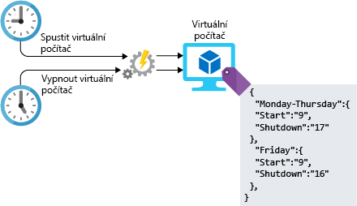

Správa infrastruktury jakéhokoli typu úlohy zahrnuje i úlohy konfigurace. Tuto konfiguraci můžete provést ručně, ale může se jednat o neefektivní proces, který je náročný na pracovní sílu a náchylný k chybám. Co když máte vést projekt, který vyžaduje nasazení stovek systémů do Azure? Jak budete tyto prostředky vytvářet a konfigurovat? Kolik času vám to zabere? Podaří se vám zajistit správnou konfiguraci všech systémů bez rozdílů? Když do návrhu architektury začleníte automatizaci, nemusíte se těmito výzvami zabývat. Podívejme se na některé způsoby, jak můžete automatizaci v Azure využít.

## <a name="infrastructure-as-code"></a>Infrastruktura jako kód

Infrastruktura jako kód (IaC) je správa infrastruktury (sítí, virtuálních počítačů, nástrojů pro vyrovnávání zatížení a topologií připojení) v popisném modelu využívajícím systém správy verzí, který je podobný systému používanému pro zdrojový kód. Stejně jako v případě principu, že stejný zdrojový kód generuje vždy stejný binární soubor, platí i zde, že model IaC při každém použití vygeneruje stejné prostředí. IaC je klíčovým postupem v rámci DevOps a často se používá v kombinaci s průběžným doručováním.

Infrastruktura jako kód byla vyvinuta s cílem vyřešit problém spočívající v rozdílech mezi prostředími. Bez IaC musí týmy udržovat nastavení jednotlivých nasazených prostředí. V průběhu času se každé prostředí stane „sněhovou vločkou“ – to znamená, že získá jedinečnou konfiguraci, kterou není možné automaticky reprodukovat. Nekonzistence mezi prostředími vede k problémům při nasazování. Vzhledem k těmto „sněhovým vločkám“ jsou při správě a údržbě infrastruktury nutné ruční procesy, které je obtížné sledovat a přispívají k chybám.

Při automatickém nasazení služeb a infrastruktury existují dva odlišné přístupy, které můžete zaujmout: imperativní a deklarativní. Při imperativním přístupu explicitně zadáte příkazy, které se spustí a vytvoří požadovaný výstup. Při deklarativním přístupu zadáte, jak má výstup vypadat místo toho, abyste zadali, jak se má provést. Oba přístupy jsou důležité, takže nesprávná volba neexistuje. Jak budou tyto odlišné přístupy vypadat v Azure a jak je můžete využít?

### <a name="imperative-automation"></a>Imperativní automatizace

Začněme s imperativní automatizací. U imperativní automatizace zadáváme, _jak_ se mají operace provádět. To se obvykle provádí přes kód programu prostřednictvím skriptovacího jazyka nebo sady SDK. U prostředků Azure můžeme použít Azure CLI nebo Azure PowerShell. Podívejme se na příklad, který k vytvoření účtu úložiště používá Azure CLI.

```azure-cli
az group create --name storage-resource-group \
        --location eastus

az storage account create --name mystorageaccount \
        --resource-group storage-resource-group \
        --kind BlobStorage \
        --access-tier hot
```

V tomto příkladu zadáme, jak se mají tyto prostředky vytvořit. Spustíme příkaz a vytvoříme skupinu prostředků. Spustíme další příkaz a vytvoříme účet úložiště. Explicitně říkáme Azure, které příkazy se mají spustit, abychom dostali požadovaný výstup.

S tímto přístupem jsme schopni infrastrukturu plně automatizovat. Můžeme určit oblasti pro vstup a výstup a zajistit, že se vždy spustí stejné příkazy. Automatizací prostředků jsme pokryli ruční kroky procesu a zefektivnili operace správy prostředků. Tento přístup má ale také určité nevýhody. S tím, jak je architektura čím dál složitější, mohou se i skripty pro vytváření prostředků rychle stát složitými. Abychom zajistili úplné spuštění, bude možná třeba přidat zpracování chyb a ověřování vstupů. Příkazy se mohou měnit, což vyžaduje neustálou údržbu skriptů.

### <a name="declarative-automation"></a>Deklarativní automatizace

U deklarativní automatizace zadáváme, _co_ má být výstupem, a detaily způsobu dosažení cíle necháváme na použitém systému. V Azure se deklarativní automatizace provádí prostřednictvím šablon Azure Resource Manageru.

Šablony Resource Manageru jsou soubory strukturované ve formátu JSON, které určují, co se má vytvořit. V příkladu níže říkáme službě Azure, aby vytvořila účet úložiště s názvy a vlastnostmi, které zadáme. Skutečný postup, kterým se vytvoří tento účet úložiště, ponecháváme na Azure. Šablony obsahují čtyři části: parametry, proměnné, prostředky a výstupy. Parametry zpracují vstup, který se má použít v šabloně. Proměnné poskytují způsob ukládání hodnot pro použití v celé šabloně. Prostředky jsou to, co se vytváří, a výstupy představují způsob, jak uživatelům poskytnout podrobnosti toho, co se vytvořilo.

```json
{
    "$schema": "https://schema.management.azure.com/schemas/2015-01-01/deploymentTemplate.json#",
    "contentVersion": "1.0.0.0",
    "parameters": {
        "name": {
            "type": "string"
        },
        "location": {
            "type": "string"
        },
        "accountType": {
            "type": "string",
            "defaultValue": "Standard_RAGRS"
        },
        "kind": {
            "type": "string"
        },
        "accessTier": {
            "type": "string"
        },
        "httpsTrafficOnlyEnabled": {
            "type": "bool",
            "defaultValue": true
        }
    },
    "variables": {
    },
    "resources": [
        {
            "apiVersion": "2018-02-01",
            "name": "[parameters('name')]",
            "location": "[parameters('location')]",
            "type": "Microsoft.Storage/storageAccounts",
            "sku": {
                "name": "[parameters('accountType')]"
            },
            "kind": "[parameters('kind')]",
            "properties": {
                "supportsHttpsTrafficOnly": "[parameters('httpsTrafficOnlyEnabled')]",
                "accessTier": "[parameters('accessTier')]",
                "encryption": {
                    "services": {
                        "blob": {
                            "enabled": true
                        },
                        "file": {
                            "enabled": true
                        }
                    },
                    "keySource": "Microsoft.Storage"
                }
            },
            "dependsOn": []
        }
    ],
    "outputs": {
        "storageAccountName": {
            "type": "string",
            "value": "[parameters('name')]"
        }
    }
}
```

Šablony lze použít k vytvoření většiny služeb a práci s nimi v Azure. Můžete je ukládat v úložištích kódů a prostředích se správou zdrojového kódu a sdílet v různých prostředích, abyste měli jistotu, že vyvíjená infrastruktura odpovídá skutečné produkci. Představují skvělý způsob automatického nasazení a pomáhají zajistit konzistenci, eliminovat chybné konfigurace nasazení a zvýšit provozní rychlost.

Automatizace nasazení infrastruktury představuje skvělý první krok, ale při nasazování virtuálních počítačů máte před sebou ještě spoustu práce. Podívejme se na několik přístupů k automatizaci konfigurace po nasazení.

## <a name="vm-customization-images-vs-post-deployment-configuration"></a>Přizpůsobení virtuálního počítače: Image vs. konfigurace po nasazení

U mnoha nasazení virtuálních počítačů se úloha neprovede, pokud počítač běží. Pravděpodobně existuje další konfigurace, kterou je potřeba provést, než bude virtuální počítač moci sloužit svému zamýšlenému účelu. Je možné, že bude potřeba zformátovat další disky, virtuální počítač bude nutné připojit k doméně, nainstalovat agenta pro software pro správu a také skutečné úlohy budou zřejmě vyžadovat instalaci a konfiguraci.

Existují dvě běžné strategie používané pro konfiguraci, které se považují za součást konfigurace samotného virtuálního počítače. Obě mají svoje výhody a nevýhody:

- Vlastní image
- Spouštění skriptů po nasazení

Vlastní image se generují při nasazení virtuálního počítače a konfigurací nebo instalací softwaru na danou spuštěnou instanci. Pokud je všechno nakonfigurováno správně, počítač lze vypnout a image se vytvoří z virtuálního počítače. Image pak můžete použít jako základ pro další nové virtuální počítače. Práce s vlastními imagemi může zkrátit celkovou dobu potřebnou pro nasazení, protože jakmile je virtuální počítač nasazen a běží, není potřeba už nic konfigurovat. Pokud je pro vás rychlost nasazení důležitým faktorem, stojí vlastní image rozhodně za prozkoumání.

Skriptování po nasazení obvykle využívá jednoduchou základní image a potom spoléhá na skriptování nebo na platformu pro správu konfigurace, aby provedly konfiguraci po nasazení virtuálního počítače. Skriptování po nasazení je možné provádět spuštěním skriptu na virtuálním počítači prostřednictvím rozšíření skriptů Azure nebo pomocí robustnějšího řešení, jako je Azure Automation DSC (Desired State Configuration).

U každého přístupu je třeba mít na paměti určité aspekty. Při použití imagí budete muset zajistit, že existuje proces, který bude zpracovávat aktualizace a opravy zabezpečení imagí a správu inventáře samotných imagí. Při použití skriptování po nasazení se doba sestavení může prodloužit, protože virtuální počítač nelze přidat do úloh za provozu, dokud není sestavení dokončeno. To nemusí představovat velký problém u samostatných systémů, ale při použití služeb, které provádí automatické škálování (jako jsou škálovací sady virtuálních počítačů), může delší doba sestavení ovlivnit rychlost škálování. U obou přístupů budete chtít zajistit ošetření odchylek konfigurace. Při zavádění nové konfigurace budete chtít mít jistotu, že jsou stávající systémy odpovídajícím způsobem aktualizovány.

Automatizace nasazení prostředků může být pro vaše prostředí obrovskou výhodou. Ušetřený čas a menší počet chyb mohou vaše provozní možnosti posunout na jinou úroveň.

## <a name="automation-of-operational-tasks"></a>Automatizace provozních úloh

Jakmile jsou řešení zprovozněna, existují průběžné provozní aktivity, které lze také automatizovat. Automatizace těchto úloh pomocí služby Azure Automation snižuje množství ručních úloh, umožňuje konfigurovat a spravovat aktualizace výpočetních prostředků, centralizuje sdílené prostředky, jako jsou plány, přihlašovací údaje a certifikáty, a poskytuje architekturu pro spuštění libovolného typu úlohy Azure.

Pro vaši práci v Lamna Healthcare by to mohlo zahrnovat:

- Pravidelné vyhledávání osamocených disků.
- Instalaci nejnovějších oprav zabezpečení na virtuální počítače.
- Vyhledávání a vypínání virtuálních počítačů mimo pracovní dobu.
- Spouštění denních sestav a vytvoření řídicího panelu, který bude podávat hlášení vyššímu managementu.

Jako konkrétní příklad předpokládejme, že chcete virtuální počítač spouštět pouze během pracovní doby. Můžete napsat skript, který ráno virtuální počítač spustí a večer ho vypne. Můžete nakonfigurovat službu Azure Automation, aby tento skript spouštěla ve stanovenou dobu. Následující obrázek ukazuje roli služby Azure Automation v tomto procesu.



## <a name="automating-development-environments"></a>Automatizace vývojových prostředí

Na opačném konci kanálu cloudové infrastruktury jsou vývojové počítače používané vývojáři k vytváření aplikací a služeb, které jsou jádrem vašeho podnikání. Prostřednictvím služby Azure DevTest Labs můžete virtuální počítače opatřit všemi správnými nástroji a úložišti, které potřebují. Vývojáři pracující na více službách mohou přecházet mezi vývojovými prostředími bez nutnosti zřizovat nové počítače vlastními silami. Tato vývojová prostředí lze vypnout, pokud je nepoužíváte, a znovu spustit, až je zase budete potřebovat.

## <a name="automation-at-lamna-healthcare"></a>Automatizace v Lamna Healthcare

Podívejme se na to, jak se pomocí automatizace zdokonalila Lamna Healthcare. Na začátku se nasazení infrastruktury a sestavení serverů odehrávaly pouze ručně. Inženýři nasazovali všechno prostřednictvím portálu. Tím vznikaly odchylky a chyby mezi testovacím a produkčním prostředím a rozdíly bránily v detekci problémů před uvedením kódu do produkce.

Nyní inženýři mohou nasadit celou infrastrukturu prostřednictvím šablon Resource Manageru. Tyto šablony se vrací se změnami do úložiště GitHub a před jejich uvolněním pro nasazení se provede kontrola kódu. Mohou také vytvořit stejnou infrastrukturu pro vývoj, testování a produkci a tím zajistit, že ověří konfiguraci ve všech prostředích.

U většiny služeb využívajících virtuálních počítače mají standardní základní image a pomocí DSC konfigurují systémy po nasazení. U webových farem, kde potřebují škálovatelnost škálovacích sad virtuálních počítačů, mají k dispozici plně automatický proces vrácení kódu se změnami a sestavení nové image s veškerou potřebnou konfigurací, než ji zpřístupní ve škálovacích sadách.

Mají úlohu automatizace, která vypne určené virtuální počítače mimo pracovní dobu, aby se snížily náklady, a také automaticky provádí opravy virtuálních počítačů.

Vývojáři nyní mají samoobslužné prostředí ve službě DevTest Labs, kde mohou vyvíjet kód s využitím nejnovějších imagí a konfigurací, čímž zajistí, že vyvíjený produkt odpovídá konfiguraci v produkci.

Toto všechno sice vyžaduje počáteční úsilí, ale výhody se v dlouhodobém měřítku vyplatí. Jsou schopni výrazně snížit počet chyb a úsilí, které provozní týmy vyžadují k údržbě prostředí. Vývojářům se velmi líbí, že mohou snadno zřizovat prostředky, pro které provádí vývoj, a eliminovat nutnost přecházet tam a zpět, aby vytvořili prostředí.

## <a name="summary"></a>Shrnutí

Podívali jsme se na několik způsobů, jak začlenit možnosti automatizace do vaší architektury. Vynaložení času na automatizaci prostředí přináší mnoho výhod od nasazení infrastruktury jako kódu až po vylepšení produktivity vývojářů pomocí testovacích prostředí. Snížení počtu chyb, menší rozdíly a úspora provozních nákladů může být velkou výhodou pro vaši organizaci a může vám pomoci povýšit cloudové prostředí na další úroveň.