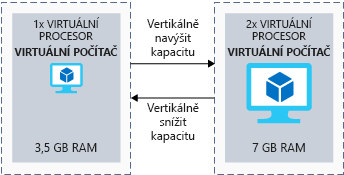
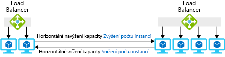
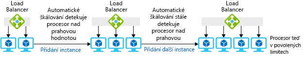

Málokdy dokážeme přesně předpovědět zatížení systému. Veřejně přístupné aplikace se mohou rychle narůstat. Interní aplikace zase může potřebovat podpořit větší uživatelskou základnu v důsledku růstu firmy. I kdybychom zátěž dokázali předpovědět, nebývá většinou rovnoměrná. Maloobchodní prodejci mají větší poptávku o svátcích, sportovní weby při finálových zápasech. V tomto článku budeme definovat _vertikální navýšení/snížení kapacity_ a _horizontální navýšení/snížení kapacity_. Ukážeme si některé způsoby, jak Azure zlepšuje možnosti škálování, a podíváme se na bezserverové a kontejnerové technologie. Dozvíte se, jak tyto technologie zlepšují škálovací schopnost architektury.

## Co je škálování?

_Škálování_ je proces správy prostředků, které aplikaci pomáhají dosáhnout požadovaného výkonu.  Pokud máte přebytek prostředků, které slouží uživatelům, nepoužíváte je efektivně a plýtváte penězi. Pokud je prostředků naopak nedostatek, může to mít vliv na výkon naší aplikace. Cílem tedy je splnit definované požadavky na výkon a současně optimalizovat náklady. 

_Prostředky_ můžou být cokoli, co je potřeba ke správě spuštěných aplikací. Nejčastějšími prostředky virtuálních počítačů jsou paměť a procesor, ale u některých služeb Azure je potřeba vzít v úvahu i šířku pásma nebo abstraktní položky jako třeba jednotky žádostí u databáze Cosmos DB.

V ideálním světě konstantní poptávky po aplikaci bychom mohli jednoduše předpovědět potřebnou úroveň prostředků. Ale ve skutečném světě se poptávka po aplikacích v čase mění, takže je těžší potřebnou úroveň prostředků předpovědět. Pokud máte štěstí, jsou změny předvídatelné nebo sezónní, ale obvykle to u všech aplikací neplatí. V ideálním případě chcete zajistit správné množství prostředků, abyste vyhověli poptávce a přizpůsobili se jejím změnám.

Škálování je obtížné hlavně v místním prostředí, kde máte koupené vlastní servery, které sami spravujete. Přidání prostředků může být nákladné a přechod do online režimu zdlouhavý, někdy dokonce delší, než doba, po kterou potřebujete zvýšenou kapacitu. Stejně obtížné může být i snížení kapacity v době nízké poptávky po systému, kdy máte zbytečně vyšší náklady.

Klíčovou výhodou Azure je jednoduché škálování. Většinu prostředků Azure můžete jednoduše přidávat nebo odebírat podle změny poptávky. Řada služeb také nabízí automatické možnosti monitorování poptávky a přizpůsobení. Tato funkce automatického škálování, která se běžně označuje jako automatické škálování, umožňuje nastavit prahové hodnoty minimální a maximální úrovně instancí, které musí být dostupné. Automatické škálování přidává nebo odebírá instance na základě metrik výkonu (například využití procesoru).

#### Vertikální a horizontální navýšení kapacity

> [!VIDEO https://www.microsoft.com/videoplayer/embed/RE2yBWi]

## Co je vertikální navýšení a snížení kapacity?

Vertikální navýšení kapacity je proces, při kterém zvýšíme kapacitu dané instance. Virtuální počítač můžeme zvýšit z 1 vCPU a 3,5 GB paměti RAM na 2 vCPU a 7 GB paměti RAM, abychom zajistili větší kapacitu pro zpracování dat. Naproti tomu vertikální snížení kapacity je proces, při kterém snížíme kapacitu dané instance. Například snížením kapacity virtuálního počítače ze 2 vCPU a 7 GB paměti RAM na 1 vCPU a 3,5 GB paměti RAM se sníží kapacita i náklady. Následující obrázek ukazuje příklad změny velikosti virtuálního počítače.

Pojďme se podívat, co znamená vertikální navýšení a snížení kapacity v souvislosti s prostředky Azure:

- U virtuálních počítačů Azure se škáluje podle velikosti virtuálního počítače. Každé velikosti odpovídá určitý procesor, paměť RAM a místní úložiště. Můžeme například vertikálně navýšit kapacitu virtuálního počítače Standard_DS1_v2 (1 vCPU a 3,5 GB paměti RAM) na virtuální počítač Standard_DS2_v2 (2 vCPU a 7 GB paměti RAM).
- Azure SQL Database je implementace Microsoft SQL Serveru jako PaaS (platforma jako služba).  Kapacitu databáze můžete vertikálně navýšit na základě počtu jednotek databázových transakcí (DTU) nebo počtu procesorů vCPU. Jednotky DTU jsou abstraktním vyjádřením zahrnutých prostředků. Představují kombinaci CPU, IO a paměti. Například byste mohli databázi Azure SQL škálovat z velikosti P2 s 250 DTU až na P4 s 500 DTU, aby získala větší kapacitu a propustnost.
- Azure App Service je služba hostování webů v Azure poskytovaná jako PaaS (platforma jako služba). Weby běží ve virtuální serverové farmě, které se také říká plán služby App Service. Kapacitu plánu služby App Service můžete vertikálně navýšit nebo snížit použitím jednotlivých vrstev, které nabízejí různou kapacitu. Například plán služby App Service S1 má 1 vCPU a 1,75 GB paměti RAM pro každou instanci. Kapacitu můžeme vertikálně navýšit na plán služby App Service S2, který má 2 vCPU a 3 GB paměti RAM pro každou instanci.

Pokud chcete mít tyto možnosti v místním prostředí, většinou musíte počkat na nákup potřebného hardwaru a jeho instalaci, abyste mohli začít využívat novou úroveň škálování. V Azure jsou už fyzické prostředky pro vás nasazené a dostupné. Stačí vybrat alternativní úroveň škálování, kterou chcete použít.

V závislosti na zvolených cloudových službách možná ve svém řešení budete muset zohlednit dopad vertikálního navýšení kapacity.

Pokud se například rozhodnete vertikálně navýšit kapacitu služby Azure SQL Database, služba navýší kapacitu jednotlivých uzlů a pokračuje v provozu. Se změnou úrovně služeb nebo úrovně výkonu databáze se vytvoří replika původní databáze na nové úrovni výkonu a následně se přepne připojení na repliku. Při tomto procesu nedochází ke ztrátě dat. Dojde jenom ke krátkému přerušení (obvykle méně než 4 sekundy), kdy se služba přepne na repliku.

Pokud se rozhodnete vertikálně navýšit nebo snížit kapacitu virtuálního počítače, uděláte to tak, že vyberete jinou velikost instance. Ve většině případů to vyžaduje restartování virtuálního počítače, takže je lepší s tím předem počítat a zařídit se podle toho.

Stále byste měli hledat místa, kde je možné vertikálně snížit kapacitu. Pokud dokáže aplikace poskytovat odpovídající výkon v nižší cenové úrovni, může být faktura za Azure výrazně nižší.

## Co je horizontální navýšení a snížení kapacity?

Zatímco vertikální navýšení nebo snížení kapacity upraví množství prostředků, které má instance k dispozici, horizontální navýšení nebo snížení kapacity upraví celkový počet instancí.

_Horizontální navýšení kapacity_ je proces, který spočívá v přidání dalších instancí, které podporují zatížení vašeho řešení. Například kdyby byl front-end našeho webu hostovaný na virtuálních počítačích, mohli bychom při vyšším zatížení zvýšit počet virtuálních počítačů.

_Horizontální snížení kapacity_ je proces, který spočívá v odebrání instancí, které už nejsou potřeba k podpoře zatížení vašeho řešení. Pokud se webové front-endy používají málo, můžeme snížit počet instancí, abychom ušetřili. Následující obrázek ukazuje příklad změny počtu instancí virtuálních počítačů.

Tady je několik příkladů, co znamená horizontální navýšení a snížení kapacity u prostředků Azure:

- Na úrovni infrastruktury k automatickému přidávání a odebírání dalších instancí pravděpodobně použijete škálovací sady virtuálních počítačů.
  - Škálovací sady virtuálních počítačů umožňují vytvářet a spravovat skupiny identických virtuálních počítačů s vyrovnáváním zatížení.
  - Počet instancí virtuálních počítačů se může automaticky zvyšovat nebo snižovat v reakci na poptávku nebo podle definovaného plánu.
- U implementace Azure SQL Database můžete ke sdílení zatížení mezi instancemi databáze použít horizontální dělení. _Horizontální dělení_ je technika distribuce velkých objemů dat, která mají stejnou strukturu, mezi více nezávislých databází.
- Ve službě Azure App Service hostuje vaši aplikaci virtuální webová serverová farma v podobě plánu služby App Service. Horizontální navýšení kapacity v tomto případě znamená, že zvýšíte počet virtuálních počítačů ve farmě. Stejně jako u škálovacích sad virtuálních počítačů se počet instancí může automaticky zvýšit nebo snížit v reakci na určité metriky nebo podle plánu.

K horizontálnímu navýšení kapacity můžete jednoduše použít Azure Portal, nástroje příkazového řádku nebo šablony Resource Manageru. Většinou je pro koncového uživatele bezproblémové.

### Automatické škálování

Některé služby můžete nakonfigurovat na použití funkce, která se nazývá automatické škálování. Při automatickém škálování se nemusíte zabývat ručním škálováním služeb. Místo toho můžete nastavit minimální a maximální prahové hodnoty instancí a škálovat podle konkrétních metrik (délka fronty, využití procesoru) nebo plánů (v pracovní dny mezi 17. a 19. hodinou). Následující obrázek ukazuje, jak funkce automatického škálování spravuje instance pro zvládnutí zatížení.

### Co je potřeba vzít v úvahu při horizontálním navyšování nebo snižování kapacity

Při horizontálním navýšení kapacity, může rychlost škálování aplikace ovlivnit délka jejího spouštění. Pokud spuštění aplikace a její zpřístupnění uživatelům trvá dvě minuty, znamená to, že zpřístupnění uživatelům bude trvat dvě minuty každé instanci. Dobu spuštění byste měli vzít v úvahu, když určujete, jak rychle chcete škálovat.

Zamyslete se také nad tím, jak aplikace pracuje se stavy. Když se horizontálně sníží kapacita aplikace, nebude k dispozici žádný stav uložený v počítači. Pokud se uživatel připojí k instanci, která nemá žádný stav, může se zobrazit výzva k přihlášení nebo opakovanému výběru dat, což je pro uživatele nepříjemné. Často se to řeší tak, že se použije stav jiné služby, jako je Redis Cache nebo SQL Database, takže webové servery nemají žádný stav. Pokud webové front-endy nemají žádný stav, nemusíte si dělat starosti s dostupností jednotlivých instancí. Všechny pracují stejně a jsou i stejně nasazené.

## Omezování

Řekli jsme, že zatížení aplikace se v čase mění. Může to způsobovat počet aktivních nebo souběžných uživatelů a prováděné aktivity. K přidání kapacity můžeme použít automatické škálování, ale můžeme také použít mechanismus, který omezí počet požadavků u jejich zdroje. Limity výkonu můžeme zabezpečit tak, že na úrovni aplikace nastavíme známé limity, abychom zabránili poškození aplikace. Omezování se nejčastěji používá v aplikacích s přístupnými koncovými body rozhraní API.

Jakmile aplikace zjistí, že může být překročen limit, zahájí omezování, aby nedošlo k narušení smlouvy SLA celého systému. Pokud například zákazníkům zpřístupníte rozhraní API, aby mohli získávat data, můžete omezit počet požadavků na 100 za minutu. Pokud některý zákazník tento limit překročí, můžete reagovat stavovým kódem HTTP 429, včetně čekací doby potřebné k úspěšnému odeslání dalšího požadavku.

## Bezserverová architektura

Bezserverová architektura je spouštěcí prostředí pro hostování v cloudu, kde můžete spouštět své aplikace bez starostí o základní prostředí. Vytvoříte instanci služby a přidáte svůj kód. Nemusíte se starat o správu ani údržbu infrastruktury, a dokonce to ani není možné.

Bezserverové aplikace jsou nakonfigurované tak, aby reagovaly na události. Ty může představovat koncový bod REST, časovač nebo zpráva obdržená z jiné služby Azure. Aplikace bez serveru se spouští jen při aktivaci nějakou událostí.

Infrastruktura není vaše starost. Škálování a výkon jsou zajišťovány automaticky a poplatky se účtují výhradně za prostředky, které použijete. Není ani potřeba si rezervovat kapacitu. Příkladem bezserverové architektury v Azure jsou služby Azure Functions, Azure Container Instances a Logic Apps.

Vraťme se k příkladu Lamna Healthcare. Nabízí se možnost uspořit náklady a zjednodušit správu. Měli byste zvážit koncový bod rozhraní API. Místo hostování rozhraní API ve službě Azure App Service, kde tým platí za vyhrazenou kapacitu, může tým využít aplikaci Azure Function App, která se aktivuje požadavkem HTTP. Služba Azure Functions by týmu umožnila platit jenom za prostředky, které jsou potřeba ke zpracování každé transakce. Náklady a škálování by tak byly přímo úměrné počtu transakcí v systému.

## Kontejnery

Kontejner je způsob spouštění aplikací ve virtuálním prostředí. Virtuální počítač je virtualizovaný na úrovni hardwaru. Hypervisor umožňuje spustit na jednom fyzickém serveru více virtualizovaných operačních systémů. Kontejnery posouvají virtualizaci o úroveň výš. Virtualizace probíhá na úrovni operačního systému a ve stejném operačním systému tak můžete spustit více instancí stejné aplikace.

Kontejnery jsou vhodné pro scénáře horizontálního navýšení kapacity. Jsou jednoduché a navržené tak, aby je uživatelé vytvářeli, škálovali a zastavovali dynamicky podle změn prostředí a požadavků.

Výhodou používání kontejnerů je možnost spouštět na každém virtuálním počítači více izolovaných aplikací. Vzhledem k tomu, že kontejnery jsou zabezpečené a izolované na úrovni jádra, nepotřebujete pro každou samostatnou úlohu vlastní virtuální počítač.

Kontejnery můžete spouštět na virtuálních počítačích. Ale existuje také několik služeb Azure, které slouží ke zjednodušení správy a škálování kontejnerů:

- **Azure Kubernetes Service (AKS)**

  Azure Kubernetes Service umožňuje nastavit virtuální počítače, aby fungovaly jako uzly. Azure hostuje platformu Kubernetes pro správu, takže se vám účtují jenom spuštěné pracovní uzly, které hostují vaše kontejnery.

  Pokud chcete zvýšit počet pracovních uzlů v Azure, je potřeba to provést ručně v Azure CLI. V době psaní tohoto článku je k dispozici verze Preview služby Cluster Autoscaler pro AKS, která pracovní uzly škáluje automaticky. V clusteru Kubernetes můžete k horizontálnímu navýšení počtu instancí nasazených kontejnerů použít Horizontal Pod Autoscaler.

  Ke škálování AKS také můžete použít Virtual Kubelet (viz následující popis).

- **Azure Container Instances (ACI)**
  
  Služba Azure Container Instances je bezserverová technologie, která umožňuje vytvářet a spouštět kontejnery na vyžádání. Účtuje se jen doba spuštění (po sekundách).

  Virtual Kubelet můžete použít k připojení služby Azure Container Instances ke svému prostředí Kubernetes, včetně AKS. Pokud cluster Kubernetes požaduje další instance kontejnerů, můžete díky aplikaci Virtual Kubelet řešit tyto požadavky službou ACI. Služba ACI je bezserverová, takže nemusíte mít rezervovanou kapacitu. Můžete spojit výhody a využít ovladatelné a flexibilní škálování Kubernetes na bezserverové architektuře s účtováním po sekundách. V době psaní tohoto článku se píše o Virtual Kubelet jako o experimentálním softwaru, který není určený pro ostrý provoz.

## Škálování v Lamna Healthcare

Lamna Healthcare provozuje rezervační systém pro správu pacientů. Systém pro správu zpracovává rezervace (objednání se k lékaři) a záznamy pacientů pro desítky nemocnic a zdravotnických zařízení. Místní zdravotní služba je z hlediska kapacity plně vytížená. V tuto chvíli se nepředpokládá další růst. Systém běží na webu PHP hostovaném ve službě Azure App Service.

Průběh zatížení aplikace je předvídatelný, protože ordinační doba je od pondělí do pátku od 9 do 17 hodin.  Od úterý do pátku je v celém systému v průměru 1 200 transakcí za hodinu. O víkendech systém zpracovává 500 transakcí za hodinu. Po volnějším víkendu následuje rušné pondělí s průměrným počtem 2 000 transakcí za hodinu.

K hostování aplikace se používá plán služby App Service S1, ale provozní tým zaznamenal vysoké využití procesoru (přes 95 %) u všech instancí. Vysoké využití procesoru ovlivňuje rychlost zpracování a načtení aplikace. V cloudovém prostředí nemusí vysoké využití prostředků znamenat nic špatného. Znamená, že hodnota odpovídá ceně a nasazené prostředky jsou dobře využité. 

U nasazených instancí se tým rozhodl pro _vertikální navýšení kapacity_ plánu služby App Service z S1 (1 vCPU a 1,75 GB paměti RAM) na S2 (2 vCPU a 3 GB paměti RAM). Kapacitu může jednoduše navýšit na webu Azure Portal, jediným příkazem v Azure CLI, v Azure PowerShellu nebo pomocí šablon Resource Manageru.

Tým se rozhodl automatizovat počet nasazených instancí podle plánu, protože profil zatížení je předvídatelný. Plán služby App Service nakonfigurují na automatické škálování. Předpokládejme, že dvě instance dokáží zpracovat 500 transakcí za hodinu. Aby tým vyhověl požadavkům, navýší kapacitu na šest instancí od úterý do pátku a na osm instancí v pondělí (na základě informací a monitorování při zátěžových testech).

Automatické škálování má ještě další výhodu, a to přípravu na nepředvídatelné scénáře. Web také nárazově zvládne vyšší zátěž o víkendech (více návštěv v zimním období kvůli nachlazení a chřipce). Tým může nastavit automatické škálování, konkrétně přidání jedné instance, když procento CPU překročí 70 %, a ubrání jedné instance, když využití klesne pod 15 %.

V rozhraní API rezervačního systému pacientů, které je za instancí služby Azure API Management, tým použil model omezení. Toto omezení brání nedostatečnému výkonu systému, protože povolí jen určitou propustnost systému.

Zabývali jsme se vertikálním navýšením a snížením kapacity a horizontálním navýšením a snížením kapacity a řekli jsme si, jak tyto možnosti využít v architektuře. Podívali jsme se na bezserverové technologie a kontejnery, které dále rozvíjejí možnosti škálování.