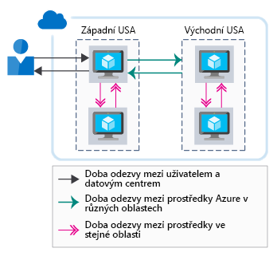
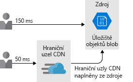
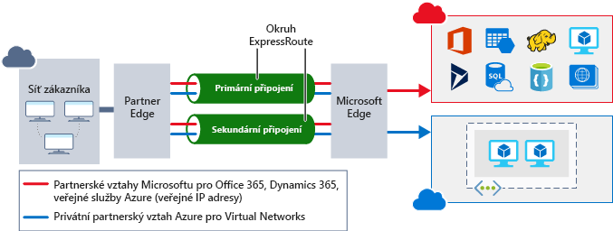

Výkon sítě může mít výrazný dopad na činnost uživatelů. V komplexní architektuře s mnoha různými službami může mít minimalizace latence v každém segmentu směrování velký dopad na celkový výkon. V této jednotce se budeme zabývat důležitostí latence sítě a možnostmi snižování latence v dané architektuře. Probereme také, jak v organizaci Lamna Healthcare přijali strategie pro minimalizaci latence sítě mezi svými prostředky Azure i mezi svými uživateli a Azure.

## Důležitost latence sítě

Latence je míra zpoždění. Latence sítě je čas potřebný k přenosu ze zdroje do cíle v určité síťové infrastruktuře. Toto časové období se běžně označuje jako zpoždění odezvy nebo čas potřebný k přenosu ze zdroje do cíle a zase zpět.

V tradičním prostředí datacentra může být latence minimální, protože prostředky často sdílí stejné umístění a společnou sadu infrastruktury. Pokud jsou prostředky fyzicky blízko sebe, je čas potřebný k přenosu ze zdroje do cíle kratší.

Cloudové prostředí je oproti tomu škálovatelné. Prostředky hostované v cloudu nemusí být ve stejném racku, ve stejném datacentru a dokonce ani ve stejné oblasti. Tento distribuovaný přístup může mít dopad na dobu odezvy síťové komunikace. Všechny oblasti Azure jsou sice vzájemně propojené vysokorychlostní optickou páteřní sítí, ale rychlost světla stále představuje fyzické omezení. Při volání mezi službami v různých fyzických umístěních se bude vyskytovat latence sítě, která bude v korelaci se vzdáleností mezi příslušnými umístěními.

Čím je aplikace „upovídanější“, tím více odezev se vyžaduje. Jednotlivé odezvy mají svoje latence a každá z nich přispívá k celkové latenci. Následující obrázek ukazuje, jak je latence vnímaná uživatelem kombinací dob odezvy potřebných k obsloužení požadavku.

Teď se podíváme na možnosti, jak zvýšit výkon mezi prostředky Azure a od koncových uživatelů k prostředkům Azure.

## Latence mezi prostředky Azure

Předpokládejme, že v organizaci Lamna Healthcare mají pilotní nasazení nového systému objednávání pacientů, které používá několik webových serverů a jednu databázi v oblasti Azure Západní Evropa. Tato architektura minimalizuje doby přenosů dat, protože prostředky jsou umístěné společně uvnitř jedné oblasti Azure.

Předpokládejme, že pilotní nasazení systému bylo úspěšné a bylo rozšířeno i na uživatele v Austrálii. U těchto uživatelů se při prohlížení webu projevuje doba odezvy z prostředků v západní Evropě a komfort pro koncové uživatele bude kvůli latenci sítě nízký.

Tým v Lamna Healthcare rozhodl, že u těchto uživatelů sníží latenci tím, že bude hostovat další instanci front-endu v oblasti Austrálie – východ. Tento návrh sice zkracuje čas, který webový server potřebuje k vrácení obsahu koncovým uživatelům, ale komfort je i tak nízký kvůli velké latenci při komunikaci mezi front-end webovými servery v oblasti Austrálie – východ a databází v oblasti Západní Evropa.

Zbývající latenci je možné snížit několika způsoby:

- Vytvoření repliky dané databáze pro čtení v oblasti Austrálie – východ. Při použití této možnosti bude čtení fungovat dobře, ale u zápisů se bude stále projevovat latence. Repliky pro čtení umožňuje geografická replikace Azure SQL Database.
- Synchronizaci dat mezi oblastmi umožňuje Synchronizace dat SQL Azure.
- Použití globálně distribuované databáze, například Azure Cosmos DB. To by umožnilo, aby čtení i zápisy probíhaly bez ohledu na polohu, ale může to vyžadovat změny ve způsobu, jakým aplikace ukládá a odkazuje na data.
- Použití technologie pro ukládání do mezipaměti, jako je Azure Cache for Redis, k minimalizaci volání do vzdálených databází u často používaných dat, což s sebou nese vysokou latenci.

Tady je cílem minimalizace latence sítě mezi jednotlivými vrstvami aplikace. Způsob řešení závisí na příslušné architektuře aplikace a dat, ale Azure poskytuje mechanismy pro toto řešení v několika službách.

## Latence mezi uživateli a prostředky Azure

Dosud jsme se zabývali latencí mezi prostředky Azure, ale měli bychom brát v úvahu také latenci mezi uživateli a cloudovou aplikací. Chceme optimalizovat doručování rozhraní front-endu koncovým uživatelům. Podívejme se na několik možností, jak lze zvýšit výkon sítě mezi koncovými uživateli a aplikací.

### Optimalizace cesty ke koncovému bodu pomocí nástroje pro vyrovnávání zatížení DNS

V příkladu s organizací Lamna Healthcare jsme viděli, že jejich tým vytvořil další uzel webového front-endu v oblasti Austrálie – východ. Koncoví uživatelé však musí explicitně určit, který koncový bod front-endu chtějí používat. Návrháři řešení v Lamna Healthcare chtějí, aby prostředí pro jejich uživatele bylo co nejkomfortnější.

K tomu se dá využít Azure Traffic Manager. Traffic Manager je nástroj pro vyrovnávání zatížení na základě DNS, který umožňuje distribuovat provoz v rámci oblastí Azure a napříč těmito oblastmi. Místo toho, aby uživatel musel přecházet na konkrétní instanci webového front-endu, může Traffic Manager směrovat uživatele na základě sady charakteristik:

- **Priorita** – Zadáte seřazený seznam instancí front-endu. Pokud instance s nejvyšší prioritou není dostupná, Traffic Manager přesměruje uživatele na další dostupnou instanci.
- **Vážená hodnota** – Pro každou instanci front-endu nastavíte váženou hodnotu. Traffic Manager pak distribuuje provoz podle těchto definovaných hodnot.
- **Výkon** – Traffic Manager směruje uživatele na nejbližší instanci front-endu na základě latence sítě.
- **Geografická oblast** – Můžete nastavit geografické oblasti pro nasazení front-endu a směrovat uživatele na základě zmocnění ohledně suverenity dat nebo lokalizace obsahu.

Profily služby Traffic Manager můžou být také vnořené. Uživatele je možné nejprve směrovat do různých geografických oblastí (například Evropa a Austrálie) pomocí geografického směrování a pak je směrovat na místní nasazení front-endu pomocí směrování výkonu.

Už víte, že v organizaci Lamna Healthcare nasadili webový front-end v Západní Evropě a Austrálii. Předpokládejme, že v jejich primárním nasazení v oblasti Západní Evropa nasadili Azure SQL Database a v oblasti Austrálie – východ nasadili repliku pro čtení. Předpokládejme také, že při dotazech pro čtení se příslušná aplikace může připojit k místní instanci SQL.

Tým nasadí instanci služby Traffic Manager v režimu výkonu a jako profily služby Traffic Manager přidá dvě instance front-endu. Jako koncový uživatel přejdete na vlastní název domény (například lamnahealthcare.com), který směruje do služby Traffic Manager. Traffic Manager pak vrátí název DNS front-endu v oblasti Západní Evropa nebo Austrálie – východ podle optimální hodnoty latence sítě.

Je důležité si uvědomit, že toto vyrovnávání zatížení se zpracovává jenom pomocí DNS, neprovádí se tady žádné přímé vyrovnávání zatížení ani ukládání do mezipaměti. Traffic Manager prostě uživateli vrátí název DNS nejbližšího front-endu.

### Ukládání obsahu do mezipaměti poblíž uživatelů pomocí sítě CDN

Na daném webu se bude pravděpodobně používat nějaká forma statického obsahu (celé stránky nebo prostředky, jako jsou obrázky a videa). Tento obsah lze uživatelům doručovat rychleji pomocí sítě pro doručování obsahu (CDN), jako je například Azure CDN. 

Pokud Lamna nasadí obsah do Azure CDN, zkopírují se tyto položky na více serverů po celém světě. Předpokládejme, že jednou z těchto položek je video obsluhované z úložiště objektů blob: `HowToCompleteYourBillingForms.MP4`. Tým v organizaci pak nakonfiguruje web tak, aby odkazy na toto video u jednotlivých uživatelů ve skutečnosti směřovaly na hraniční server CDN, který je k nim nejblíže – nikoli tedy na úložiště objektů blob. Při tomto přístupu se obsah umístí blíže k cíli – čímž se sníží latence a zvýší komfort uživatelů. Následující obrázek ukazuje, jak použití služby Azure CDN umístí obsah blíže cíli, a tím se sníží latence a zlepší komfort uživatelů.

Sítě pro doručování obsahu _lze_ používat také k hostování dynamického obsahu uloženého v mezipaměti. Vyžaduje to však zvláštní pozornost, protože obsah uložený v mezipaměti může být v porovnání se zdrojem zastaralý. Vypršení platnosti kontextu lze řídit nastavením hodnoty TTL (Time to Live). Pokud je hodnota TTL moc vysoká, může se zobrazovat zastaralý obsah a bude potřeba mezipaměť vyprázdnit.

Zpracování obsahu uloženého v mezipaměti lze určit pomocí funkce **akcelerace dynamického webu**, která může výkon webových stránek s dynamickým obsahem zvýšit. Akcelerace dynamického webu může také poskytovat cestu s nízkou latencí k dalším službám v daném řešení (například koncový bod rozhraní API).

### Připojení z místního prostředí do Azure pomocí ExpressRoute

Optimalizace síťového připojení z místního prostředí do Azure je také důležitá. Uživatelům aplikací, ať už jsou hostované na virtuálních počítačích nebo prostřednictvím nabídek PaaS, jako je Azure App Service, budete chtít zajistit optimální připojení. 

Pro připojení uživatelů ke službám se dá vždycky použít veřejný internet, ale výkon internetu může kolísat a můžou na něj mít vliv vnější záležitosti. Kromě toho možná nechcete na internetu vystavovat všechny vaše služby a chtěli byste raději privátní připojení k vašim prostředkům Azure.

Jednou z možností je také síť VPN typu Site-to-Site přes internet, ale u architektur s vysokou propustností můžou režie VPN a variabilita internetu výrazně zvyšovat latenci.

Je tu možné využít Azure ExpressRoute. ExpressRoute je privátní vyhrazené připojení mezi vaší sítí a Azure, které poskytuje zaručený výkon a koncovým uživatelům zajišťuje optimální cestu ke všem vašim prostředkům Azure. Následující obrázek ukazuje, jak okruh ExpressRoute zajišťuje připojení mezi místními aplikacemi a prostředky Azure.

V organizaci Lamna se po dalším posouzení scénáře rozhodnou dále zlepšit komfort koncových uživatelů ve svých zařízeních a zřídí okruh ExpressRoute v oblasti Austrálie – východ i v oblasti Západní Evropa. Tím koncovým uživatelům umožní přímé připojení k systému objednávání a zajistí nejnižší možnou latenci dané aplikace.

Vzhledem k dopadu latence sítě na příslušnou architekturu je důležité zajistit pro koncové uživatele nejlepší možný výkon. Podívali jsme se na několik možností, jak snížit latenci sítě mezi koncovými uživateli a Azure a mezi prostředky Azure.