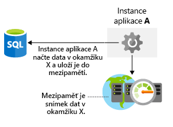

V architektuře je důležité zohlednit výkon úložiště. Stejně jako latence sítě i nedostatečný výkon úložné vrstvy může mít negativní vliv na práci koncových uživatelů. Jak byste optimalizovali úložiště dat? Co je potřeba vzít v úvahu, abyste měli jistotu, že v architektuře úložiště nejsou kritické body? V tomto článku se podíváme, jak v architektuře optimalizovat výkon úložiště.

## Optimalizace výkonu úložiště virtuálního počítače

Nejdřív se pojďme podívat na optimalizaci úložiště pro virtuální počítače. Diskové úložiště má rozhodující vliv na výkon virtuálních počítačů a výběr správného typu disku pro aplikaci představuje důležité rozhodnutí.

Různé aplikace budou mít různé požadavky na úložiště. Aplikace může být citlivá na latenci při čtení a zápisu na disk nebo může vyžadovat zpracování velkého počtu vstupně-výstupních operací za sekundu (IOPS) nebo celkově větší propustnost disku.

Jaký typ disku použijete, když vytváříte zatížení IaaS? Nabízejí se čtyři možnosti:

- **Místní úložiště SSD** – každý virtuální počítač má dočasný disk v místním úložišti SSD. Jeho velikost se liší podle velikosti virtuálního počítače. Místní disk SSD má vysoký výkon, ale při údržbě nebo při opakovaném nasazení virtuálního počítače může dojít ke ztrátě dat. Tento disk je vhodný jenom jako dočasné úložiště dat, která nebudete trvale potřebovat. Můžete ho použít třeba pro stránkovací soubor nebo systémovou databázi tempdb SQL Serveru. Za toto úložiště nic neplatíte. Cena za něj je zahrnuta v nákladech na virtuální počítač.

- **Standardní úložiště HDD** – toto úložiště v podobě diskové jednotky je vhodné, když aplikaci neomezuje nejednotná latence ani nižší úroveň propustnosti. Příkladem použití tohoto typu disku jsou vývojové/testovací úlohy, které nevyžadují garantovaný výkon.

- **Standardní úložiště SSD** – úložiště SSD s nízkou latencí disku SSD a s nižší úrovní propustnosti. Dobrým příkladem použití tohoto typu disku je neprodukční webový server.

- **Úložiště SSD úrovně Premium** – úložiště SSD vhodné pro zatížení při ostrém provozu, kdy se vyžaduje největší spolehlivost a trvale nízká latence nebo vysoká míra propustnosti a IOPS. Vzhledem k tomu, že tyto disky mají vyšší výkon a jsou spolehlivější, doporučují se pro všechny úlohy v ostrém provozu.

Úložiště Premium je možné připojit jen k virtuálnímu počítači určité velikosti. Velikosti virtuálních počítačů umožňujících připojení úložiště Premium jsou v názvu označeny písmenem s, například D2**s**_v3 nebo Standard_F2**s**_v2. Standardní úložiště s disky HDD nebo SSD je možné připojit k libovolnému typu virtuálního počítače (bez ohledu na to, zda mají v názvu písmeno s).

Disky mohou být prokládané, tzn. že mohou používat technologii prokládání (například prostory úložiště s přímým přístupem ve Windows nebo mdadm v Linuxu), aby se zvýšila propustnost a IOPS tím, že se disková aktivita rozdělí mezi více disků. Prokládání disků posouvá hranice výkonu disků. Často se používá u vysoce výkonných databázových systémů nebo jiných systémů s vysokými požadavky na úložiště.

Pokud spoléháte na zátěže virtuálních počítačů, je potřeba vyhodnotit požadavky na výkon aplikace, abyste pro své virtuální počítače dokázali vybrat správné základní úložiště.

## Optimalizace výkonu úložiště pro aplikaci

Můžete použít různé technologie úložiště, které zlepšují výkon samotného disku, ale můžete také řešit výkon při přístupu k datům v aplikační vrstvě. Pojďme se podívat na několik možností.

### Ukládání do mezipaměti

Ke zlepšení výkonu aplikace se často používá vrstva mezipaměti integrovaná mezi aplikací a úložištěm dat. Mezipaměť obvykle ukládá data do paměti, aby se dala rychle načíst. Mohou to být data, ke kterým je potřeba častý přístup, nebo vámi určená data z databáze, případně dočasná data, jako je stav uživatele. Budete mít kontrolu nad typem uložených dat, četností jejich aktualizace a vypršením jejich platnosti. Pokud mezipaměť umístíte do stejné společné oblasti jako aplikaci a databázi, snížíte tím celkovou latenci mezi aplikací a databází. Načítání dat z mezipaměti bude skoro vždy rychlejší než načítání stejných dat z databáze. Přidání vrstvy mezipaměti tak může výrazně zlepšit celkový výkon aplikace. Následující obrázek ukazuje, jak aplikace načítá data z databáze, ukládá je do mezipaměti a podle potřeby používá hodnotu uloženou v mezipaměti.

Azure Cache for Redis je služba ukládání do mezipaměti v Azure, která ukládá data v paměti. Je založená na opensourcové mezipaměti Redis a představuje plně spravovanou službu nabízenou společností Microsoft. Vyberte si požadovanou úroveň výkonu a nakonfigurujte aplikaci na používání této služby.

### Polyglotní použití

Polyglotní použití je řešení vašich požadavků na úložiště s využitím jiných technologií úložišť dat.

Jako příklad si vezměme elektronické obchodování. Při elektronickém obchodování můžete prostředky aplikace ukládat do úložiště objektů blob, recenze produktů a doporučení do úložiště typu NoSQL a profily uživatelů nebo data účtů do databáze SQL. Následující obrázek znázorňuje, jak může aplikace používat různé metody k ukládání různých typů dat.

Je to důležité, protože různá úložiště dat jsou navržená pro určité případy použití nebo mohou být přístupnější kvůli nižším nákladům. Pokud bychom například ukládali objekty blob do SQL Database, přístup k nim může být nákladnější a pomalejší než přístup přímo z úložiště objektů blob.

Zajištění konzistence dat napříč distribuovanými úložišti daty může být velkou výzvou. Problém je v tom, že strategie, jako je serializace a zamykání, fungují správně pouze tehdy, když všechny instance aplikace sdílejí stejné úložiště dat a aplikace je navržená tak, aby zámky byly jen krátkodobé. Pokud jsou ale data rozdělená na oddíly nebo replikují se v různých úložištích dat, může se zamykání a serializace přístupu k datům za účelem zajištění konzistence stát nákladnou režií, která má dopad na propustnost, dobu odezvy a škálovatelnost systému. Většina moderních distribuovaných aplikací proto data, která upravují, nezamyká, a mají spíše volnější přístup ke konzistenci, kterému se říká případná konzistence.

Konečná konzistence znamená, že pokud nedojde k dalším operacím zápisu, repliky úložišť dat nakonec splynou. Při zápisu do jednoho úložiště dat může čtení z jiného úložiště vracet starší data. Konečná konzistence umožňuje větší škálování. Operace čtení a zápisu mají nízkou latenci, protože nečekají, až se zkontroluje jednotnost informací ve všech úložištích.

## Příklad Lamna Healthcare

Rezervační systém pro pacienty zdravotního zařízení Lamna Healthcare je hostovaný ve dvou oblastech Azure: Západní Evropa a Austrálie – východ. K nasazení webu se jako front-endové uzly používají virtuální počítače. V západní Evropě mají nasazenou službu Azure SQL DB jako primární a ve východní Austrálii jako sekundární službu pro čtení. Front-endové uzly nevyžadují vysokou míru propustnosti disku, ale stabilní latenci a výkon i provozní spolehlivost, a proto se používá úložiště SSD úrovně Premium.

V každé oblasti Azure lokálně hostují službu Azure Cache for Redis, ve které jsou uložené časté požadavky uživatelů a informace o dostupnosti lékařů. Nejčastější aktivitou zjištěnou v aplikaci je čtení dat. Kvůli optimalizaci výkonu se implementovalo ukládání do mezipaměti.

Uvedli jsme několik příkladů, jak zlepšit výkon úložiště. Ve vrstvě infrastruktury volbou správné architektury disku a na úrovni aplikace ukládáním do mezipaměti a výběrem správné datové platformy pro svá data. Správná architektura řešení zajistí co možná nejlepší přístup k datům.