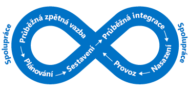
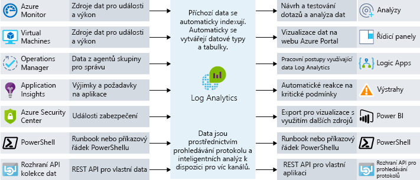

Koncoví uživatelé od svých aplikací očekávají více. Chtějí mít skvělé uživatelské prostředí a nenarážet na problémy s výkonem. Jak do své architektury integrujete identifikaci kritických bodů výkonu? V této jednotce se podíváme na procesy i nástroje, které můžou pomoct zajistit, aby vaše aplikace dobře fungovala, a pokud dobře nefunguje, pomůžou vám zjistit důvody.

## Význam požadavků

Než budeme mluvit o výkonu, je důležité probrat požadavky. Teoreticky bychom mohli ve vylepšování škálovatelnosti a výkonu pokračovat do nekonečna. V určitém okamžiku už je ale další vylepšení nepřekonatelně drahé, obtížné a nemá dostatečný obchodní dopad, aby mělo smysl. 

Tento bod nám pomáhají najít naše **požadavky netýkající se funkcí**. Tyto konkrétní požadavky nám neříkají, co naše aplikaci musí *dělat*. Místo toho nám říkají, jaké úroveň kvality musí splňovat. Můžeme například definovat, aby nám tyto požadavky netýkající se funkcí říkaly:

- Jak rychle se musí transakce vrátit při daném zatížení
- Kolik současných připojení musíme podporovat, než začneme vracet chyby
- Jak dlouho smí být naše aplikace v případě selhání serveru mimo provoz, než bude online k dispozici záloha

Definovat tyto požadavky předtím, než začnete tvořit řešení, je důležité k zajištění, aby aplikace splňovala očekávání, ale nevyžadovala větší úsilí nebo výdaje, než je nezbytné. Na základě těchto požadavků netýkajících se funkcí můžeme také naplánovat pravidla monitorování a provozu. 

Proberte požadavky se zúčastněnými stranami nebo zákazníky, zdokumentujte je a široce o nich informujte, aby bylo jisté, že se všichni shodnou na tom, co se rozumí „dobrým výkonem“.

## DevOps a výkon aplikace

Podstatou DevOps je, že v naší organizaci nemáme sila vývoje a infrastruktury. Místo toho spolupracují na efektivním vytváření, nasazování, monitorování a správě aplikací ve zjednodušeném procesu.

Plánování, vývoj, testování a monitorování se provádí v rámci iteračního přístupu. Výkon a kvalita naší aplikace nejsou něčím, na co dodatečně myslíme při nasazení do živého prostředí, ale stávají se přímo součástí životního cyklu vývoje našeho softwaru. Následující obrázek ukazuje, kde jsou v životním cyklu vývoje softwaru příležitosti pro spolupráci.

Tento přístup je v souladu s konceptem DevOps zvaným „posun doleva“. Jinými slovy posuňte kontroly řízení kvality do dřívějších fází procesu nasazení a vydání. Umožní vám to dříve zachytit problémy s dopadem na koncové uživatele. Protože pracujeme v průběžném cyklu, omezujeme množství ručních interakcí a co nejvíce automatizujeme. 

Jedním ze způsobů, jak z výkonu děláme součást procesu DevOps, je provádění testů výkonu nebo zátěžových testů, abychom ověřili, že aplikace splňuje požadavky netýkající se funkcí, než ji nasadíme do produkčního prostředí.

V ideálním případě bychom mohli testy výkonu a zátěžové testy provádět v prostředí, které je úplně stejné jako produkční prostředí, bez dopadu na naše skutečné produkční servery. Při využití cloudu tuto možnost máte. Můžete automatizovat vytváření prostředí podobného produkčnímu, provést testování a pak prostředí odstranit, abyste minimalizovali náklady. Tento přístup k automatizaci může poskytnout jistotu, že vaše aplikace dokáže zvládat rozsah, jaký v současnosti požadujete, a také reagovat na budoucí růst.

Základní součástí tohoto přístupu se stává monitorování výkonu aplikace. Pokud provádíme testy výkonu a zátěžové testy naší aplikace nebo chceme mít pod kontrolou produkční výkon, pak chceme rozumět tomu, jaké části naší aplikace možná z hlediska výkonu nefungují optimálně. Podívejme se na způsoby, jak to udělat.

## Možnosti monitorování výkonu v Azure

Monitorování je shromažďování a analýza dat s cílem určit výkon, stav a dostupnost vaší podnikové aplikace a souvisejících prostředků.

Chceme být stále informovaní, že naše aplikace běží bez problémů. K informování o zásadních problémech, které nastávají, se dají využít proaktivní oznámení. Existuje mnoho vrstev monitorování, které můžeme vzít v úvahu, hlavně vrstva infrastruktury a aplikační vrstva.

### Azure Monitor

Azure Monitor poskytuje jeden bod správy pro protokoly na úrovni infrastruktury a monitorování pro většinu služeb Azure. Shromažďuje metriky, protokoly aktivit a diagnostické protokoly a další informace. Azure Monitor poskytuje celou řadu funkcí, včetně:

- Upozornění Azure k proaktivnímu oznamování nebo zasahování v případě jakéhokoli narušení metrik nebo vyplývajících aktivit
- Zkombinování mnoha monitorovacích zdrojů do jednoho zobrazení naší aplikace pomocí řídicích panelů Azure

Azure Monitor je místem, kde můžete začít se všemi přehledy metrik prostředků téměř v reálném čase. Řada prostředků Azure začne metriky poskytovat automaticky po nasazení. Například instance webové aplikace Azure budou poskytovat metriky výpočetních prostředků a aplikačních žádostí. Vedle diagnostických metrik hostitele virtuálního počítače se tady shromažďují také metriky z Application Insights. Zobrazí se také diagnostické metriky hosta virtuálního počítače, jakmile se k jejich odběru přihlásíte.

### Log Analytics

Centralizované protokolování vám může pomoct odhalit skryté problémy, které může být obtížné vystopovat. Pomocí Log Analytics se můžete dotazovat na data mezi protokoly a agregovat je. Tato korelace mezi zdroji vám může pomoct identifikovat potíže nebo problémy s výkonem, které nemusí být zřejmé při prohlížení jednotlivých protokolů nebo metrik. Následující obrázek ukazuje, jak Log Analytics funguje jako hlavní centrum pro monitorování dat. Log Analytics přijímá data o monitorování prostředků Azure a zpřístupňuje je uživatelům kvůli jejich analýze nebo vizualizaci.

Můžete sloučit širokou škálu zdrojů dat, protokolů zabezpečení, protokolů aktivit Azure, serverových, síťových a aplikačních protokolů. Můžete také do Log Analytics posílat data místního System Center Operations Manageru v hybridních scénářích nasazení a nechat Azure SQL Database odesílat diagnostické informace přímo do Log Analytics pro podrobné monitorování výkonu.

Centralizované protokolování může být obrovsky přínosné pro řešení potíží ve všech typech scénářů, včetně problémů s výkonem. Je klíčovou součástí vhodné strategie monitorování pro všechny architektury.

## Správa výkonu aplikací

Hluboké potíže aplikací se často velmi obtížné vystopují. Přínosná k tomu může být integrace telemetrie do aplikace pomocí řešení správy výkonu aplikací (APM) ke sledování výkonu a chování aplikací na nízké úrovni. Tato telemetrie může zahrnovat doby požadavků na jednotlivé stránky, výjimky v rámci vaší aplikace a dokonce i vlastní metriky ke sledování obchodní logiky. Tato telemetrie může poskytovat obrovský přehled o tom, co se v rámci vaší aplikace děje.

Application Insights v Azure je služba, která tuto podrobnou správu výkonu aplikací poskytuje. Do aplikace nainstalujete malý instrumentační balíček a vytvoříte prostředek Application Insights na portálu Microsoft Azure Portal. Instrumentace monitoruje vaši aplikaci a odesílá telemetrická data na portál.

Ingestovat je možné telemetrii z hostitelských prostředí, jako jsou čítače výkonu, diagnostika Azure nebo protokoly Dockeru. Můžete také nastavit webové testy, které webové službě pravidelně odesílají umělé požadavky. Dokonce můžete nakonfigurovat, aby vaše aplikace odesílala vlastní události a metriky, které napíšete sami v kódu klienta nebo serveru. Příkladem jsou události specifické pro aplikaci, jako jsou prodané položky nebo vyhrané hry.

Application Insights ukládá data v běžném úložišti a metriky se sdílejí se službou Azure Monitor. Může využívat sdílené funkce, například upozornění, řídicí panely a hloubkovou analýzu pomocí dotazovacího jazyka Log Analytics.

Běžným modelem, který se využívá k určování dostupnosti webové aplikace, je model monitorování stavu pomocí koncových bodů. Tento model se používá k monitorování webových aplikací a přidružených back-endových služeb, jestli jsou dostupné a správně fungují. Model se implementuje pomocí dotazu na konkrétní identifikátor URI. Koncový bod kontroluje místo pouhé dostupnosti samotného front-endu stav řady komponent, včetně back endových služeb, na kterých aplikace závisí. Slouží to jako kontrola stavu na úrovni služby, která vrací údaj o celkovém stavu služby.

Řešení monitorování výkonu aplikací jako Application Insights můžete využít k hlubšímu pochopení vaší aplikace a nalezení vztahů aktivity napříč aplikací. Může vám to pomoct pochopit, jak funguje konkrétní akce v klientském prohlížeči, na serveru a v navazujících službách. Poskytne vám to také přehled o trendech a nabídne oznámení v případě problému, pomůže zjistit, v čem problém spočívá a jak ho vyřešit, než ho uživatelé zaregistrují.

## Monitorování výkonu v Lamna Healthcare

V Lamna Healthcare implementovali webový systém objednávání pacientů s využitím virtuálních počítačů a databáze SQL Azure ve dvou oblastech Azure. Rozhodli se využít agenta virtuálního počítače a Log Analytics k monitorování výkonu front-endových virtuálních počítačů.

Využívají službu Azure Monitor k porozumění výkonu jejich databází SQL Azure a zachycení klíčových metrik výkonu včetně procentuálního využití a zablokování procesoru.

Služba Application Insights je nakonfigurovaná k zachytávání informací o dostupnosti a telemetrických informací. Tým novou funkci objednávání změnil, aby odesílala vlastní telemetrie událostí do Application Insights. Teď mají členové týmu přístup, který jim umožňuje porozumět objem uskutečněných obchodních událostí, a můžou tak získat mnohem lepší přehled o tom, co se v jejich aplikaci děje.

Podívali jsme se na některé procesy, nástroje a osvědčené postupy, které vám pomůžou sledovat problémy s výkonem a zajistit, aby vaše aplikace fungovala co nejlépe.