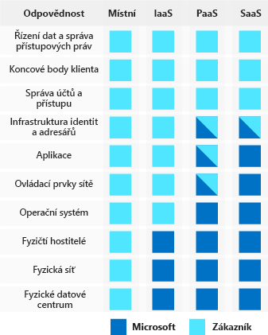

Pokud jde o zabezpečení, neexistuje žádné „jednoduché tlačítko“ ani řešení, které by vás zbavilo všech problémů. Představte si, že společnost Lamna Healthcare zanedbávala ve svém prostředí zabezpečení. Společnost si nyní uvědomila, že se na tuto oblast musí více zaměřit. Ve společnosti Lamna si nejsou jistí, kde začít nebo zda si můžou prostě zakoupit řešení, které by jejich prostředí zabezpečilo. Společnost ví, že potřebuje holistický přístup, ale není si jista, co to přesně v jejím případě znamená. V tomto tématu určíme klíčové koncepty hloubkové ochrany, identifikujeme klíčové technologie a přístupy k zabezpečení s podporou hloubkové ochrany a probereme, jak těchto konceptů využít při navrhování vlastních služeb Azure.

#### Hloubková ochrana

> [!VIDEO https://www.microsoft.com/videoplayer/embed/RWjTfZ]

## Vícevrstvý přístup k zabezpečení

*Hloubková ochrana* je strategie, která využívá řady mechanismů ke zpomalení postupu útoku s cílem získat neoprávněný přístup k informacím. Každá vrstva poskytuje ochranu, takže pokud dojde k prolomení jedné vrstvy, zabrání dalšímu ohrožení následující vrstva. Přístup k zabezpečení založený na více vrstvách používá Microsoft jak u fyzických datacenter, tak u služeb Azure. Cílem hloubkové ochrany je chránit informace a bránit jejich krádeži někým, kdo k nim nemá oprávnění přistupovat. Mezi běžné principy používané k definování postoje k zabezpečení patří důvěrnost, integrita a dostupnost, známé pod zkratkou CIA.

- __Důvěrnost__ – princip nejnižší úrovně oprávnění. Přístup k informacím omezíte pouze na jednotlivce, kteří mají explicitně udělený přístup. Mezi tyto informace patří ochrana hesel uživatelů, certifikáty vzdáleného přístupu a obsah e-mailů.

- __Integrita__ –prevence neoprávněných změn u neaktivních informací nebo u informací v přenosu. Běžným přístupem používaným při přenosu dat je vytvořit odesílateli pomocí jednosměrného algoritmu hash jedinečný otisk dat. Hodnota hash se spolu s daty odešle příjemci. Příjemce hodnotu hash dat přepočítá a porovná ji s původní hodnotou, aby nebyl pochyb o tom, že během přenosu se žádná data neztratila ani nezměnila.

- __Dostupnost__ – zajištění dostupnosti služeb oprávněným uživatelům. Útoky DoS (odepření služeb) jsou nejběžnější příčinou ztráty dostupnosti pro uživatele. Návrh systému k předejití kritickým prvkům způsobujícím selhání pohání také přírodní katastrofy, takže se do geograficky rozptýlených umístění nasazuje více instancí aplikací.

## Vrstvy zabezpečení

Hloubkovou ochranu si můžete představit jako sadu soustředných kruhů, v jejichž středu jsou data, která potřebujete zabezpečit. Každý kruh přidává kolem dat další vrstvu zabezpečení. Tento přístup ruší závislost na jedné vrstvě ochrany, slouží ke zpomalení útoku a poskytuje telemetrii výstrah, na kterou můžete reagovat ručně nebo automaticky. Pojďme se podívat na jednotlivé vrstvy.

### Data

Téměř ve všech případech jdou útočníci po datech:

- Uložených v databázi
- Uložených na disku virtuálních počítačů
- Uložených v aplikaci SaaS jako Office 365
- Uložených v cloudovém úložišti

Za zajištění vhodného zabezpečení zodpovídají ti, kteří data ukládají a řídí k nim přístup. Často existují zákonné požadavky předepisující mechanismy a procesy, které musí být splněné, aby se zajistila důvěrnost, integrita a dostupnost dat.

### Aplikace

- Zajistěte, aby byly aplikace zabezpečené a bez ohrožení zabezpečení.
- Ukládejte citlivé tajné kódy aplikací do zabezpečeného úložného média.
- Vytvořte ze zabezpečení požadavek, který se musí při návrhu všech aplikací zohlednit.

Integrace zabezpečení do životního cyklu vývoje aplikací vám pomůže snížit počet ohrožení zabezpečení zavedených do kódu. Vyzvěte všechny vývojové týmy, aby u svých aplikací ve výchozím stavu zajistili zabezpečení. Zaveďte povinné požadavky na zabezpečení.

### Výpočetní prostředky

- Zabezpečte přístup k virtuálním počítačům.
- Implementujte ochranu koncových bodů a stahujte do svých systémů opravy zabezpečení a aktualizace.

Malware, systémy bez oprav zabezpečení a nesprávně zabezpečené systémy dělají z vašeho prostředí snadný cíl. U této vrstvy se zaměřte na zabezpečení výpočetních prostředků a použití vhodných kontrolních mechanismů, které minimalizují problémy se zabezpečením.

### Sítě

- Omezte komunikaci mezi prostředky prostřednictvím segmentace a řízení přístupu
- Ve výchozím stavu ji odepírejte
- Omezte příchozí a odchozí internetový přístup (kde je to žádoucí).
- Implementujte zabezpečené připojení k místním sítím.

U této vrstvy se zaměřte na omezení síťového připojení napříč všemi prostředky a povolte ho pouze v nutných případech. Segmentujte své prostředky a používejte řízení na úrovni sítě k omezení komunikace pouze na to, co je potřeba. Omezením této komunikace snižujete riziko laterálního pohybu v celé síti.

### Hranice

- Použijte ochranu proti útokům DDoS (distribuovaný útok na dostupnost služby), abyste odfiltrovali rozsáhlé útoky předtím, než způsobí odepření služeb koncovým uživatelům.
- Použijte hraniční brány firewall k identifikaci škodlivých útoků na vaši síť a k upozornění na ně.

Na hranici sítě jde o ochranu před síťovými útoky na prostředky. Identifikace těchto útoků, eliminace jejich důsledků a upozorňování na ně je k zabezpečení sítě důležité.

### Zásady a přístup

- Řiďte přístup k infrastruktuře a řiďte změny.
- Používejte jednotné přihlašování a vícefaktorové ověřování.
- Auditujte události a změny.

U vrstvy zásad a přístupu jde hlavně o zajištění zabezpečení identit, udělení přístupu pouze tomu nejnutnějšímu a protokolování změn.

### Fyzické zabezpečení

- První linii obrany představuje fyzické zabezpečení budovy a řízení přístupu k výpočetnímu hardwaru v datacentru.

U fyzického zabezpečení jde o zajištění fyzické ochrany majetku proti nedovolenému přístupu. Tím se zajistí, že další vrstvy nelze obejít a že se ztrátou nebo odcizením se naloží odpovídajícím způsobem.

Každá vrstva může implementovat jednu nebo více oblastí zájmu důvěrnosti, integrity a dostupnosti.

|#|Kruh|Příklad|Princip
|---|---|---|---|
|1|Data|Šifrování neaktivních uložených dat ve službě Azure Blob Storage|Integrita|
|2|Aplikace|Šifrované relace protokolu SSL/TLS|Integrita|
|3|Výpočetní prostředky|Pravidelné aktualizace a opravy zabezpečení operačního systému a softwaru|Dostupnost|
|4|Síť|Pravidla zabezpečení sítě|Důvěrnost|
|5|Hranice|Ochrana před útoky DDoS|Dostupnost|
|6|Zásady a přístup|Ověřování uživatelů pomocí Azure Active Directory|Integrita|
|7|Fyzické zabezpečení|Biometrické řízení přístupu do datacentra Azure|Důvěrnost|

## Sdílená odpovědnost

S přesunem výpočetních prostředí z datacenter řízených zákazníkem do cloudových datacenter se přesouvá i odpovědnost za zabezpečení. Za zabezpečení teď odpovídá jak poskytovatel cloudových služeb, tak i zákazníci.

## Neustálé vylepšování

Hrozby se vyvíjejí v reálném čase v obrovském měřítku. Proto není architektura zabezpečení nikdy úplně hotová. Microsoft a naši zákazníci vyžadují inteligentní, rychlé a adekvátní reakce na tyto hrozby.

[Azure Security Center](https://azure.microsoft.com/services/security-center/) zajišťuje zákazníkům jednotnou správu zabezpečení a pokročilou ochranu před hrozbami, aby jak místně, tak i v Azure všichni událostem zabezpečení rozuměli a uměli na ně reagovat. Zákazníci Azure jsou zase odpovědní za průběžné přehodnocování a vyvíjení architektury zabezpečení.

## Hloubková obrana ve společnosti Lamna Healthcare

Lamna Healthcare se intenzivně zaměřila na hloubkovou ochranu napříč všemi IT týmy. Vzhledem k tomu, že je tato organizace zodpovědná za značné množství citlivých lékařských údajů, uvědomují si, že nejlepším řešením je komplexní přístup. 

Sestavili virtuální tým složený ze zástupců všech IT týmů, který se společně s bezpečnostním týmem zaměřuje na zavedení tohoto přístupu v celé organizaci. Poučují techniky a architekty o ohrožení zabezpečení a způsobech jejich řešení, a poskytují rady při prosazování projektů v organizaci.

Uvědomují si, že v tomto úsilí nemohou nikdy polevit, a zavedli pravidelné kontroly zásad, procesů, techniky a architektury, aby zajistili, že budou neustále hledat způsoby, jak zabezpečení vylepšit.

## Shrnutí

Vysvětlili jsme si přístup založený na hloubkové ochraně. Řekli jsme si, jak vypadají jednotlivé vrstvy této ochrany a na co se každá vrstva zaměřuje. Pokud k zabezpečení architektury budete přistupovat tímto způsobem, dokážete řešit zabezpečení prostředí komplexně, místo abyste se zaměřovali jenom na jednou vrstvu nebo technologii.