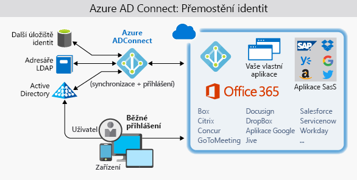

Společnost Lamna Healthcare hostí starší interní aplikaci a webový portál pro svoje klinické lékaře, aby mohli spravovat zdravotní údaje o pacientech. Tato organizace dostává mnoho žádostí, aby aplikace byla dostupná ošetřovatelům, kteří jsou často na místě u pacientů, a tedy mimo síť. 

Nedávný únik dat způsobený škodlivými agenty tuto společnost přinutil, aby zpřísnila svoje zásady hesel. Společnost teď od uživatelů vyžaduje, aby měnili hesla častěji a aby používali delší a složitější hesla. To vedlo k nežádoucímu vedlejšímu efektu – uživatelé mají problém zapamatovat si různé přihlašovací údaje vytvořené pro různé role správy, tak si začali složitá hesla zapisovat bez ohledu na bezpečnost. 

V tomto článku si povíme o identitě jako vrstvě zabezpečení interních a externích aplikací. Vysvětlíme si výhody jednotného přihlašování (SSO) a vícefaktorového ověřování (MFA) pro zajištění bezpečné identity. Také se dozvíte, proč uvažovat o replikaci místních identit do Azure Active Directory.

## Identita jako vrstva zabezpečení

Digitální identity jsou nedílnou součástí dnešního podnikání a sociálních interakcí – místních i online. V minulosti byly služby identit a řízení přístupu omezené na interní síť společnosti a používaly protokoly jako Kerberos a LDAP, které byly navržené k tomuto účelu. V nedávné době začali lidé komunikovat s digitálními službami především pomocí mobilních zařízení. Zákazníci i zaměstnanci očekávají, že budou mít ke službám přístup odkudkoli a kdykoli, což vedlo k vývoji protokolů identit, které fungují v internetovém měřítku napříč mnoha různorodými zařízeními a operačními systémy.

Společnost Lamna Healthcare posuzuje schopnosti své architektury ohledně identit a hledá možnosti, jak do své aplikace přinést následující schopnosti:

- Poskytnout uživatelům aplikace jednotné přihlašování
- Vylepšit starší verzi aplikace tak, aby s minimálním úsilím začala používat moderní ověřování
- Vynutit vícefaktorové ověřování pro všechna přihlášení z prostředí mimo sítě společnosti
- Vyvinout aplikaci, aby se mohli pacienti zaregistrovat a bezpečně spravovat údaje svého účtu

## Jednotné přihlašování

Čím více identit musí uživatel spravovat, tím větší je riziko bezpečnostního incidentu souvisejícího s přihlašovacími údaji. Více identit znamená, že uživatel si musí pamatovat a měnit více hesel. Zásady hesel se můžou mezi aplikacemi lišit, a protože požadavky na složitost hesel rostou, je pro uživatele obtížnější si hesla pamatovat.

A všechny tyto identity vyžadují správu. Zvyšují se nároky na helpdesk, který se musí zabývat problémy s uzamčením účtů a žádostmi o resetování hesel. Pokud uživatel opustí organizaci, může být náročné sledovat všechny tyto identity a zajistit, aby byly zakázané. Pokud se nějaká identita přehlédne, může to umožnit přístup, i když by měl být vyloučený.

Při použití jednotného přihlašování si uživatelé musí pamatovat jenom jedno ID a jedno heslo. Jediné identitě vázané na uživatele je umožněný přístup z různých aplikací, což zjednodušuje model zabezpečení. Když uživatelé mění role nebo opouštějí organizaci, jsou změny přístupu vázané na jedinou identitu. Tím se značně snižuje úsilí potřebné ke změně nebo zákazu účtů. Při použití jednotného přihlašování můžou uživatelé spravovat své identity snadněji a zlepší se možnosti zabezpečení ve vašem prostředí.

### Jednotné přihlašování (SSO) s Azure Active Directory

Azure Active Directory (AD) je cloudová služba identit. Má integrovanou podporu synchronizace s místní službou Active Directory nebo se dá používat samostatně. To znamená, že všechny aplikace, ať už místní, v cloudu (včetně Office 365) nebo i mobilní, můžou sdílet stejné přihlašovací údaje. Správci a vývojáři můžou řídit přístup k datům a aplikacím pomocí centralizovaných pravidel a zásad nakonfigurovaných v Azure AD.

Využitím Azure AD k jednotnému přihlašování můžete kombinovat různé zdroje dat do systému Intelligent Security Graph. Ten umí poskytnout analýzu hrozeb a ochranu identit v reálném čase všem účtům v Azure AD – i účtům synchronizovaným z místní služby AD. Použitím centralizovaného zprostředkovatele identity budete mít centralizované bezpečnostní prvky, vytváření sestav, upozorňování a správu infrastruktury identity.

### Synchronizace adresářů pomocí nástroje AD Connect

Nástroj Azure AD Connect integruje vaše místní adresáře do Azure Active Directory. Azure AD Connect poskytuje nejnovější možnosti a nahrazuje starší verze nástrojů pro integraci identity, jako jsou například DirSync nebo Azure AD Sync.

Tento jediný nástroj umožňuje jednoduché nasazení pro synchronizaci a přihlašování.

Společnost Lamna Healthcare vyžaduje, aby ověřování probíhalo především u místních řadičů domény, ale v situaci zotavení po havárii vyžaduje také cloudové ověřování. Nemá žádné požadavky, které by služba Azure AD nepodporovala.

Společnost Lamna Healthcare se rozhodla pokročit k následující konfiguraci:

- Nástrojem Azure AD Connect bude synchronizovat skupiny, uživatelské účty a hodnoty hash hesel uložené v místní službě Active Directory se službou Azure AD.
  - To se dá použít jako náhradní způsob, pokud je předávací ověřování nedostupné.
- Nakonfigurovat předávací ověřování pomocí místního ověřovacího agenta nainstalovaného na místním Windows Serveru.
- Pomocí funkce bezproblémového jednotného přihlašování v Azure AD automaticky přihlašovat uživatele z místních počítačů připojených k doméně.
  - To omezí uživatelské třenice potlačením více žádostí o ověření.

## Ověřování a přístup

Zásady zabezpečení společnosti Lamna Healthcare vyžadují, aby se všechna přihlášení, ke kterým dochází mimo hraniční síť společnosti, ověřovala pomocí dalšího faktoru ověřování. Tento požadavek spojuje dva aspekty služby Azure AD: vícefaktorové ověřování a zásady podmíněného přístupu.

### Vícefaktorové ověřování

Vícefaktorové ověřování (MFA) poskytuje dodatečné zabezpečení pro vaše identity – k úplnému ověření se vyžadují dva nebo více prvků. Tyto prvky spadají do tří kategorií:

- *Něco, co víte*
- *Něco, co máte*
- *Něco, co jste*

**Něco, co víte** může být heslo nebo odpověď na bezpečnostní otázku. **Něco, co máte** může být mobilní aplikace, která obdrží oznámení, nebo zařízení, které generuje token. **Něco, co jste** je obvykle nějaký druh biometrické vlastnosti používaný na mnoha mobilních zařízeních, například otisk prstu nebo sken obličeje.

Použití vícefaktorového ověřování zlepší zabezpečení vaší identity omezením důsledků prozrazení přihlašovacích údajů. Útočník, který má heslo uživatele, by k úplnému ověření musel získat i telefon nebo obličej uživatele. Ověření pomocí jenom jednoho faktoru je nedostatečné a útočník nebude moct prokázat svoji identitu jen pomocí těchto přihlašovacích údajů. Výhody, které to přináší pro zabezpečení, jsou obrovské a je potřeba donekonečna opakovat, že je potřeba MFA povolit, kdykoli je to možné.

Služba Azure AD má schopnosti MFA integrované a může se integrovat s jinými poskytovateli MFA. Ověřování MFA je poskytováno bezplatně každému uživateli, který má v Azure AD roli globálního správce, protože se jedná o vysoce citlivé účty. U všech ostatních účtů se dá MFA povolit zakoupením licence s touto funkcí a přiřazením licence k účtu.

### Zásady podmíněného přístupu

Když kromě MFA zajistíte, aby byly před udělením přístupu splněné další požadavky, můžete tak přidat další vrstvu ochrany. Blokováním přihlášení z podezřelých IP adres nebo zamítnutím přístupu zařízením bez ochrany před malwarem můžete omezit přístup, pokud je přihlášení riskantní.

Azure Active Directory poskytuje funkci zásad podmíněného přístupu (CAP), která zahrnuje podporu zásad přístupu na základě skupiny, lokality a stavu zařízení. Funkce lokality umožňuje společnosti Lamna odlišit IP adresy, které nepatří k její síti, a prostřednictvím zásad zabezpečení vyžadovat ze všech takových lokalit vícefaktorové ověřování (MFA).

Společnost Lamna Healthcare vytvořila [zásady podmíněného přístupu](https://docs.microsoft.com/azure/active-directory/conditional-access/overview), které od uživatelů přistupujících k aplikaci z IP adresy mimo firemní síť vyžadují, aby prokázali svou identitu prostřednictvím MFA.

## Zabezpečení starších aplikací

Zaměstnanci společnosti Lamna Healthcare požadují zabezpečený vzdálený přístup k aplikaci pro správu, která je hostovaná místně. Z počítačů připojených k doméně (za firemní bránou firewall) se uživatelé vůči této aplikaci v současnosti ověřují pomocí Integrovaného ověřování systému Windows (WIA). Projekt začlenění moderního ověřovacího mechanismu do aplikace je naplánovaný, ale existuje značný obchodní tlak, aby se funkce vzdáleného přístupu zprovoznily co nejdříve. Proxy aplikace Azure AD umožňuje rychle, jednoduše a bezpečně používat vzdálený přístup k aplikaci beze změn kódu.

Proxy aplikací služby Azure AD nabízí:

- Jednoduchost
  - Aby aplikace fungovaly s Proxy aplikací, nemusíte je měnit nebo aktualizovat.
  - Uživatelé získají konzistentní prostředí pro ověřování. Prostřednictvím portálu MyApps získají jednotné přihlašování k aplikacím SaaS v cloudu i k místním aplikacím.
- Zabezpečení
  - Když aplikace publikujete pomocí Proxy aplikací služby Azure AD, můžete využívat výhody bohatých řídicích prvků ověřování a analýzy zabezpečení v Azure. Získáte funkce zabezpečení v cloudovém měřítku a zabezpečení Azure, jako je podmíněný přístup a dvoustupňové ověření.
  - Abyste uživatelům umožnili vzdálený přístup, nemusíte kvůli tomu otevírat příchozí připojení přes bránu firewall.
- Efektivnost z hlediska nákladů
  - Proxy aplikací funguje v cloudu, takže ušetříte čas a peníze. Místní řešení obvykle vyžadují, abyste zřídili a udržovali demilitarizované zóny (DMZ), hraniční servery nebo jiné složité infrastruktury.

Proxy aplikací služby Azure AD se skládá ze dvou částí: z agenta konektoru, který se nachází na Windows Serveru uvnitř vaší podnikové sítě, a z externího koncového bodu, který je na portálu MyApps nebo na externí adrese URL. Když uživatel přejde na tento koncový bod, ověří se pomocí služby Azure AD a přes agenta konektoru se přesměruje na místní aplikaci.

## Práce s identitami uživatelů

Po integraci moderního ověřování do své stávající aplikace společnost Lamna Healthcare rychle poznala, jaký přínos může mít pro jejich organizaci systém správy identit, jako je Azure AD. Nyní chce tým vedoucích prozkoumat další možnosti, jak můžou služby identity od Microsoftu zvýšit přidanou hodnotu. Teď se zaměřil na externí zákazníky. Hledá způsob, jak modernizací interakce se stávajícími zákazníky ještě více integrovat externí poskytovatele identit, jako je Google, Facebook a LinkedIn.

Azure AD B2C je služba pro správu identit postavená na pevných základech služby Azure Active Directory, která umožňuje přizpůsobení a řízení způsobu, jakým se zákazníci registrují a přihlašují a jakým při používání vašich aplikací spravují své profily. To zahrnuje mimo jiné aplikace vyvinuté pro iOS, Android a .NET. Azure AD B2C poskytuje přihlašovací prostředí sociálních identit a současně chrání profilové informace o identitě zákazníků. Adresáře Azure AD B2C se liší od standardních adresářů Azure AD a dají se vytvořit na portálu Azure Portal.

## Správa identit ve společnosti Lamna Healthcare

Poznali jsme, jak ve společnosti Lamna Healthcare použili řešení pro správu identit v Azure ke zlepšení zabezpečení prostředí. Začali tím, že uživatelům poskytli prostředí jednotného přihlašování, aby minimalizovali účty, se kterými musí uživatelé pracovat, a snížili tak provozní složitost, kterou nadměrné účty přinášejí. Vynutili vícefaktorové ověřování (MFA) pro přístup ke svým aplikacím a aktualizovali starší aplikaci, aby s minimálním úsilím začala používat moderní ověřování. Také zjistili, jak můžou zlepšit práci s identitami zákazníků, a zlepšit tak použitelnost aplikace pro své pacienty.

## Shrnutí

V této lekci jsme poznali, jak se kombinací řady funkcí Azure Active Directory dá získat solidní řešení identit k zabezpečení přístupu k aplikacím bez ohledu na jejich umístění. Identita je důležitou vrstvou zabezpečení. Když ji dobře navrhnete a zahrnete do své architektury, můžete zajistit, aby bylo vaše prostředí zabezpečené.