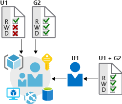
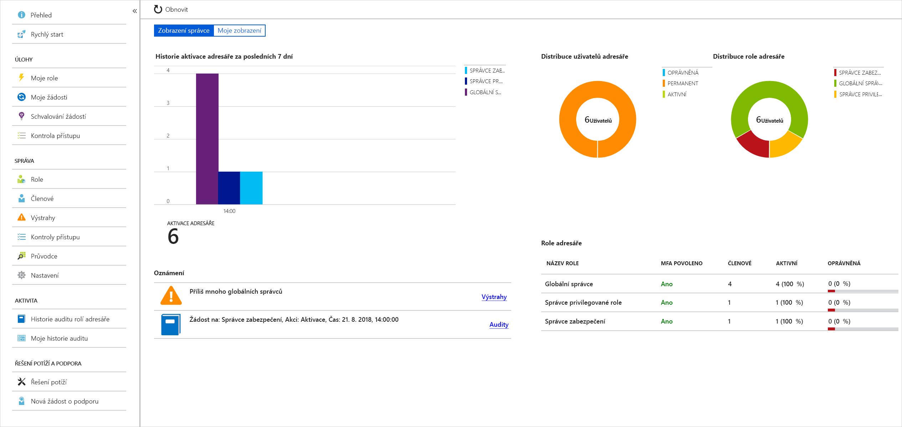

Organizace Lamna Healthcare nedávno zaznamenala značný výpadek webové aplikace určené pro zákazníky. Jeden technik měl úplný přístup ke skupině prostředků obsahující produkční webovou aplikaci. Tento člověk omylem odstranil skupinu prostředků a všechny podřízené prostředky včetně databáze hostující živá zákaznická data. 

Ve správě zdrojového kódu byl naštěstí k dispozici zdrojový kód aplikace i prostředky a podle plánu automaticky probíhalo pravidelné zálohování databáze. Službu se proto podařilo poměrně snadno obnovit. Tady se podíváme, jak se dalo tomuto výpadku vyhnout použitím možností Azure pro ochranu přístupu k infrastruktuře.

## Důležitost infrastruktury

Cloudová infrastruktura se stává důležitou součástí mnoha firem. Je nezbytné zajistit, aby lidé a procesy měli jenom práva, která potřebují ke své práci. Přiřazení nesprávných přístupových práv může vést ke ztrátě dat, úniku informací nebo způsobit nedostupnost služeb. 

Správci systémů mívají na starosti velké počty uživatelů, systémů a sad oprávnění. Udělení správných přístupových práv se tak může rychle stát nezvládnutelným úkolem a správce pak situaci řeší univerzálním oprávněním pro všechny. Toto řešení může sice zjednodušit správu, ale snadno může vést k tomu, že neúmyslně udělíte širší přístupová práva, než je potřeba.

## Řízení přístupu na základě role

Řízení přístupu na základě role (RBAC) nabízí trochu jiné řešení. Role jsou definované jako kolekce přístupových oprávnění. Objekty zabezpečení jsou mapovány na role přímo nebo prostřednictvím členství ve skupinách. Oddělení objektů zabezpečení, přístupových oprávnění a prostředků zjednodušuje správu přístupu a umožňuje jemněji odstupňovanou kontrolu.

V Azure se uživatelé, skupiny a role ukládají v Azure Active Directory (Azure AD). Rozhraní API Azure Resource Manageru používá řízení přístupu na základě role k zabezpečení veškeré správy přístupu k prostředků v Azure.

<!-- 
 -->

### Role a skupiny pro správu

Role jsou sady oprávnění, jako je „Jen pro čtení“ nebo „Přispěvatel“, která se dají udělit uživatelům pro přístup k instanci služby Azure. Role lze udělit na úrovni jednotlivých instancí služeb, ale zároveň je mohou přebírat nižší úrovně hierarchie Azure Resource Manageru. Role přiřazené ve vyšším oboru, například pro celé předplatné, se dědí do podřízených oborů, jako jsou instance služby. 

Skupiny pro správu jsou další hierarchickou úrovní, která byla nedávno zavedená do modelu RBAC. Skupiny pro správu přidávají možnost seskupovat předplatná a používat zásady ještě na vyšší úrovni.

To, že správci můžou nechat role protékat libovolně definovanou hierarchií předplatných, jim také umožňuje udělit ověřeným uživatelům dočasný přístup k celému prostředí. Auditor může například požadovat dočasný přístup jen pro čtení ke všem předplatným.

### Privileged Identity Management

Kromě správy přístupu k prostředkům Azure pomocí RBAC byste při komplexním přístupu k ochraně infrastruktury měli zvážit zahrnutí průběžného auditování členů rolí s tím, jak se jejich organizace mění a vyvíjí. Azure AD Privileged Identity Management (PIM) je další placená nabídka, která poskytuje přehled o přiřazeních rolí, samoobslužnou aktivaci rolí za běhu a kontroly přístupu k prostředkům Azure AD a Azure.

## Poskytování identit službám

Pro služby je často cenné mít identity. Častokrát v rozporu s doporučeními jsou přihlašovací údaje vložené v konfiguračních souborech. Bez zabezpečení konfiguračních souborů se může k těmto přihlašovacím údajům dostat každý, kdo má k systémům nebo úložištím přístup, a riskovat jejich prozrazení.

Azure AD řeší tento problém dvěma způsoby: instančními objekty a spravované identitami pro služby Azure.

### Instanční objekty

Abyste porozuměli instančním objektům, měli byste nejdřív chápat pojmy **identita** a **objekt zabezpečení** používané v prostředí správy identit.

**Identita** je jednoduše něco, co se dá ověřit. Samozřejmě to zahrnuje uživatele s uživatelskými jmény a hesly, ale může jít také o aplikace nebo jiné servery, které se prokazují například pomocí tajných kódů nebo certifikátů. Jako definici navíc uveďme, že **účet** označuje data přidružená k identitě.

**Objekt zabezpečení** je identita jednající s určitými rolemi nebo deklaracemi. Zvažte použití příkazu sudo (na příkazovém řádku Bash) nebo možnosti Spustit jako správce (ve Windows). V obou těchto případech jste dál přihlášení se stejnou identitou jako předtím, ale změnili jste roli, pod kterou něco spouštíte.

Název **instanční objekt** je proto výstižný. Je to identita použitá službou nebo aplikací. Stejně jako u jiných identit se instančnímu objektu dají přiřadit role.

Organizace Lamna Healthcare může například svým skriptům nasazení uložit, aby se spouštěly ověřené jako instanční objekty. Pokud je to jediná identita, která má oprávnění provádět destruktivní akce, udělala společnost Lamna velký krok k tomu, aby zajistila, že se nepředvídané odstranění prostředků nebude opakovat.

### Spravované identity pro prostředky Azure

Vytváření instančních objektů je zdlouhavé a jejich údržba může být z mnoha důvodů obtížná. Spravované identity pro prostředky Azure jsou mnohem jednodušší a většinu práce udělají za vás.

Spravovaný identita se dá okamžitě vytvořit pro libovolnou službu Azure, která ji podporuje, přičemž tento seznam se neustále rozrůstá. Když pro službu vytváříte spravovanou identitu, vytvoříte účet na tenantovi služby Azure Active Directory. Infrastruktura Azure se automaticky postará o ověřování služby a správu účtu. Tento účet pak můžete používat stejně jako jakýkoli jiný účet AD – například bezpečně nechat ověřenou službu přistupovat k dalším prostředkům Azure.

Organizace Lamna Healthcare jde při správě identit ještě o krok dál a používá spravované identity pro všechny podporované služby, které potřebují provádět správu infrastruktury a nasazení.

## Ochrana infrastruktury v organizaci Lamna Healthcare

Viděli jsme, jak organizace Lamna Healthcare řešila problémy z incidentu, kdy byla neúmyslně odstraněna infrastruktura. Používá řízení přístupu na základě role k lepší správě zabezpečení infrastruktury a spravované identity k oddělení přihlašovacích údajů od kódu a usnadnění správy identit potřebných pro své služby.

## Shrnutí

Abyste zajistili dostupnost a integritu infrastruktury, je důležité infrastrukturu správně zabezpečit. Když budete správně používat funkce jako RBAC a spravované identity, pomůže vám to chránit prostředí Azure před neoprávněným nebo nezamýšleným přístupem a zlepší to schopnosti zabezpečení identit ve vaší architektuře.