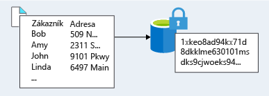
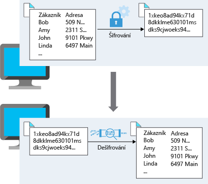

Data jsou nejcennějším a nenahraditelným majetkem organizace a šifrování slouží jako poslední a nejsilnější obrana ve strategii vícevrstvého zabezpečení. Lamna Healthcare jako poskytovatel zdravotní péče ukládá velké objemy citlivých dat. Nedávno u nich došlo k narušení zabezpečení, které zpřístupnilo nešifrované citlivé údaje pacientů, takže si teď plně uvědomují, že mají ve své ochraně dat mezery. Chtějí zjistit, jak můžou lépe využít šifrování k tomu, aby sebe i své pacienty před tímto typem útoků ochránili. Podíváme se na to, co je šifrování, jak k šifrování dat přistupovat a jaké možnosti šifrování jsou k dispozici v Azure.

## Co je šifrování?

Šifrování je proces změny dat, aby se stala nečitelnými a nepoužitelnými. K použití nebo čtení šifrovaných dat je nutné je *dešifrovat*, což vyžaduje použití tajného kódu. Existují dva typy šifrování nejvyšší úrovně: **symetrické** a **asymetrické**.

Symetrické šifrování používá k zašifrování i dešifrování dat stejný klíč. Představte si používání počítačové aplikace pro správu hesel. Zadáte hesla a ta se zašifrují pomocí vašeho osobního klíče (ten se často odvozuje od vašeho hlavního hesla). Když je potřeba data načíst, použije se stejný klíč a data se dešifrují.

Asymetrické šifrování používá pár veřejného klíče a privátního klíče. Každý z klíčů může data zašifrovat, ale nemůže dešifrovat svá vlastní zašifrovaná data. K dešifrování potřebujete druhý klíč z páru. Asymetrické šifrování se používá třeba u protokolu TLS (používaného v protokolu https) a podepisování dat.

Symetrické i asymetrické šifrování hraje svou roli při řádném zabezpečení dat. 

K šifrování se obvykle přistupuje dvěma způsoby: šifrování neaktivních uložených dat a šifrování během přenosu.

### Šifrování neaktivních uložených dat

Neaktivní uložená data jsou data, která jsou uložená na fyzickém médiu. Můžou to být data uložená na disku serveru, data uložená v databázi nebo data uložená v účtu úložiště. Šifrování neaktivních uložených dat bez ohledu na mechanismus jejich uložení zaručuje, že uložená data jsou nečitelná bez klíčů a tajných kódů potřebných k jejich dešifrování. Pokud by útočník získal pevný disk s šifrovanými daty a neměl přístup k šifrovacím klíčům, bylo by pro něj ohrožení dat značně obtížné. V takové situaci by se útočník musel pokusit o útoky na šifrovaná data, které jsou mnohem složitější a vyžadují mnohem více prostředků než přístup k nešifrovaným datům na pevném disku.

Samotná zašifrovaná data se můžou lišit v obsahu, použití a důležitosti pro organizaci. Může jít o finanční informace důležité pro podnikání, duševní vlastnictví vyvinuté firmou, osobní údaje zákazníků nebo zaměstnanců, které firma ukládá, nebo dokonce i klíče a tajné kódy pro šifrování samotných dat.

### Šifrování během přenosu

Přenášená data jsou data aktivně přesouvaná z jednoho umístění do druhého, například přes internet nebo prostřednictvím privátní sítě. Zabezpečený přenos se dá zajistit šifrováním dat před odesláním přes síť nebo zřízením zabezpečeného kanálu pro přenos nešifrovaných dat mezi dvěma systémy. Šifrování dat během přenosu chrání data před vnějšími pozorovateli a poskytuje mechanismus pro přenos dat při současném snížení rizika ohrožení. 

## Identifikace a klasifikace dat

Vraťme se k problému, který se snaží vyřešit Lamna Healthcare. Došlo u nich k útokům, které ohrozily citlivá data, takže existuje mezera mezi tím, co šifrují, a co by šifrovat měli. Musejí začít tím, že identifikují a klasifikují typy dat, která ukládají, a sladí to s obchodními a zákonnými požadavky, které se týkají ukládání dat. Klasifikovat tato data je přínosné, protože to souvisí s rizikem ohrožení organizace, zákazníků nebo partnerů. Klasifikace by měla vypadat třeba takto:

|Klasifikace dat|Vysvětlení|Příklady|
|---|---|---|
|S omezeným přístupem|Data klasifikovaná jako s omezeným přístupem představují významné riziko v případě, že by došlo k jejich zveřejnění, pozměnění nebo odstranění. Pro taková data se vyžadují silné úrovně ochrany. |Data obsahující čísla sociálního pojištění, čísla platebních karet, osobní zdravotní záznamy|
|Soukromá| Data klasifikovaná jako soukromá představují střední riziko v případě, že by došlo k jejich zveřejnění, pozměnění nebo odstranění. Pro taková data se vyžadují přiměřené úrovně ochrany. Jako soukromá se klasifikují data, která nejsou klasifikovaná jako s omezeným přístupem nebo jako veřejná.  |Osobní záznamy obsahující informace, jako je adresa, telefonní číslo, akademické záznamy, záznamy o nákupech zákazníků|
|Veřejná| Data klasifikovaná jako veřejná nepředstavují žádné riziko v případě, že by došlo k jejich zveřejnění, pozměnění nebo odstranění. Pro taková data není potřeba žádná ochrana. |Veřejné finančních zprávy, veřejné zásady, produktová dokumentaci pro zákazníky|

Inventarizací typů ukládaných dat získají lepší představu, kde můžou být uložená citlivá data a kde může nebo nemusí docházet ke stávajícímu šifrování.

Důležité jsou také důkladné znalosti zákonných a obchodních požadavků, které se týkají dat ukládaných organizací. Zákonné požadavky, které organizace musí dodržovat, často řídí velkou část požadavků na šifrování dat. V Lamna Healthcare ukládají citlivá data spadající pod zákon o nakládání se zdravotními informacemi, který obsahuje požadavky, jak zpracovávat a ukládat data o pacientech. Další obory můžou spadat pod jiné zákonné požadavky. Finanční instituce může ukládat informace o účtech, které spadají pod standardy odvětví platebních karet. Organizace podnikající v EU může spadat pod obecné nařízení o ochraně osobních údajů (GDPR), které definuje zacházení s osobními údaji v EU. Obchodní požadavky můžou také stanovovat, že se šifrovat musí všechna data, která by mohla organizaci finančně ohrozit nebo obsahují konkurenční informace.

Jakmile budete mít data klasifikovaná a požadavky definované, můžete pak využít různých nástrojů a technologií k implementaci a vynucení šifrování ve vaší architektuře.

## Šifrování v Azure

Pojďme se podívat na některé způsoby, jak Azure umožňuje šifrovat data napříč službami.

### Šifrování úložiště nezpracovaných dat

Šifrování služby Azure Storage pro neaktivní uložená data pomáhá chránit vaše data, aby se splnily závazky organizace související se zabezpečením a dodržováním předpisů. Pomocí této funkce platforma Azure Storage automaticky šifruje vaše data před jejich uložením do Azure Managed Disks, Azure Blob Storage, Souborů Azure nebo úložiště Azure Queue a před načtením je dešifruje. Provádění šifrování, šifrování neaktivních uložených dat, dešifrování a správy klíčů v šifrování služby Storage je pro aplikace, které tyto služby využívají, transparentní.

Pro Lamna Healthcare to znamená, že pokaždé, když používají služby podporující šifrování služby Storage, se jejich data šifrují na fyzickém médiu úložiště. Ve vysoce nepravděpodobném případě, že útočník získá přístup k fyzickému disku, budou data nečitelná, protože se zašifrovala při zápisu na fyzický disk.

### Šifrování virtuálních počítačů

Šifrování služby Storage poskytuje nízkou úroveň šifrovací ochrany pro data zapsaná na fyzický disk, ale jak můžete chránit virtuální pevné disky (VHD) virtuálních počítačů? Co když útočník se zlými úmysly získá přístup k vašemu předplatnému Azure a získá virtuální pevné disky vašich virtuálních počítačů? Jak byste zajistili, aby se nemohl dostat k datům uloženým na virtuálním pevném disku?

Azure Disk Encryption (ADE) je funkce, která pomáhá šifrovat disky virtuálních počítačů IaaS s Windows a Linuxem. ADE k zajištění šifrování svazků pro operační systém a datové disky používá standardní funkci BitLocker systému Windows a funkci DM-Crypt systému Linux. Toto řešení je integrované s Azure Key Vaultem a pomáhá řídit a spravovat klíče a tajné kódy pro šifrování disků (a pro přístup k trezoru klíčů můžete používat spravovanou identitu pro služby Azure).

 Lamna Healthcare může ADE použít na své virtuální počítače, aby všechna data uložená na virtuálních pevných discích byla zabezpečená podle jejich organizačních požadavků a požadavků na dodržování předpisů. Protože se šifrují i spouštěcí disky, můžou řídit a auditovat používání.

### Šifrování databází

Lamna Healthcare má několik nasazených databází, ve kterých jsou uložená data vyžadující dodatečnou ochranu. Mnoho databází přesunuli do Azure SQL Database a chtějí zajistit, aby se data v jejich databázi šifrovala. Pokud by došlo k odcizení datových souborů, souborů protokolů nebo záložních souborů, chtějí mít jistotu, že budou bez přístupu k šifrovacím klíčům nečitelné.

Transparentní šifrování dat pomáhá chránit Azure SQL Database a Azure Data Warehouse před hrozbou škodlivých aktivit. Provádí šifrování a dešifrování neaktivní uložené databáze, souvisejících záloh a souborů transakčních protokolů v reálném čase a nevyžaduje žádné změny v aplikaci. Ve výchozím nastavení je transparentní šifrování dat povolené pro všechny nově nasazené databáze SQL Azure.

Transparentní šifrování dat šifruje úložiště celé databáze pomocí symetrického klíče nazývaného šifrovací klíč databáze. Ve výchozím nastavení Azure poskytuje jedinečný šifrovací klíč v rámci logického SQL Serveru a zpracovává všechny podrobnosti. S klíči uloženými v Azure Key Vaultu je také podporovaná služba Bring Your Own Key.

Protože je transparentní šifrování dat ve výchozím nastavení povolené, můžou si v Lamna Healthcare být jistí, že mají data uložená v jejich databázích řádně ochráněná.

### Šifrování tajných kódů

Viděli jsme, že všechny služby šifrování používají klíče pro šifrování a dešifrování dat, jak tedy zajistíme zabezpečení samotných klíčů? Lamna Healthcare může mít také hesla, připojovací řetězce nebo jiné citlivé informace, které potřebuje mít bezpečně uložené.

Azure Key Vault je cloudová služba, která funguje jako zabezpečené úložiště tajných kódů. Key Vault vám umožní vytvořit několik zabezpečených kontejnerů označovaných jako trezory. Tyto trezory využívají moduly hardwarového zabezpečení (HSM). Trezory pomáhají snížit riziko nechtěné ztráty informací o zabezpečení tím, že centralizují ukládání tajných kódů aplikací. Trezory klíčů také řídí a protokolují přístup ke všem položkám, které jsou v nich uložené. Azure Key Vault může zpracovávat žádosti o certifikáty TLS (Transport Layer Security) a jejich obnovování a poskytuje funkce potřebné pro robustní řešení správy životního cyklu certifikátů. Key Vault je navržený tak, aby podporoval všechny typy tajných kódů. Těmito tajnými kódy můžou být hesla, přihlašovací údaje databáze, klíče rozhraní API a certifikáty.

Vzhledem k tomu, že identitám Azure AD jde udělit přístup k používání tajných kódů v Azure Key Vaultu, můžou aplikace používající spravované identity služeb Azure automaticky a hladce získat tajné kódy, které potřebují.

Lamna Healthcare může používat Key Vault k ukládání všech svých citlivých informací o aplikacích, včetně certifikátů TLS, které používají pro zabezpečení komunikace mezi systémy.

## Šifrování v Lamna Healthcare

V Lamna Healthcare absolvovali proces identifikace a klasifikace všech dat, která ukládají. Tyto klasifikace sladili se zákonnými a obchodními požadavky a zjistili, že mají mnohem více dat, která musí šifrovat. Zašifrovali všechny virtuální počítače, na kterých jsou uložená citlivá data, a šifrují všechny citlivé informace o pacientech, které mají uložené v Blob Storage. Transparentní šifrování dat je povolené ve všech jejich databázích, takže jejich relační databáze splňují požadavky na šifrování bez ohledu na klasifikaci. Také v celé organizaci využívají Key Vault k ukládání všech certifikátů a přihlašovacích údajů, které můžou aplikace potřebovat pro své fungování.

## Shrnutí

Šifrování je často poslední vrstvou obrany proti útokům a je důležitou součástí vícevrstvého přístupu k zabezpečení vaší architektury. Azure poskytuje integrované možnosti a služby pro šifrování a ochranu dat před nechtěným zpřístupněním. Ochrana zákaznických dat uložených v Azure Services má pro Microsoft nejvyšší význam a měla by být součástí každého návrhu architektury. Základní služby jako Azure Storage, Azure Virtual Machines, Azure SQL Database a Azure Key Vault vám můžou pomoct zabezpečit vaše prostředí pomocí šifrování.
