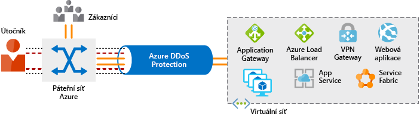
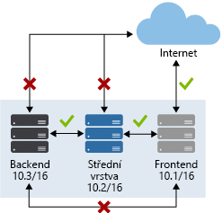
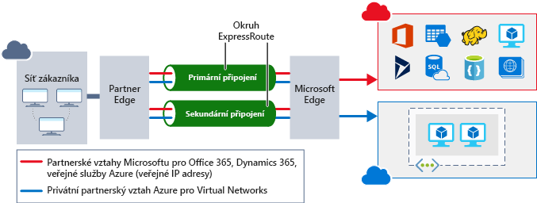

Zabezpečení sítě před útoky a neoprávněným přístupem je důležitou součástí každé architektury. Během plánování migrace do cloudu v Lamna Healthcare věnovali čas naplánování síťové infrastruktury tak, aby se zajistilo, že bude mít vhodné prvky zabezpečení sítě, které ji ochrání před útokem. Podíváme se teď na to, jak zabezpečení sítě vypadá, jak do architektury integrovat vícevrstvý přístup a jak vám Azure může pomáhat se zabezpečením sítě pro vaše prostředí.

## Co je zabezpečení sítě

Zabezpečení sítě chrání komunikace prostředků v síti a mimo síť. Cílem je omezit riziko ohrožení v síťové vrstvě napříč vašimi službami a systémy. Omezením tohoto rizika ohrožení snížíte pravděpodobnost, že může dojít k napadení prostředků. V kontextu zabezpečení sítě se dá zaměřit na tyto oblasti:

- Zabezpečení toku přenosů mezi aplikacemi a internetem
- Zabezpečení toku přenosů mezi aplikacemi
- Zabezpečení toku přenosů mezi uživateli a aplikací

Zabezpečení toku přenosů mezi aplikacemi a internetem se zaměřuje na omezení rizika ohrožení mimo vaši síť. Síťové útoky nejčastěji začínají mimo vaši síť, proto se dá omezením rizika ohrožení na internetu a zabezpečením hraniční sítě riziko napadení snížit.

Zabezpečení toku přenosů mezi aplikacemi se zaměřuje na data mezi aplikacemi a jejich vrstvami, mezi různými prostředími a v dalších službách v rámci vaší sítě. Omezením rizika ohrožení mezi těmito prostředky snížíte účinek, který může ohrožený prostředek mít. To může pomoct snížit další šíření v síti.

Zabezpečení toku přenosů mezi uživateli a aplikací se zaměřuje na zabezpečení síťového tok pro vaše koncové uživatele. Tím se omezuje riziko ohrožení vašich prostředků ze strany vnějších útoků a poskytuje uživatelům bezpečný mechanismus pro využívání vašich prostředků. 

## Vícevrstvý přístup k zabezpečení sítě

Společným pojítkem v rámci tohoto modulu je uplatnění vícevrstvého přístupu k zabezpečení a v síťové vrstvě tomu není jinak. Nestačí jenom zaměřit se na zabezpečení hraniční sítě nebo na zabezpečení sítě mezi službami v síti. Vícevrstvý přístup nabízí několik úrovní ochrany, takže pokud útočník pronikne jednou vrstvou, jsou zavedené další ochrany k omezení dalšího útoku.

Pojďme se podívat, jak může Azure poskytnout nástroje pro vícevrstvý přístup k zabezpečení vaší sítě.

### Ochrana na internetu

Pokud začneme v hraniční síti, zaměřujeme se na omezení a vyloučení útoků z internetu. Je dobré začít vyhodnocením prostředků přístupných z internetu a povolit příchozí a odchozí komunikaci jenom tam, kde je to nezbytné. Identifikujte všechny prostředky, které povolují příchozí síťový provoz jakéhokoli typu, a ověřte, že jsou nezbytné a omezené jenom na požadované porty a protokoly. Skvělým místem, kde tyto informace hledat, je Azure Security Center, protože identifikuje prostředky přístupné z internetu, ke kterým nejsou přidružené skupiny zabezpečení sítě (NSG), a také prostředky, které nejsou zabezpečené za bránou firewall.

Zajistit ochranu u příchozích přenosů v hraniční síti je možné několika způsoby. Application Gateway je nástroj pro vyrovnávání zatížení vrstvy 7, který zahrnuje firewall webových aplikací (WAF) pro pokročilé zabezpečení vašich služeb založených na protokolu HTTP. WAF je založený na sadách základních pravidel OWASP 3.0 nebo 2.2.9 a poskytuje ochranu před běžně známými chybami zabezpečení, jako je skriptování napříč weby nebo útok prostřednictvím injektáže SQL.

Pro ochranu služeb nezaložených na protokolu HTTP nebo pro větší přizpůsobení je možné použít síťových virtuálních zařízení (NVA) k zabezpečení síťových prostředků. Síťová virtuální zařízení se podobají zařízením brány firewall v místních sítích a nabízí je mnoho z nejoblíbenějších dodavatelů zabezpečení sítě. Síťová virtuální zařízení umožňují lépe přizpůsobit zabezpečení těch aplikací, které to vyžadují, ale můžou být složitější, proto se doporučuje pečlivě zvážit požadavky.

Jakýkoli prostředek přístupný z internetu je vystavený riziku napadení prostřednictvím útoku na dostupnost služby. Tyto typy útoků se snaží zahltit síťový prostředek zasíláním tolika požadavků, že se prostředek zpomalí nebo přestane reagovat. Ke zmírnění těchto útoků poskytuje Azure DDoS základní ochranu všech služeb Azure a vylepšenou ochranu, kterou lze dále přizpůsobit vašim prostředkům. Ochrana před útoky DDoS blokuje provoz útoku a zbývající provoz přesměrovává do zamýšleného cíle. Během několika minut od detekce útoku budete upozorněni pomocí metrik Azure Monitoru.

### Zabezpečení virtuální sítě

Ve virtuální síti (VNet) je důležité omezit komunikaci mezi prostředky na nezbytné minimum.

Důležitou součástí k omezení zbytečné komunikace mezi virtuálními počítači jsou skupiny zabezpečení sítě (NSG). NSG fungují ve vrstvách 3 a 4 a poskytují seznam povolené nebo zamítnuté komunikace do a ze síťových rozhraní a podsítí. NSG jsou plně přizpůsobitelné a umožňují úplně zamezit síťové komunikaci do a z virtuálních počítačů. Pomocí NSG můžete izolovat aplikace mezi prostředími, vrstvami a službami.

K izolaci služeb Azure, aby umožňovaly jenom komunikaci z virtuálních sítí, použijte koncové body služby virtuální sítě. Pomocí koncových bodů služby je možné svázat prostředky služeb Azure s vaší virtuální sítí. Svázání prostředků služeb s virtuální sítí poskytuje lepší zabezpečení, protože zcela eliminuje přístup k prostředkům z veřejného internetu a povoluje jen provoz z vaší virtuální sítě. Tím se zmenší potenciální oblast útoku na vaše prostředí, sníží se nároky na správu k omezení komunikace mezi virtuální sítí a službami Azure a zajistí se optimální směrování této komunikace.

### Integrace sítě

Je běžné mít existující síťovou infrastrukturu, která se musí integrovat, aby zajistila komunikaci z místních sítí nebo zajistila lepší komunikaci mezi službami v Azure. Existuje několik klíčových způsobů, jak tuto integraci zvládnout a zlepšit zabezpečení vaší sítě.

Připojení virtuální privátní sítě (VPN) představují běžný způsob, jak vytvořit zabezpečené komunikační kanály mezi sítěmi, a nejinak je tomu při práci s virtuálními sítěmi v Azure. Připojení mezi virtuálními sítěmi Azure a místním zařízením VPN je skvělý způsob, jak zajistit zabezpečenou komunikaci mezi vaší sítí a virtuálními počítači v Azure.

Pokud chcete poskytnout vyhrazené soukromé připojení mezi vaší sítí a Azure, můžete použít ExpressRoute. ExpressRoute umožňuje rozšířit vaše místní sítě do cloudu Microsoftu přes soukromé připojení zajišťované poskytovatelem připojení. Pomocí ExpressRoute můžete vytvořit připojení ke cloudovým službám Microsoftu, jako je například Microsoft Azure, Office 365 nebo Dynamics 365. Tím se vylepšuje zabezpečení místní komunikace díky odesílání tohoto provozu přes privátní okruh místo přes internet. Nemusíte povolovat přístup k těmto službám pro vaše koncové uživatele přes internet a můžete tento provoz odesílat prostřednictvím zařízení pro další kontroly provozu.

Aby se dosáhlo jednoduché integrace více virtuálních sítí v Azure, vytváří peering virtuálních sítí přímé připojení mezi určenými virtuálními sítěmi. Po vytvoření můžete pomocí skupiny zabezpečení sítě zajistit izolaci mezi prostředky stejným způsobem, jakým zabezpečujete prostředky ve virtuální síti. Tato integrace vám umožňuje poskytovat stejnou základní úroveň zabezpečení ve všech peeringových virtuálních sítích. Komunikace je povolená jenom mezi přímo připojenými virtuálními sítěmi.

## Zabezpečení sítě v Lamna Healthcare

V Lamna Healthcare využili mnoha z těchto služeb k vybudování zabezpečené síťové infrastruktury. Komunikace mezi prostředky je ve výchozím nastavení zakázaná a povoluje se jenom v případě potřeby. Příchozí připojení z internetu je povolené jenom pro služby, které ho vyžadují, a RDP a SSH nejsou povolené z internetových koncových bodů, ale jenom z důvěryhodných interních prostředků.

Své webové služby přístupné z internetu mají kvůli zabezpečení umístěné za službami Application Gateway s aktivovaným WAF. To platí pro služby spuštěné na virtuálních počítačích i ve službě App Service. Díky využívání služeb Application Gateway mají ochranu před mnoha známými chybami zabezpečení.

Mají aktivovaný standard DDoS k zajištění ochrany pro jejich internetové koncové body před útoky na dostupnost služby.

Pomocí skupin zabezpečení sítě dokážou plně izolovat komunikaci mezi aplikačními službami a mezi prostředími. Umožňují jenom nezbytnou komunikaci mezi službami v rámci prostředí a mezi produkčními a neprodukčními prostředími není povolený žádný přístup.

K zajištění vyhrazeného připojení mezi koncovými uživateli a aplikacemi v Azure zřídili okruh ExpressRoute s připojením k jejich místní síti. Díky tomu zůstává jejich provoz do Azure mimo internet a privátní připojení pro jejich služby v Azure zajišťuje komunikaci se systémy, které zůstávají v místním prostředí.

S tímto přístupem Lamna Healthcare využívá služeb Azure k zajištění zabezpečení ve více vrstvách síťové infrastruktury.

## Shrnutí

Vícevrstvý přístup k zabezpečení sítě pomáhá snižovat riziko ohrožení prostřednictvím síťových útoků. Azure poskytuje několik služeb a funkcí pro zabezpečení prostředků přístupných z internetu, interních prostředků a komunikaci mezi místními sítěmi. Tyto funkce umožňují vytvářet bezpečná řešení v Azure.