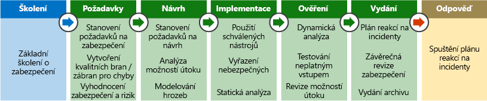

Hostování aplikací na cloudové platformě poskytuje oproti tradičním místním nasazením celou řadu výhod. Cloudový model sdílené odpovědnosti přesouvá zabezpečení na úrovni fyzické sítě, vytváření a hostitele pod kontrolu poskytovatele cloudových služeb. Útočník snažící se ohrozit platformu na této úrovni by narazil na to, že se mu útok nevyplatí kvůli značným investicím a znalostem, které poskytovatel vložil do zabezpečení a monitorování své infrastruktury.

Proto je pro útočníky mnohem efektivnější zneužít slabá místa zabezpečení, které na úrovni aplikace zavádějí zákazníci cloudové platformy. Kromě toho zákazníci přijetím systému platforma jako služba (PaaS) pro hostování svých aplikací mohou uvolnit prostředky ze správy zabezpečení operačního systému a nasadit je k posílení kódu aplikace a monitorování identit ve vnější síti kolem aplikace. V této lekci probereme některé způsoby, jak se dá zabezpečení aplikací zlepšit jejich správným navržením.

## Scénář

Klienti Lamna Healthcare chtějí mít přístup ke svým osobním zdravotním záznamům na online webovém portálu. Dodržování zákona o ochraně osobních údajů ve zdravotnictví je povinné a vystavuje společnost značnému riziku finančních postihů, pokud dojde k porušení zabezpečení osobních údajů. Zabezpečení aplikací a osobních dat, se kterými pracuje, je proto prvořadé.

Toto jsou primární oblasti, které se týkají zákaznických aplikací:

- Návrh zabezpečené aplikace
- Zabezpečení dat
- Správa identit a přístupu
- Zabezpečení koncových bodů

## Životní cyklus vývoje zabezpečení

Aby se zajistilo, že se otázky zabezpečení stanou součástí životního cyklu vývoje softwaru, je možné během fáze vývoje aplikace využít proces Microsoft [Security Development Lifecycle](https://www.microsoft.com/sdl) (SDL). Problémy se zabezpečením a dodržováním předpisů se řeší mnohem snadněji při navrhování aplikace, kdy je možné zmírnit řadu běžných chyb, které můžou vést k nedostatečnému zabezpečení konečného produktu. Řešení problémů v rané fázi vývoje softwaru je také mnohem méně nákladné. Tohle je typická posloupnost kroků v SDL, které je v softwarovém projektu možné použít:

1. Školení

    - Základní školení o zabezpečení

1. Požadavky

    - Definování požadavků a bran kvality
    - Analýza rizik zabezpečení a ochrana osobních údajů
 
1. Návrh

    - Analýza prostoru pro útoky
    - Modelování hrozeb
 
1. Implementace

    - Určení nástrojů k měření kvality kódu
    - Vynucení zakázaných rozhraní API a funkcí
    - Provedení analýzy statického kódu
    - Kontrola uložených tajných kódů v úložištích
 
1. Ověření

    - Dynamické testování / testování neplatným vstupem
    - Kontrola modelů hrozeb / prostoru pro útoky
 
1. Vydání

    - Zformování plánu reakcí zabezpečení
    - Provedení závěrečné revize zabezpečení
    - Vydání archivu
 
1. Reakce 

    - Spuštění reakce na hrozby

SDL je nejen proces nebo sada nástrojů, ale přinejmenším stejně tak aspekt kultury. Vytvořením kultury, ve které je zabezpečení samozřejmým požadavkem při vývoji každé aplikace, může vést k obrovskému pokroku ve schopnostech organizace, pokud jde o zabezpečení.

<!-- Bear in mind that the migration of un-modified applications (especially COTS procured software systems) will not be able to perform many of the steps listed above.
 -->

## Vyhodnocení provozního zabezpečení

Po nasazení aplikace je zásadní průběžně vyhodnocovat stav jejího zabezpečení, určovat, jak zmírnit případné zjištěné potíže, a získané znalosti následně využít v cyklu vývoje softwaru. Hloubka, do jaké se to provádí, závisí na vyspělosti týmu vývoje softwaru a provozního týmu, ale také na požadavcích na ochranu osobních údajů.

K dispozici jsou softwarové služby pro kontrolu ohrožení zabezpečení, které pomáhají tento proces automatizovat a pravidelně zabezpečení posuzovat, aniž by se týmy zatěžovaly nákladnými ručními procesy, jako je testování průniku.

Azure Security Center je bezplatná služba, která je teď ve výchozím nastavení povolená pro všechna předplatná Azure a která je úzce integrovaná s dalšími službami Azure na úrovni aplikací, jako jsou Azure Application Gateway a Firewall webových aplikací Azure. Díky analýze protokolů z těchto služeb může ASC hlásit známá ohrožení zabezpečení v reálném čase, doporučovat reakce k jejich zmírnění a nechat se nakonfigurovat tak, aby v reakci na útoky automaticky spouštěl playbooky.

<!-- SDL culture
Key Vault / MSI
CSE = App  -> DB & App Storage
Mention approach of code scanning & SDL
Scanning for passwords - Git
 -->

## Identita jako vnější hranice

Ověření identity se stává první linií obrany pro aplikace. Omezení přístupu k webové aplikaci pomocí ověřování a autorizace relací může výrazně zmenšit možnosti útoku. Azure AD a Azure AD B2C nabízejí efektivní způsob, jak zodpovědnost za kontrolu identit a přístupu přenést na plně spravovanou službu. Zásady podmíněného přístupu Azure AD, Privileged Identity Management a ovládací prvky Identity Protection dále vylepšují zákazníkovu schopnost zabránit neoprávněnému přístupu a auditovat změny.

## Ochrana dat

Zákaznická data jsou cílem většiny, ne-li všech útoků proti webovým aplikacím. Zabezpečené úložiště a přenos dat mezi aplikací a její vrstvou datového úložiště hrají prvořadou roli.

Lamna Healthcare ukládá a používá zvlášť citlivá data zdravotních záznamů pacientů. Zákon HIPAA, přijatý Kongresem USA v roce 1996, kromě jiného definuje národní standardy pro elektronické zdravotnické transakce prováděné poskytovateli zdravotní péče a zaměstnavateli. Lamna musí zajistit, aby pacienti a oprávněné strany, jako jsou jejich lékaři, měli ke zdravotním datům zabezpečený přístup.

S ohledem na splnění těchto požadavků v Lamna Healthcare upravili své aplikace tak, aby se šifrovala všechna neaktivní uložená data pacientů i data během přenosu. Používá se například protokol TLS (Transport Layer Security) k šifrování dat, která se vyměňují mezi webovou aplikací a backendovými databázemi SQL. Data se šifrují také v neaktivní uložené podobě na SQL Serveru pomocí transparentního šifrování dat,takže i v případě, že by došlo k neoprávněnému průniku do prostředí, budou data komukoli bez správného dešifrovací klíče k ničemu.

Pro šifrování dat uložených v úložišti objektů blob je možné použít šifrování na straně klienta k zašifrování dat v paměti před tím, než se zapíšou do služby úložiště. Knihovny podporující toto šifrování jsou dostupné pro .NET, Javu nebo Python a umožňují integrovat šifrování dat přímo do aplikací a zvýšit tak integritu dat.

### Zabezpečené uložení klíče a tajného kódu

Velmi důležité je oddělení tajných kódů aplikace (připojovací řetězce, hesla apod.) a šifrovacích klíčů od aplikace sloužící pro přístup k datům. Šifrovací klíče a tajné kódy aplikace by nikdy neměly být uložené v kódu aplikace konfiguračních souborů. Místo toho by se mělo používat zabezpečené úložiště, jako je Azure Key Vault. Přístup k těmto citlivým údajům se pak dá omezit na identity aplikací prostřednictvím Managed Service Identities a klíče se můžou pravidelně obměňovat, aby se omezilo riziko ohrožení v případě úniku šifrovacího klíče. Zákazníci se také můžou rozhodnout používat vlastní šifrovací klíče vygenerované pomocí místních modulů hardwarového zabezpečení (HSM), a dokonce i nařídit, aby instance Azure Key Vaultu byly implementované v jednotenantových diskrétních modulech hardwarového zabezpečení.

<!-- ### Secure and immutable file storage

All Azure storage accounts are encrypted by default using Microsoft managed keys. Azure customers also have the ability to use their own encryption keys (BYOK) to encrypt blob, file and queue data so that even the hosting provider has no access to unencrypted data. Data immutability is often required for auditing purposes or when legal disputes call for data to be effectively frozen for a determined amount of time. Azure has recently introduced an [immutable data storage](https://docs.microsoft.com/azure/storage/blobs/storage-blob-immutable-storage) option known as Write-Once, Read many (WORM) for this scenario. -->
