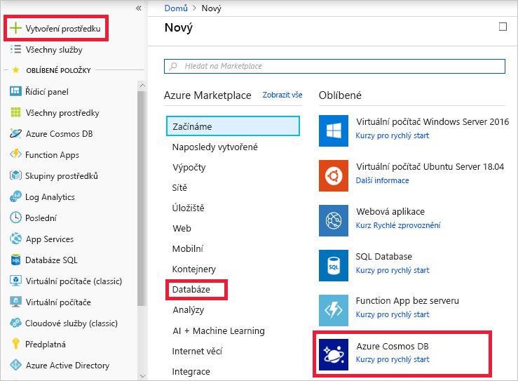
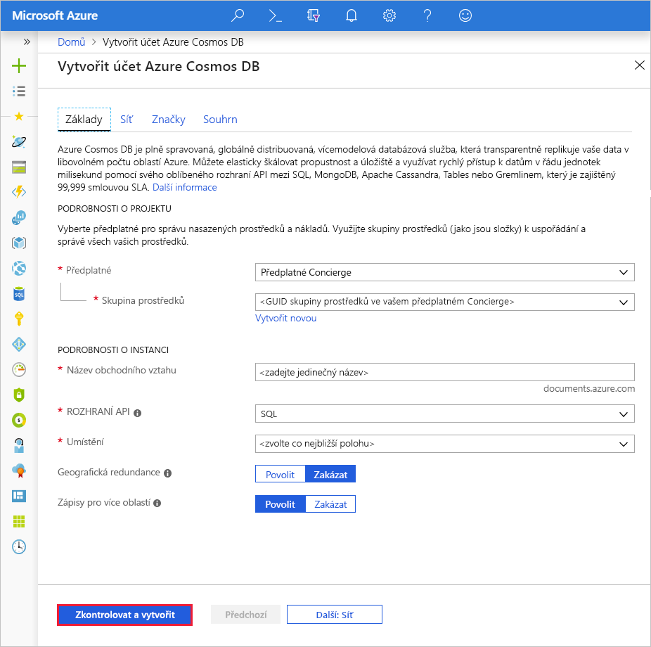
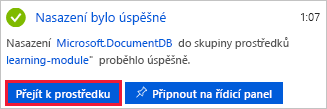
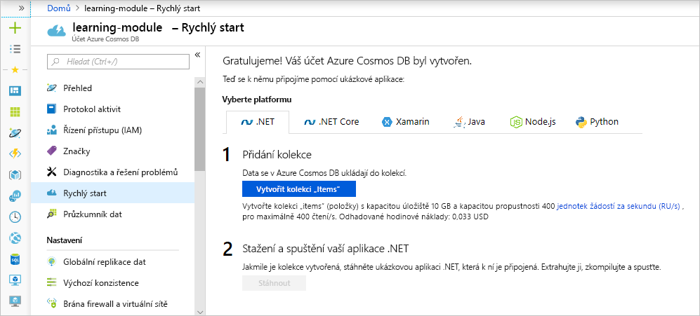

Pro vaše zákazníky a úspěch vaší firmy je naprosto stěžejní, abyste zákazníkům na svém online webu s oblečením nabízeli rychlý přístup k produktům. Když se sníží vzdálenost, kterou data musí urazit na cestě za zákazníky, budete moct obsah doručovat rychleji. Pokud jsou vaše data uložená v Azure Cosmos DB, replikace dat webu do několika oblastí po celém světě je operace, která vyžaduje jen klikání myší.

<!-- Activate the sandbox -->
[!include]

V této lekci se dozvíte, jaké jsou výhody globální distribuce a nativní databázové služby typu multi-master, a pak replikujete svůj účet do tří dalších oblastí.

## Základy globální distribuce

Globální distribuce umožňuje replikovat data z jedné oblasti do několika jiných oblastí Azure. Kdykoli můžete přidat nebo odebrat oblasti, ve kterých se vaše databáze replikuje, a Azure Cosmos DB zajistí, že když přidáte další oblast, vaše data budou v případě, že nejsou větší než 100 TB, k dispozici do 30 minut.

Pro replikaci dat do dvou nebo více oblastí existují dva běžné scénáře:

1. Poskytování přístupu k datům s nízkou latencí koncovým uživatelům po celém světě bez ohledu na to, kde se nacházejí
2. Přidání oblastní odolnosti pro zajištění provozní kontinuity a zotavení po havárii (BCDR)

Pokud chcete zákazníkům poskytovat přístup s nízkou latencí, doporučuje se replikovat data do oblastí, které jsou uživatelům nejblíže. Pro vaši společnost s oblečením online máte zákazníky v Los Angeles, New Yorku a Tokiu. Podívejte se na stránku [Oblasti Azure](https://azure.microsoft.com/global-infrastructure/regions/) a určete oblasti, které jsou daným skupinám zákazníků nejblíže. To jsou totiž oblasti, do kterých budete replikovat uživatele.

Abyste mohli zajistit řešení BCDR, doporučuje se přidat oblasti podle spárovaných oblastí popsaných v článku o [provozní kontinuitě a zotavení po havárii (BCDR): Spárované oblasti Azure](https://azure.microsoft.com/documentation/articles/best-practices-availability-paired-regions/).

Když se databáze replikuje, replikují se stejnou měrou i propustnost a úložiště. Pokud by tedy vaše původní databáze měla v úložišti 10 GB a propustnost 1000 RU/s a replikovali byste ji do tří dalších oblastí, každá oblast by měla 10 GB dat a propustnost 1000 RU/s. Vzhledem k tomu, že se úložiště a propustnost replikují do každé oblasti, náklady na replikaci oblasti jsou stejné jako v původní oblasti. Proto replikace do 3 dalších oblastí bude znamenat přibližně čtyřnásobné náklady oproti původní nereplikované databázi.

## Vytvoření účtu služby Azure Cosmos DB na portálu

1. Pomocí stejného účtu, kterým jste aktivovali sandbox, se přihlaste na portál [Azure Portal](https://portal.azure.com/learn.docs.microsoft.com?azure-portal=true).

    > [!IMPORTANT]
    > Přihlaste se na portál Azure Portal a k sandboxu pomocí stejného účtu.
    >
    > Přihlaste se na portál Azure Portal pomocí odkazu uvedeného výše, abyste měli jistotu, že jste připojení k sandboxu, který poskytuje přístup k předplatnému Concierge.

1. Klikněte na **Vytvořit prostředek** > **Databáze** > **Azure Cosmos DB**.

   

1. Na stránce **Vytvořit účet Azure Cosmos DB** zadejte nastavení nového účtu služby Azure Cosmos DB, včetně umístění.

    <!-- Resource selection -->  
    [!include]

    Nastavení|Hodnota|Popis
    ---|---|---
    Předplatné|*Předplatné Concierge*|Vyberte své předplatné Concierge. Pokud se předplatné Concierge nezobrazuje, máte pro své předplatné povoleno několik tenantů a je nutné tenanty změnit. Pokud to chcete udělat, přihlaste se znovu pomocí následujícího odkazu na portál: [Azure Portal pro Sandbox](https://portal.azure.com/learn.docs.microsoft.com?azure-portal=true).
    Skupina prostředků|Použít existující  <rgn>[název sandboxové skupiny prostředků]</rgn>|Vyberte možnost **Použít existující** a pak zadejte <rgn>[název sandboxové skupiny prostředků]</rgn>.
    Název účtu|*Zadejte jedinečný název*|Zadejte jedinečný název, který identifikuje tento účet služby Azure Cosmos DB. Jelikož je řetězec *documents.azure.com* připojený k ID, které poskytnete k vytvoření identifikátoru URI, použijte jedinečné, ale snadno rozpoznatelné ID.  Toto ID může obsahovat pouze malá písmena, číslice a znak spojovníku (-) a musí se skládat ze 3 až 31 znaků.
    Rozhraní API|SQL|Rozhraní API určuje typ účtu, který se má vytvořit. Azure Cosmos DB poskytuje pro splnění požadavků vaší aplikace pět rozhraní API: SQL (databáze dokumentů), Gremlin (databáze grafu), MongoDB (databáze dokumentů), Azure Table a Cassandra, z nichž každé v současné době vyžaduje samostatný účet.   Vyberte **SQL**, protože v tomto modulu vytváříte databázi dokumentů, která umožňuje dotazování pomocí syntaxe SQL a přístup pomocí rozhraní SQL API.|
    Umístění|*Vyberte oblast, která je k vám nejblíže*|Ze seznamu oblastí výše vyberte oblast, která je k vám nejblíže.
    Geografická redundance| Zakázat | Toto nastavení vytvoří replikovanou verzi vaší databáze ve druhé (spárované) oblasti. Zatím nechte tuto možnost zakázanou, protože databázi budete replikovat později.
    Zápisy pro více oblastí | Povolit | Toto nastavení umožňuje zapisovat do několika oblastí najednou. Toto nastavení se dá nakonfigurovat jen při vytváření účtu.

1. Klikněte na **Zkontrolovat a vytvořit**.

    

1. Jakmile se nastavení ověří, klikněte na **Vytvořit**, aby se účet vytvořil.

1. Vytvoření účtu trvá několik minut. Počkejte, až se na portálu zobrazí oznámení o úspěšném nasazení, a klikněte na toto oznámení.

    

1. V okně oznámení klikněte na **Přejít k prostředku**.

    

    Na portálu se zobrazí zpráva **Blahopřejeme! Váš účet služby Azure Cosmos DB byl vytvořen**.

    

## Replikace dat v několika oblastech

Pojďme teď replikovat databázi, která je nejblíže vašim uživatelům v Los Angeles, New Yorku a Tokiu.

1. V nabídce na stránce účtu klikněte na **Globální replikace dat**.
1. Na stránce **Globální replikace dat** vyberte oblasti Západní USA 2, Východní USA a Východní Japonsko a klikněte na **Uložit**.

    Pokud se na portálu Azure Portal nezobrazuje mapa, minimalizujte nabídky na levé straně obrazovky, aby se zobrazila.

    Během zápisu dat do nových oblastí stránka zobrazí zprávu o tom, že **probíhá aktualizace**. Data v nových oblastech budou k dispozici do 30 minut.

    

## Shrnutí

V této lekci jste replikovali svou databázi do oblastí světa, ve kterých máte nejvíce uživatelů, a nabídli jste jim tak přístup k datům na vašem webu s nižší latencí.
