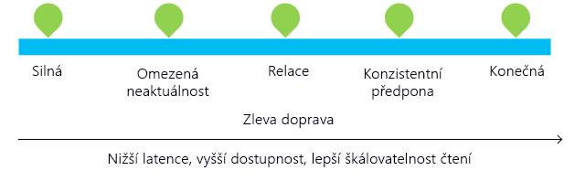

Azure Cosmos DB umožňuje vývojářům zvolit si mezi pěti dobře definovanými modely konzistence ze spektra konzistencí – silná konzistence, omezená neaktuálnost, relace, konzistentní předpona a případná. Tyto úrovně konzistence umožňují maximalizovat dostupnost a výkon vaší databáze v závislosti na vašich potřebách. V případě, že se data musí zpracovat v konkrétním pořadí, může být správnou volbou silná konzistence. Nebo v případech, kdy data nemusí být okamžitě konzistentní, může být vhodná případná konzistence. 

V této lekci se seznámíte s dostupnými úrovněmi konzistence v Azure Cosmos DB a určíte správnou úroveň konzistence pro svůj online web s oblečením.

## Základní informace o konzistenci

Každý databázový účet má výchozí úroveň konzistence, která určuje konzistenci dat v něm. Na jednom konci spektra je silná konzistence, která nabízí záruku linearizovatelnosti, která zaručuje, že operace čtení vrátí nejnovější verzi položky. Na druhém konci spektra je případná konzistence, která zaručuje, že pokud se nebudou zapisovat žádná další data, repliky ve skupině si nakonec budou odpovídat. Někde uprostřed je konzistence Relace, která je nejoblíbenější, protože zaručuje monotónní čtení a zápisy a poskytuje záruky čtení vlastních zápisů (RYW).

V následující tabulce najdete záruky, které nabízejí jednotlivé úrovně konzistence.
 
**Úrovně konzistence a záruky**

| Úroveň konzistence | Záruky |
| --- | --- |
| Silná | Linearizovatelnost Operace čtení zaručeně vrátí nejnovější verzi položky.|
| Omezená neaktuálnost | Konzistentní předpona Operace čtení jsou oproti zápisům zpožděné nejvíce o k předpon nebo o interval t. |
| Relace   | Konzistentní předpona Monotónní čtení, monotónní zápisy, čtení zápisů, zápisy po čtení |
| Konzistentní předpona | Vrácené aktualizace jsou předponou všech aktualizací bez mezer. |
| Případná  | Čtení mimo pořadí |

V účtu Azure Cosmos DB můžete na portálu Azure Portal nakonfigurovat výchozí úroveň konzistence (a později přepsat konzistenci v konkrétním požadavku pro čtení). Výchozí úroveň konzistence se interně vztahuje na data v rámci sad oddílů, které se můžou nacházet v různých oblastech.

Ve službě Azure Cosmos DB jsou operace čtení provedené v konzistenci relace, konzistentní předpona nebo v případné konzistenci z pohledu využití jednotek žádosti dvakrát tak levné v porovnání se silnou konzistencí a s omezenou neaktuálností.

### Použití úrovní konzistence

Okolo 73 % tenantů Azure Cosmos DB používá konzistenci Relace a 20 % upřednostňuje omezenou neaktuálnost. Přibližně 3 % zákazníků Azure Cosmos DB zpočátku experimentují s různými úrovněmi konzistence, než se rozhodnou pro konkrétní konzistenci pro svou aplikaci. Jen 2 % tenantů Azure Cosmos DB přepisují úrovně konzistence podle požadavků.

## Úrovně konzistence podrobně

Pokud se chcete o úrovních konzistence dozvědět více, podívejte se na portálu Azure Portal na ukázky konzistence založené na hudebních notách a pak si přečtěte informace níže o jednotlivých úrovních.

1. Na portálu Azure Portal, klikněte na **Výchozí konzistence**.
2. Proklikejte si jednotlivé modely konzistence a sledujte hudební ukázky. Podívejte se, jak se data zapisují do jednotlivých oblastí a jaký vliv má na zápis dat not volba konzistence. Poznámka: Možnost Silná je zašedlá, protože je k dispozici jen pro data zapisovaná do jediné oblasti.

    

Pojďme zjistit více o úrovních konzistence. Zkuste se zapřemýšlet nad tím, jak by tyto úrovně konzistence fungovaly pro váš produkt a data uživatelů na webu prodejce oblečení.

### Silná konzistence

* Silná konzistence, nabízí záruku [linearizovatelnosti](https://aphyr.com/posts/313-strong-consistency-models), která zaručuje, že operace čtení vrátí nejnovější verzi položky.
* Silná konzistence zaručuje, že se zápis zobrazí, až když ho trvale potvrdí většinové kvorum replik. Zápis buď synchronně trvale potvrdí jak primární lokalita, tak kvorum sekundárních lokalit, nebo se zruší. Čtení se vždy potvrdí většinovým kvorem čtení, klientovi se nikdy nezobrazí nepotvrzené nebo částečné zápisy a má vždy zaručeno, že přečte nejnovější potvrzený zápis. 
* Účty Azure Cosmos DB, které jsou nakonfigurované tak, aby používaly silnou konzistenci, k sobě nemůžou přidružit více než jednu oblast Azure.  
* Náklady na operaci čtení (z pohledu využití jednotek žádostí) se silnou konzistencí jsou vyšší než u Relace a Případné konzistence, ale stejné jako u omezené neaktuálnosti.

### Konzistence Omezená neaktuálnost

* Konzistence Omezená neaktuálnost zaručuje, že čtení může být oproti zápisu zpožděné nanejvýš *K* verzí nebo předpon položky nebo po časový interval *t*.
* Proto, když zvolíte omezenou neaktuálnost, se dá neaktuálnost nakonfigurovat dvěma způsoby: počtem verzí *K* položky, o kterou jsou operace čtení opožděné za zápisy, a časovým intervalem *t*.
* Omezená neaktuálnost nabízí celkové globální uspořádání kromě dat v období neaktuálnosti. Jak v období neaktuálnosti, tak mimo něj existují v oblasti záruky monotónního čtení.
* Omezená neaktuálnost nabízí silnější záruky konzistence než Relace, Konzistentní předpona nebo Případná konzistence. Pro globálně distribuované aplikace doporučujeme používat omezenou neaktuálnost v situacích, kdy chcete mít silnou konzistenci, ale zároveň 99,99% dostupnost a nízkou latenci.
* Účty Azure Cosmos DB, které jsou nakonfigurované tak, aby používaly konzistenci Omezená neaktuálnost, k sobě můžou přidružit libovolné množství oblastí Azure. 
* Náklady na operaci čtení (z pohledu využití RU) se silnou konzistencí jsou vyšší než u Relace a případné konzistence, ale stejné jako u omezené neaktuálnosti.

### Konzistence Relace

* Na rozdíl od modelů globální konzistence, kterou nabízí úrovně konzistence Silná a Omezená neaktuálnost, konzistence Relace je omezená na relaci klienta.
* Konzistence Relace je ideální pro všechny scénáře, které zahrnují zařízení nebo relaci uživatele, protože zaručuje monotónní čtení, zápisy a nabízí záruky čtení vlastních zápisů (RYW).
* Konzistence Relace poskytuje předvídatelnou konzistenci pro relaci a maximální propustnost pro čtení, přičemž nabízí zápisy a čtení s nízkou latencí.
* Účty Azure Cosmos DB, které jsou nakonfigurované tak, aby používaly konzistenci Relace, k sobě můžou přidružit libovolné množství oblastí Azure.
* Náklady na operaci čtení (z pohledu využití RU) s konzistencí Relace jsou nižší než u silné konzistence nebo u konzistence Omezená neaktuálnost, ale vyšší než u případné konzistence.

### Konzistence Konzistentní předpona

* Konzistentní předpona zaručuje, že pokud se nebudou zapisovat žádná další data, repliky ve skupině si nakonec budou odpovídat. 
* Konzistentní předpona zaručuje, že operace čtení nikdy nepřečtou zápisy mimo pořadí. Pokud se zápisy provedly v pořadí `A, B, C`, klientovi se zobrazí buď `A`, `A,B`, nebo `A,B,C`, ale nikdy položka mimo pořadí, jako je `A,C` nebo `B,A,C`.
* Účty Azure Cosmos DB, které jsou nakonfigurované tak, aby používaly konzistenci Konzistentní předpona, k sobě můžou přidružit libovolné množství oblastí Azure. 

### Případná konzistence

* Případná konzistence zaručuje, že pokud se nebudou zapisovat žádná další data, repliky ve skupině si nakonec budou odpovídat.
* Případná konzistence je nejslabší forma konzistence, kde klient může získat hodnoty, které jsou starší, než jaké získal předtím.
* Případná konzistence nabízí nejslabší konzistenci čtení, ale taky nejnižší latenci pro čtení i zápis.
* Účty Azure Cosmos DB, které jsou nakonfigurované tak, aby používaly případnou konzistenci, k sobě můžou přidružit libovolné množství oblastí Azure. 
* Náklady na operaci čtení (z pohledu využití RU) s případnou konzistencí jsou nejnižší ze všech úrovní konzistence Azure Cosmos DB.

## Shrnutí

V této lekci jste zjistili, jak se pomocí úrovní konzistence dá maximalizovat vysoká dostupnost a minimalizovat latence.