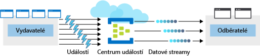

Váš tým se rozhodl využít funkce služby Azure Event Hubs ke správě a zpracování zvyšujícího se počtu transakcí, které procházejí systémem.

Centrum událostí je prostředek Azure. V prvním kroku vytvoříte v Azure nové centrum a nakonfigurujete ho tak, aby splňovalo specifické požadavky vašich aplikací.

## Co je centrum událostí Azure?

Azure Event Hubs je cloudová služba pro zpracování událostí, která je schopná přijmout a zpracovat miliony událostí za sekundu. Centra událostí fungují jako vstupní body kanálu událostí, kam přicházejí vstupní data, která jsou zde uložená, dokud nejsou dostupné prostředky pro zpracování.

Entita, která posílá data do služby Event Hubs, se nazývá *vydavatel* a entita, která čte data z této služby, se nazývá *příjemce* neboli *odběratel*. Služba Azure Event Hubs se nachází mezi těmito dvěma entitami, a dělí produkci (od vydavatele) od spotřeby (k odběrateli) streamu událostí. Toto dělení pomáhá řídit scénáře, kdy je míra produkce událostí mnohem vyšší než jejich spotřeba. Následující obrázek ukazuje roli centra událostí.

### Události

**Událost** je malý paket informací (*datagram*), který obsahuje oznámení. Události mohou být publikovány jednotlivě nebo v dávkách, ale jedno publikování (individuální nebo dávkové) nesmí překročit 256 kB.

### Vydavatelé a odběratelé

Vydavateli události jsou aplikace nebo zařízení, které posílají události prostřednictvím protokolu HTTPS nebo prostřednictvím rozšířeného protokolu řízení front zpráv (AMQP) 1.0.

Protokol AMQP má lepší výkon, pokud vydavatelé posílají data často. Má ale také větší režii při zahájení relace, protože musí nejprve nastavit trvalý obousměrný soket a protokol TLS nebo protokol SSL/TLS. 

Při přerušovanějším publikování je lepší volbou protokol HTTPS. I když HTTPS vyžaduje u každého požadavku další režii, nevzniká režie při zahájení relace.

> [!NOTE] 
> Stávající klienti založení na platformě Kafka, kteří používají Apache Kafka 1.0 a novější verze klientů, také mohou fungovat jako vydavatelé center událostí.

Odběratelé událostí jsou aplikace, které k příjmu a zpracování událostí z centra událostí používají jednu ze dvou podporovaných programových metod.

- **EventHubReceiver** – jednoduchá metoda, která nabízí omezené možnosti správy.
- **EventProcessorHost** – účinná metoda, kterou použijeme v další části tohoto modulu.

### Skupiny uživatelů

**Skupina uživatelů** centra událostí představuje konkrétní zobrazení datového streamu z centra událostí. Při použití oddělených skupin uživatelů mohou různé odběratelské aplikace zpracovávat streamy událostí nezávisle na sobě, aniž by to ovlivňovalo jiné aplikace. Použití více skupin uživatelů ale není povinné. U mnoha aplikací stačí jedna výchozí skupina uživatelů.

### Ceny

Existují tři cenové úrovně služby Azure Event Hubs: Basic, Standard a Dedicated. Tyto úrovně se liší podle podporovaných připojení, počtu dostupných skupin uživatelů a propustnosti. Pokud k vytvoření oboru názvů služby Event Hubs použijete Azure CLI, a nezadáte cenovou úroveň, bude přiřazena výchozí úroveň **Standard** (20 skupin příjemců, 1000 zprostředkovaných připojení).

## Vytvoření a konfigurace nové služby Azure Event Hubs

Při vytvoření a konfiguraci nové služby Azure Event Hubs je třeba provést dva hlavní kroky. Prvním krokem je definice **oboru názvů** služby Event Hubs. Druhým krokem je vytvoření centra událostí v tomto oboru názvů.

### Definice oboru názvů Event Hubs

Obor názvů Event Hubs je entita pro správu jednoho nebo více center událostí. Vytvoření oboru názvů Event Hubs obvykle obnáší následující kroky:

1. Definice nastavení na úrovni oboru názvů. Některá nastavení, jako je kapacita oboru názvů (nakonfigurovaná prostřednictvím **jednotek propustnosti**), cenová úroveň a výkonnostní metriky, se definují na úrovni oboru názvů. Tato nastavení platí pro všechna centra událostí v daném oboru názvů. Pokud tato nastavení nedefinujete, použijí se výchozí hodnoty: *1* pro kapacitu a *Standard* pro cenovou úroveň.

    Jednou nastavená jednotka propustnosti už nejde změnit. Vaše konfigurace musí být v rovnováze s předpokládaným rozpočtem na Azure. Pro různé požadavky na propustnost proto možná budete chtíti vytvořit jiná centra událostí. Pokud máte například aplikaci s daty o prodeji a plánujete dvě centra událostí, z nichž jedno je pro vysoce propustnou kolekci telemetrických dat o prodeji v reálním čase a druhé je pro málo využívanou kolekci protokolů událostí, bude lepší pro každé centrum použít samostatný obor názvů. To znamená, že budete muset nakonfigurovat (a platit) vysoce propustnou kapacitu jenom pro telemetrické centrum.

1. Vyberte jedinečný název oboru názvů. Obor názvů je přístupný na této adrese URL: *_obor_názvů_.servicebus.windows.net*.

1. Definujte následující volitelné vlastnosti:

    - Povolit Kafku. Tato volba umožňuje aplikacím Kafka publikovat události v centru událostí.
    - Nastavit pro tento obor názvů zónovou redundanci. Při zónové redundanci se data replikují do různých oddělených datacenter s vlastní nezávislou napájecí, síťovou a chladicí infrastrukturou.
    - Povolit automatické rozšiřování a maximální počet jednotek propustnosti pro automatické rozšiřování. Automatické rozšiřování nabízí možnost automatického škálování zvýšením počtu jednotek propustnosti na maximální hodnotu. To je užitečné, když chcete předejít situacím, kdy dochází k omezení využití sítě, protože příchozí a odchozí data překračují aktuálně nastavené počty jednotek propustnosti.

### Příkazy Azure CLI pro vytvoření oboru názvů Event Hubs

K vytvoření nového oboru názvů Event Hubs použijte následující příkazy `az eventhubs namespace`. Tady je stručný popis dílčích příkazů, které budeme používat ve cvičení.

| Příkaz | Popis |
|---------|-------------|
| `create` | Vytvořte obor názvů služby Event Hubs. |
| `authorization-rule` | Všechna centra událostí ve stejném oboru názvů Event Hubs mají společné přihlašovací údaje pro připojení. Tyto přihlašovací údaje budete potřebovat, když budete konfigurovat aplikace, aby k odesílání a příjímání zpráv používaly centrum událostí. Tento příkaz vrací připojovací řetězec pro váš obor názvů služby Event Hubs. |

### Konfigurace nového centra událostí

Po vytvoření oboru názvů Event Hubs můžete vytvořit centrum událostí. Při vytváření nového centra událostí jsou některé parametry povinné.

Následující parametry jsou při vytvoření centra událostí povinné:

- **Název centra událostí** – jedinečný název centra událostí v rámci předplatného, který splňuje následující požadavky:
  - Je dlouhý 1 až 50 znaků.
  - Obsahuje jenom písmena, číslice, tečky, spojovníky a podtržítka.
  - Začíná a končí písmenem nebo číslicí.
- **Počet oddílů** – počet oddílů požadovaných v centru událostí (2 až 32). Počet oddílů by měl být přímo úměrný očekávanému počtu současných uživatelů. Po vytvoření centra tato možnost nejde změnit. Oddíl odděluje stream zpráv, aby aplikace uživatele neboli příjemce mohly číst jenom určitou podmnožinu datového streamu. Pokud není definovaná jiná hodnota, výchozí hodnota je *4*.
- **Uchovávání zpráv** – počet dnů (1 až 7), kdy zprávy zůstanou dostupné, pokud by z nějakého důvodu bylo potřeba datový stream přehrát znovu. Pokud není definovaná jiná hodnota, výchozí hodnota je *7*.

Centrum událostí také můžete nakonfigurovat tak, aby streamovalo data do úložiště Azure Blob nebo do účtu Azure Data Lake Store.

### Příkazy Azure CLI pro vytvoření centra událostí

K vytvoření nového centra událostí pomocí Azure CLI použijete sadu příkazů `az eventhubs eventhub`. Tady je stručný popis dílčích příkazů, které budeme používat:

| Příkaz | Popis |
|---------|-------------|
| `create` | Vytvoří centrum událostí v zadaném oboru názvů. |
| `show` | Zobrazí podrobnosti vašeho centra událostí. |

## Shrnutí

Abyste mohli nasadit službu Azure Event Hubs, musíte nakonfigurovat obor názvů služby Event Hubs a pak nakonfigurovat samotné centrum událostí. V další části si ukážeme podrobný postup konfigurace pro vytvoření nového oboru názvů a centra událostí.