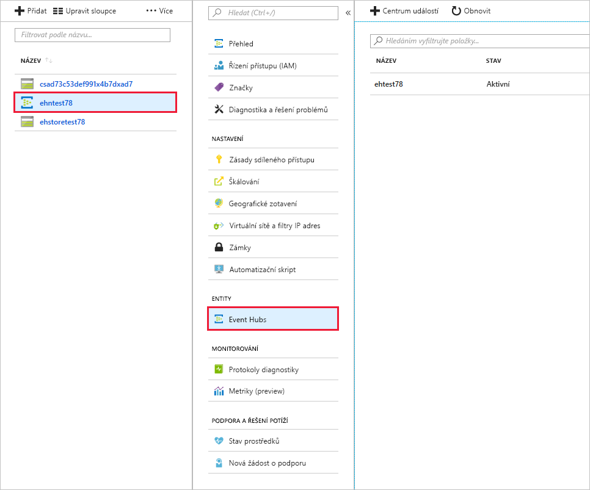

Teď jste připraveni vytvořit novou službu Event Hub. Po vytvoření této služby Event Hub použijete web Azure Portal k zobrazení tohoto nového centra.

[!include[](../../../includes/azure-sandbox-activate.md)]

## <a name="set-some-defaults-in-the-azure-cli"></a>Některé výchozí hodnoty v Azure CLI

Začněme tím, že zadáme pár výchozích hodnot pro příkazový řádek Azure CLI ve službě Cloud Shell. To vás zbaví nutnosti zadávat je pokaždé znovu. Zejména pojďme nastavit _skupinu prostředků_ a _umístění_. Vyberte umístění z následujícího seznamu.

[!include[](../../../includes/azure-sandbox-regions-first-mention-note.md)]

Potom zadejte následující příkaz do příkazového řádku Azure CLI a nahraďte umístění takovým, které je vám blíže.

```azurecli
az configure --defaults group=<rgn>[sandbox Resource Group]</rgn> location=westus2
```

## <a name="create-an-event-hubs-namespace"></a>Vytvoření oboru názvů služby Event Hubs

Následujícím postupem vytvořte obor názvů služby Event Hubs pomocí prostředí Bash, které je podporované prostředím Azure Cloud Shell:

1. Pomocí příkazu `az eventhubs namespace create` vytvořte obor názvů služby Event Hubs. Použijte následující parametry.

    > [!div class="mx-tableFixed"]
    > |Parametr      |Popis|
    > |---------------|-----------|
    > |--name (povinný)      |Zadejte jedinečný název oboru názvů služby Event Hubs o délce 6 až 50 znaků. Název by měl obsahovat jen písmena, číslice a pomlčky. Měl by začínat písmenem a končit písmenem nebo číslicí.|
    > |--resource-group (povinný) | Toto bude předem vytvořená skupina prostředků sandboxu Azure dodávaná z výchozích hodnot. |
    > |--l (nepovinný)     |Zadejte umístění nejbližšího datového centra Azure. Bude se používat jako výchozí.|
    > |--sku (nepovinný) | Cenová úroveň pro obor názvů [Basic | Standard], výchozí hodnota je _Standard_. Ta určuje prahové hodnoty počtů připojení a příjemců. |

    Nastavte název do proměnné prostředí, abychom ho mohli používat opakovaně.

    ```azurecli
    NS_NAME=myEvt-HubNs1
    ````

    [!include[](../../../includes/azure-cloudshell-copy-paste-tip.md)]

    ```azurecli
    az eventhubs namespace create --name $NS_NAME
    ```

    > [!NOTE]
    > Azure je, co se týká názvu, velmi striktní a rozhraní příkazového řádku vrátí **chybný požadavek**, pokud název neexistuje nebo je neplatný. Vyzkoušejte jiný název změnou proměnné prostředí a opětovným zadáním příkazu.


1. Pomocí následujícího příkazu načtěte připojovací řetězec pro obor názvů služby Event Hubs. Budete ho potřebovat ke konfiguraci aplikací pro odesílání a příjem zpráv pomocí vaší služby Event Hub.

    ```azurecli
    az eventhubs namespace authorization-rule keys list --name RootManageSharedAccessKey --namespace-name $NS_NAME
    ```

    > [!div class="mx-tableFixed"]
    > |Parametr      |Popis|
    > |---------------|-----------|
    > |--resource-group (povinný)  | Toto bude předem vytvořená skupina prostředků sandboxu Azure dodávaná z výchozích hodnot. |
    > |--namespace-name (povinný)  | Zadejte název vytvořeného oboru názvů. |

    Tento příkaz vrací blok JSON s připojovacím řetězem pro obor názvů služby Event Hubs, který použijete později ke konfiguraci aplikací vydavatele a příjemce. Uložte hodnotu následujících klíčů pro pozdější použití.

    - **primaryConnectionString**
    - **primaryKey**

## <a name="create-an-event-hub"></a>Vytvoření služby Event Hub

Pomocí následujícího postupu vytvořte novou službu Event Hub:

1. Vytvořte novou službu Event Hub pomocí příkazu `eventhub create`. Příkaz potřebuje následující parametry:

    > [!div class="mx-tableFixed"]
    > |Parametr      |Popis|
    > |---------------|-----------|
    > |--name (povinný)  |Zadejte název služby Event Hub.|
    > |--resource-group (povinný)  |Vlastník skupiny prostředků.|
    > |--namespace-name (povinný)      |Zadejte vytvořený obor názvů.|

    Pojďme nejdřív definovat název služby Event Hub v proměnné prostředí.

    ```azurecli
    HUB_NAME=[name]
    ```

    ```azurecli
    az eventhubs eventhub create --name $HUB_NAME --namespace-name $NS_NAME
    ```

1. Zobrazte podrobnosti služby Event Hub pomocí příkazu `eventhub show`. Vstup:

    > [!div class="mx-tableFixed"]
    > |Parametr      |Popis|
    > |---------------|-----------|
    > |--resource-group (povinný)  |Vlastník skupiny prostředků.|
    > |--namespace-name (povinný)      |Zadejte vytvořený obor názvů.|
    > |--name (povinný)|Název služby Event Hub.|

    ```azurecli
    az eventhubs eventhub show --namespace-name $NS_NAME --name $HUB_NAME
    ```

## <a name="view-the-event-hub-in-the-azure-portal"></a>Zobrazení služby Event Hub na webu Azure Portal

V dalším kroku se podívejme, jak to vypadá na webu Azure Portal.

1. Pomocí stejného účtu, kterým jste aktivovali sandbox, se přihlaste k webu [Azure Portal](https://portal.azure.com/learn.docs.microsoft.com?azure-portal=true).

1. Pomocí panelu vyhledávání v horní části portálu najděte obor názvů služby Event Hubs.

1. Vyberte obor názvů. Tím ho otevřete.

1. Vyberte **Obor názvů služby Event Hubs** v oddílu **ENTITY**.

1. Klikněte na **Event Hubs**.

    Vaše služba Event Hub událostí se zobrazí se stavem **Aktivní** a výchozími hodnotami pro **Uchovávání zpráv** (*7*) a **Počet oddílů** (*4*).

    

## <a name="summary"></a>Shrnutí

Právě jste vytvořili novou službu Event Hub a máte připravené všechny potřebné informace ke konfiguraci aplikací vydavatele a příjemce.
