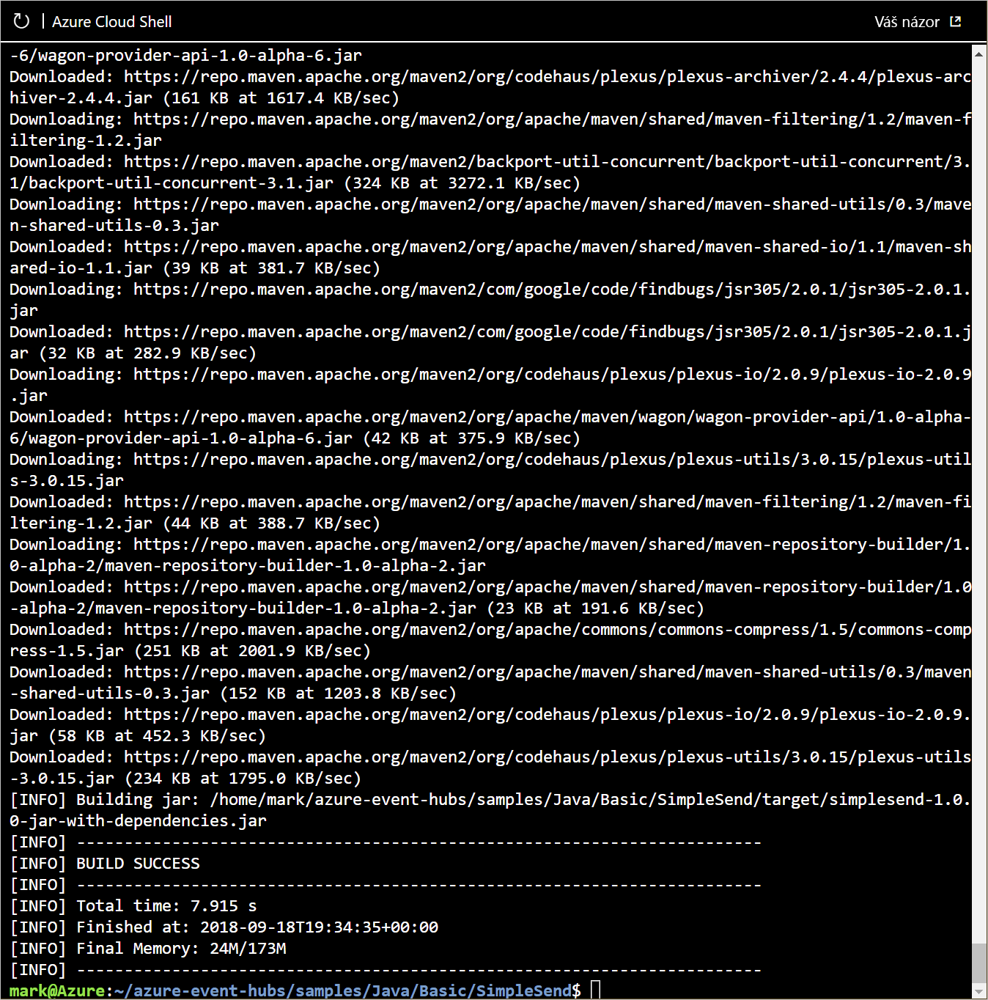

Teď jste připraveni nakonfigurovat aplikace vydavatele a uživatele pro centrum událostí.

V této lekci tyto aplikace nakonfigurujete, aby odesílaly nebo přijímaly zprávy prostřednictvím centra událostí. Tyto aplikace jsou uložené v úložišti GitHub.

Nakonfigurujete dvě samostatné aplikace. Jedna funguje jako odesílatel zprávy (**SimpleSend**) a druhá jako příjemce zprávy (**EventProcessorSample**). Obě aplikace jsou v jazyce Java, takže můžete celou dobu pracovat v prohlížeči. Stejná konfigurace je ale potřeba pro každou platformu, jako je .NET.

## <a name="create-a-general-purpose-standard-storage-account"></a>Vytvoření účtu obecného úložiště úrovně Standard

Aplikace příjemce v jazyce Java, kterou budete v této lekci konfigurovat, ukládá zprávy do služby Azure Blog Storage. Blob Storage vyžaduje účet úložiště.

1. Vytvořte účet úložiště (pro obecné účely V2) pomocí příkazu `storage account create`. Nezapomeňte, že jsme nastavili výchozí skupinu prostředků a umístění, takž i když se tyto parametry normálně _vyžadují_, můžeme je nechat stranou.

    |Parametr      |Popis|
    |---------------|-----------|
    |--name (povinný)  | Název účtu úložiště. |
    |--resource-group (povinný)  |Vlastník skupiny prostředků. Použijeme předem vytvořenou skupinu prostředků Sandboxu.|
    |--location (povinný)    |Volitelné umístění, pokud chcete účet úložiště na konkrétním místě, a ne v umístění skupiny prostředků.|

    Nastavte název účtu úložiště do proměnné. Musí být složený jenom z malých písmen a číslic, jako oddělovač je povolený spojovník. Musí být také v rámci Azure jedinečný.

    ```azurecli
    STORAGE_NAME=[name]
    ```

    Potom použijte tento příkaz k vytvoření účtu úložiště.

    ```azurecli
    az storage account create --name $STORAGE_NAME --sku Standard_RAGRS --encryption blob
    ```

    > [!TIP]
    > Pokud se vytvoření účtu úložiště nepovede, změňte proměnnou prostředí a zkuste to znovu.

1. K zobrazení seznamu všech přístupových klíčů přidružených k účtu úložiště použijte příkaz `account keys list`. Vezme se název účtu a skupina prostředků (výchozí nastavení).

    ```azurecli
    az storage account keys list --account-name $STORAGE_NAME
    ```

     Zobrazí se seznam přístupových klíčů přidružených k vašemu účtu úložiště. Zkopírujte hodnotu **key** a uložte si ji pro budoucí použití. Klíč budete potřebovat pro přístup ke svému účtu úložiště.

1. K zobrazení připojovacího řetězce vašeho účtu úložiště použijte následující příkaz:

    ```azurecli
    az storage account show-connection-string -n $STORAGE_NAME
    ```

    Tento příkaz vrátí podrobnosti o připojení k účtu úložiště. Zkopírujte _hodnotu_ **connectionString** a uložte si ji. Výsledek by měl vypadat přibližně takto:

    ```output
    "DefaultEndpointsProtocol=https;EndpointSuffix=core.windows.net;AccountName=storage_account_name;AccountKey=VZjXuMeuDqjCkT60xX6L5fmtXixYuY2wiPmsrXwYHIhwo736kSAUAj08XBockRZh7CZwYxuYBPe31hi8XfHlWw=="
    ```

1. V účtu úložiště vytvořte kontejner s názvem **messages**. Použijte k tomu následující příkaz. Použijte hodnotu **connectionString** zkopírovanou v předchozím kroku:

    ```azurecli
    az storage container create -n messages --connection-string "<connection string here>"
    ```

## <a name="clone-the-event-hubs-github-repository"></a>Klonování úložiště GitHub služby Event Hubs

Ke klonování úložiště GitHub služby Event Hubs pomocí příkazu `git` použijte následující postup. Příkaz můžete spustit přímo v Cloud Shellu.

1. Zdrojové soubory aplikace, kterou vytvoříte v této lekci, jsou umístěné v [úložišti GitHub](https://github.com/Azure/azure-event-hubs). Následujícími příkazy se nejprve ujistěte, že jste v domovském adresáři služby Cloud Shell, a pak je použijte ke klonování tohoto úložiště:

    ```bash
    cd ~
    git clone https://github.com/Azure/azure-event-hubs.git
    ```
    Úložiště se naklonuje do domovské složky.

## <a name="edit-simplesendjava"></a>Úpravy souboru SimpleSend.java

Použijeme integrovaný editor kódu služby Cloud Shell. Je založený na editoru Monaco a je podobný editoru Visual Studio Code, ale je kompletně online.

Tento editor použijeme k úpravě aplikace SimpleSend a k přidání oboru názvů Event Hubs, názvu centra událostí, názvu zásady sdíleného přístupu a primárního klíče. Hlavní příkazy se zobrazují v dolní části okna editoru. 

V této lekci budete potřebovat zapsat úpravy kombinací kláves <kbd>CTRL+O</kbd>, dále potvrdit název výstupního souboru klávesou <kbd>ENTER</kbd> a ukončit editor kombinací kláves <kbd>CTRL+X</kbd>. Editor má také v pravém horním rohu nabídku „...“ se všemi editačními příkazy.

1. Přejděte do složky **SimpleSend**.

    ```bash
    cd azure-event-hubs/samples/Java/Basic/SimpleSend/src/main/java/com/microsoft/azure/eventhubs/samples/SimpleSend
    ```

1. Otevřete editor kódu v aktuální složce. Nalevo se zobrazí se seznam souborů a napravo bude prostor editoru.

    ```bash
    code .
    ```

1. Otevřete soubor **SimpleSend.java** tak, že ho vyberete ze seznamu souborů.

1. V editoru najděte následující řetězce a nahraďte je:

    - `"Your Event Hubs namespace name"` nahraďte názvem vašeho oboru názvů centra událostí.
    - `"Your Event Hub"` nahraďte názvem vašeho centra událostí.
    - `"Your policy name"` nahraďte hodnotou **RootManageSharedAccessKey**.
    - `"Your primary SAS key"` nahraďte hodnotou klíče **primaryKey** svého oboru názvů centra událostí, kterou jste si uložili v předchozích krocích.
 
    > [!TIP]
    > Na rozdíl od okna terminálu může editor využívat klávesové zkratky pro kopírování a vložení, které jsou typické pro váš operační systém.

    Pokud jste některé z nich zapomněli, můžete přejít do okna terminálu pod editorem a pomocí příkazu `echo` vypsat některou z proměnných prostředí. Příklad:

    ```bash
    echo $NS_NAME
    ```
    Když vytvoříte obor názvů Event Hubs, vytvoří se 256bitový klíč SAS s názvem **RootManageSharedAccessKey**, který má přidruženou dvojici primárního a sekundárního klíče. Tyto klíče udělují oboru názvů práva k posílání, poslechu a správě. V předchozí lekci jste k zobrazení klíče použili příkaz Azure CLI. Ale tento klíč také najdete, když na webu Azure Portal otevřete stránku **Zásady sdíleného přístupu** pro obor názvů Event Hubs.

1. Uložte **SimpleSend.java** pomocí nabídky „...“ nebo klávesové zkratky (<kbd>Ctrl+S</kbd> ve Windows a Linuxu, <kbd>Cmd+S</kbd> v systému macOS).

1. Editor zavřete pomocí nabídky „...“ nebo klávesové zkratky <kbd>CTRL+Q</kbd>.

## <a name="use-maven-to-build-simplesendjava"></a>Použití nástroje Maven k vytvoření souboru SimpleSend.java

Teď vytvoříte aplikaci v Javě pomocí příkazů **mvn**.

1. Přejděte zpátky k hlavní složce **SimpleSend**.

    ```bash
    cd ~/azure-event-hubs/samples/Java/Basic/SimpleSend
    ```

1. Sestavte aplikaci SimpleSend v Javě. Tím zajistíte, že aplikace použije podrobné informace o připojení pro vaše centrum událostí:

    ```bash
    mvn clean package -DskipTests
    ```

    Vytvoření může trvat i několik minut. Než budete pokračovat, zkontrolujte, že se zobrazila zpráva **[INFO] BUILD SUCCESS**.

    

## <a name="edit-eventprocessorsamplejava"></a>Úpravy souboru EventProcessorSample.java

Teď nakonfigurujete aplikaci **příjemce** (také se jim říká **odběratelé** nebo **uživatelé**) na příjem dat z centra událostí.

Pro aplikaci příjemce jsou k dispozici dvě metody: **EventHubReceiver** a **EventProcessorHost**. EventProcessorHost je nástavbou metody EventHubReceiver. Metoda EventProcessorHost nabízí jednodušší programové rozhraní než EventHubReceiver. EventProcessorHost může automaticky rozdělovat oddíly zprávy mezi více instancí EventProcessorHost s použitím stejného účtu úložiště.

V této lekci použijete metodu EventProcessorHost. Aplikaci EventProcessorSample upravte přidáním oboru názvů Event Hubs, názvu centra událostí, názvu zásady sdíleného přístupu a primárního klíče, názvu účtu úložiště, připojovacího řetězce a názvu kontejneru.

1. K přechodu do složky **EventProcessorSample** použijte následující příkaz:

    ```bash
    cd ~/azure-event-hubs/samples/Java/Basic/EventProcessorSample/src/main/java/com/microsoft/azure/eventhubs/samples/eventprocessorsample
    ```

1. Otevřete editor kódu.

    ```bash
    code .
    ```
    
1. Vyberte soubor **EventProcessorSample.java**.

1. V editoru najděte následující řetězce a nahraďte je:

    - `----ServiceBusNamespaceName----` nahraďte názvem vašeho oboru názvů Event Hubs.
    - `----EventHubName----` nahraďte názvem vašeho centra událostí.
    - `----SharedAccessSignatureKeyName----` nahraďte hodnotou **RootManageSharedAccessKey**.
    - `----SharedAccessSignatureKey----` nahraďte hodnotou klíče **primaryKey** svého oboru názvů Event Hubs, kterou jste si uložili v předchozích krocích.
    - `----AzureStorageConnectionString----` nahraďte připojovacím řetězcem účtu úložiště, který jste si uložili v předchozích krocích.
    - `----StorageContainerName----` nahraďte textem **messages**.
    - `----HostNamePrefix----` nahraďte názvem vašeho účtu úložiště.

1. Uložte **EventProcessorSample.java** pomocí nabídky „...“ nebo klávesové zkratky (<kbd>Ctrl+S</kbd> ve Windows a Linuxu, <kbd>Cmd+S</kbd> v systému macOS).

1. Zavřete editor.

## <a name="use-maven-to-build-eventprocessorsamplejava"></a>Použití nástroje Maven k vytvoření souboru EventProcessorSample.java

1. K přechodu do hlavní složky **EventProcessorSample** použijte následující příkaz:

    ```bash
    cd ~/azure-event-hubs/samples/Java/Basic/EventProcessorSample
    ```

1. K vytvoření aplikace SimpleSend v Javě použijte následující příkaz. Tím zajistíte, že aplikace použije podrobné informace o připojení pro vaše centrum událostí:

    ```bash
    mvn clean package -DskipTests
    ```

    Vytvoření může trvat i několik minut. Než budete pokračovat, zkontrolujte, že se zobrazila zpráva **[INFO] BUILD SUCCESS**.

    

## <a name="start-the-sender-and-receiver-apps"></a>Spuštění odesílací a přijímací aplikace

1. Spusťte aplikaci Java z příkazového řádku příkazem **java** a zadáním balíčku .jar. Ke spuštění aplikace SimpleSend použijte následující příkazy:

    ```bash
    cd ~/azure-event-hubs/samples/Java/Basic/SimpleSend
    java -jar ./target/simplesend-1.0.0-jar-with-dependencies.jar
    ```

1. Když se zobrazí **Send Complete...** (Odeslání dokončeno...), stiskněte <kbd>ENTER</kbd>.

    ```output
    jar-with-dependencies.jar
    SLF4J: Failed to load class "org.slf4j.impl.StaticLoggerBinder".
    SLF4J: Defaulting to no-operation (NOP) logger implementation
    SLF4J: See http://www.slf4j.org/codes.html#StaticLoggerBinder for further details.
    2018-09-18T19:42:15.146Z: Send Complete...
    ```

1. Ke spuštění aplikace EventProcessorSample použijte následující příkaz.

    ```bash
    cd ~/azure-event-hubs/samples/Java/Basic/EventProcessorSample
    java -jar ./target/eventprocessorsample-1.0.0-jar-with-dependencies.jar
    ```

1. Když se na konzole přestanou zobrazovat zprávy, stisknutím <kbd>ENTER</kbd> nebo <kbd>CTRL+C</kbd> tento program ukončete.

    ```output
    ...
    SAMPLE: Partition 0 checkpointing at 1064,19
    SAMPLE (3,1120,20): "Message 80"
    SAMPLE (3,1176,21): "Message 84"
    SAMPLE (3,1232,22): "Message 88"
    SAMPLE (3,1288,23): "Message 92"
    SAMPLE (3,1344,24): "Message 96"
    SAMPLE: Partition 3 checkpointing at 1344,24
    SAMPLE (2,1120,20): "Message 83"
    SAMPLE (2,1176,21): "Message 87"
    SAMPLE (2,1232,22): "Message 91"
    SAMPLE (2,1288,23): "Message 95"
    SAMPLE (2,1344,24): "Message 99"
    SAMPLE: Partition 2 checkpointing at 1344,24
    SAMPLE: Partition 1 batch size was 3 for host mystorageacct2018-46d60a17-7060-4b53-b0e0-cca70c970a47
    SAMPLE (0,1120,20): "Message 81"
    SAMPLE (0,1176,21): "Message 85"
    SAMPLE: Partition 0 batch size was 10 for host mystorageacct2018-46d60a17-7060-4b53-b0e0-cca70c970a47
    SAMPLE: Partition 0 got event batch
    SAMPLE (0,1232,22): "Message 89"
    SAMPLE (0,1288,23): "Message 93"
    SAMPLE (0,1344,24): "Message 97"
    SAMPLE: Partition 0 checkpointing at 1344,24
    SAMPLE: Partition 3 batch size was 8 for host mystorageacct2018-46d60a17-7060-4b53-b0e0-cca70c970a47
    SAMPLE: Partition 2 batch size was 9 for host mystorageacct2018-46d60a17-7060-4b53-b0e0-cca70c970a47
    SAMPLE: Partition 0 batch size was 3 for host mystorageacct2018-46d60a17-7060-4b53-b0e0-cca70c970a47
    ```

## <a name="summary"></a>Shrnutí

Nakonfigurovali jste odesílací aplikaci, aby posílala zprávy do centra událostí. Nakonfigurovali jste také přijímací aplikaci, aby přijímala zprávy z centra událostí.