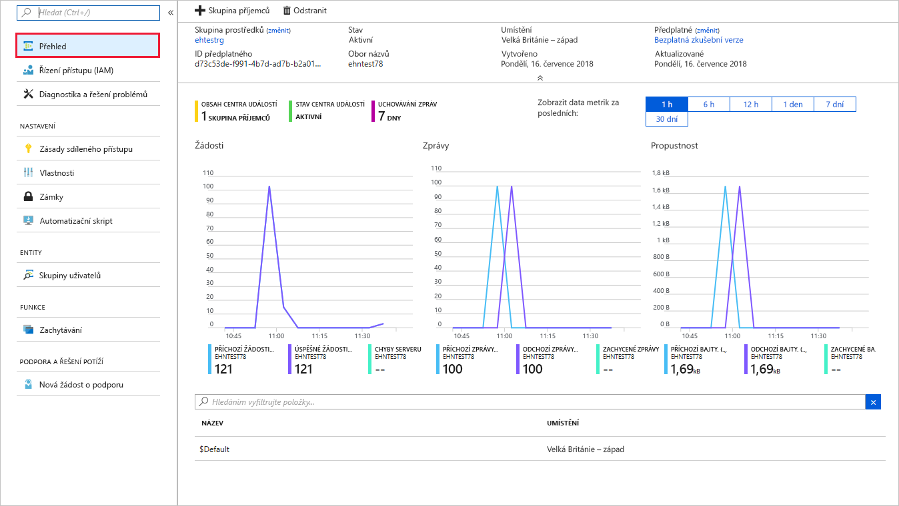
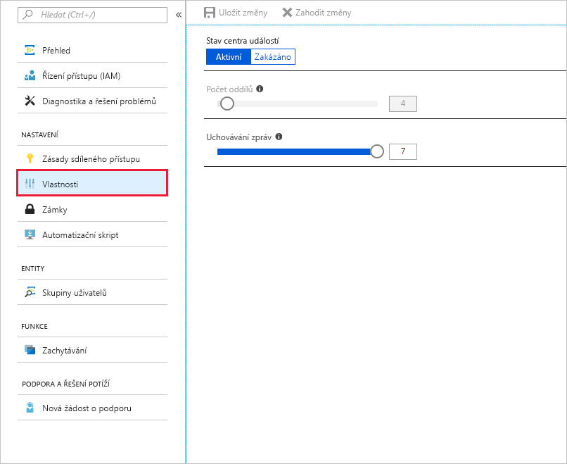
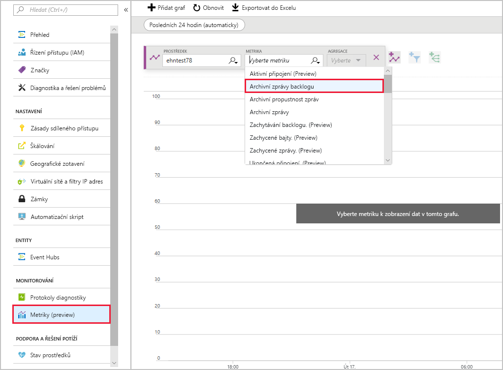

V této lekci pomocí portálu Azure Portal ověříte, že centrum událostí pracuje a funguje podle vašich očekávání. Zároveň otestujete, jak funguje zasílání zpráv centra událostí, když je dočasně nedostupné, a pomocí metrik Event Hubs zjistíte výkonnost centra událostí.

## <a name="view-event-hub-activity"></a>Zobrazení aktivity centra událostí

1. Pomocí stejného účtu, kterým jste aktivovali sandbox, se přihlaste k webu [Azure Portal](https://portal.azure.com/learn.docs.microsoft.com?azure-portal=true).

1. Pomocí panelu vyhledávání najděte svoje centrum událostí a otevřete ho.

1. Na stránce Přehled si prohlédněte počet zpráv.

    

1. Aplikace SimpleSend a EventProcessorSample jsou nakonfigurované k odesílání a příjmu 100 zpráv. Uvidíte, že centrum událostí zpracovalo 100 zpráv z aplikace SimpleSend a přeneslo 100 zpráv do aplikace EventProcessorSample.

## <a name="test-event-hub-resilience"></a>Testování odolnosti centra událostí

Pomocí následujícího postupu zjistíte, co se stane, když aplikace odesílá zprávy do centra událostí, které je dočasně nedostupné.

1. Odešlete zprávy do centra událostí znovu pomocí aplikace SimpleSend. Použijte následující příkaz:

    ```azurecli
    cd ~
    cd azure-event-hubs/samples/Java/Basic/SimpleSend
    java -jar ./target/simplesend-1.0.0-jar-with-dependencies.jar
    ```

1. Když se zobrazí **Send Complete...** (Odeslání dokončeno...), stiskněte <kbd>ENTER</kbd>.

1. Na obrazovce **Přehled** vyberte centrum událostí – tím se zobrazí podrobnosti o konkrétním centru událostí. Na tuto obrazovku se dostanete také prostřednictvím možnosti **Event Hubs** ze stránky oboru názvů.

1. Vyberte **Nastavení** > **Vlastnosti**.

1. Pod stavem centra událostí klikněte na **Zakázáno**. Uložte změny.

    

    **Aspoň pět minut počkejte.**

1. Kliknutím na **Aktivní** pod stavem centra událostí toto centrum znovu povolte a uložte změny.

1. Znovu spusťte aplikaci EventProcessorSample pro příjem zpráv. Použijte následující příkaz.

    ```azurecli
    cd ~
    cd azure-event-hubs/samples/Java/Basic/EventProcessorSample
    java -jar ./target/eventprocessorsample-1.0.0-jar-with-dependencies.jar
    ```

1. Když se na konzole přestanou zobrazovat zprávy, stiskněte <kbd>ENTER</kbd>.

1. Na portálu Azure Portal pak přejděte zpět do svého oboru názvů centra událostí. Pokud jste stále ještě na stránce centra událostí, můžete přejít zpět pomocí navigace s popisem cesty v horní části obrazovky. Případně také můžete obor názvů vyhledat a vybrat ho.

1. Klikněte na **Monitorování** > **Metriky (Preview)**.

    

1. V seznamu **Metriky** vyberte **Příchozí zprávy** a klikněte na **Přidat metriku**.

1. V seznamu **Metriky** vyberte **Odchozí zprávy** a klikněte na **Přidat metriku**.

1. V horní části grafu klikněte na **Posledních 24 hodin (automaticky)** a změňte časové období na **Posledních 30 minut**. Tím rozbalíte graf dat.

Uvidíte, že přestože byly zprávy odeslány předtím, než bylo centrum událostí uvedeno na určitou dobu do offline režimu, všech 100 zpráv se úspěšně přeneslo.

## <a name="summary"></a>Shrnutí

V této lekci jste pomocí metrik služby Event Hubs otestovali, že vaše centrum událostí úspěšně zpracovává odesílání a příjem zpráv.
