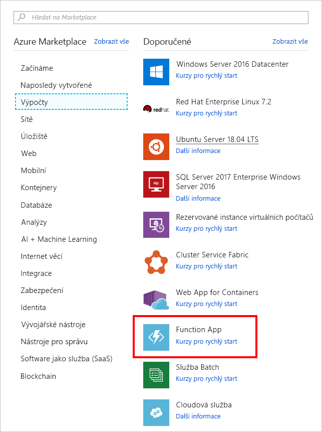

V této lekci vytvoříme aplikaci funkcí Azure, která se pomocí triggeru časovače vyvolá každých 20 sekund.

[!include[](../../../includes/azure-sandbox-activate.md)]

## <a name="create-an-azure-function-app"></a>Vytvoření aplikace funkcí Azure

Začněme vytvořením aplikace funkcí Azure na portálu.

1. Pomocí stejného účtu, kterým jste aktivovali sandbox, se přihlaste k portálu [Azure Portal](https://portal.azure.com/learn.docs.microsoft.com?azure-portal=true).

1. V levém navigačním panelu vyberte **Vytvořit prostředek**.

1. Vyberte **Compute**.

1. Vyhledejte a vyberte **Function App**. V případě potřeby můžete k vyhledání a vytvoření nového prostředku použít panel vyhledávání.

    

1. Zadejte globálně jedinečný **název aplikace**.

1. Vyberte nějaké **předplatné**.

1. Vyberte existující **skupinu prostředků** <rgn>[název skupiny prostředků sandboxu]</rgn>.

1. Jako **operační systém** zvolte **Windows**.

1. Jako **Plán hostování** zvolte **Plán Consumption**. Při použití typu plánu Consumption se vám bude účtovat každé spuštění funkce a prostředky se přidělují automaticky na základě vytížení aplikace.

1. Vyberte **Umístění** z níže uvedeného seznamu.

    [!include[](../../../includes/azure-sandbox-regions-first-mention-note-friendly.md)]

1. **Zásobník modulu Runtime** ponechte ve výchozím nastavení *.NET*, což je jazyk, ve kterém v tomto cvičení implementujeme příklady funkcí.

1. Vytvořte nový účet **úložiště**. Jako název se použije nějaká varianta názvu aplikace, ale pokud chcete, můžete ho změnit.

1. Vyberte **Vytvořit**. Po nasazení aplikace funkcí přejděte na portálu na **Všechny prostředky**. Aplikace funkcí bude uvedena s typem **App Service** a s názvem, který jste jí dali.
 
## <a name="create-a-timer-trigger"></a>Vytvoření triggeru časovače

Teď v naší funkci vytvoříme trigger časovače.

1. Klikněte na tlačítko Přidat (**+**) vedle **Funkce**. Tato akce spustí proces vytváření funkce.

1. Na stránce **Azure Functions pro .NET – Začínáme** vyberte **Na portálu** a potom **Pokračovat**.

1. V seznamu šablon pro rychlý start vyberte **Časovač** a potom ve spodní části obrazovky vyberte **Vytvořit**.

## <a name="configure-the-timer-trigger"></a>Konfigurace triggeru časovače

Máme aplikaci funkcí Azure s logikou, která do okna protokolu vytiskne zprávu. Plán časovače nastavíme tak, aby se spustil každých 20 sekund.

1. Vyberte **Integrace**.

1. Do okna **Plán** zadejte následující hodnotu:

    ```log
    */20 * * * * *
    ```

1. Vyberte **Uložit**.

## <a name="test-the-timer"></a>Testování časovače

Nyní, když jsme nakonfigurovali časovač, vyvolá funkci na intervalu, který jsme definovali.

1. Vyberte **TimerTrigger1**.

    > [!NOTE]
    > **TimerTrigger1** je výchozí název. Když trigger vytvoříte, vybere se automaticky.

1. Otevřete panel **protokolů** v dolní části obrazovky.

1. Sledujte nové zprávy, které dorazí každých 20 sekund do okna protokolu.

1. Pokud chcete zastavit spuštění funkce, vyberte možnost **Spravovat** a poté přepnete **Stav funkce** na *Zakázané*.
