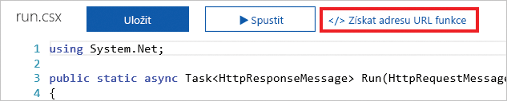

Na většině platforem a zařízení je požadavek HTTP běžnou operací. Požadavky HTTP posíláme neustále, ať už je to žádost o vyhledání slova ve slovníku nebo o zjištění místního počasí. Azure Functions umožňuje rychle vytvořit logiku, která se má při přijetí požadavku HTTP spustit.

Tady se naučíte, jak vytvořit a vyvolat funkci Azure pomocí triggeru HTTP. Projdete si také některé možnosti přizpůsobení, které jsou k dispozici.

## Co je trigger HTTP?

Trigger HTTP je aktivační událost, která spustí funkci, když přijme požadavek HTTP. Triggery HTTP nabízejí řadu možností a přizpůsobení, včetně následujících:

- Poskytnutí autorizovaného přístupu zadáním klíčů
- Omezení, které příkazy HTTP se podporují
- Vrácení dat zpátky volajícímu
- Příjem dat prostřednictvím parametrů řetězce dotazu nebo textu požadavku
- Podpora šablon tras URL pro změnu adresy URL funkce

Při vytváření triggeru HTTP vybíráte programovací jazyk, zadáváte název triggeru a vybíráte úroveň autorizace.

## Co je úroveň autorizace triggeru HTTP?

Úroveň autorizace triggeru HTTP je příznak, který indikuje, jestli příchozí požadavek HTTP vyžaduje klíč API pro účely ověřování.

Existují tři úrovně autorizace:

1. Funkce
2. Anonymní
3. Správce

Úrovně **Funkce** a **Správce** jsou založené na klíči. Pokud chcete odeslat požadavek HTTP, musíte zadat klíč pro ověření. Existují dva typy klíčů, klíč *funkce* a klíč *hostitele*. Rozdíl mezi těmito dvěma klíči je v jejich rozsahu. Klíče funkce jsou specifické pro funkci. Klíče hostitele se vztahují na všechny funkce v rámci celé aplikace funkcí. Pokud je úroveň autorizace nastavená na hodnotu **Funkce**, můžete použít klíč *funkce* i klíč hostitele. Pokud je úroveň autorizace nastavená na hodnotu **Správce**, musíte zadat klíč hostitele.

Úroveň **Anonymní** znamená, že se nevyžaduje žádné ověřování. Tuto úroveň použijeme v našem cvičení.

## Jak vytvořit trigger HTTP

Stejně jako trigger časovače i trigger HTTP můžete vytvořit prostřednictvím webu Azure Portal. Uvnitř vaší funkce Azure v seznamu předdefinovaných typů triggerů vyberte **Trigger HTTP**. Potom zadejte logiku, kterou chcete spustit, a proveďte případná vlastní nastavení, jako je omezení použití určitých příkazů HTTP.

Jedním z nastavení, kterým je důležité porozumět, je **Název parametru požadavku**. Toto nastavení je řetězec odpovídající názvu parametru, který obsahuje informace o příchozím požadavku HTTP. Ve výchozím nastavení je název tohoto parametru *req*.

## Jak vyvolat trigger HTTP

Pokud chcete vyvolat trigger HTTP, odešlete požadavek HTTP na adresu URL pro vaši funkci. Tuto adresu URL získáte, když přejdete na znakovou stránku funkce a vyberte odkaz **Získat adresu URL funkce**.

Když máte adresu URL funkce, můžete odesílat požadavky HTTP. Pamatujte si, že když funkce přijme data, můžete buď použít parametry řetězce dotazu, nebo zadat data prostřednictvím textu požadavku.

Trigger HTTP vyvolá funkci Azure, když na své adrese URL přijme požadavek HTTP. Triggery HTTP umožňují přijímat data a vracet data zpátky volajícímu.