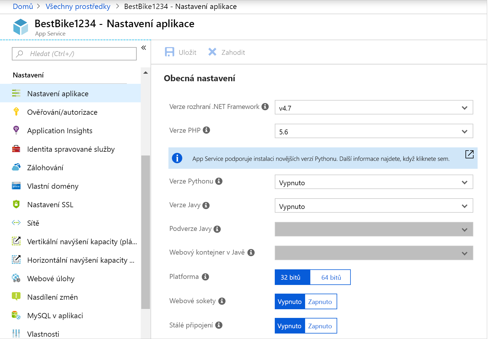
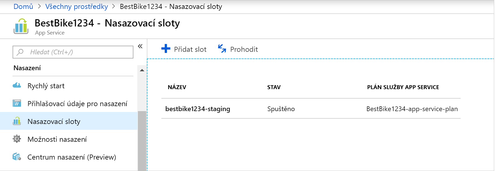
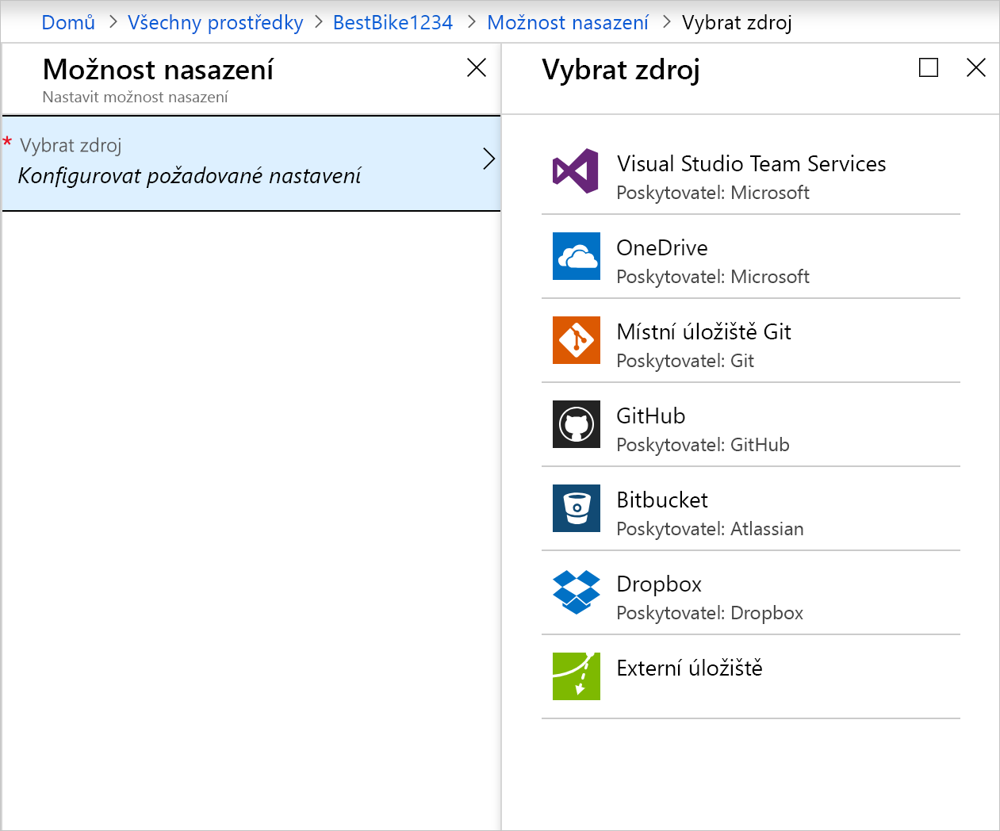

Tady se dozvíte, jak vytvořit webovou aplikaci Azure App Service pomocí webu Azure Portal.

## Proč používat Azure Portal?

Prvním krokem při hostování webové aplikace je vytvořit si v rámci svého předplatného Azure webovou aplikaci (aplikaci App Service).

Webovou aplikaci si můžete vytvořit řadou způsobů. Můžete použít Azure Portal, Azure CLI, skript nebo integrované vývojové prostředí (IDE).

Tady budeme používat portál, protože má grafické prostředí, což z něj dělá skvělý vzdělávací nástroj. Portál vám pomůže najít dostupné funkce, přizpůsobit existující prostředky a přidat další prostředky.

## Co je Azure App Service?

Azure App Service je plně spravovaná výpočetní platforma v rámci prostředí Azure, která je optimalizována pro hostování webových aplikací, rozhraní REST API a mobilních back-endů.

Toto řešení typu Platforma jako služba (PaaS) nabízené v rámci Microsoft Azure umožňuje zaměřit se na sestavování aplikací, zatímco Azure zajistí infrastrukturu pro jejich spouštění a škálování.

## Vytvoření webové aplikace

Jakmile budete chtít hostovat svoji vlastní aplikaci, navštívíte Azure Portal a vytvoříte **webovou aplikaci**. Vytvořením **webové aplikace** na portálu Azure Portal ve skutečnosti vytvoříte sadu prostředků pro hostování v App Service, která vám umožní hostovat jakoukoli webovou aplikaci, která je podporována v Azure, ať už jde o aplikaci využívající například ASP.NET Core, Node.js nebo PHP. Na následujícím obrázku je vidět, jak snadno lze nakonfigurovat rozhraní/jazyk, které aplikace používá.

Azure Portal obsahuje šablonu k vytvoření webové aplikace. Tato šablona vyžaduje zadání hodnot do následujících polí:

- **Název aplikace**: Název webové aplikace.
- **Předplatné**: Platné a aktivní předplatné.
- **Skupina prostředků**: Platná skupina prostředků. V následující části je podrobně vysvětleno, co je skupina prostředků.
- **Operační systém**: Operační systém. Možnosti: Windows, Linux a kontejnery Dockeru. Ve Windows můžete hostovat jakýkoli typ aplikace využívající řadu různých technologií. Totéž platí i pro hostování v Linuxu, ale v Linuxu musí všechny aplikace ASP.NET používat ASP.Net Core v rozhraní .NET Core. Poslední možností jsou kontejnery Dockeru, kde můžete svoje kontejnery nasadit přímo přes kontejnery hostované a spravované v rámci Azure. 
- **Plán služby App Service / umístění**: Platný plán služby Azure App Service. V následující části je podrobně vysvětleno, co je plán služby App Service.
- **Applications Insights**: Když zapnete možnost Azure Application Insights, můžete využívat užitečné nástroje pro monitorování a metriky, které Azure Portal nabízí jako pomoc s dohlížením na výkon vašich aplikací.

Díky celé řadě užitečných nástrojů, které Azure Portal obsahuje, vám tento portál nabízí výraznou pomoc při správě, monitorování a řízení vaší webové aplikace.

### Sloty nasazení

Pomocí webu Azure Portal můžete do webové aplikace App Service snadno přidat **sloty nasazení**. Můžete například vytvořit **přípravný** slot nasazení, kam nahrajete svůj kód pro testování v rámci Azure. Jakmile budete se svým kódem spokojení, můžete snadno **prohodit** přípravný slot nasazení s produkčním slotem. Provedete to jednoduše několika kliknutími myší na portálu Azure Portal.

### Podpora kontinuální integrace a průběžného nasazování

Azure Portal již ve výchozím nastavení poskytuje kontinuální integraci a průběžné nasazování pomocí Visual Studio Team Services, GitHubu, Bitbucketu, Dropboxu, OneDrivu nebo místního úložiště Git na počítači pro vývoj. Stačí svoji webovou aplikaci propojit s kterýmkoli z výše uvedených zdrojů a o zbytek se postará App Service – automaticky vám do webové aplikace synchronizuje kód a všechny budoucí změny v kódu. Kromě toho si pomocí služby Visual Studio Team Services můžete definovat vlastní proces sestavování a vydávání verzí, který končí zkompilováním vašeho zdrojového kódu, spuštěním testů, sestavením vydávané verze a nakonec nahráním vydané verze do webové aplikace, a to pokaždé, když potvrdíte změny kódu. K tomuto všemu dojde implicitně bez nutnosti jakéhokoli zásahu.

### Integrované publikování sady Visual Studio a publikování přes FTP

Kromě toho, že si můžete pro svoji webovou aplikaci nastavit kontinuální integraci a průběžné nasazování, je zde vždy výhoda v podobě těsné integrace se sadou Visual Studio pro publikování vaší webové aplikace do Azure prostřednictvím technologie Nasazení webu. Azure sice navíc podporuje publikování přes FTP, je však vhodnější ho nepoužívat, protože nenabízí některé možnosti, které nabízí Nasazení webu – možnost zvolit pouze ty soubory, které byly změněny nebo přidány, abyste do Azure nemuseli publikovat vždy vše!

### Integrovaná podpora automatického škálování (automatické horizontální navyšování kapacity na základě reálného zatížení)

Webová aplikace v sobě obsahuje možnost vertikálního navyšování/snižování kapacity nebo horizontálního navyšování kapacity. V závislosti na využití webové aplikace můžete vertikálně navyšovat/snižovat kapacitu vaší aplikace zvýšením nebo snížením objemu prostředků příslušného počítače, který hostuje vaši webovou aplikaci. Prostředky mohou představovat počet dostupných jader a množství dostupné paměti RAM.

Horizontální navýšení kapacity na druhé straně představuje možnost zvýšit počet instancí počítačů, na kterých vaše webová aplikace běží.

## Co je skupina prostředků?

Skupina prostředků je způsob, jak seskupit vzájemně závislé prostředky a služby, jako jsou například virtuální počítače, webové aplikace nebo databáze, pro danou aplikaci a prostředí. Představte si ji jako **složku** – místo, kde můžete seskupit prvky vaší aplikace.

Skupiny prostředků umožňují snadno spravovat a odstraňovat prostředky. Umožňují také monitorovat, řídit přístup, zřizovat a spravovat fakturaci pro kolekce prostředků, které jsou nutné ke spuštění aplikace nebo které jsou používané klientem.

## Co je plán služby App Service?

Plán služby App Service je sada fyzických prostředků a kapacity, do kterých je možné nasadit vaši aplikaci.

Azure Portal obsahuje šablonu k vytvoření nového plánu služby App Service. Tato šablona vyžaduje následující základní informace:

- Oblast (Západní USA, Střední USA, Severní Evropa atd.)
- Počet škálování (jedna, dvě, tři instance atd.)
- Velikost instance (Malá, Střední, Velká)
- Skladovou položku (SKU) nebo cenovou úroveň (Free, Shared, Basic, Standard, Premium, PremiumV2, V izolovaném prostředí)

Webové aplikace, mobilní aplikace a aplikace API hostované v Azure App Service a také funkce Azure Functions běží v rámci plánu služby App Service. Můžete sice do plánu služby App Service nasadit neomezený počet aplikací, nicméně počet, který budete využívat, bude vždy do značné míry záviset na využití výkonu procesoru podle typu nasazovaných aplikací a podle prostředků, které budou tyto aplikace vyžadovat.

Kdykoli si můžete v plánu služby App Service na webu Azure Portal vizualizovat, jaké máte využití procesoru a paměti, abyste mohli lépe určit, jestli nebude vhodnější rozhodnout se pro škálování nebo přesunutí aplikací do jiného plánu služby App Service.
