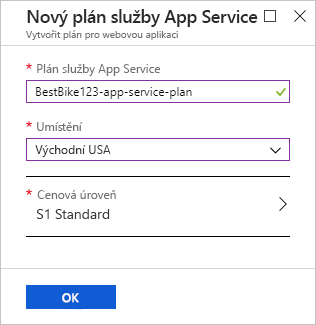
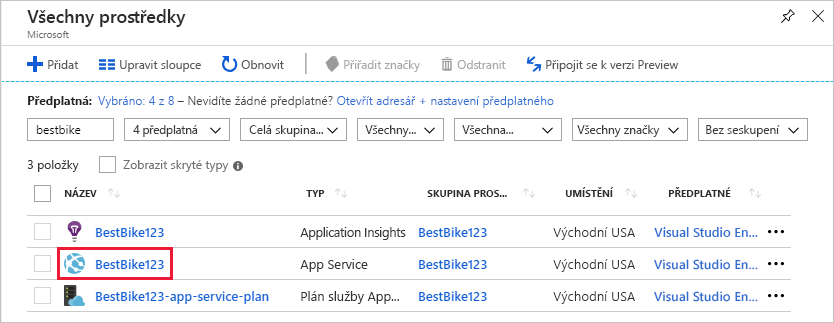
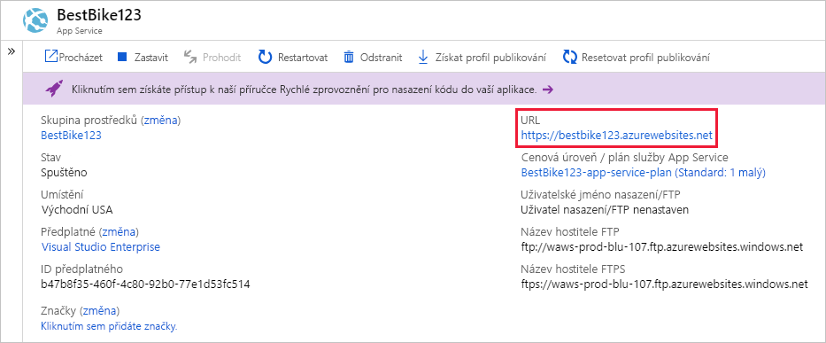

V této jednotce použijete Azure Portal k vytvoření webové aplikace.

[!include]

## Vytvoření webové aplikace

Pomocí stejného účtu, kterým jste aktivovali sandbox, se přihlaste k webu [Azure Portal](https://portal.azure.com/learn.docs.microsoft.com?azure-portal=true).

::: zone pivot="csharp"

1. V horní části levého navigačního podokna klikněte na odkaz **Vytvořit prostředek**. Všechno, co v Azure vytvoříte, je prostředek.

1. Portál vás přenese na stránku **Marketplace**. Tady můžete vyhledat prostředek, který chcete vytvořit, nebo vybrat některý z populárních prostředků, které lidé na portálu Azure Portal vytvářejí.

1. Klikněte na **Web** > **Webová aplikace**. Portál vás přesměruje na stránku **Vytvořit novou webovou aplikaci**.

1. Při vytváření nové webové aplikace si od vás Azure Portal vyžádá určité informace, aby vám mohl aplikaci vytvořit. V tomto oddílu zadejte následující základní informace:

    1. **Název aplikace**: Klient chce, aby se aplikace jmenovala `BestBike`. Zadejte do pole tento název. Tato hodnota musí být globálně jedinečná mezi všemi ostatními webovými aplikacemi hostovanými v Azure a portál zkontroluje, že tento název aplikace ještě nikdo nepoužil. Název musí být jedinečný. Proto do něj při hledání jedinečné varianty můžete přidat číslice.

    2. **Předplatné**: V tomto poli potřebujete z rozevíracího seznamu vybrat aktivní předplatné Azure. Vyberte předplatné Concierge.

    3. **Operační systém**: V tomto poli se musíte rozhodnout, jestli chcete k hostování nové webové aplikace použít **Windows** nebo **Linux**. Toto nastavení přímo ovlivňuje plán služby App Service, který později vyberete nebo vytvoříte. Pokud si pamatujete, plán služby App Service připomíná virtuální počítač, který má operační systém se všemi prostředky (procesorem, pamětí atd.) potřebnými k provozování vaší aplikace. V tomto případě váš klient preferuje hostování webové aplikace na počítači s Windows. Vyberte proto **Windows**.

    4. **Publikovat**: Můžete vybrat, že chcete kód publikovat, nebo vyberte image kontejneru Docker. Napíšete kód, který budete chtít spustit ve službě App Service, a proto vyberte možnost **Kód**.

    5. **Application Insights**: Azure Application Insights umožňuje zjišťovat a diagnostikovat problémy s kvalitou webových aplikací a webových služeb a pomáhá pochopit, co v nich uživatelé opravdu dělají. Jedním z požadavků klienta je, že chce mít možnost prohlížet sestavy o provozu na webu a sledovat trendy rostoucího a klesajícího provozu. V tomto případě zapněte Application Insights pro tuto webovou aplikaci výběrem možnosti **Zapnuto**. Po výběru možnosti **Zapnuto** budete také muset vybrat umístění nebo oblast pro ukládání dat Application Insights aplikace. Application Insights je k dispozici jen v omezeném počtu oblastí. Pro tuto ukázku vyberte některou z dostupných oblastí.

::: zone-end

::: zone pivot="node"

1. V horní části levého navigačního podokna klikněte na odkaz **Vytvořit prostředek**. Všechno, co v Azure vytvoříte, je prostředek.

1. Portál vás přenese na stránku **Marketplace**. Tady můžete vyhledat prostředek, který chcete vytvořit, nebo vybrat některý z populárních prostředků, které lidé na portálu Azure Portal vytvářejí.

1. Klikněte na **Web** > **Webová aplikace**. Portál vás přesměruje na stránku **Vytvořit novou webovou aplikaci**.

1. Při vytváření nové webové aplikace si od vás Azure Portal vyžádá určité informace, aby vám mohl aplikaci vytvořit. V tomto oddílu zadejte následující základní informace:

    1. **Název aplikace**: Klient chce, aby se aplikace jmenovala `BestBike`. Zadejte do pole tento název. Tato hodnota musí být globálně jedinečná mezi všemi ostatními webovými aplikacemi hostovanými v Azure a portál zkontroluje, že tento název aplikace ještě nikdo nepoužil. Název musí být jedinečný. Proto do něj při hledání jedinečné varianty můžete přidat číslice.

    2. **Předplatné**: V tomto poli potřebujete z rozevíracího seznamu vybrat aktivní předplatné Azure. Vyberte předplatné Concierge.

    3. **Operační systém**: V tomto poli se musíte rozhodnout, jestli chcete k hostování nové webové aplikace použít **Windows** nebo **Linux**. Toto nastavení přímo ovlivňuje plán služby App Service, který později vyberete nebo vytvoříte. Možná si ještě pamatujete, že plán služby App Service se podobá virtuálnímu počítači, který má operační systém se všemi prostředky (procesorem, pamětí RAM atd.) potřebnými ke spuštění aplikace. V tomto případě dal klient přednost hostování webové aplikace na počítači s Linuxem. Vyberte proto **Linux**.

    4. **Publikovat**: Můžete vybrat, že chcete kód publikovat, nebo vyberte image kontejneru Docker. Napíšete kód, který budete chtít spustit ve službě App Service, a proto vyberte možnost **Kód**.

    5. **Zásobník modulu runtime**: Při hostování webové aplikace v plánu služby App Service s Linuxem musíte tuto službu informovat o technologii webového serveru, na kterém běží aplikace. Jako modul runtime použijete **Node.js**. Vyberte v seznamu nejnovější verzi Node.js.

::: zone-end

::: zone pivot="java"

1. V horní části levého navigačního podokna klikněte na odkaz **Vytvořit prostředek**. Všechno, co v Azure vytvoříte, je prostředek.

1. Portál vás přenese na stránku **Marketplace**. Tady můžete vyhledat prostředek, který chcete vytvořit, nebo vybrat některý z populárních prostředků, které lidé na portálu Azure Portal vytvářejí.

1. Klikněte na **Web** > **Webová aplikace**. Portál vás přesměruje na stránku **Vytvořit novou webovou aplikaci**.

1. Při vytváření nové webové aplikace si od vás Azure Portal vyžádá určité informace, aby vám mohl aplikaci vytvořit. V tomto oddílu zadejte následující základní informace:

    1. **Název aplikace**: Klient chce, aby se aplikace jmenovala `BestBike`. Zadejte do pole tento název. Tato hodnota musí být globálně jedinečná mezi všemi ostatními webovými aplikacemi hostovanými v Azure a portál zkontroluje, že tento název aplikace ještě nikdo nepoužil. Název musí být jedinečný. Proto do něj při hledání jedinečné varianty můžete přidat číslice.

    2. **Předplatné**: V tomto poli potřebujete z rozevíracího seznamu vybrat aktivní předplatné Azure. Vyberte předplatné Concierge.

    3. **Operační systém**: V tomto poli se musíte rozhodnout, jestli chcete k hostování nové webové aplikace použít **Windows** nebo **Linux**. Toto nastavení přímo ovlivňuje plán služby App Service, který později vyberete nebo vytvoříte. Možná si ještě pamatujete, že plán služby App Service se podobá virtuálnímu počítači, který má operační systém se všemi prostředky (procesorem, pamětí RAM atd.) potřebnými ke spuštění aplikace. V tomto případě dal klient přednost hostování webové aplikace na počítači s Linuxem. Vyberte proto **Linux**.

    4. **Publikovat**: Můžete vybrat, že chcete kód publikovat, nebo vyberte image kontejneru Docker. Napíšete kód, který budete chtít spustit ve službě App Service, a proto vyberte možnost **Kód**.

    5. **Zásobník modulu runtime**: Při hostování webové aplikace v plánu služby App Service s Linuxem musíte tuto službu informovat o technologii webového serveru, na kterém běží aplikace. Naše aplikace v jazyce Java běží na webovém serveru Tomcat. Proto vyberte v seznamu **Tomcat 9.0 (JRE 8)**.

::: zone-end

## Použití skupiny prostředků sandboxu

Webová aplikace Azure musí být součástí skupiny prostředků. Vyberte **Použít existující** a zvolte <rgn>[název skupiny prostředků sandboxu]</rgn>.

## Vytvoření plánu služby App Service

V tomto poli musíte vybrat plán služby App Service potřebný k provozování vaší aplikace. Portál ve výchozím nastavení vybere poslední plán služby App Service, který jste vytvořili. Kliknutím na pole **Plán služby App Service / umístění** přejděte na stránku **Plán služby App Service**.

Kliknutím na odkaz **Vytvořit nový** přejděte na stránku **Nový plán služby App Service**. Portál vás požádá o určité informace, aby mohl vytvořit nový plán služby App Service.

1. **Plán služby App Service:** Do tohoto pole zadejte název nového plánu služby App Service. Pro tuto aplikaci zadejte stejný název webové aplikace, jaký jste vybrali dříve, ale přidejte k němu příponu `-app-service-plan`, abyste prostředek snadno odlišili od ostatních.

2. **Umístění**: V tomto poli je potřeba vybrat oblast, kde se nachází plán služby App Service. Jde vlastně o geografickou lokalitu, kde plán služby App Service vytvoří virtuální počítače potřebné ke spuštění aplikace. V tomto případě si můžete ze seznamu vybrat kteroukoli možnost.

[!include]

::: zone pivot="csharp"

3. **Cenová úroveň:** V tomto poli potřebujete vybrat velikost virtuálního počítače, který bude hostovat vaši aplikaci. Po kliknutí na znaménko **>** přejdete na stránku **Cenová úroveň**.

    Tady máte spoustu možností, ze kterých si můžete zvolit. Portál tyto možnosti seskupuje podle potřebné úrovně úlohy. K dispozici jsou tři kategorie úloh: Vývoj/testování, Produkční a Izolovaný režim. Podle požadavků aplikace, kterou chcete hostovat v Azure, vyberte odpovídající kategorii úloh. Tady vyberte v kategorii **Produkční úloha** cenovou úroveň **S1**. Kliknutím na **Použít** potvrďte vybranou cenovou úroveň.

::: zone-end

::: zone pivot="java"

3. **Cenová úroveň:** V tomto poli potřebujete vybrat velikost virtuálního počítače, který bude hostovat vaši aplikaci. Po kliknutí na znaménko **>** přejdete na stránku **Cenová úroveň**.

    Tady máte spoustu možností, ze kterých si můžete zvolit. Portál tyto možnosti seskupuje podle potřebné úrovně úlohy. K dispozici jsou tři kategorie úloh: Vývoj/testování, Produkční a Izolovaný režim. Podle požadavků aplikace, kterou chcete hostovat v Azure, vyberte odpovídající kategorii úloh. V kategorii **Produkční úloha** vyberte cenovou úroveň **P1V2**. Kliknutím na **Použít** potvrďte vybranou cenovou úroveň.

::: zone-end

Nyní jste zpět na stránce **Nový plán služby App Service**.

4. Kliknutím na tlačítko **OK** použijte svůj nový plán služby App Service.

    
   
5. Kliknutím na tlačítko **Vytvořit** zahajte proces vytváření webové aplikace.

    > [!NOTE]
    > Může to několik sekund trvat, než se vaše webová aplikace vytvoří a než bude připravená k použití.

Portál vás přesměruje na stránku řídicího panelu a dá vám vědět, až webovou aplikaci vytvoří.

Jakmile bude tato nová aplikace připravená, přejděte do ní na portálu Azure Portal.

1. V levém navigačním panelu klikněte na položku nabídky **Všechny prostředky**. Na stránce **Všechny prostředky** se zobrazí seznam všech prostředků, které máte vytvořené na portálu Azure Portal.

2. Proklikejte se aplikační službou BestBike, která pro vás byla právě vytvořena.

    > [!NOTE]
    > Pokud budete svoji aplikaci hledat podle názvu BestBike, můžete také najít prostředky Application Insights a plán služby App Service, které byly pro vaši novou webovou aplikaci vytvořeny. Proklikejte prostředek typu **App Service**.

    

Na portálu se otevře domovská stránka služby webové aplikace s vybranou volbou **Přehled**.

Pokud chcete zobrazit náhled výchozího obsahu vaší nové webové aplikace, klikněte v pravé horní části webu Azure Portal na **adresu URL**. Pokud se zobrazí zástupná webová stránka, znamená to, že jste webovou aplikaci úspěšně vytvořili.
