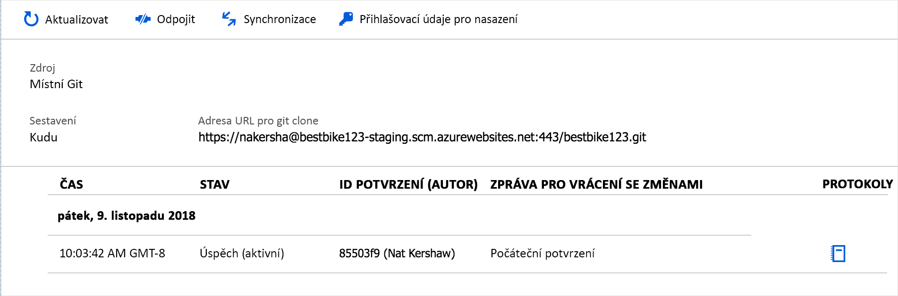
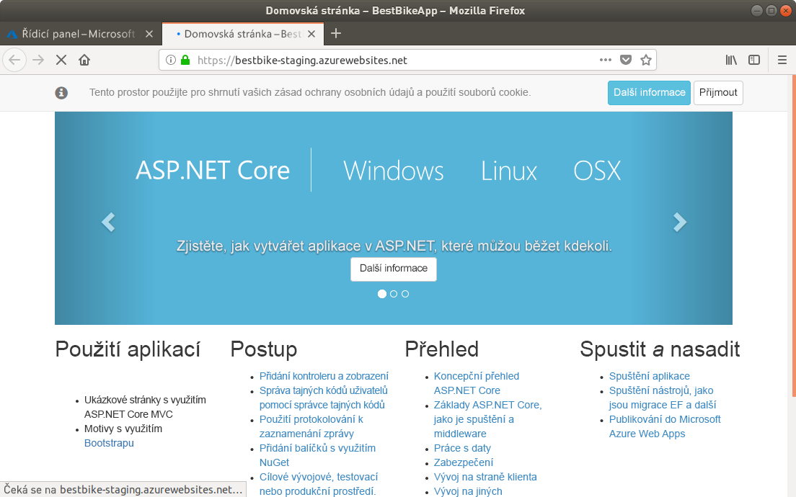

V této lekci nasadíte webovou aplikaci do služby App Service.

::: zone pivot="csharp"

## <a name="use-a-local-git-repository-as-your-deployment-option"></a>Použití místního úložiště Git jako možnosti pro nasazení

V dalším kroku nakonfigurujeme službu App Service pro nasazení v Gitu. To nám umožní nasazovat nové verze aplikace odesláním kódu do koncového bodu Gitu v Azure.

1. Na stránce s přehledem webové aplikace ve službě App Service klikněte na navigačním panelu vlevo na položku nabídky **Deployment Center**.

1. Klikněte na **Místní git**.

1. Klikněte na **Pokračovat**.

1. Klikněte na **Buildovací server App Service Kudu**.

1. Klikněte na **Dokončit**.

## <a name="create-deployment-credentials"></a>Vytvoření přihlašovacích údajů pro nasazení

Než bude možné něco nasadit s úložištěm Git, App Service vyžaduje nastavení uživatelského jména a hesla pro ověřování z klienta Git.

1. Klikněte na tlačítko **Přihlašovací údaje pro nasazení**.

1. Klikněte na **Přihlašovací údaje uživatele**.

1. Pokud je ještě prázdné, nastavte pole **Uživatelské jméno**. Nemusí být stejné jako uživatelské jméno pro účet Azure.

1. Zadejte **Heslo** podle vlastního výběru a potom ho potvrďte.

    > [!NOTE]
    > Je třeba, abyste svoje uživatelské jméno a heslo nezapomněli! Budete je potřebovat později, až náš kód začneme nahrávat a nasazovat do Azure.

1. Klikněte na **Uložit přihlašovací údaje**.

1. Poznamenejte si **identifikátor URI Git Clone**, což je adresa URL úložiště Azure Git, kterou použijete jako **vzdálené úložiště** pro vaše místní úložiště kódu aplikace.

## <a name="set-up-git-on-cloud-shell"></a>Nastavení Gitu ve službě Cloud Shell

Git je už nainstalován ve službě Azure Cloud Shell, ale určitě si budete chtít nastavit uživatelské jméno a e-mail pro svůj účet cloudového prostředí.

1. V editoru Cloud Shell vpravo zadejte následující příkazy, přičemž zástupné symboly `[your name]` a `[your email]` nahraďte svým jménem a e-mailem (bez závorek):

    ```bash
    git config --global user.name "[your name]"
    git config --global user.email "[your email]"
    ```

1. Pokud budete chtít ověřit, že se vaše údaje zaznamenaly v Gitu, zadejte následující příkaz:

    ```bash
    cat ~/.gitconfig
    ```

   Měly by se vám zobrazit následující údaje s vaším jménem a e-mailem:

    ```output
    [user]
        name = {your name}
        email = {your email}
    ```

## <a name="initialize-a-local-git-repository-for-your-code"></a>Inicializace místního úložiště Git pro váš kód

Abyste mohli Git začít používat, budete muset pro kód aplikace .NET Core inicializovat místní úložiště Git.

1. Ujistěte se, že jste ve složce projektu, kterou jste předtím vytvořili.

    ```bash
    cd ~/BestBikeApp/
    ```

1. Inicializujte nové úložiště Git zadáním následujícího příkazu:

    ```bash
    git init
    ```

    Pokud je příkaz úspěšný, zobrazí se zpráva, která bude vypadat nějak takto:

    ```output
    Initialized empty Git repository in /home/{your-user}/BestBikeApp/.git/
    ```

1. Připravte všechny soubory aplikace pro Git.

   Dalším krokem je dát Gitu vědět o vašich souborech aplikace. To provedete tak, že přidáte všechny soubory pracovního adresáře, aby je mohl Git **připravit**. Zadejte následující příkaz:

    ```bash
    git add .
    ```

    Uvedený příkaz přidá všechny soubory, které v příkazu zastupuje parametr ".", do stavu přípravy v Gitu.

1. Teď budete muset svoje změny potvrdit v Gitu.

   Až soubory pomocí Gitu připravíte, budete je muset potvrdit v **historii potvrzení Gitu** na svém místním počítači. Uděláte to tak, že zadáte následující příkaz:

    ```bash
   git commit -m "Initial commit"
    ```

   Pro příkaz `commit` je možné zadat argument `-m`, který umožňuje zahrnout zprávu s potvrzením změn, které vytváříte. Později při odesílání svého kódu do Azure uvidíte tuto zprávu uloženou u tohoto konkrétního potvrzení změn.

## <a name="add-a-remote-for-the-local-git-repository"></a>Přidání vzdáleného úložiště pro místní úložiště Git

Zatím jste úspěšně inicializovali nové místní úložiště Git. Kromě toho jste všechny soubory aplikace potvrdili v Gitu. Zbývá tedy přidat **vzdálené úložiště** pro připojení vašeho místního úložiště Git k úložišti hostovanému v Azure.

Uděláte to takto:

1. Zkopírujte **adresu URL Git Clone**, kterou jste viděli výše.

1. Po zkopírování přejděte zpátky do okna **terminálu** a zadejte následující příkaz Gitu s vaší adresou URL:

    ```bash
    git remote add origin https://BESTBIKE-git@BESTBIKE.scm.azurewebsites.net:443/BESTBIKE.git
    ```

    Výše uvedený příkaz Gitu připojí vaše místní úložiště Git s úložištěm hostovaným v Azure. Teď můžete nasadit kód jeho odesláním do úložiště.

1. Výše uvedený příkaz můžete ověřit zadáním následujícího příkazu Gitu:

    ```bash
    git remote -v
    ```

    Výše uvedený příkaz vygeneruje následující výstup:

    ```output
    origin  https://BESTBIKE-git@BESTBIKE.scm.azurewebsites.net:443/BESTBIKE.git (fetch)
    origin  https://BESTBIKE-git@BESTBIKE.scm.azurewebsites.net:443/BESTBIKE.git (push)
    ```

## <a name="push-your-code-to-azure"></a>Odeslání kódu do Azure

Teď, když máte místní úložiště Git připojené ke vzdálenému úložišti Git v Azure, budete vyvíjet a následně sestavíte aplikaci, jejíž kód potom odešlete (nasdílíte) do Azure.

1. Zadáním následujícího příkazu Gitu nasdílejte svoji **hlavní** větev do vzdáleného úložiště Git v Azure:

    ```bash
    git push origin master
    ```

1. Zobrazí se výzva k zadání hesla, které jste si poznamenali v části **Přihlašovací údaje pro nasazení** uvedené výše. Zadejte heslo a stiskněte Enter. Git spustí nahrávání potvrzených souborů do vzdáleného úložiště Git v Azure.

## <a name="verify-the-code-is-uploaded-to-azure"></a>Ověření nahrání kódu do Azure

1. Vraťte se na Azure Portal.

1. V levém navigačním panelu klikněte na položku nabídky **Všechny prostředky**.

1. Na webu Azure Portal přejděte k seznamu všech prostředků vytvořených v Azure do této chvíle.

1. Klikněte na webovou aplikaci.

1. Jakmile jste na stránce přehledu, přejděte na **Deployment Center**.

    Uvidíte, že první potvrzené soubory, které jste uložili místně na svém počítači, jsou nahrané na webu Azure Portal.

    Když kód nasdílíte (odešlete) do vzdáleného úložiště Git v App Service, Azure tuto operaci zaznamená.

    Po každém odeslání kódu do Azure se zobrazí nový záznam se zprávou o potvrzení (řetězec zadaný s argumentem `-m`), kterou jste zadali při potvrzení změn.

    ****

1. Pojďme se podívat na adresu URL aplikace. Adresu URL najdete v předchozím textu. Pokud ji zapomenete, vždycky můžete přejít na stránku **Přehled** přípravného slotu nasazení, kde ji můžete vybrat.

1. Adresu URL zadejte do adresního řádku prohlížeče.

    

Blahopřejeme! Podařilo se vám hostovat aplikaci ve službě App Service.

::: zone-end

::: zone pivot="node"

Existují dva základní způsoby, jak nahrát soubor **.zip** do webové aplikace ve službě App Service.

V prvním případě můžete k nasazení komprimované webové stránky do služby App Service použít vyhrazenou integrovanou webovou stránku. Po přechodu na adresu `https://<app_name>.scm.azurewebsites.net/ZipDeployUI` se zobrazí web, na který můžete přetáhnout místní soubor **.zip**, abyste ho nahráli na server. K přihlášení je potřeba použít stejné přihlašovací údaje k Azure, jaké jste použili k vytvoření webu. Jde o podobný postup jako při nahrávání do složky úložiště, která je namapovaná na hostitele webu, prostřednictvím protokolu FTP.

Ve druhém případě, což je i náš případ, použijeme příkazový řádek. Azure CLI obsahuje příkaz `webapp deployment` pro nahrání souboru ZIP, který obsahuje všechny soubory daného webu. Následující příkaz použijte k nahrání souboru ZIP na vytvořený web. Nezapomeňte nahradit parametr `<app_name>` a název souboru .zip:

```azurecli
az webapp deployment source config-zip --resource-group <rgn>Resource Group<rgn> --src helloworld.zip --name <app_name> 
```

Odpovědí bude blok JSON s podrobnostmi o přenosu.

```json
{
  "active": true,
  "author": "N/A",
  "author_email": "N/A",
  "complete": true,
  "deployer": "Push-Deployer",
  "end_time": "2018-12-19T18:04:13.441193Z",
  "id": "ddd8d88c04194a00a0eb7cb96766c054",
  "is_readonly": true,
  "is_temp": false,
  "last_success_end_time": "2018-12-19T18:04:13.441193Z",
  "log_url": "https://<app_name>.scm.azurewebsites.net/api/deployments/latest/log",
  "message": "Created via a push deployment",
  "progress": "",
  "received_time": "2018-12-19T18:04:09.585955Z",
  "site_name": "<app_name>",
  "start_time": "2018-12-19T18:04:09.843809Z",
  "status": 4,
  "status_text": "",
  "url": "https://<app_name>.scm.azurewebsites.net/api/deployments/latest"
}
```

Až příkaz doběhne, otevřete v prohlížeči novou kartu a přejděte na adresu `https://<app_name>.azurewebsites.net`. Uvidíte zprávu „Hello World!“, kterou zobrazí vaše úspěšně nasazená aplikace &mdash;.

::: zone-end

::: zone pivot="java"

## <a name="configure-deployment-credentials"></a>Konfigurace přihlašovacích údajů pro nasazení

Většina technik nasazení do služby App Service, včetně té, kterou jsme použili zde, vyžaduje uživatelské jméno a heslo odděleně od přihlášení k Azure. Každá webová aplikace má předem konfigurované uživatelské jméno a heslo, které můžete resetovat na novou náhodnou hodnotu, ale nemůžete je změnit na něco, co sami vyberete.

Místo hledání těchto přihlašovacích údajů pro každou aplikaci a jejich uložení na nějaké místo můžete použít funkci uživatelských přihlašovacích údajů pro nasazení, která je ve službě App Service a která vytvoří vlastní uživatelské jméno a heslo. Zvolené hodnoty budou fungovat u *všech* webových aplikací nasazených ve službě App Service, ke kterým máte oprávnění, včetně nových webových aplikací, které vytvoříte v budoucnosti. Vybrané uživatelské jméno a heslo je spojené s přihlašovacími údaji k Azure. Uživatelské jméno a heslo smíte použít jenom vy, a proto nesdílejte tyto údaje s ostatními. Uživatelské jméno i heslo můžete kdykoliv změnit.

Nejjednodušší způsob, jak vytvořit přihlašovací údaje pro nasazení je z Azure CLI. V Cloud Shellu spusťte následující příkaz, kterým nastavíte přihlašovací údaje. Proměnné `<username>` a `<password>` nahraďte hodnotami, které jste vybrali.

```azurecli
az webapp deployment user set --user-name <username> --password <password>
```

## <a name="deploy-the-application-package-with-wardeploy"></a>Nasazení balíčku aplikace mechanismem wardeploy

**Wardeploy** je mechanismus nasazení balíčku do služby App Service, který je speciálně určený k nasazení balíčku souborů webové aplikace WAR do webových aplikací v jazyce Java. Wardeploy je součástí rozhraní Kudu REST API, což je rozhraní služby pro správu, které je dostupné u všech webových aplikací ve službě App Service, ke kterým můžete přistupovat přes HTTP. Wardeploy můžete jednoduše použít z příkazového řádku nástrojem HTTP `curl`.

Pokud chcete k nasazení aplikace použít wardeploy, spusťte následující příkazy. Proměnné `<username>` a `<password>` nahraďte uživatelským jménem a heslem uživatele, který provádí nasazení (vytvořili jste ho v předchozím kroku). Místo `<web_app_name>` použijte název webové aplikace.

```console
cd ~/helloworld/target
curl -v -X POST -u <username>:<password> https://<sitename>.scm.azurewebsites.net/api/wardeploy --data-binary @helloworld.war
```

Až příkaz doběhne, otevřete v prohlížeči novou kartu a přejděte na adresu `https://<web_app_name>.azurewebsites.net`. Uvidíte zprávu „Hello World!“ vaší úspěšně nasazené aplikace &mdash;.

::: zone-end