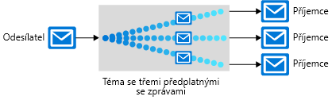

Existuje řada komunikačních platforem, které můžou zlepšit spolehlivost distribuované aplikace, včetně několika přímo v Azure. Každý z těchto nástrojů slouží jinému účelu. Pojďme se podívat na jednotlivé nástroje v Azure, abychom vám pomohli zvolit ten správný.

Architektura naší aplikace pro objednávky a sledování doručení pizzy vyžaduje několik komponent: web, úložiště dat, back-endovou službu atd. Komponenty naší aplikace můžeme svázat různými způsoby. Zároveň může jedna aplikace využívat několik technik. 

Musíme se rozhodnout, které techniky použít v aplikaci Contoso Slices. Prvním krokem je posoudit všechna místa, kde dochází ke komunikaci mezi několika částmi. Aby naše aplikace vůbec mohla fungovat, některé komponenty se _musí_ spouštět včas a rychle. Některé můžou být důležité, ale nevyžaduje se u nich rychlá odezva. Ostatní komponenty, jako oznámení naší mobilní aplikace, jsou spíše volitelné.

V tomto článku se seznámíte s dostupnými komunikačními platformami v Azure, abyste pro každou potřebu vaší aplikace mohli zvolit tu správnou.

## Rozhodnutí mezi zprávami a událostmi

Zprávy i události jsou **datagramy** – balíčky dat posílané z jedné komponenty do druhé. Jsou mezi nimi na první pohled drobné rozdíly, které však můžou zásadním způsobem ovlivnit navrhování aplikací.

### Zprávy

V terminologii distribuovaných aplikací je definující charakteristika zprávy taková, že na přijímaných zprávách může záviset celkoví integrita aplikace. Odeslání zprávy si můžete představit jako jednu komponentu předávající štafetu pracovního postupu jiné komponentě. Celý pracovní postup může představovat důležitý obchodní proces a zpráva je pojidlo, které drží komponenty pohromadě.

Zpráva obvykle obsahuje samotná data, ne jenom odkaz (např. ID nebo adresu URL) na data. Odeslání dat v rámci datagramu není tak náchylné jako odeslání odkazu. Architektura zasílání zpráv zaručuje doručení zprávy, a protože už není potřeba žádné další hledání, zpráva se spolehlivě zpracuje. Odesílající aplikace však potřebuje přesně vědět, jaká data má zpráva obsahovat, aby neodesílala příliš mnoho dat, která by musela přijímající komponenta zbytečně zpracovávat. Z tohoto důvodu často odesílatele a příjemce zprávy spojuje striktní kontrakt dat.

V nové architektuře aplikace Contoso Slices by tato společnost při zadání objednávky pizzy pravděpodobně použila zprávy. Webový front-end nebo mobilní aplikace by zprávu odeslaly ke zpracování do back-endových komponent. Na straně back-endu by se provedly kroky jako přesměrování do obchodu v blízkosti zákazníka a účtování platební karty.

### Události

Událost aktivuje upozornění, že se něco stalo. Události nejsou tak objemné jako zprávy a nejčastěji se používají pro komunikaci s všesměrovým vysíláním.

Události mají následující vlastnosti:

* Událost se může odeslat více příjemcům nebo žádnému příjemci.
* Události jsou často určené k větvení nebo mají pro každého vydavatele velký počet odběratelů.
* Vydavatel události nemá žádná očekávání ohledně toho, co má provést přijímající komponenta.

Náš řetězec pizzerií by pravděpodobně použil události k oznamování změn stavu objednávky uživatelům. Události změny stavu by se mohly odeslat do služby Azure Event Grid, pak do Azure Functions a nakonec do center oznámení Azure. Tím by se zajistilo zcela _bezserverové_ řešení.

Rozdíl mezi událostmi a zprávami je zásadní, protože komunikační platformy jsou obecně určené ke zpracování buď událostí, nebo zpráv. Služba Service Bus je určená ke zpracování zpráv. Pokud chcete odesílat události, pravděpodobně zvolíte Event Grid.

Azure nabízí také službu Azure Event Hubs, která se však nejčastěji používá pro konkrétní typ vysokorychlostní komunikace, která slouží k analýzám. Kdybychom například měli na pecích na pizzu síťově propojené senzory, mohli bychom pomocí Event Hubs a Azure Stream Analytics sledovat vzorce změn teploty, které by mohly značit příliš velký oheň nebo opotřebení součástek.

## Témata, fronty a přenosy služby Service Bus

Azure Service Bus umožňuje výměnu zpráv třemi různými způsoby: frontami, tématy a přenosy.

### Co je fronta?

**Fronta** je jednoduché dočasné umístění úložiště pro zprávy. Odesílající komponenta přidá zprávu do fronty. Cílová komponenta zprávu načte ze začátku fronty. Za normálních okolností každou zprávu přijme jen jeden příjemce.

Fronty oddělují zdrojové a cílové komponenty za účelem izolace cílových komponent od vysokého zatížení. 

Během špiček můžou zprávy přicházet rychleji, než je cílové komponenty dokážou zpracovávat. Protože zdrojové komponenty nemají žádné přímé připojení k cíli, zdroj to neovlivní a fronta se bude zvětšovat. Cílové komponenty budou zprávy odebírat z fronty rychlostí, jakou je dokážou zpracovávat. Až poptávka klesne, můžou cílové komponenty dohánět resty a fronta se bude zkracovat.

Fronta tímto způsobem reaguje na vysokou poptávku, aniž byste do systému museli přidávat prostředky. V případě zpráv, které je potřeba zpracovat poměrně rychle, však můžete přidáním dalších instancí cílové komponenty umožnit sdílení zatížení. Každou zprávu by zpracovávala pouze jedna instance. Jedná se o účinný způsob, jak škálovat celou aplikaci přidáváním prostředků pouze do komponent, které je skutečně potřebují.

### Co je téma?

**Téma** se podobá frontě, ale může mít několik odběrů. To znamená, že se k odběru jednoho tématu může přihlásit několik cílových komponent, takže se každá zpráva doručí několika příjemcům. Odběry také můžou filtrovat zprávy v tématu a přijímat pouze relevantní zprávy. Odběry poskytují stejnou oddělenou komunikaci jako fronty a stejným způsobem reagují na vysokou poptávku. Téma použijte, pokud chcete každou zprávu doručit do více než jedné cílové komponenty.

Témata se nepodporují v cenové úrovni Basic.

### Co je přenos?

**Přenos** je objekt, který poskytuje synchronní obousměrnou komunikaci mezi aplikacemi. Na rozdíl od front a témat nejde o dočasné umístění úložiště pro zprávy. Místo toho poskytuje obousměrná připojení bez vyrovnávací paměti přes hranice sítí, jako jsou brány firewall. Přenosy použijte, pokud chcete směrovat komunikaci mezi komponentami, jako by se nacházely ve stejném segmentu sítě, ale byly oddělené zařízeními zabezpečení sítě.

> [!NOTE]
> Přestože jsou přenosy součástí služby Azure Service Bus, neimplementují volně svázané pracovní postupy zasílání zpráv a tento modul se jim dále nevěnuje.

## Fronty služby Service Bus a fronty služby Storage

Existují dvě funkce Azure, které obsahují fronty zpráv: služba Service Bus a účty Azure Storage. Obecně platí, že fronty služby Storage se snadněji používají, ale jsou méně sofistikované a flexibilní než fronty služby Service Bus.

Mezi hlavní výhody front služby Service Bus patří:

* Podporuje větší velikost zpráv (256 kB na zprávu oproti 64 kB)
* Podporuje aspoň jedno doručení i nanejvýš jedno doručení – máte na výběr mezi velmi malou šancí, že se zpráva ztratí, a velmi malou šancí, že se zpráva zpracuje dvakrát.
* Zaručuje pořadí metodou **první dovnitř, první ven (FIFO, First-In-First-Out)** – zprávy se zpracují ve stejném pořadí, v jakém se přidaly (i když je metoda FIFO normální operace fronty, nezaručuje se pro všechny zprávy).
* Dokáže seskupit několik zpráv do transakce – pokud se nepodaří doručit jednu zprávu v transakci, nedoručí se žádné zprávy v transakci.
* Podporuje zabezpečení na základě role
* Nevyžaduje, aby cílové komponenty neustále odesílaly dotazy na frontu.

Výhody front služby Storage:

* Podporuje neomezenou velikost front (oproti 80 GB pro fronty služby Service Bus).
* Udržuje protokol všech zpráv.

## Jak zvolit komunikační technologii

Podívali jsme se na různé koncepty a implementace, které Azure nabízí. Teď probereme, jak by měl vypadat náš rozhodovací proces u našich jednotlivých případů komunikace.

#### Zvažte následující otázky:

1. Představuje komunikace událost? Pokud ano, zvažte službu Event Grid nebo Event Hubs.

1. Měla by se jedna zpráva doručit do více než jedno cíle? Pokud ano, použijte téma služby Service Bus. Jinak použijte frontu.

Pokud se rozhodnete, že potřebujete frontu:

#### Fronty služby Service Bus si vyberte v případě, že:

* Potřebujete záruku nanejvýš jednoho doručení.
* Potřebujete záruku FIFO.
* Potřebujete seskupovat zprávy do transakcí.
* Chcete dostávat zprávy bez dotazování fronty.
* Potřebujete na fronty uplatnit řízení přístupu na základě role.
* Potřebujete zpracovávat zprávy větší než 64 kB, ale menší než 256 kB.
* Velikost fronty nepřekročí 80 GB.
* Chcete mít možnost publikovat a používat dávky zpráv.

#### Queue Storage si vyberte v případě, že:

* Potřebujete jednoduchou frontu bez dalších konkrétních požadavků.
* Potřebujete protokol auditu pro všechny zprávy, které projdou frontou.
* Očekáváte, že bude fronta větší než 80 GB.
* Chcete sledovat průběh zpracování zprávy ve frontě.

I když mezi sebou můžou komponenty distribuované aplikace komunikovat přímo, často můžete zvýšit spolehlivost této komunikace tak, že použijete zprostředkující komunikační platformy, jako je Azure Service Bus nebo Azure Event Grid.

Služba Event Grid je určená pro události, které příjemce události pouze upozorní a neobsahují nezpracovaná data související s danou událostí. Azure Event Hubs je služba určená pro vysokorychlostní události analytického typu. Fronty služby Azure Service Bus a fronty služby Storage jsou určené pro zprávy, pomocí kterých je možné provázat základní části jakéhokoli pracovního postupu aplikace.

Pokud máte jednoduché požadavky, pokud chcete odeslat každou zprávu pouze do jednoho cíle nebo pokud chcete psát kód co nejrychleji, může být nejlepší možností fronta služby Storage. Jinak fronty služby Service Bus poskytují mnohem více možností a větší flexibilitu.

Pokud chcete odesílat zprávy více odběratelům, použijte téma služby Service Bus.
