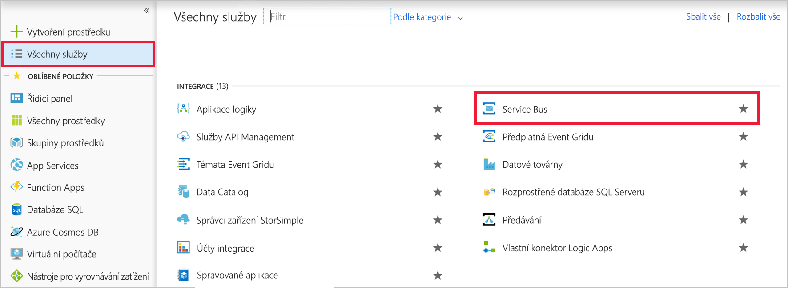
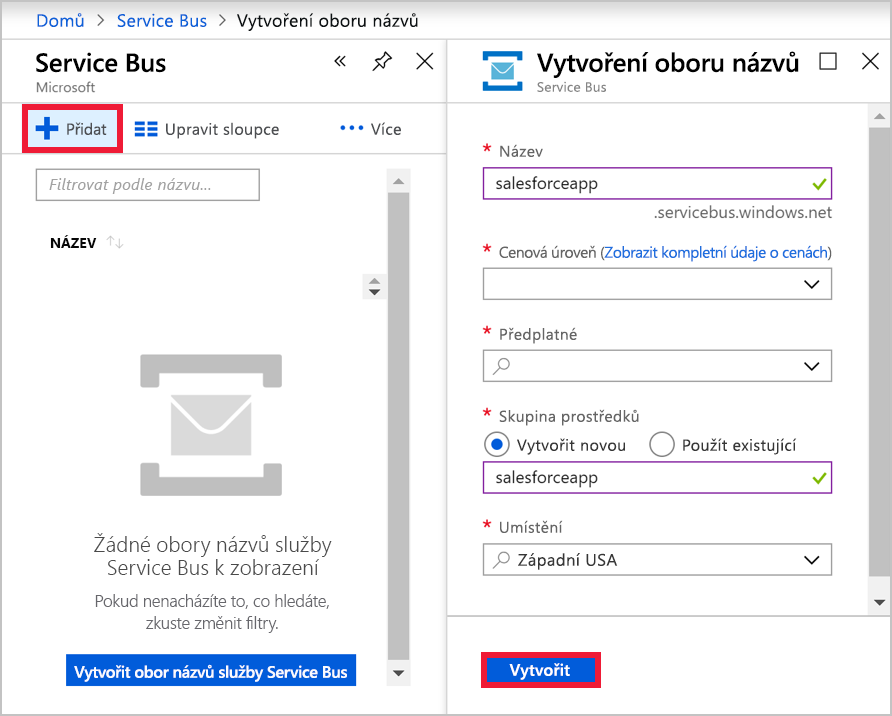
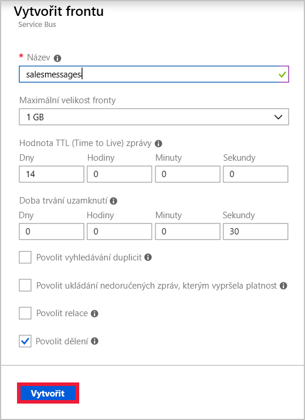
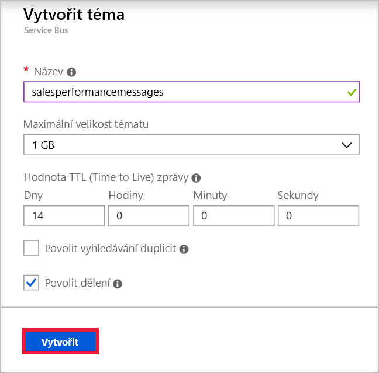

Předpokládejme, že máte aplikaci pro prodejní tým ve vaší globální společnosti. Každý člen týmu má mobilního telefonu, kam se aplikace nainstaluje. Webová služba hostovaná v Azure implementuje obchodní logiku pro vaši aplikaci a ukládá informace v Azure SQL Database. Existuje jedna instance webové služby pro každou geografickou oblast. Určili jste tyto účely pro zasílání zpráv mezi mobilní aplikací a webovou službou:

- Zprávy, které se týkají jednotlivých prodejů, se musí odesílat jenom do instance webové služby v oblasti uživatele.
- Zprávy, které se týkají prodejní výkonnosti, se musí odesílat do všech instancí webové služby.

Pro první případ použití jste se rozhodli implementovat frontu Service Busu a pro druhý případ pak téma Service Busu.

[!include]

V tomto cvičení vytvoříte obor názvů Service Busu, který bude obsahovat frontu i téma s odběry.

## Vytvoření oboru názvů Service Busu

Obor názvů v Azure Service Busu je kontejner s jedinečným plně kvalifikovaným názvem domény pro fronty, témata a přenosy. Nejprve je potřeba vytvořit obor názvů.

Každý obor názvů má primární a sekundární šifrovací klíče sdíleného přístupového podpisu. Odesílající nebo přijímající komponenta musí při připojení tyto klíče poskytnout, aby získala přístup k objektům v rámci oboru názvů.

Pokud chcete vytvořit obor názvů služby Service Bus pomocí webu Azure Portal, postupujte podle těchto kroků:

1. Přihlaste se k webu [Azure Portal](https://portal.azure.com/learn.docs.microsoft.com?azure-portal=true).

1. V levé navigační nabídce klikněte na **Všechny služby**.

1. V okně **Všechny služby** se posuňte dolů do části **INTEGRACE** a pak klikněte na **Service Bus**.

    

1. V levém horním rohu okna **Service Bus** klikněte na **Přidat**.

1. Do textového pole **Název** zadejte jedinečný název oboru názvů. Například „salesteamapp“ + *vaše iniciály* + *aktuální datum*.

1. V rozevíracím seznamu **Cenová úroveň** vyberte **Standard**.

1. V rozevíracím seznamu **Předplatné** vyberte své předplatné (Předplatné Concierge).

1. V části **Skupina prostředků** vyberte **Použít existující** a zvolte <rgn>[název skupiny prostředků sandboxu]</rgn>.

1. V rozevíracím seznamu **Umístění** vyberte umístění ve vaší blízkosti (z níže uvedeného seznamu).

    [!include]

1. Kliknutím na **Vytvořit** vytvoříte obor názvů služby Service Bus.

    

## Vytvoření fronty Service Busu

Teď, když máte obor názvů, můžete vytvořit frontu pro zprávy o jednotlivých prodejích. Postupujte přitom takto:

1. V okně **Service Bus** klikněte na **Aktualizovat**. Zobrazí se právě vytvořený obor názvů.

1. Klikněte na právě vytvořený obor názvů.

1. V levém horním rohu okna oboru názvů klikněte na **+ Fronta**.

1. V okně **Vytvořit frontu** do textového pole **Název** zadejte **salesmessages** a pak klikněte na **Vytvořit**. Azure vytvoří frontu ve vašem oboru názvů.

    

## Vytvoření tématu Service Busu a odběrů

Musíte také vytvořit téma, které se použije pro zprávy týkající se prodejní výkonnosti. Toto téma bude odebírat více instancí webové služby obchodní logiky z různých zemí. Každá zpráva se doručí do více instancí.

Postupujte takto:

1. V okně **Obor názvů služby Service Bus** klikněte na **+ Téma**.

1. V okně **Vytvořit téma** do textového pole **Název** zadejte **salesperformancemessages** a pak klikněte na **Vytvořit**. Azure vytvoří téma ve vašem oboru názvů.

    

1. Po vytvoření tématu v okně **Obor názvů služby Service Bus** v části **Entity** klikněte na **Témata**.

1. V seznamu témat klikněte na **salesperformancemessages** a pak klikněte na **+ Odběr**.

1. Do textového pole **Název** zadejte **Americas** a pak klikněte na **Vytvořit**.

1. Klikněte na **+ Odběr**.

1. Do textového pole **Název** zadejte **EuropeAndAfrica** a pak klikněte na **Vytvořit**.

Vytvořili jste infrastrukturu potřebnou pro využití služby Service Bus ke zvýšení odolnosti vaší aplikace distribuované prodejcům. Vytvořili jste frontu pro zprávy o jednotlivých prodejích a téma pro zprávy o prodejní výkonnosti. Téma obsahuje více odběrů, protože zprávy odesílané do tématu se můžou doručovat více přijímajícím webovým službám po celém světě.
