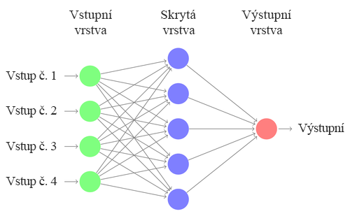
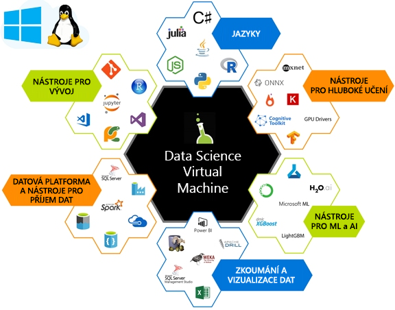

Cílem strojového učení (ML) je najít funkce pro trénování modelu, který transformuje vstupní data (například obrázky, časové řady nebo zvuk) na daný výstup (například titulky, cenové hodnoty, přepisy). U tradičních datových věd se funkce často vytvářejí ručně. Tyto ručně vytvářené funkce jsou předány do algoritmu učení bez podstruktury, jako například sítě znázorněné v následujícím diagramu. 

V případě hloubkového učení se postup extrakce funkcí učí vyjádřením vstupů jako vektorů a jejich transformací na daný výstup pomocí řady chytrých lineární algebraických operací.  Výstup modelu je porovnán s očekávaným výstupem pomocí rovnice, které se říká ztrátová funkce. Hodnota vrácená ztrátovou funkcí každého trénovacího vstupu se používá k navádění modelu při extrahování funkcí, jehož výsledkem bude nižší hodnota ztráty při dalším průchodu. Tento proces se nazývá *školení*. 

Tyto algoritmy se prostřednictvím školení naučí nejvýkonnější a nejvhodnější funkce pro danou sadu dat. Nazývají se hloubkové kvůli počtu vrstev v síti.  

Řady maticových operací, které jsme vypočítali jako součást lineární algebraické komponenty, jsou výpočetně náročné. Tyto operace mohou být často zpracovány paralelně, díky čemuž jsou skvělými kandidáty pro specializované výpočty, jako je například grafické procesory (GPU) pro efektivní výpočet.

Nastavení prostředí k provedení hloubkového učení je netriviální. Co je nastavení hardwaru, musíte trénovat svůj model pomocí CPU nebo GPU, a kolik paměti by měly mít tyto počítače? K vytvoření a trénování hloubkového učení sítě je nutné mít nainstalovaný správný software. Máte řadu architektur hloubkového učení, ze kterých můžete vybírat, ale musíte tak činit s vědomím závislostí mezi jednotlivé komponentami. Po všech těchto nastaveních můžete najít skvělý model vytvořený v jiné architektuře, který byste chtěli vyzkoušet. Nechcete režii k získání nové architektury hloubkového učení se všemi jejími závislostmi nastavenými na vašem počítači. Data Science Virtual Machine může tyto problémy pomoct vyřešit. 

## Co je Data Science Virtual Machine (DSVM)?

Data Science Virtual Machine je image virtuálního počítače (VM) v Azure. Ten obsahuje mnoho oblíbených nástrojů pro datovou vědu a hloubkové učení, které jsou již nainstalovány a nakonfigurovány. Tyto image jsou dostupné s oblíbenou datovou vědou a nástroji k strojovému učení, včetně Microsoft R Server Developer Edition, Microsoft R Open, Anaconda Python, Julia, Jupyter Notebook, Visual Studio Code, RStudio, xgboost a mnoho dalších.  Místo zavádění srovnatelného pracovního prostoru vlastními silami můžete zřídit DSVM a tím si ušetřit mnoho času s instalací, konfigurací a správou balíčků. Po nasazení DSVM můžete okamžitě začít pracovat na svém projektu datové vědy.

DSVM můžete využít pro tréninkový model s použitím algoritmů hloubkového učení na hardwaru založeného na grafickém procesoru (GPU). S využitím možností škálování virtuálního počítače v cloudu Azure vám DSVM umožňuje používat hardware založený na GPU v cloudu podle potřeby. Při tréninku velkých modelů nebo potřebě vysokorychlostních výpočtů je možné přepnout na virtuální počítač založený na GPU a stále zůstat na stejném disku s operačním systémem. Verze Windows Serveru 2016 DSVM je dodávána s předinstalovanými ovladači GPU, architekturami a verzemi GPU architektur hloubkového učení. Na Linuxu je hloubkové učení na GPU povoleno jak na virtuálním počítači pro datovou vědu CentOS, tak i Ubuntu. Edici 2016 virtuálního počítače pro datové vědy pro Ubuntu, CentOS nebo Windows můžete také nasadit na virtuální počítače Azure, který je založený na CPU. V takovém případě všechny architektury hloubkového učení přejdou do režimu procesoru. 

Další informace o tom, co můžete dělat s DSVM, najdete v tématu [datové vědy Data Science Virtual Machine s Linuxem v Azure](https://docs.microsoft.com/azure/machine-learning/data-science-virtual-machine/linux-dsvm-walkthrough)

