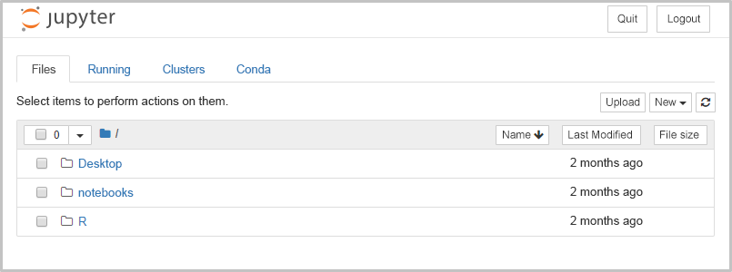

Jako vývojář softwaru máte ve společnosti příležitost rozvíjet své dovednosti a stát se členem interního týmu zaměřeného na AI. Pustili jste se do této zajímavé nové role, ale stále máte svou každodenní práci. Od vedoucího technického týmu AI jste se dozvěděli o užitečných poznámkových blocích Jupyter s cvičeními založenými na knihovně PyTorch určenými k trénování modelu klasifikace obrázků. Zajímalo by vás to, ale nechcete na svůj vývojový počítač instalovat sadu rozhraní. Proto se rozhodnete vytvořit virtuální počítač založený na imagi Data Science Virtual Machine (DSVM). 

[!include[](../../../includes/azure-sandbox-activate.md)]

## <a name="what-is-the-azure-cli"></a>Co je Azure CLI

Azure CLI je nástroj příkazového řádku od Microsoftu pro správu prostředků Azure, který je určený pro různé platformy. Je k dispozici pro macOS, Linux a Windows a také v prohlížeči prostřednictvím [Azure Cloud Shellu](https://docs.microsoft.com/azure/cloud-shell/overview). Veškeré informace o používání tohoto nástroje najdete v modulu o **řízení služeb Azure pomocí CLI**.

## <a name="managing-deployments"></a>Správa nasazení

V Azure CLI je příkaz `az group deployment`, který slouží ke správě nasazení Azure Resource Manageru. K provedení konkrétních úkolů použijeme různé podpříkazy. Nejčastější příkazy:

| Podpříkaz | Popis |
|-------------|-------------|
| `create` | Spustí nasazení. |
| `list` | Získá všechna nasazení skupiny prostředků. |
| `export` | Exportuje šablonu použitou k nasazení. |

Seznam všech dostupných příkazů pro nasazení najdete v [referenčních informacích k příkazu az group deployment](https://docs.microsoft.com/cli/azure/group/deployment?view=azure-cli-latest#az-group-deployment-create).

Ke zřízení virtuálního počítače použijeme příkaz `az group deployment create`.

## <a name="create-a-json-deployment-parameters-file"></a>Vytvoření souboru JSON s parametry nasazení

K vytvoření virtuálního počítače použijeme šablonu Azure Resource Manageru. Tato šablona definuje imagi virtuálního počítače DSVM s Linuxem, který chceme zřídit. Do šablony musíme zadat některé parametry, jako je velikost používaného virtuálního počítače, uživatelské jméno a heslo správce a název hostitele počítače. 

1. V Azure Cloud Shellu (v této lekci napravo) spusťte následující příkaz:

    ```azurecli
    code .
    ```
    <!-- TODO add a link to official doc that explains the built-in editor when it becomes available --> Tento příkaz otevře v integrovaném editoru prázdný soubor. 

1. Do prázdného souboru v editoru kódu vložte následující fragment kódu JSON.

    ```json
    { 
      "$schema": "https://schema.management.azure.com/schemas/2015-01-01/deploymentParameters.json#",
      "contentVersion": "1.0.0.0",
      "parameters": {
         "adminUsername": { "value" : "<USERNAME>"},
         "adminPassword": { "value" : "<PASSWORD>"},
         "vmName": { "value" : "<HOSTNAME>"},
         "vmSize": { "value" : "Standard_DS2_v2"},
      }
    }
    ```

1. V kódu JSON, který jste vložili do editoru, aktualizujte následující parametry:

    |Parametr  |Aktuální hodnota  |Vaše hodnota  |
    |---------|---------|---------|
    |adminUsername     |  `<USERNAME>`       |    Zvolte jméno správce tohoto nového počítače, například *azuser*.     |
    |adminPassword     |  `<PASSWORD>`       |   Zvolte heslo k tomuto účtu správce. Další informace o požadavcích na heslo najdete v [nejčastějších dotazech k virtuálním počítačům s Linuxem](https://docs.microsoft.com/azure/virtual-machines/linux/faq?azure-portal=true).     |
    |vmName     |   `<HOSTNAME>`      |  Zvolte název nového virtuálního počítače. Název musí začínat písmenem a smí obsahovat jenom malá písmena a číslice. Zvolený název by měl být jedinečný. Může obsahovat třeba vaše iniciály a rok narození. |
    |vmSize     |  Standard_DS2_v2       |  V tomto cvičení stačí použít tuto velikost, ale můžete ji změnit. Seznam dostupných velikostí virtuálních počítačů najdete v článku o [velikostech virtuálních počítačů s Linuxem v Azure](https://docs.microsoft.com/azure/virtual-machines/linux/sizes?azure-portal=true)       |

1. Klikněte na symbol tří teček (**...**) v pravé horní části editoru, pak z nabídky vyberte **Uložit**. Tím soubor uložíte jako `parameter_file.json`. Potom textový editor zavřete.

    > [!IMPORTANT]
    > Zapamatujte si hodnoty adminUsername, adminPassword a vmName. Budeme je používat v tomto cvičení.

## <a name="create-a-resource-group"></a>Vytvoření skupiny prostředků 

> [!IMPORTANT]
> Normálně byste vytvořili skupinu prostředků v oblasti, kterou si sami vyberete. Ale aktuální relace sandboxu doplní skupinu prostředků, kterou můžete použít. Skupina prostředků pro tuto relaci je **<rgn>[Název skupiny prostředků sandboxu]</rgn>**.

## <a name="deploy-the-dsvm-to-your-resource-group"></a>Nasazení virtuálního počítače DSVM do skupiny prostředků

Máme skupinu prostředků a v souboru `parameter_file.json` jsme definovali parametry šablony Resource Manageru virtuálního počítače DSVM. Teď spustíme příkaz `az group deployment create`, abychom zřídili virtuální počítač.

1. V Azure Cloud Shellu spusťte následující příkaz:

    ```azurecli
    az group deployment create \
    --resource-group  <rgn>[sandbox resource group name]</rgn> \
    --template-uri https://raw.githubusercontent.com/Azure/DataScienceVM/master/Scripts/CreateDSVM/Ubuntu/azuredeploy.json \
    --parameters parameter_file.json
    ```

    [!include[](../../../includes/azure-cloudshell-copy-paste-tip.md)]

    Příkaz použije šablonu Resource Manageru s našimi parametry a vytvoří z nich v naší skupině prostředků virtuální počítač. 

2. Nasazení virtuálního počítače zabere několik minut. Kromě informace ` - Running ..`, která se zobrazí na konzole, se až do konce operace nic dalšího nezobrazí. Jakmile operací skončí, zobrazí se na obrazovce odpověď JSON. Posuňte se až na konec kódu JSON a zkontrolujte, jestli je v poli **provisioningState** hodnota *Succeeded*.

    > [!TIP]
    > Pokud se zobrazí chybová zpráva, že záznam DNS už použila jiná veřejná IP adresa, zkuste změnit hodnotu **vmName** v souboru `parameter_file.json` na jiný název, který je jedinečný.

3. Informace o virtuálním počítači získáte spuštěním následujícího příkazu. Název `<HOSTNAME>` nahraďte názvem hostitele svého virtuálního počítače, který jste definovali.

    ```azurecli
    az vm show -d \
    --name <HOSTNAME> \
    --resource-group <rgn>[sandbox resource group name]</rgn> \
    --output table
    ```

    Tímto příkazem zobrazíte stav virtuálního počítače. Pole **PowerState** pole by mělo mít hodnotu *Virtuální počítač je v provozu*. Později se v tomto cvičení budeme připojovat k virtuálnímu počítači pomocí IP adresy v poli **PublicIps**. Můžeme se také připojit pomocí plně kvalifikovaného názvu domény (FQDN), který se tady zobrazí v poli **Fqdns**.

Blahopřejeme! Vytvořili a nasadili jste virtuální počítač s Linuxem, který je založený na imagi DSVM.

## <a name="open-the-vm-to-ssh-traffic-on-port-22"></a>Otevření provozu SSH na portu 22 virtuálního počítače

Ve výchozím nastavení nemá virtuální počítač otevřené žádné porty. Naším cílem je připojovat se vzdáleně. Spusťte server Jupyter Notebook a pak na počítači spusťte další místní příkazy. Abychom se k virtuálnímu počítači mohli vzdáleně připojovat protokolem Secure Shell (SSH), potřebujeme otevřít port. Protokol SSH má výchozí port 22.  

1. V Azure Cloud Shellu spusťte následující příkaz, ve kterém nahradíte `<HOSTNAME>` názvem svého virtuálního počítače, který jste mu dali při nastavení. 

    ```azurecli
    az vm open-port \
    -g <rgn>[sandbox resource group name]</rgn> \
    -n <HOSTNAME> \
    --port 22 \
    --priority 900
    ```

Dokončení příkazu může trvat až minutu. Po dokončení příkazu vrátí příkazový řádek odpověď JSON. Zkontrolujte, jestli je v poli **provisioningState** hodnota *Succeeded* (Úspěšné). Za chvíli otestujeme SSH, ale napřed otevřeme ještě jeden port.

## <a name="open-the-vm-to-access-the-jupyter-notebook-server-remotely"></a>Otevření virtuálního počítače pro vzdálený přístup k serveru Jupyter Notebook

Řekli jsme si, že image DSVM obsahuje předem nainstalovaný software, nástroje a ukázky, které vám pomůžou s datovou vědou, strojovým učením a projekty hloubkového učení. V imagi je nainstalovaný Jupyter a ukázkové poznámkové bloky. Na virtuálním počítači chceme spustit server Jupyter Notebook a pak se k němu chceme připojit z místního počítače. Ve výchozím nastavení je server poznámkového bloku spuštěný na portu 8888. Abychom mohli k serveru vzdáleně přistupovat, potřebujeme na virtuálním počítači tento port otevřít. 

1. V Azure Cloud Shellu spusťte následující příkaz, ve kterém nahradíte `<HOSTNAME>` názvem svého virtuálního počítače DSVM, který jste mu dali při nastavení.

    ```azurecli
    az vm open-port \
    -g <rgn>[sandbox resource group name]</rgn> \
    -n <HOSTNAME> \
    --port 8888 \
    --priority 901
    ```

Také v tomto případě může dokončení příkazu trvat až minutu. Po dokončení příkazu vrátí příkazový řádek odpověď JSON. Zkontrolujte, jestli je v poli **provisioningState** hodnota *Succeeded* (Úspěšné).  

## <a name="connect-to-the-vm-with-secure-shell-ssh"></a>Připojení k virtuálnímu počítači protokolem Secure Shell (SSH)

1. V Azure Cloud Shellu spusťte následující příkaz, který najde veřejnou IP adresu virtuálního počítače. Místo názvu `<HOSTNAME>` zadejte název virtuálního počítače DSVM, který jste mu dali při nastavení.

    ```azurecli
    az vm list-ip-addresses \
    -g <rgn>[sandbox resource group name]</rgn> \
    -n <HOSTNAME> \
    --output table
    ```

1. V Cloud Shellu spusťte následující příkaz, kterým se přihlásíte k virtuálnímu počítači. Místo jména `<USERNAME>` zadejte uživatelské jméno, které jste si vybrali na začátku tohoto cvičení. Adresu `<IP>` nahraďte hodnotou ze sloupce **PublicIPAddresses** v předchozím kroku.

    Například pokud jste jako své uživatelské jméno použili *azuser* a adresa PublicIPAddresses má hodnotu 33.165.103.23, bude příkaz vypadat takto:
    
    `ssh azuser@33.165.103.23`
    
    ```azurecli 
    ssh <USERNAME>@<IP>
    ``` 

1. Jakmile se zobrazí výzva, zadejte heslo správce, které jste vybrali na začátku tohoto cvičení. Po úspěšném přihlášení by se formát řádku měl změnit na `username@hostname`, například `azuser@js1982`.

V dalším kroku spustíte na svém virtuálním počítači server s Poznámkovým blokem Jupyter a vzdáleně otevřete poznámkový blok.

## <a name="start-the-jupyter-notebook-server-on-the-vm"></a>Spuštění serveru Jupyter Notebook na virtuálním počítači

Na virtuálním počítači je ve složce `~/notebooks` sada poznámkových bloků. Pokud ještě jste připojení k relaci SSH, spusťte server s poznámkovým blokem a otevřete jeden z těchto poznámkových bloků, abyste ověřili, že všechno funguje.


1. Na příkazovém řádku virtuálního počítače spusťte následující příkaz:

    ```bash
    jupyter notebook --ip=0.0.0.0 --no-browser --allow-root
    ```

> [!CAUTION]
> V tomto cvičení používáme pro přístup k serveru s poznámkovým blokem protokol `http://`. Pokud chcete server s poznámkovým blokem provozovat jako veřejný server, musíte ho zabezpečit. Další informace o zabezpečení serveru s poznámkovým blokem najdete v oficiální online dokumentaci k projektu Jupyter. 

V předchozím příkazu jsme server Jupyter Notebook spustili příkazem `jupyter notebook`. Zadali jsme tři důležité argumenty příkazového řádku. Nezapomeňte, že jsme se k tomuto počítači připojili vzdáleně prostřednictvím konzoly. Poznámkové bloky se obsluhují v prohlížeči. 

 - `--ip=0.0.0.0` Ve výchozím nastavení běží server s poznámkovým blokem lokálně na adrese 127.0.0.1:8888 a je přístupný jenom z místního hostitele. Pro místní přístup k serveru s poznámkovým blokem použijte v prohlížeči adresu http://127.0.0.1:8888. Pokud IP adresu nastavíte na 0.0.0.0, dáte tím serveru pokyn, aby naslouchal provozu na všech IP adresách. Pokud server s poznámkovým blokem naslouchá na adrese 0.0.0.0, bude dosažitelný na IP adrese hostitelského počítače.  
 - `--no-browser` Protože se k poznámkovému bloku chceme připojit z jiného počítače po internetu, nakonfigurujeme server s poznámkovým blokem tak, aby neotvíral prohlížeč, což je výchozí chování. 
 - `--allow-root` V tomto cvičení máme na virtuálním počítači jenom účet správce, takže chceme poznámkové bloky spouštět jako uživatel root.

## <a name="connect-to-the-jupyter-notebook-server-from-a-remote-browser"></a>Připojení k serveru Jupyter Notebook ze vzdáleného prohlížeče

Po spuštění uvedeného příkazu na virtuálním počítači se spustí server s poznámkovým blokem a na konzole se zobrazí adresa URL, kterou použijete v prohlížeči. 


1. Adresu URL, kterou zobrazí server s poznámkovým blokem, zkopírujte do adresního řádku oblíbeného prohlížeče. Když na URL kliknete, otevře se ve výchozím prohlížeči. 

    Zobrazí se zpráva „Site can't be reached“ (Server není dostupný), protože adresa URL, kterou jste dostali, slouží pro připojení k serveru s poznámkovým blokem z hostitelského počítače.

1. Pokud se chcete k serveru připojit vzdáleně, nahraďte název hostitele v adrese URL IP adresou virtuálního počítače, kterou jste si uložili. 

    Tady je příklad adresy URL serveru s poznámkovým blokem.

    ´http://**ab-dsvm-4**:8888/?token={nějaký token}´

    V tomto případě název **ab-dsvm-4** nahradíme IP adresou počítače. Pokud je naše IP adresa `52.175.199.43`, tak URL bude:

    ´http://**52.175.199.43**:8888/?token={nějaký token}´

    Dejte pozor, aby v adrese URL zůstala adresa portu `:8888`.

    > [!TIP]
    > Pokud nechcete používat IP adresu, můžete také použít plně kvalifikovaný název serveru ve tvaru `<HOST NAME>.<REGION>.cloudapp.azure.com`.

    Na následujícím snímku obrazovky je vidět řídicí panel serveru Jupyter v prohlížeči.

    

1. Přejděte k poznámkovému bloku **notebooks/IntroToJupyterPython.ipynb** a vyberte ho. Vyzkoušejte tento poznámkový blok a ověřte si, že všechno funguje podle očekávání.

    Blahopřejeme! Máte spuštěný virtuální počítač založený na imagi DSVM a můžete vzdáleně pracovat se serverem Jupyter. V tomto cvičení jsme spustili software, který byl nainstalován na virtuálním počítači. V dalším cvičení izolujeme software v kontejneru virtuálního počítače, abychom s ním mohli bezpečně experimentovat.

4. Až budete s poznámkovým blokem hotovi, můžete server Jupyter zastavit v Cloud Shellu příkazem `Control-C`.
