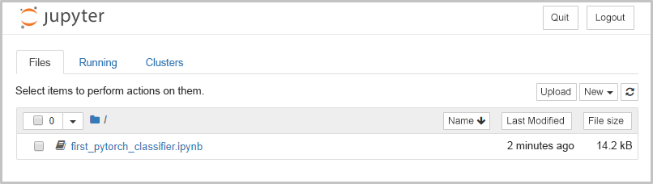

Teď, když máte váš virtuální počítač zprovozněný, musíte se rozhodnout ohledně trénování prvního modelu hloubkového učení. Své experimenty budete chtít spustit izolovaně od všeho ostatního na serveru. To uděláte tak, že je spustíte v kontejneru Docker.

## <a name="connect-to-the-vm-with-ssh"></a>Připojení k virtuálnímu počítači pomocí SSH

Ujistěte se, že jste stále připojeni k virtuálnímu počítači přes SSH. Pokud ne, stačí tento příkaz znovu spustit a vzdáleně se vrátit do virtuálního počítače.

1. V Azure Cloud Shellu spusťte následující příkaz, kterým se přihlásíte k virtuálnímu počítači.

    ```azurecli 
    ssh <USERNAME>@<IP>
    ``` 
    
    Nahraďte `<USERNAME>` názvem účtu správce definovaným při vytváření virtuálního počítače. Nahraďte `<IP>` IP adresou virtuálního počítače, kterou jste uložili v předchozím cvičení.  

1. Po zobrazení výzvy zadejte heslo pro účet správce a dokončete proces přihlašování.

## <a name="run-a-jupyter-notebook-server-in-a-docker-container-in-the-vm"></a>Spusťte server Jupyter Notebook v kontejneru Docker ve virtuálním počítači

> [!NOTE]
> Protože máme ve virtuálním počítači pouze účet správce nebo kořenový účet, musíme spouštět všechny příkazy Dockeru jako kořenové pomocí `sudo`

1. Chcete-li zobrazit, jaké kontejnery Docker existují ve virtuálním počítači, spusťte následující příkaz v příkazovém řádku.

    ```azurecli 
    sudo docker ps
    ```

1. Spusťte následující příkaz v příkazovém řádku a vytvořte nový kontejner pro naše experimenty.

    ```azurecli 
    sudo docker run --rm -it --entrypoint '/bin/sh' -p 8888:8888 pytorch/pytorch -c \
    'conda install jupyter matplotlib -y &&\
    curl https://pytorch.org/tutorials/_downloads/cifar10_tutorial.ipynb > first_pytorch_classifier.ipynb &&\
    jupyter notebook --ip=0.0.0.0 --no-browser --allow-root'
    ``` 

    Tento příkaz se spustí na delší dobu. Takže zatímco budeme mít nějaký čas, pojďme si probrat, co příkaz dělá. 
    - `docker run` spustí příkaz v novém kontejneru. Snímek používaného Dockeru je pytorch/pytorch. Nejprve vytvoří zapisovatelnou vrstvu kontejneru nad zadanou bitovou kopií a pak ji spustí pomocí zadaného příkazu.
    - `--rm` po opuštění kontejner odebere. Pokud chcete zachovat kontejner v provozu, vyřaďte tento argument. 
    - `--entrypoint 'bin/sh'` přepíše výchozí vstupní bod bitové kopie do prostředí Bash
    - `-c` definuje, jaký příkaz se spustí při spuštění kontejneru. V takovém případě se spouští tři příkazy:
        - Nainstaluje Jupyter a matplotlib
        - Zkopíruje poznámkový blok (cifar10_tutorial.ipynb) z pytorch.org do souboru ve volaném kontejneru `first_pytorch_classifier.ipynb`
        - Spustí server poznámkového bloku v kontejneru stejně jako v předchozím cvičení.  Nespustí se žádný prohlížeč, povolí přístup do poznámkového bloku z kořenového adresáře a naslouchání na všech portech. 
    
    Server poznámkového bloku naslouchá na všech portech pro tento kontejner. Ale jak bude provoz přicházet z oblasti mimo kontejner? Argument `-p 8888:8888` namapuje port `8888` kontejneru na port TCP 8888 na hostitelském počítači. Takže provoz přicházející do virtuálního počítače přes port 8888 bude zvolen kontejnerem. 

## <a name="connect-to-the-jupyter-notebook-server-from-a-remote-browser"></a>Připojení k serveru Jupyter Notebook ze vzdáleného prohlížeče 

Jakmile je poznámkový blok Jupyter spuštěn v kontejneru, zobrazí se zpráva podobná následující zprávě. 

> *Zkopírujte/vložte tuto adresu URL do prohlížeče při prvním připojování, pokud se chcete připojit pomocí tokenu: http://(5b8783e7911d nebo 127.0.0.1):8888/?token={sometoken}*

1. Část adresy URL **http://(5b8783e7911d nebo 127.0.0.1)** nahraďte plně kvalifikovaným názvem domény (FQDN) nebo IP adresou virtuálního počítače a přejděte na adresu na nové kartě prohlížeče.

    

    > [!TIP]
    > FQDN a IP adresu svého virtuálního počítače můžete získat pomocí následujícího příkazu:
    > 
    > `az vm show -d --name <HOSTNAME> --resource-group <rgn>[sandbox resource group name]</rgn> --output table`
    >
    > Nezapomeňte nahradit `<HOSTNAME>` názvem svého virtuálního počítače. 
    
    Tentokrát uvidíme jenom jeden poznámkový blok. Je to proto, že se nacházíme v kontejneru a tento poznámkový blok jsme pouze zkopírovali. V dalším cvičení budeme experimentovat s tímto poznámkovým blokem. 
    
    > [!TIP]
    > Server poznámkového bloku zatím nevypínejte. Podíváme se na poznámkový blok `first_pytorch_classifier.ipynb` v dalším cvičení.