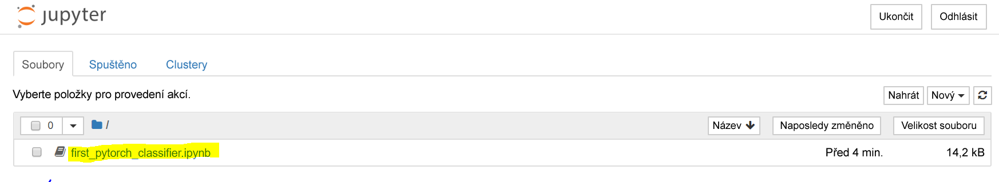
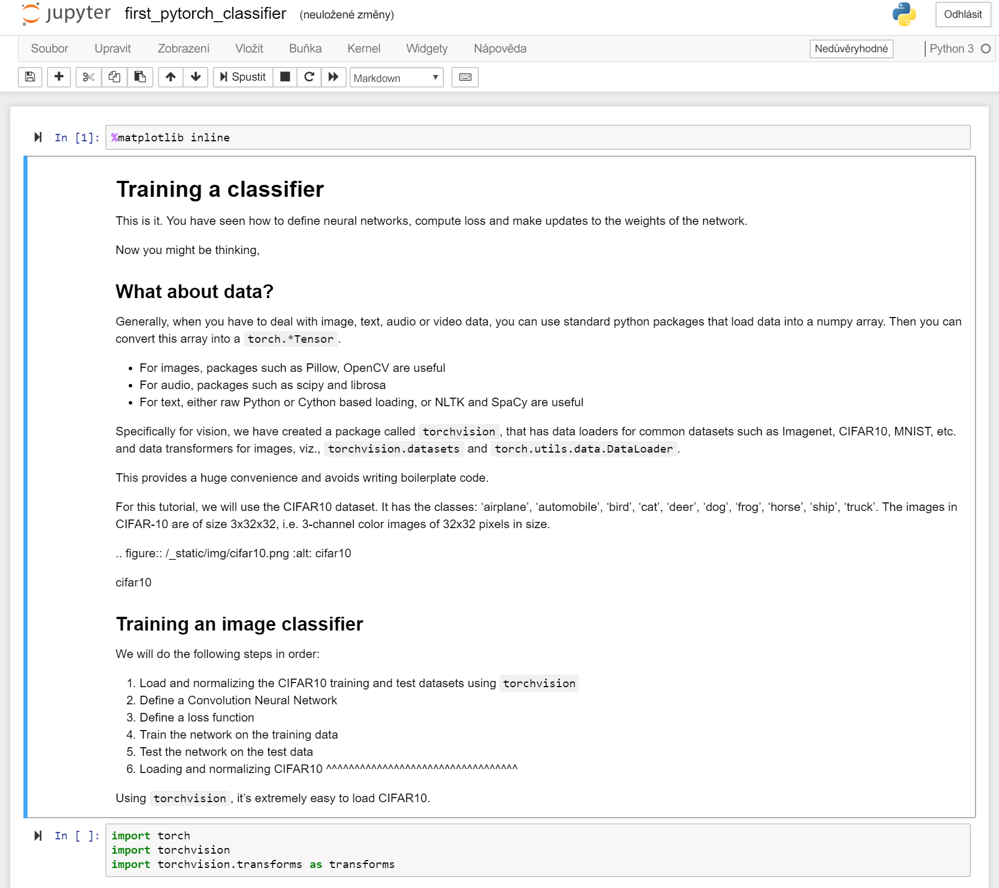
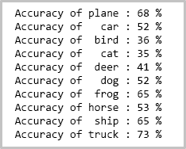

 

Programátoři hloubkového učení většinou neimplementují všechny algebraické operace s maticemi ručně. Používají raději rozhraní, jako je PyTorch nebo TensorFlow.  

PyTorch je architektura založená na jazyce Python, která nabízí flexibilní vývojovou platformu pro hloubkové učení. Vychází z vědecké výpočetní knihovny Pythonu s názvem NumPy. 

Asi se chcete zeptat, proč k vytváření modelů hloubkového učení používat právě PyTorch.  

- Jednoduše použitelné rozhraní API – pokud znáte Python, půjde vám to rychle.
- Podpora Pythonu – PyTorch bez problémů integruje vědecké výpočetní služby.
- Dynamické výpočetní grafy – místo předdefinovaných grafů s konkrétními funkcemi vytváří PyTorch dynamické výpočetní grafy, které můžete upravovat za běhu. Dynamické výpočetní grafy jsou důležité pro vnořené dávkové zpracování a také když nevíme, kolik paměti budeme k vytvoření dané sítě potřebovat.

Další informace o architektuře PyTorch najdete v [oficiální dokumentaci na webu PyTorch.org](https://pytorch.org/about/).

## Spuštění prvního modelu PyTorch

Teď, když jste z image PyTorch zřídili kontejner Dockeru, můžete začít experimentovat. Možná si ještě vzpomínáte, že jsme si z webu [python.org](https://python.org) stáhli poznámkový blok. Tento ukázkový poznámkový blok vás povede při trénování sítě, aby uměla zařadit obrázky do různých kategorií. Definuje hloubkovou konvoluční neuronovou síť (CNN).

1. V místním prohlížeči přejděte k serveru Jupyter Notebook, který jste nastavili v předchozím cvičení. Adresu URL bude mát tvar:

    `<HOSTNAME>.<REGION>.cloudapp.azure.com:8888/?token={sometoken}`

1. V řídicím panelu vyberte poznámkový blok `first_pytorch_classifier.ipynb`.

    

    Podle pokynů v poznámkovém bloku natrénujte svůj první klasifikátor PyTorch.

    

2. Začněte od začátku poznámkového bloku a spusťte každou buňku v uvedeném pořadí. Všimněte si, že:

    - Spuštění některých buněk trvá delší dobu. Všimněte si malé tečky v pravém horním rohu poznámkového vedle slov „Python 3“. Když je jádro zaneprázdněné operacemi, změní se tečka na vyplněný tmavší kroužek. Zůstane takový až do dokončení operace. 
    - Trénujete síť CNN, aby dokázala klasifikovat obrázky. Jakmile bude síť vytrénovaná, otestuje poznámkový blok, jak model zařadí označené obrázky. Zaznamená předpověď každého obrázku a vypočítá přesnost modelu. Výsledky se zobrazí v následujícím formátu.

    
    
    - Další informace o poznámkovém bloku najdete v online [dokumentaci ke kurzům na PyTorch](https://pytorch.org/tutorials/beginner/blitz/cifar10_tutorial.html).
    
    - Na konci poznámkového bloku se poznámky zmiňují o trénování GPU. Pokud jste postupovali podle cvičení v tomto modulu, nastavili jste virtuální počítač, který je založený na CPU. U modelu této velikosti je to v pořádku, protože s GPU byste ani nemuseli zaznamenat výrazné zlepšení doby trénování. Pokud chcete vyzkoušet modul, který používá virtuální počítač s grafickými procesory, musíte udělat dvě změny:
    - Zřídit virtuální počítač DSVM se zapnutým GPU o velikosti řady N.
    - Vytvořit kontejner příkazem `nvidia-docker` místo příkazu `docker` použitého v předchozím cvičení.