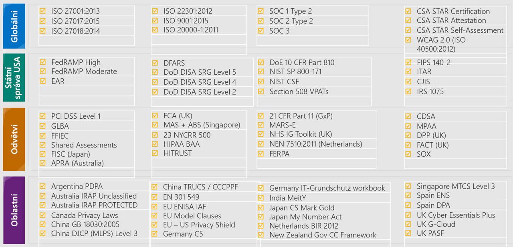

Azure Government je cloudové prostředí speciálně navržené tak, aby splňovalo požadavky na zabezpečení a dodržování předpisů pro státní správu USA. Tento důležitý cloud poskytuje převratné inovace zákazníkům ze státní správy USA a jejich partnerům. Azure Government je určen pro státní správu na všech úrovních – od místních a státních úřadů až po federální vládní instituce včetně úřadů Ministerstva obrany. 

I když existuje více poskytovatelů cloudu pro veřejný sektor, jen málo z nich nabízí jedinečné funkce vyžadované státními, místními a federálními vládními úřady. Azure Government poskytuje hybridní prostředí zajišťující flexibilitu, komplexní zabezpečení a dodržování předpisů napříč regulatorními standardy.

Hlavním rozdílem mezi řešeními Microsoft Azure a Microsoft Azure Government je skutečnost, že Azure Government je suverénní cloud. Je to fyzicky oddělená instance cloudu Azure, která je vyhrazená pouze pro úlohy státní správy USA. Je vytvořená výhradně pro instituce státní správy a jejich poskytovatele řešení.

Cloud Azure Government je navržený pro vysoce citlivá data, díky kterým můžou zákazníci ze státní správy bezpečně přenést důležité úlohy do cloudu.

#### Přehled cloudu Azure Government

> [!VIDEO https://www.microsoft.com/videoplayer/embed/RE2FIcr]

<!-- What is Azure Government video from YouTube >
> [!VIDEO https://www.youtube.com/embed/_WcyWeARD2Y]
-->

<!-- Azure Friday video
> [!VIDEO https://www.youtube.com/embed/xHnTWkKo9tc]
-->

Než budeme pokračovat, ukážeme si hlavní výhody používání cloudu Azure Government.

:::row:::
  :::column:::
    
  :::column-end:::
    :::column span="3":::

**Fyzicky oddělená** instance Microsoft Azure.

Microsoft Azure Government je samostatná fyzická instance Azure. Má pokročilou infrastrukturu s robustními síťovými funkcemi v osmi oznámených oblastech v USA. Tyto oblasti zahrnují dvě oblasti se zabezpečením úrovně 5 DoD (Ministerstvo obrany). Azure Government nabízí také replikaci dat mezi jednotlivými oblastmi k zajištění provozní kontinuity. Všechny jsou propojené prostřednictvím nenasvíceného (temného) privátního vlákna.
 
 ExpressRoute poskytuje možnost volby a pohodlí u připojení mezi místními a virtuálními prostředky v cloudu a umožňuje spolehlivé připojení ve scénářích, jako je migrace dat, zotavení po havárii a další scénáře, u kterých je potřebná vysoká dostupnost. Umístění ExpressRoute jsou v Chicagu, Dallasu, New Yorku, Phoenixu, San Antoniu, Seattlu, Silicon Valley a Washingtonu DC.

Azure Government nabízí také klíčové síťové služby, jako jsou koncové body služeb virtuální sítě pro úložiště a SQL a Network Watcher pro zabezpečenější sestavování aplikací a monitorování. 

  :::column-end:::
:::row-end:::
:::row:::
  :::column:::
    
  :::column-end:::
    :::column span="3":::
Jediný hyperškálovatelný cloud vytvořený **speciálně pro vládu USA**.

Azure Government využívají tisíce zákazníků ze státní správy v rámci federálních, státních a místních úřadů. Patří mezi ně mnoho úřadů na federální úrovni a také armáda, válečné námořnictvo, letectvo a námořní jednotky.

  :::column-end:::
:::row-end:::
:::row:::
  :::column:::
    
  :::column-end:::
    :::column span="3":::
Vyhovuje nejkomplexnějším **standardům pro dodržování předpisů**.

Azure poskytuje nejširší a nejkomplexnější zajištění dodržování předpisů v oboru. 

  :::column-end:::
:::row-end:::

:::row:::
  :::column:::
    
  :::column-end:::
    :::column span="3":::
Prostředí je navržené tak, aby **překračovalo požadavky státní správy USA**.

Azure Government umožňuje úřadům:
- **Modernizovat své služby pomocí důvěryhodného cloudu**. Využívat nejmodernější zabezpečení k ochraně dat občanů, aplikací a hardwaru v prostředí, které je vytvořené tak, aby překračovalo nejvyšší požadavky na dodržování předpisů.
- **Zapojit se do nové éry agilní státní správy**. Pomocí flexibilních hybridních řešení efektivně zapojit občany prostřednictvím konzistentních možností komunikace a škálovatelných řešení, a to v cloudu i místně. Prostředí je možné přizpůsobit pomocí možností napříč platformami, nástroji a službami. Úřady tak můžou vytvářet svůj cloud vlastním tempem.
- **Posunout se dál**. Využívat možnosti zařízení Internetu věcí (IoT), analýz a hloubkového učení k získávání prakticky využitelných přehledů dat. Rychle inovovat procesy státní právy pomocí přizpůsobených řešení, která poskytují lepší prostředí pro občany.
- **Rozšiřovat své možnosti**. Pokročilé výpočetní schopnosti poskytované inteligentním cloudem pro státní správu otevírají úřadům možnosti, jaké nikdy předtím neměly. Využívat pokročilé nástroje pro analýzu a úložiště v inteligentním a výkonném cloudu pro státní správu a objevovat tak nové poznatky v datech.

  :::column-end:::
:::row-end:::

:::row:::
  :::column:::
    
  :::column-end:::
    :::column span="3":::
Podporuje **nejširší nabídku služeb**, nástrojů a jazyků.

Azure Government je jediné řešení, které kombinuje nabídky typu Infrastruktura jako služba (IaaS), Platforma jako služba (PaaS) a Software jako služba (SaaS). Nabízí služby v oblasti výpočetních kapacit, síťové infrastruktury, úložišť, webových a mobilních řešení, databází, dat a analýz, umělé inteligence a služeb cognitive services, Internetu věcí (IoT), podnikových integrací, zabezpečení a identity, monitorování a správy a vývojářských nástrojů.

Program Azure Government FedRAMP s vysokou úrovní dodržování předpisů zahrnuje více než 38 služeb.
Azure Government sice neobsahuje všechny služby Microsoft Azure, seznam poskytovaných služeb se však neustále rozšiřuje. Nejnovější seznam služeb najdete v [nástroji pro produkty dostupné podle oblasti](https://azure.microsoft.com/en-us/global-infrastructure/services/) (v rozevíracím seznamu **Oblasti** vyberte Azure Government). Služby dostupné v prostředí Azure Government jsou uvedené podle kategorie a zjistíte tu také, jestli jsou obecně dostupné nebo jestli jsou k dispozici ve verzi Preview. 

  :::column-end:::
:::row-end:::
