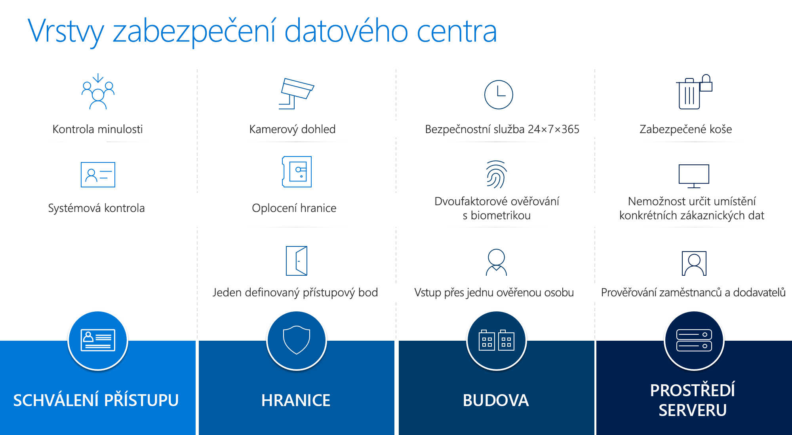

Služba Azure Government je od základů navržená tak, aby splňovala přísné požadavky státní správy USA. Splňuje nezbytné standardy dodržování předpisů, překračuje regulační požadavky státní správy USA a dokáže chránit vládní data, aplikace a hardware.

Zákazníci mají zajištěné vysoké úrovně zabezpečení, protože Azure Government:

- Poskytuje samostatnou instanci služby Microsoft Azure, která nabízí geografickou replikaci.
- Se nabízí jen americkým úřadům, organizacím přidruženým ke státní správě USA nebo organizacím, které potřebují používat data spravovaná vládou.
- Podporuje scénáře zotavení po havárii pomocí geograficky distribuovaných datacenter.
- Překračuje nejvyšší standardy dodržování předpisů. 

Azure Government zahrnuje více než 72 režimů dodržování předpisů – to je nejširší a nejkomplexnější dodržování předpisů v oboru. 

## Azure Government: Zabezpečení datacentra ve vrstvách

Přístup služby Azure Government k fyzickému zabezpečení, který podrobně řeší obranu, nabízí několik úrovní ochrany. Ukazuje to následující diagram. 

- **Schválení přístupu** je komplexní a zajišťuje, že jen osoby uvedené na seznamu předem autorizovaných osob budou mít přístup k datacentrům Azure Government. Personálu se uděluje přístup do citlivých oblastí jen v případě, že je skutečně nutný. Postupuje se podle principu přístupu s nejnižšími oprávněními. Povinnosti personálu pro správu datacentra a jeho zabezpečení jsou navíc jasně rozdělené. To nabízí další provozní záruky.
- Zabezpečení **okolí** začíná oplocením, vstupními branami a monitorováním kamerami. Každé datacentrum má jeden definovaný přístupový bod a neustálou hlídku. 
- Zabezpečení **budovy** zahrnuje nepřetržitý provoz (24 hodin denně, 7 dní v týdnu, 365 dní v roce) bezpečnostní služby, dvojúrovňové ověřování pomocí biometriky a vstup ověřených osob po jedné. Budovy nenesou logo Microsoftu a kromě neustálé hlídky jsou navíc nepřetržitě hlídané rozsáhlým kamerovým monitorovacím systémem. Komplexní proces schvalování přístupu zajišťuje, že do našich datacenter mohou vstupovat jen osoby uvedené na seznamu předem autorizovaných osob. Personálu se uděluje přístup do citlivých oblastí jen v případě, že je skutečně nutný. Postupuje se podle principu přístupu s nejnižšími oprávněními. Povinnosti personálu pro správu datacentra a jeho zabezpečení jsou navíc jasně rozdělené. To nabízí další provozní záruky.
- Přístup do **prostředí serverů** je omezený podle interních potřeb přístupu zaměstnanců. Provozní předpisy znemožňují přinášet nebo odebírat neschválená zařízení pro ukládání dat. Kromě toho serverovny chrání další bezpečnostní kontroly, včetně detektorů kovu, biometrického dvojúrovňového ověřování, monitorování kamerami a nepřetržitého dohledu hlídek. 

## Zabezpečení dat
Azure Government nabízí širokou škálu služeb, které pomáhají zabezpečit data:

Služby **Azure Security Center** a **Microsoft Intelligent Graph** využívají rozšířenou analýzu, abyste mohli zmírňovat následky vyvíjejících se útoků a učit se z nich.

**Key Vault** šifruje klíče a tajné kódy v hardwarových zabezpečovacích modulech ověřených dle standardu FIPS 140-2, zřizuje a centrálně spravuje klíče během sekund a provádí audit pro následné analýzy a detekci hrozeb.

**Azure Active Directory (AAD)** efektivně řídí oprávnění a přístup. Toto komplexní cloudové řešení pro správu identit a přístupu nabízí robustní sadu funkcí, které umožňují spravovat uživatele a skupiny. Pomáhá zabezpečit přístup k místním i cloudovým aplikacím. Spravuje identity uživatelů a vytváří inteligentně řízené zásady přístupu, které zabezpečují prostředky. Poskytuje jedno konzistentní prostředí pro přihlašování na zařízeních Mac a zařízeních s Windows, Androidem i iOSem. Azure Multi-Factor Authentication znemožňuje neoprávněný přístup jak k místním, tak ke cloudovým aplikacím tím, že poskytuje další úroveň ověřování. Pomocí monitorování a upozornění na zabezpečení a sestavách založených na strojovém učení, které identifikují nekonzistentní vzory přístupu, můžete chránit svoji firmu a omezovat potenciální hrozby.

Geograficky distribuovaná datacentra, integrované replikační služby a **Azure Site Recovery** spolu se službou **Backup** podporují scénáře zotavení po havárii a zajišťují provozní kontinuitu.
