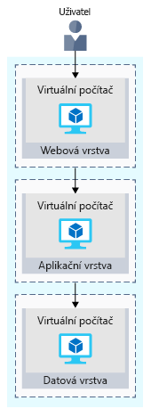

Vaším prvním krokem zřejmě bude opětovné vytvoření místní konfigurace v cloudu.

Tato základní konfigurace vám poskytne představu o tom, jak se sítě konfigurují a jak se síťový provoz přesouvá do a z Azure.

## Web elektronického obchodu na první pohled

Větší podnikové systémy se často skládají z více navzájem propojených aplikací a služeb, které pracují společně. Můžete mít například front-endový webový systém, který zobrazuje skladové zásoby a umožňuje zákazníkům vytvářet objednávky. Tento systém může komunikovat s celou řadou webových služeb, aby mohl poskytovat informace o skladových zásobách, spravovat profily uživatelů, zpracovávat platební karty a plnit požadavky zpracovaných objednávek.

Existuje několik strategií a schémat, které softwaroví architekti a návrháři používají, aby usnadnili návrh, vytvoření, správu a údržbu těchto složitých systémů. Na několik z nich se podíváme a začneme s _volně propojenými architekturami_.

### Výhody volně propojených architektur

> [!VIDEO https://www.microsoft.com/videoplayer/embed/RE2yHrc]

### Použití n-vrstvé architektury

Architektonické schéma, pomocí něhož lze vytvářet volně propojené systémy, je _n-vrstvá_ architektura.

[N-vrstvá architektura](https://docs.microsoft.com/azure/architecture/guide/architecture-styles/n-tier) rozděluje aplikaci minimálně na dvě logické vrstvy. Z architektonického pohledu mohou vyšší vrstvy přistupovat ke službám z nižší vrstvy, ale nižší vrstvy by nikdy k vyšší vrstvě přistupovat neměly.

Vrstvy pomáhají oddělit problémy a jsou navrženy k opakovanému použití. Použití vrstvené architektury také zjednodušuje údržbu. Vrstvy lze aktualizovat nebo nahrazovat nezávisle a v případě potřeby je možné vložit nové vrstvy.

_Třívrstvá_ odkazuje na n-vrstvou aplikaci, která má tři vrstvy. Vaše webová aplikace elektronického obchodu má tuto třívrstvou architekturu:

* **Webová vrstva** poskytuje vašim uživatelům webové rozhraní prostřednictvím prohlížeče.
* **Aplikační vrstva** spouští obchodní logiku.
* **Datová vrstva** zahrnuje databáze a další úložiště, která obsahují informace o produktech a objednávky zákazníků.

Na následujícím obrázku je znázorněn tok požadavku od uživatele k datové vrstvě.

Když uživatel kliknutím na tlačítko odešle objednávku, odešle se do webové vrstvy žádost společně s adresou a platebními údaji uživatele. Webová vrstva tyto informace předá aplikační vrstvě, která ověří platební informace a zkontroluje zásoby. Aplikační vrstva pak může objednávku uložit do datové vrstvy, odkud ji může později vzít a vyřídit.

## Web elektronického obchodu běžící v Azure

Azure poskytuje mnoho různých způsobů, jak hostovat vaše webové aplikace – od předem plně nakonfigurovaných prostředí, která hostují kód, po virtuální počítače, které můžete nakonfigurovat, přizpůsobit a spravovat.

Řekněme, že se rozhodnete provozovat svůj elektronický obchod na virtuálních počítačích. Takto to může vypadat v testovacím prostředí spuštěném v Azure. Na následujícím obrázku je znázorněna třívrstvá architektura běžící na virtuálním počítači, který má zapnuty funkce zabezpečení za účelem omezení příchozích požadavků. 

Pojďme se na to podívat podrobněji.

:::row:::
  :::column:::
    
  :::column-end:::
    :::column span="3":::
**Co je oblast Azure?**

_Oblast_ je datacentrum Azure v konkrétním zeměpisném umístění. Příklady oblastí jsou Východní USA, Západní USA a Severní Evropa. V této instanci vidíte, že aplikace běží v oblasti USA – východ.

  :::column-end:::
:::row-end:::
:::row:::
  :::column:::
    
  :::column-end:::
    :::column span="3":::
**Co je virtuální síť?**

_Virtuální síť_ je logicky izolovaná síť v Azure. Virtuální sítě Azure znáte, pokud jste nastavovali sítě v technologii Hyper-V, VMware nebo dokonce jiných veřejných cloudech. Virtuální sítě jsou segmentované do jedné nebo více _podsítí_. Podsítě vám pomůžou uspořádat a zabezpečit vaše prostředky.

Webová, aplikační a datová vrstva mají každá jeden virtuální počítač. Všechny tři virtuální počítače jsou ve stejné virtuální síti, ale jsou v oddělených podsítích.

Uživatelé komunikují přímo s webovou vrstvou, tento virtuální počítač má proto veřejnou IP adresu společně s privátní IP adresou. Uživatelé nekomunikují s aplikační ani datovou vrstvou, proto mají tyto virtuální počítače pouze privátní IP adresu.

Datacentra Azure spravují fyzický hardware za vás. Virtuální sítě konfigurujete prostřednictvím softwaru, který vám umožňuje chovat se k virtuální síti stejně jako ke své vlastní síti. Můžete například rozhodnout o tom, ke kterým dalším sítím může vaše virtuální síť přistupovat, ať už se jedná o veřejný internet, nebo jiné sítě v adresním prostoru privátních IP adres.

  :::column-end:::
:::row-end:::
:::row:::
  :::column:::
    
  :::column-end:::
    :::column span="3":::
**Co je skupina zabezpečení sítě?**

_Skupina zabezpečení sítě_, neboli NSG, povoluje nebo zakazuje příchozí síťový provoz do vašich prostředků Azure. Skupinu zabezpečení sítě můžete považovat za bránu firewall vaší sítě na úrovni cloudu.

Všimněte si například, že virtuální počítač ve webové vrstvě povoluje příchozí provoz na portech 22 (SSH) a 80 (HTTP). Skupina zabezpečení sítě tohoto virtuálního počítače umožňuje příchozí provoz pomocí těchto portů ze všech zdrojů. Skupinu zabezpečení sítě můžete nakonfigurovat tak, aby přijímala provoz pouze ze známých zdrojů, jako jsou třeba důvěryhodné IP adresy.

> [!NOTE]
> Port 22 vám umožní přímé připojení k systémům Linux přes SSH. Tady vidíte port 22 otevřený pro účely výuky. V praxi můžete nakonfigurovat přístup ke své virtuální síti pomocí VPN, abyste zvýšili zabezpečení.

  :::column-end:::
:::row-end:::

## Shrnutí

Vaše třívrstvá aplikace teď běží v Azure v oblasti USA – východ. _Oblast_ je datacentrum Azure v konkrétním zeměpisném umístění.

Každá vrstva může přistupovat pouze ke službám z nižší vrstvy. Virtuální počítač spuštěný ve webové vrstvě má veřejnou IP adresu, protože přijímá provoz z internetu. Virtuální počítače v nižších vrstvách, tedy aplikační a datové vrstvě, mají svoje privátní IP adresy, protože nekomunikují přímo přes internet.

_Virtuální sítě_ vám umožňují seskupovat a izolovat související systémy. _Skupiny zabezpečení sítě_ definujete, abyste mohli řídit, jaký provoz může virtuální sítí proudit.

Konfigurace, kterou jste tu viděli, je dobrým začátkem. Když ale nasazujete web elektronického obchodu do provozu v cloudu, pravděpodobně budete čelit stejným problémům jako v místním nasazení.
