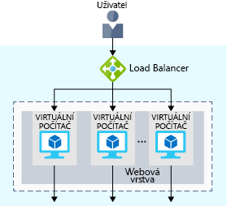
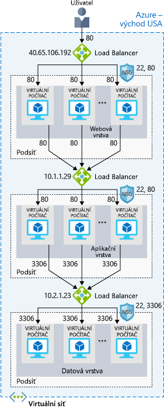
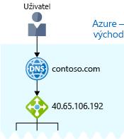

Váš web je teď aktivní a běží v Azure. Jak ale můžete zajistit, aby běžel nepřetržitě?

Co se třeba stane, když budete potřebovat provést týdenní údržbu? Během údržby bude vaše služba i nadále nedostupná. A vzhledem k tomu, že váš web je určený pro uživatele po celém světě, neexistuje žádná ideální doba, kdy systém kvůli údržbě vypnout. V případě, že se ve stejnou dobu připojuje příliš mnoho uživatelů, můžete také narazit na problémy s výkonem.

## Co je dostupnost a vysoká dostupnost?

:::row:::
  :::column:::
    
  :::column-end:::
    :::column span="3":::
_Dostupnost_ odkazuje na to, jak dlouho je vaše služba aktivní a spuštěná bez přerušení. Termíny _vysoká dostupnost_ nebo _s vysokou dostupností_ odkazují na službu, která je aktivní a běží po dlouhou dobu.

Asi víte, jak frustrující je, když se nemůžete dostat k informacím, které potřebujete. Představte si web sociální sítě nebo zpravodajský web, který každodenně navštěvujete. Můžete k webu kdykoli přistoupit nebo se vám často zobrazují zprávy typu „503 Služba není dostupná“?
  :::column-end:::
 :::row-end:::

Možná jste zaslechli termín „dostupnost s pěti devítkami“. Dostupnost s pěti devítkami znamená, že u služby je zaručeno, že běží 99,999 % času. Přestože je velmi obtížné dosáhnout 100% dostupnosti, mnoho týmů se snaží alespoň o dostupnost s pěti devítkami.

## Co je odolnost proti chybám?

:::row:::
  :::column:::
    
  :::column-end:::
    :::column span="3":::
_Odolnost proti chybám_ odkazuje na schopnost systému zůstat v provozu za mimořádných okolností.

Mezi tyto okolnosti patří:

- Přírodní katastrofy
- Plánované i neplánované údržby systému, které zahrnují aktualizace softwaru a opravy zabezpečení
- Provozní špičky webu
- Hrozby uživatelů se zlými úmysly, jako jsou například distribuované útoky na dostupnost služby (neboli DDoS)
  :::column-end:::
:::row-end:::

Představte si, že váš marketingový tým chce uskutečnit bleskovou slevovou akci, kterou chce podpořit novou řadu vitamínových doplňků. Během této doby můžete očekávat velkou špičku. Tato špička by mohla zahltit váš systém zpracování, který by se následně zpomalil nebo zastavil. Vaši zákazníci by byli zklamaní. Takové zklamání jste možná zažili sami. Už jste někdy chtěli využít online slevovou akci, ale pak jste zjistili, že přístup na web nefunguje?

## Co je nástroj pro vyrovnávání zatížení?

:::row:::
  :::column:::
    
  :::column-end:::
    :::column span="3":::
_Nástroj pro vyrovnávání zatížení_ distribuuje provoz rovnoměrně mezi všechny systémy ve fondu. Nástroj pro vyrovnávání zatížení vám pomůže zajistit vysokou dostupnost i odolnost proti chybám.

Řekněme, že začnete tak, že do každé vrstvy přidáte další virtuální počítače, všechny stejně nakonfigurované. Cílem je mít připravené další systémy pro případ, že se některý z nich ocitne mimo provoz nebo obsluhuje příliš mnoho uživatelů současně.
  :::column-end:::
:::row-end:::

Problém představuje fakt, že každý virtuální počítač by měl mít svou vlastní IP adresu. Navíc nemáte jak distribuovat provoz v případě, že některý ze systémů selže nebo je příliš zaneprázdněný. Jak připojit virtuální počítače tak, aby se uživateli jevily jako jeden systém?

K distribuci provozu použijte nástroj pro vyrovnávání zatížení. Nástroj pro vyrovnávání zatížení se pro uživatele stane vstupním bodem. Uživatel nebude (nepotřebuje) vědět, který systém si nástroj pro vyrovnávání zatížení vybere k přijetí požadavku.

Následující obrázek ukazuje roli centra událostí.

Vidíte, že nástroj pro vyrovnávání zatížení obdrží požadavek uživatele. Nástroj pro vyrovnávání zatížení směruje žádosti do jednoho z virtuálních počítačů ve webové vrstvě. Pokud je virtuální počítač nedostupný nebo přestane reagovat, nástroj pro vyrovnávání zatížení do něj přestane provoz odesílat. Nástroj pro vyrovnávání zatížení pak přesměruje provoz do jednoho z reagujících serverů.

Vyrovnávání zatížení vám umožňuje spouštět úlohy údržby, aniž byste museli službu přerušit. Pro každý virtuální počítač můžete dobu údržby rozvrhnout. Nástroj pro vyrovnávání zatížení zjistí, že virtuální počítač během údržby nereaguje, a přesměruje provoz na jiné virtuální počítače ve fondu.

Aplikační a datové vrstvy vašeho webu elektronického obchodu můžou mít také nástroj pro vyrovnávání zatížení. Všechno závisí na tom, co vaše služba vyžaduje.

## Co je Azure Load Balancer?

Azure Load Balancer je služba nástroje pro vyrovnávání zatížení, kterou poskytuje Microsoft a která vám pomůže s údržbou.

Pokud na virtuálním počítači ručně nakonfigurujete běžný software nástroje pro vyrovnávání zatížení, nevýhodou je, že budete mít další systém, který vyžaduje údržbu. Pokud se nástroj pro vyrovnávání zatížení ocitne mimo provoz nebo vyžaduje rutinní údržbu, váš původní problém je zpět.

Pokud ale místo toho použijete Azure Load Balancer, nemusíte udržovat žádnou infrastrukturu ani software.

Následující obrázek ukazuje roli nástrojů pro vyrovnávání zatížení Azure ve vícevrstvé architektuře.

## A co DNS?

:::row:::
  :::column:::
    
  :::column-end:::
    :::column span="3":::
DNS, neboli Domain Name System, je způsob, jak můžete mapovat popisné názvy na jejich IP adresy. DNS si můžete představit jako telefonní seznam internetu.

Například název vaší domény, contoso.com, může být namapován na IP adresu nástroje pro vyrovnávání zatížení ve webové vrstvě 40.65.106.192.

Můžete používat vlastní server DNS nebo použít službu Azure DNS, což je hostitelská služba pro domény DNS, která běží v infrastruktuře Azure.
  :::column-end:::
:::row-end:::

Následující obrázek znázorňuje Azure DNS. Když uživatel přejde na contoso.com, Azure DNS směruje provoz do nástroje pro vyrovnávání zatížení.

## Shrnutí

Když používáte vyrovnávání zatížení, bude váš web elektronického obchodu vysoce dostupný a odolný proti chybám. Když budete provádět údržbu nebo zaznamenáte nárůst provozu, může nástroj pro vyrovnávání zatížení distribuovat provoz do jiného dostupného systému.

I když na virtuálním počítači můžete nakonfigurovat vlastní nástroj pro vyrovnávání zatížení, služba Azure Load Balancer omezuje potřebu údržby, protože neexistuje žádná infrastruktura nebo software, který byste museli udržovat.

DNS mapuje popisné názvy na jejich IP adresy, podobně jako telefonní seznam mapuje jména osob nebo společností na telefonní čísla. Můžete používat vlastní server DNS nebo použít službu Azure DNS.
