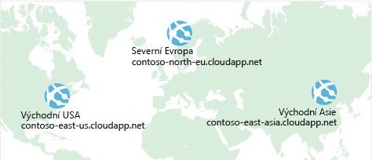
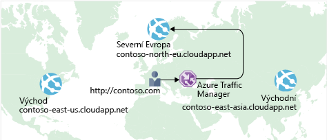

Nedávno jste se seznámili s tím, jak služba **Azure Load Balancer** pomáhá dosahovat vysoké dostupnosti a minimalizovat prostoje.

I když je teď váš web elektronického obchodu více dostupný, nevyřešil se problém latence, ani jsme nezajistili odolnost proti chybám napříč geografickými oblastmi.

Jak můžete nakonfigurovat svůj web umístěný ve Spojených státech, aby se uživatelům v Evropě nebo Asii rychleji načítal?

## Co je latence sítě?

:::row:::
  :::column:::
    
  :::column-end:::
    :::column span="3":::  
_Latence_ představuje dobu, kterou trvá cesta dat po síti. Obvykle se měří v milisekundách.

Porovnejme latenci se šířkou pásma. Šířka pásma se vztahuje k množství dat, která se vejdou do připojení. Latence se vztahuje k době, která je potřebná k tomu, aby data dosáhla svého cíle.
  :::column-end:::
:::row-end:::

Latenci mohou ovlivnit faktory, jako je typ používaného připojení a to, jak je vaše aplikace navržena. Nejdůležitějším faktorem je ale zřejmě vzdálenost.

Představte si svůj web elektronického obchodu, který se nachází v oblasti USA – východ. Obvykle bude trvat kratší dobu přenést data do Atlanty (vzdálenost přibližně 400 mil), než je přenést do Londýna (vzdálenost přibližně 4 000 mil).

Váš web elektronického obchodu používá standardní HTML, CSS, JavaScript a obrázky. Latence sítě pro velké množství souborů se může zvýšit. Jak můžete snížit latenci pro uživatele, kteří jsou geograficky velmi daleko?

## Horizontální navýšení kapacity v různých oblastech

Vzpomeňte si, že Azure poskytuje datacentra v oblastech po celé zeměkouli.

:::row:::
  :::column:::
     
  :::column-end:::
  :::column span="3":::
Přemýšlejte o nákladech na vytvoření datacentra. Náklady na vybavení nejsou jediným důležitým faktorem. Potřebujete energii, chlazení a personál, který bude v každém umístění udržovat vaše systémy v provozu. Replikace celého datacentra může být neuvěřitelně nákladná. Když ale použijete Azure, vaše náklady budou mnohem nižší, protože Azure už vybavení a personál má.
  :::column-end:::
:::row-end:::

Jedním ze způsobů, jak snížit latenci, je poskytnout přesné kopie služby ve více oblastech. Následující obrázek ukazuje příklad globálního nasazení.

Diagram zobrazuje váš web elektronického obchodu běžící ve třech oblastech Azure: USA – východ, Severní Evropa a Východní Asie. Všimněte si jednotlivých názvů DNS. Jak můžete připojit uživatele ke službě, která je jim geograficky nejblíže, ale v rámci domény contoso.com?

## Směrování uživatelů na nejbližší koncový bod pomocí služby Traffic Manager

:::row:::
  :::column:::
     
  :::column-end:::
  :::column span="3":::

Jednou z odpovědí je **Azure Traffic Manager**. Traffic Manager používá server DNS, který je uživateli nejblíže, pro nasměrování uživatelského provozu do globálně distribuovaného koncového bodu.
  :::column-end:::
:::row-end:::

Následující obrázek ukazuje roli Traffic Manageru.

Traffic Manager nevidí provoz, který proběhl mezi klientem a serverem. Místo toho směruje webový prohlížeč klienta do preferovaného koncového bodu. Traffic Manager může směrovat provoz několika různými způsoby, například do koncového bodu s nejnižší latencí.

I když tu není zobrazené, mohlo by toto nastavení také zahrnovat vaše místní nasazení běžící v Kalifornii. Traffic Manager můžete připojit ke svým místním sítím, což vám umožní zachovat investice do stávajících datacenter. Nebo můžete aplikaci přesunout kompletně do cloudu. Volba je na vás.

## Porovnání služeb Load Balancer a Traffic Manager

:::row:::
  :::column:::
     
  :::column-end:::
  :::column span="3":::
Azure Load Balancer distribuuje provoz v jedné oblasti, aby byly vaše služby vysoce dostupné a odolné proti chybám. Traffic Manager funguje na úrovni DNS a směruje klienta do preferovaného koncového bodu. Tento koncový bod může patřit oblasti, která je vašemu uživateli nejblíže.

Služby Load Balancer i Traffic Manager pomáhají každá trochu jiným způsobem k tomu, aby vaše služby byly odolnější proti chybám. Když Load Balancer zjistí nereagující virtuální počítač, přesměruje provoz do jiného virtuálního počítače ve fondu. Traffic Manager monitoruje stav vašich koncových bodů. Když služba Traffic Manager najde nereagující koncový bod, přesměruje provoz do dalšího nejbližšího koncového bodu, který reaguje.
  :::column-end:::
:::row-end:::

## Shrnutí

Geografická vzdálenost je jedním z nejzávažnějších faktorů, které způsobují latenci. Když použijete službu Traffic Manager, můžete hostovat přesné kopie vaší služby ve více geografických oblastech. Uživatelé ve Spojených státech, Evropě a Asii pak budou mít skvělé podmínky pro používání vašeho webu elektronického obchodu.
