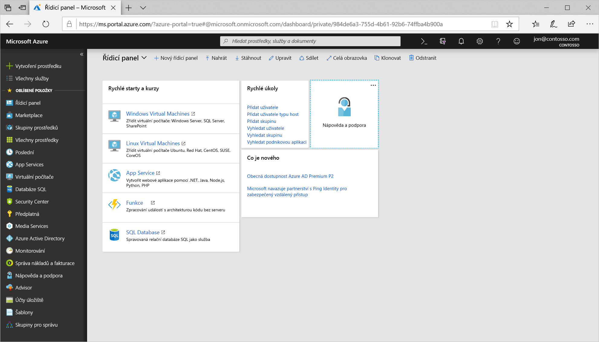

Naplánovali jste síťovou infrastrukturu a identifikovali několik virtuálních počítačů určených k migraci do cloudu. Virtuální počítače můžete vytvořit několika způsoby. Volba, kterou provedete, závisí na prostředí, se kterým jste obeznámeni. Azure podporuje pro vytváření a správu prostředků webový portál. Můžete také použít nástroje příkazového řádku, které běží v systémech MacOS, Windows a Linux.

[!include]

#### Možnosti vytvoření a správy virtuálních počítačů

> [!VIDEO https://www.microsoft.com/videoplayer/embed/RE2yJKx]

Podíváme se nejdříve na portál Azure Portal, což je nejjednodušší způsob, jak s Azure začít.

## Azure Portal

**Azure Portal** nabízí snadno použitelné uživatelské rozhraní založené na prohlížeči, které umožňuje vytvářet a spravovat všechny prostředky Azure. Můžete například vytvořit novou databázi, zvýšit výpočetní výkon virtuálních počítačů a monitorovat své měsíční náklady. Je to také skvělý vzdělávací nástroj, protože můžete prozkoumat všechny dostupné prostředky a pomocí průvodců si ty, které potřebujete, vytvořit.

Po přihlášení uvidíte dvě hlavní oblasti. První je nabídka s možnostmi, které umožňují vytvářet a monitorovat prostředky a spravovat fakturaci. Druhá je přizpůsobitelný řídicí panel, který poskytuje snímek všech základních služeb nasazených do Azure. Až s Azure začnete pracovat, pravděpodobně zjistíte, že používání tohoto portálu je skutečně pohodlné.

> [!TIP]
> Zobrazení, která vidíte při provádění výběrů na portálu, se často nazývají _okna_. Okno může fungovat jako strukturovaná nabídka nebo jako konfigurační panel. Při procházení portálu Azure Portal se na sebe uživatelské rozhraní vrství zleva doprava, kdy se vysunutím webového zobrazení ukáže aktuální okno. Posuvníkem v dolní části můžete rychle přejít zpět do nadřazených zobrazení.

### Vytvoření virtuálního počítače Azure pomocí portálu Azure Portal

Předpokládejme, že chcete vytvořit virtuální počítač s webem WordPress. Vytvoření webu není obtížné, měli byste ale pamatovat na pár věcí. Potřebujete nainstalovat a nakonfigurovat operační systém, nakonfigurovat web, nainstalovat databázi a postarat se například o brány firewall. Vytvářením virtuálních počítačů se budeme zabývat v několika dalších modulech, teď si ale jeden vytvoříme, abyste viděli, jak je to jednoduché. Nebudeme procházet všechny možnosti – úplné podrobnosti o jednotlivých možnostech najdete v modulech týkajících se **vytvoření virtuálního počítače**.

1. Pomocí stejného účtu, kterým jste aktivovali sandbox, se přihlaste k portálu [Azure Portal](https://portal.azure.com/learn.docs.microsoft.com?azure-portal=true).

1. Na levé straně uvidíte nabídku pro vytvoření a správu prostředků Azure a řídicí panel vyplňující zbytek obrazovky.

    

1. Klikněte na možnost **Vytvořit prostředek** v levém horním rohu stránky portálu. Otevře se okno Azure Marketplace. Pokud je levý boční panel sbalený, bude to zelené znaménko „plus“. Kliknutím na dvojitou šipku můžete boční panel rozbalit a zobrazit tak úplný text, jak znázorňuje předchozí obrázek.

    

    Jak vidíte, můžete si vybrat z mnoha možností. Chceme vytvořit virtuální počítač s webem Wordpress. Virtuální počítače jsou výpočetní prostředky Azure, takže v seznamu dostupných prostředků vyberte možnost **Compute** a vyhledejte image virtuálních počítačů WordPress. Kliknutím na **Zobrazit vše** můžete zobrazit celý seznam.

1. Použijte panel vyhledávání **Hledat na Marketplace** a vyhledejte „WordPress“. Měli byste teď vidět seznam možností. Vyberte možnost **WordPress 4.9.7**, jak je vidět níže.

    

    V okně, které se pak otevře, se zobrazí licenční informace o imagi, kterou budeme používat. Klikněte na **Vytvořit**.

    

1. Zobrazí se okno **Vytvořit virtuální počítač**. Všimněte si, že ke konfiguraci virtuálního počítače můžete použít průvodce.

### Nakonfigurování virtuálního počítače

Potřebujeme nakonfigurovat základní parametry virtuálního počítače WordPress. Pokud momentálně některé z možností neznáte, nic se neděje. Všechny tyto možnosti probereme v některém budoucím modulu. Zde použité hodnoty můžete klidně zkopírovat.

1. Na kartě **Základy** použijte následující hodnoty.
    - Předplatné musí být nastaveno na _Předplatné Concierge_.
    - Jako oblast vyberte **Použít existující** a pak v rozevíracím seznamu Skupina prostředků vyberte **Použít existující** a <rgn>[název skupiny prostředků sandboxu]</rgn>.
    - Zadejte **Název** virtuálního počítače. Použijte _test-wp1-eus-vm_.
    - Z následujícího seznamu vyberte **Oblast** blízko vás.
        [!include]
    - Jako **možnosti Dostupnosti** zvolte _Žádné_. To je pro vysokou dostupnost.
    - **Image** by měla být možnost _WordPress 4.9.7_, kterou jsme vybrali z Marketplace.
    - **Velikost** ponechte jako výchozí _Standard A1_, která vám poskytne jedno jádro a 1,75 GB paměti, což by pro jednoduchý web mělo stačit.
    - Typ ověřování přepněte na **Heslo** a zadejte uživatelské jméno a heslo.

    

1. Můžete prozkoumat několik dalších karet a prohlédnout si nastavení, která můžete při vytváření virtuálního počítače ovlivnit. Až skončíte, klikněte na **Zkontrolovat a vytvořit** a překontrolujte a ověřte nastavení.

1. Na kontrolní obrazovce ověří Azure vaše nastavení. Může být potřeba zadat další informace na základě požadavků tvůrce image. Ověřte, že je všechno nastavené tak, jak chcete, a kliknutím na **Vytvořit** nasaďte a vytvořte virtuální počítač.

1. Nasazení můžete monitorovat pomocí panelu **Oznámení**. Tento panel zobrazíte nebo skryjete kliknutím na ikonu v horním panelu nástrojů.

    

1. Proces nasazení virtuálního počítače trvá několik minut. Zobrazí se oznámení, které vás informuje o úspěšném nasazení. Kliknutím na tlačítko **Přejít k prostředku** přejděte na stránku přehledu virtuálního počítače.

    

1. Zde můžete zobrazit všechny informace a možnosti konfigurace pro nově vytvořený virtuální počítač WordPress. Jedním z údajů je **Veřejná IP adresa**.

    

11. Zkopírujte tuto IP adresu, otevřete novou záložku prohlížeče a vložte ji. Měli byste se dostat na zbrusu nový wordpressový web.

    

Blahopřejeme! Pomocí několika kroků jste nasadili virtuální počítač s Linuxem, který má nainstalovanou databázi a funkční web. Podívejme se na některé další způsoby, jak vytvořit virtuální počítač.
