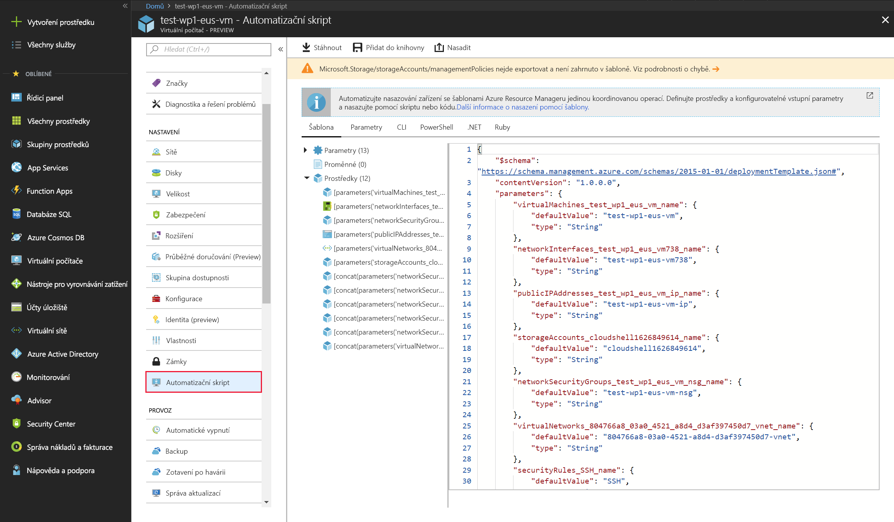

Když začínáte, pak nejjednodušší metodu, jak vytvářet prostředky, jako jsou virtuální počítače, nabízí Azure Portal. Ale není to nutně nejefektivnější nebo nejrychlejší způsob, jak pracovat s Azure, zejména v případě, že je potřeba vytvořit několik prostředků najednou. V našem případě budeme nakonec vytvářet desítky virtuálních počítačů pro obstarávání různých úloh. Nebylo by právě zábavné vytvářet je ručně přes Azure Portal!

Podívejme se na některé další způsoby, jak vytvářet a spravovat prostředky v Azure:

- Azure Resource Manager
- Azure PowerShell
- Azure CLI
- Azure REST API
- Sada Azure Client SDK
- Rozšíření pro virtuální počítače Azure
- Azure Automation Services

## <a name="azure-resource-manager"></a>Azure Resource Manager

Předpokládejme, že chcete vytvořit kopii virtuálního počítače se stejným nastavením. Můžete vytvořit image virtuálního počítače, nahrát ji do Azure a pak na ni odkazovat jako na základ pro nový virtuální počítač. Tento proces je neefektivní a časově náročný. Azure vám nabízí možnost vytvořit šablonu, ze které vznikne přesná kopie virtuálního počítače.

Infrastruktura Azure bude obvykle obsahovat řadu prostředků, přičemž mnoho z nich bude mít mezi sebou nějaký vztah. Například virtuální počítač, který jsme vytvořili, zahrnuje samotný virtuální počítač, úložiště, síťové rozhraní, webový server a databázi – to všechno bylo vytvořeno společně pro provozování webu WordPress. **Azure Resource Manager** umožňuje efektivnější práci s těmito souvisejícími prostředky. Slouží k uspořádání prostředků do pojmenovaných **skupin prostředků**, které vám umožní společné nasazování, aktualizace nebo odstraňování všech prostředků. Když jsme vytvářeli web WordPress, určili jsme při vytváření virtuálního počítače skupinu prostředků a Resource Manager umístil související prostředky do stejné skupiny.

Resource Manager umožňuje také vytváření _šablon_, pomocí kterých je možné vytvářet a nasazovat konkrétní konfigurace.

### <a name="what-are-resource-manager-templates"></a>Co jsou šablony Resource Manageru?

**Šablony Resource Manageru** jsou soubory JSON, které definují, jaké prostředky je pro řešení potřeba nasadit.

Šablony prostředků můžete vytvořit v části **Nastavení** pro konkrétní virtuální počítač, a to výběrem možnosti Automatizační skript.



Šablonu prostředků si můžete uložit pro pozdější použití nebo na jejím základě okamžitě nasadit nový virtuální počítač. Můžete například vytvořit virtuální počítač ze šablony v testovacím prostředí a zjistit, že nefunguje tak, aby mohl nahradit místní počítač. Můžete odstranit danou skupinu prostředků, čímž odstraníte všechny prostředky, šablonu pozměnit a zkusit to znovu. Pokud chcete provést změny jen u stávajících nasazených prostředků, můžete změnit použitou šablonu a znovu ji nasadit. Resource Manager změní prostředky tak, aby odpovídaly nové šabloně.

Jakmile bude vše fungovat požadovaným způsobem, můžete pomocí této šablony snadno vytvořit více verzí infrastruktury, třeba pro přípravné a produkční prostředí. Můžete parametrizovat pole, jako je název virtuálního počítače, název sítě, název účtu úložiště atd., a načíst šablonu opakovaně s použitím jiných parametrů pro přizpůsobení jednotlivých prostředí.

Šablony prostředků můžete zpracovávat pomocí nástrojů pro automatizační skriptování, jako je Azure CLI, Azure PowerShell, a dokonce i rozhraní Azure REST API s vaším oblíbeným programovacím jazykem, takže jde o účinný nástroj pro rychlé rozjetí vaší infrastruktury.

## <a name="azure-powershell"></a>Azure PowerShell

Vytváření skriptů pro správu je výkonný způsob, jak optimalizovat pracovní postup. Můžete automatizovat každodenní opakující se úlohy a jakmile se skript ověří, poběží neustále a pravděpodobně sníží počet chyb. **Azure PowerShell** je ideální pro jednorázové interaktivní úlohy nebo automatizaci opakovaných úloh.

> [!NOTE]
> PowerShell je multiplatformové prostředí, které poskytuje služby, jako je okno prostředí a analýza příkazů. Azure PowerShell je volitelný doplňkový balíček, který přidává příkazy specifické pro Azure (označované jako **rutiny**). Více o instalaci a použití Azure PowerShellu se dozvíte v samostatném školicím modulu.

Například pomocí rutiny `New-AzVM` můžete vytvořit nový virtuální počítač Azure.

```powershell
New-AzVm `
    -ResourceGroupName "TestResourceGroup" `
    -Name "test-wp1-eus-vm" `
    -Location "East US" `
    -VirtualNetworkName "test-wp1-eus-network" `
    -SubnetName "default" `
    -SecurityGroupName "test-wp1-eus-nsg" `
    -PublicIpAddressName "test-wp1-eus-pubip" `
    -OpenPorts 80,3389
```

Jak si můžete všimnout, zadáte různé parametry, které řídí spoustu dostupných konfiguračních nastavení virtuálního počítače. Většina parametrů má přiměřené hodnoty, takže stačí zadat jen požadované parametry. Další informace o vytváření a správě virtuálních počítačů pomocí Azure PowerShellu najdete v modulu **Automatizace úloh Azure pomocí skriptů v PowerShellu**.

## <a name="azure-cli"></a>Azure CLI

Další možností interakce s Azure prostřednictvím skriptování a příkazového řádku je **rozhraní příkazového řádku Azure (Azure CLI)**.

Azure CLI je multiplatformový nástroj příkazového řádku Microsoftu pro správu prostředků Azure, jako jsou virtuální počítače a disky, z příkazového řádku. Je k dispozici pro macOS, Linux a Windows a také v prohlížeči prostřednictvím služby Cloud Shell. Podobně jako Azure PowerShellu je rozhraní příkazového řádku Azure efektivní způsob, jak zjednodušit pracovní postupy správy. Na rozdíl od Azure PowerShellu nevyžaduje Azure CLI ke svému fungování PowerShell.

Například k vytvoření virtuálního počítače Azure můžete použít příkaz `az vm create`.

```azurecli
az vm create \
    --resource-group TestResourceGroup \
    --name test-wp1-eus-vm \
    --image win2016datacenter \
    --admin-username jonc \
    --admin-password aReallyGoodPasswordHere
```

Azure CLI je možné použít s jinými skriptovacími jazyky, jakou jsou Ruby a Python. Oba jazyky se běžně používají na počítačích s jiným systémem než Windows, kde vývojáři nemusí znát PowerShell.

Další informace o vytváření a správě virtuálních počítačů najdete v modulu **Správa virtuálních počítačů pomocí nástroje Azure CLI**.

## <a name="programmatic-apis"></a>Programově (rozhraní API)

Obecně řečeno jsou Azure PowerShell i Azure CLI dobrými možnostmi, pokud potřebujete spouštět jednoduché skripty a chcete zůstat u nástrojů příkazového řádku. Při složitějších scénářích, kde vytváření a správa virtuálních počítačů tvoří součást rozsáhlejší aplikace s komplexní logikou, je třeba postupovat jinak.

S každým typem prostředku v Azure můžete interagovat programově.

### <a name="azure-rest-api"></a>Azure REST API

Rozhraní Azure REST API poskytuje vývojářům operace kategorizované podle prostředků, jakož i možnost vytvářet a spravovat virtuální počítače. Operace jsou vystavené jako identifikátory URI s odpovídajícími metodami HTTP (`GET`, `PUT`, `POST`, `DELETE` a `PATCH`) a odpovídající odpovědí.

Rozhraní API Azure Compute poskytují programový přístup k virtuálním počítačům a jejich podpůrným prostředkům. S tímto rozhraním API budete mít operace pro:

- Vytváření a správu skupin dostupnosti
- Vytváření a správu rozšíření virtuálních počítačů
- Vytváření a správu spravovaných disků, snímků a imagí
- Přístup k platformovým imagím dostupným v Azure
- Načítání informací o využití vašich prostředků
- Vytváření a správu virtuálních počítačů
- Vytváření a správu škálovacích sad virtuálních počítačů

### <a name="azure-client-sdk"></a>Sada Azure Client SDK

Přestože je rozhraní REST API neutrální z hlediska platforem a jazyků, vývojáři nejčastěji hledají vyšší úroveň abstrakce. Sada Azure Client SDK zapouzdřuje rozhraní Azure REST API, což vývojářům výrazně usnadňuje práci s Azure.

Sady Azure Client SDK jsou k dispozici pro různé jazyky a architektury, včetně jazyků na bázi .NET, jako je C#, Java, Node.js, PHP, Python, Ruby a Go.

Tady je fragment kódu jazyka C# pro vytvoření virtuálního počítače Azure pomocí balíčku NuGet `Microsoft.Azure.Management.Fluent`:

```csharp
var azure = Azure
    .Configure()
    .WithLogLevel(HttpLoggingDelegatingHandler.Level.Basic)
    .Authenticate(credentials)
    .WithDefaultSubscription();
// ...
var vmName = "test-wp1-eus-vm";

azure.VirtualMachines.Define(vmName)
    .WithRegion(Region.USEast)
    .WithExistingResourceGroup("TestResourceGroup")
    .WithExistingPrimaryNetworkInterface(networkInterface)
    .WithLatestWindowsImage("MicrosoftWindowsServer", "WindowsServer", "2012-R2-Datacenter")
    .WithAdminUsername("jonc")
    .WithAdminPassword("aReallyGoodPasswordHere")
    .WithComputerName(vmName)
    .WithSize(VirtualMachineSizeTypes.StandardDS1)
    .Create();
```

Tady je stejný fragment kódu v jazyce Java s využitím sady **Azure Java SDK**:

```java
String vmName = "test-wp1-eus-vm";
// ...
VirtualMachine virtualMachine = azure.virtualMachines()
    .define(vmName)
    .withRegion(Region.US_EAST)
    .withExistingResourceGroup("TestResourceGroup")
    .withExistingPrimaryNetworkInterface(networkInterface)
    .withLatestWindowsImage("MicrosoftWindowsServer", "WindowsServer", "2012-R2-Datacenter")
    .withAdminUsername("jonc")
    .withAdminPassword("aReallyGoodPasswordHere")
    .withComputerName(vmName)
    .withSize("Standard_DS1")
    .create();
```

## <a name="azure-vm-extensions"></a>Rozšíření pro virtuální počítače Azure

Předpokládejme, že chcete na virtuálním počítači po počátečním nasazení nakonfigurovat a nainstalovat další software. Chcete, aby tato úloha použila specifickou konfiguraci a automaticky se monitorovala a provedla.

**Rozšíření pro virtuální počítače Azure** jsou malé aplikace, které umožňují konfiguraci a automatizaci úloh na virtuálních počítačích Azure po počátečním nasazení. **Rozšíření pro virtuální počítače Azure** je možné spustit přes Azure CLI, PowerShell, šablony Azure Resource Manageru a Azure Portal.

Rozšíření spojíte jako sadu s novým nasazením virtuálního počítače nebo je spustíte v existujícím systému.

## <a name="azure-automation-services"></a>Azure Automation Services

Mezi nejdůležitější výzvy při operační správě vzdálené infrastruktury patří úspora času, snížení množství chyb a zvýšení efektivity. Pokud máte hodně infrastrukturních služeb, můžete zvážit použití služeb vyšší úrovně v Azure, abyste o provozu měli větší přehled.

**Azure Automation** nabízí integraci služeb, což usnadňuje automatizaci častých, časově náročných a k chybám náchylných úloh správy. Mezi tyto služby patří **automatizace procesů**, **správa konfigurace** a **správa aktualizací**.

- **Řízení procesů**: Předpokládejme, že máte virtuální počítač, u kterého se monitoruje výskyt konkrétní chybové události. Jakmile je nahlášen problém, chcete provést příslušnou akci a problém vyřešit. Automatizace procesů umožňuje nastavit sledovací úlohy schopné reagovat na události, které můžou nastat ve vašem datovém centru.

- **Správa konfigurace**:  Možná budete chtít sledovat aktualizace softwaru, které budou k dispozici pro operační systém běžící na vašem virtuálním počítači. A budete chtít zahrnout nebo vyloučit konkrétní aktualizace. Správa konfigurace umožňuje tyto aktualizace sledovat a provádět akce podle potřeby. Pomocí **System Center Configuration Manageru** můžete spravovat počítače, servery a mobilní zařízení vaší společnosti. Tuto podporu můžete rozšířit na vaše virtuální počítače Azure pomocí Configuration Manageru.

- **Update Management**: Umožňuje spravovat aktualizace a opravy u virtuálních počítačů. S touto službou můžete vyhodnotit stav dostupných aktualizací, naplánovat instalaci a zkontrolovat výsledky nasazení za účelem ověření správného použití aktualizací. Správa aktualizací zahrnuje služby, které zajišťují správu procesů a konfigurace. Správu aktualizací pro virtuální počítač můžete povolit přímo ze svého účtu **Azure Automation**. Správu aktualizací můžete také povolit pro jeden virtuální počítač, a to v okně pro virtuální počítač na portálu.

Jak je vidět, Azure poskytuje celou řadu nástrojů pro vytváření a správu prostředků, takže operace správy můžete integrovat do procesu, _který vám bude vyhovovat_. Podívejme se na některé z dalších služeb Azure, s jejichž pomocí se můžete ujistit, že vaše infrastrukturní prostředky běží plynule.
