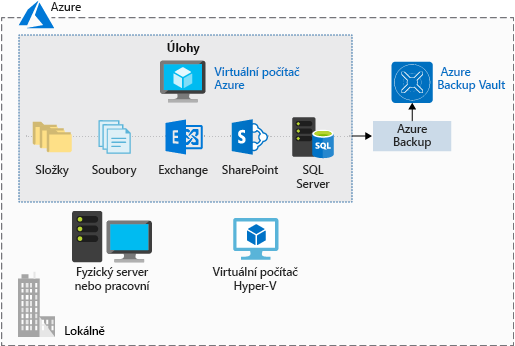

Zálohování dat a zotavení patří k nezbytným součástem plánování každé dobré infrastruktury. Může se vyskytnout chyba, která vymaže nějaká data, nebo budete potřebovat načíst archivovaná data pro účely auditování. Vhodná strategie zálohování zajistí, že nebudete v koncích, když bude potřeba obnovit data nebo software.

**Azure Backup** je nabídka _zálohování jako služby_, která chrání fyzické nebo virtuální počítače bez ohledu na to, jestli je máte umístěné u sebe nebo v cloudu.

Azure Backup lze použít v celé řadě scénářů zálohování dat, mezi které patří:

- Soubory a složky na počítačích s operačním systémem Windows (fyzických nebo virtuálních, místních nebo cloudových)
- Snímky s podporou aplikací (služba Stínová kopie svazku)
- Oblíbené úlohy serverů Microsoftu, například Microsoft SQL Server, Microsoft SharePoint a Microsoft Exchange
- Nativní podpora virtuálních počítačů Azure s Windows i Linuxem
- Klientské počítače s Linuxem a Windows 10

## Výhody používání služby Azure Backup

Tradiční zálohovací řešení nemusí vždy plně využívat základní platformu Azure. Výsledkem je řešení, které může být nákladné nebo neefektivní. Toto řešení nabízí buď příliš mnoho nebo příliš málo úložiště, nenabízí správné typy úložiště nebo má náročné a zdlouhavé úlohy správy. Služba Azure Backup je navržená tak, aby spolupracovala v kombinaci s jinými službami Azure a poskytovala několik výhod.

- **Automatická správa úložiště:** Azure Backup automaticky přiděluje a spravuje úložiště zálohování a používá model založený na průběžných platbách. Platíte jenom za to, co používáte.

- **Neomezené škálování:** Azure Backup využívá výkon a škálovatelnost Azure k zajištění vysoké dostupnosti.

- **Více možností úložiště:** Azure Backup nabízí místně redundantní úložiště, kde všechny kopie dat existují ve stejné oblasti, a geograficky redundantní úložiště, kde se vaše data replikují do sekundární oblasti.

- **Neomezený přenos dat:** Azure Backup neomezuje množství příchozích ani odchozích dat, která přenášíte. Azure Backup také neúčtuje poplatky za přenášená data.

- **Šifrování dat:** Šifrování dat umožňuje zabezpečený přenos a ukládání vašich dat v Azure.

- **Zálohování konzistentní s aplikací:** Zálohování konzistentní s aplikací znamená, že bod obnovení obsahuje všechna požadovaná data pro obnovení záložní kopie. Azure Backup poskytuje zálohy konzistentní s aplikací.

- **Dlouhodobé uchovávání:** Azure neomezuje dobu, po kterou se zálohovaná data uchovávají.

## Použití služby Azure Backup

Azure Backup využívá několik komponent, které si můžete stáhnout a nasadit do všech počítačů, které chcete zálohovat. Nasazená komponenta závisí na tom, co chcete chránit.

- Agent Azure Backup
- System Center Data Protection Manager
- Azure Backup Server
- Rozšíření virtuálního počítače Azure Backup

Azure Backup používá k ukládání dat zálohy trezor služby Recovery Services. Trezor využívá objekty blob Azure Storage, díky čemuž jde o velmi efektivní a úsporné dlouhodobé úložné médium. Při použití tohoto trezoru můžete vybrat zálohované počítače a definovat zásady zálohování (kdy se pořizují snímky a jak dlouho se mají uchovávat).