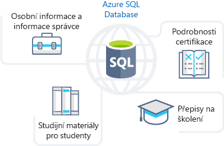
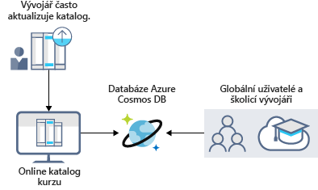
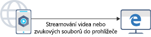
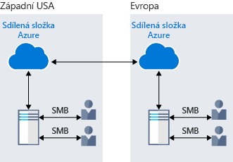
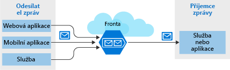
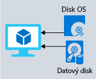

Při pohledu na výhody úložiště dat Azure je vám jasné, že tato služba nabízí nejlepší možnosti uložení vašeho výukového portálu. Teď se podrobně podíváme na jeho výhody a možnosti, abychom zjistili, jak vyhovují vašim obchodním potřebám.

## Jak může datové úložiště Azure splnit vaše potřeby na úložiště pro firmy

Azure nabízí několik možností úložiště podle toho, jaký typ úložiště dat potřebujete. Pojďme se krátce podívat na některé z nich.

:::row:::
  :::column:::
    
  :::column-end:::
    :::column span="3":::  
**Azure SQL Database**

**Azure SQL Database** je robustní plně spravovaná relační cloudová databáze. Tuto funkci můžete využít k ukládání dat, která často používáte a aktualizujete, například osobní údaje a informace o školení pro vaše zaměstnance. Můžete také provést migraci existujících databází SQL Serveru, aniž byste museli měnit své aplikace. Následující obrázek ukazuje typy dat ze scénáře online výukového portálu, které se budou ukládat v databázi Azure SQL.

:::column-end:::
:::row-end:::
:::row:::
  :::column:::
    
  :::column-end:::
    :::column span="3":::  
**Azure Cosmos DB**

Azure Cosmos DB je globálně distribuovaná databázová služba. Podporuje data bez schématu a umožňuje vám sestavovat aplikace s velmi rychlou odezvou a **stálým připojením**, které pracují s neustále se měnícími daty. Tuto funkci můžete využít k ukládání dat, které aktualizují a spravují uživatelé z celého světa. Následující obrázek znázorňuje ukázkovou databázi Azure Cosmos DB sloužící k ukládání dat, ke kterým přistupují lidé po celém světě.

:::column-end:::
:::row-end:::
:::row:::
  :::column:::
    
  :::column-end:::
    :::column span="3":::  
**Azure Blob Storage**

Azure Blob Storage vám umožňuje streamovat velká videa a zvukové soubory přímo do prohlížeče uživatele odkudkoli na světě. Úložiště objektů blob se také používá k ukládání dat pro potřeby zálohování a obnovy, zotavení po havárii a archivace. Můžete do něj uložit až 8 TB dat pro virtuální počítače. Následující obrázek ukazuje příklad použití služby Azure Blob Storage.

:::column-end:::
:::row-end:::
:::row:::
  :::column:::
    
  :::column-end:::
    :::column span="3":::  
**Azure Data Lake Storage Gen2**

Funkce Data Lake umožňuje provádět analýzu využití dat a připravovat sestavy. Data Lake je velké úložiště, do kterého se ukládají strukturovaná i nestrukturovaná data.

Služba **Azure Data Lake Storage Gen2** kombinuje škálovatelnost a úspory nákladů na ukládání objektů se spolehlivostí a výkonem vlastním systémům souborů pro velké objemy dat. Následující obrázek ukazuje, jak Azure Data Lake ukládá všechna vaše firemní data a zpřístupňuje je pro účely analýzy.

:::column-end:::
:::row-end:::
:::row:::
  :::column:::
    
  :::column-end:::
    :::column span="3":::  
**Soubory Azure**

Služba Soubory Azure nabízí plně spravované sdílené složky v cloudu. Aplikace běžící v Azure můžou jednoduše sdílet soubory mezi virtuálními počítači. Sdílené složky Azure můžete současně využívat pro cloudová i místní nasazení systémů Windows, Linux a macOS. Následující obrázek ukazuje použití služby Soubory Azure ke sdílení dat mezi dvěma zeměpisnými umístěními. Služba Soubory Azure využívá protokol SMB (Server Message Block), který zajišťuje šifrování neaktivních uložených dat i přenášených dat.

:::column-end:::
:::row-end:::
:::row:::
  :::column:::
    
  :::column-end:::
    :::column span="3":::  
**Azure Queue**

Azure Queue Storage je služba pro ukládání velkého počtu zpráv, ke které můžete získat přístup odkudkoli na světě. Abyste získali představu, jedna zpráva ve frontě může mít velikost až 64 kB a jedna fronta může obsahovat miliony zpráv.

Obvykle existuje jedna nebo více komponent odesílatele a jedna nebo více komponent příjemce. Komponenty odesílatele přidají zprávu do fronty a komponenty příjemce načtou zprávy ze začátku fronty za účelem zpracování. Následující obrázek ukazuje několik aplikací odesílatele, které přidávají zprávy do fronty Azure, a jednu aplikaci příjemce, která zprávy načítá.

Azure Queue Storage můžete použít k:

- Vytvoření pracovního backlogu a předávání zpráv mezi různými webovými servery Azure
- Distribuci zatížení mezi jiné webové servery / jinou infrastrukturu a správě nárůstu provozu
- Budování odolnosti proti selhání komponent při přistupování k datům více uživateli najednou.

:::column-end:::
:::row-end:::
:::row:::
  :::column:::
    
  :::column-end:::
    :::column span="3":::  
**Azure Storage úrovně Standard**

Virtuální počítače v Azure využívají disky k ukládání operačních systémů, aplikací a dat. Azure Storage úrovně Standard nabízí podporu spolehlivých, nízkonákladových disků pro virtuální počítače spouštějící úlohy, které nemají stěžejní význam. V úložišti úrovně Standard se data ukládají na pevné disky.

Při práci s virtuálními počítači můžete používat pro méně zásadní úlohy standardní disky SSD a HDD a pro zásadně důležité produkční aplikace disky SSD úrovně Premium. Disky Azure konzistentně poskytují odolnost podnikové úrovně s průměrnou roční chybovostí blížící se NULE, takže představují špičku v oboru. Následující obrázek ukazuje virtuální počítač Azure, který k ukládání různých dat používá různé disky.

:::column-end:::
:::row-end:::
:::row:::
  :::column:::
    
  :::column-end:::
    :::column span="3":::  
**Úrovně úložiště**

Azure nabízí pro ukládání objektů blob tři úrovně úložiště:

1. **Horká úroveň úložiště**: optimalizovaná pro ukládání dat, která se využívají často.

1. **Studená úroveň úložiště**: optimalizovaná pro data, která se nevyužívají často a ukládají se nejméně na 30 dnů.

1. **Archivní úroveň úložiště**: pro zřídka používaná data, která se ukládají nejméně na 180 dnů a vyžadují flexibilní latenci.

:::column-end:::
:::row-end:::
:::row:::
  :::column:::
    
  :::column-end:::
    :::column span="3":::  
**Šifrování a replikace**

Azure poskytuje zabezpečení a vysokou dostupnost vašim datům prostřednictvím funkcí šifrování a replikace.

#### Šifrování pro služby úložiště

Pro vaše prostředky jsou k dispozici následující typy šifrování:

1. **Šifrování služby Azure Storage (SSE)** pro neaktivní uložená data pomáhá zabezpečit vaše data, aby se zajistilo dodržení požadavků organizace na zabezpečení a předpisy. Azure SSE data před uložením zašifruje a před načtením zase dešifruje. Šifrování a dešifrování je pro uživatele transparentní.

1. **Šifrování na straně klienta** je princip, kdy data šifrují už klientské knihovny. Azure při nečinnosti ukládá zašifrovaná data a potom je při načítání dešifruje.

#### Replikace pro dostupnost úložiště

Při vytváření účtu úložiště se nastaví určitý typ replikace. Funkce replikace zajišťuje odolnost a neustálou dostupnost vašich dat. Azure poskytuje regionální a geografické replikace za účelem ochrany dat proti přírodním katastrofám a jiným místním událostem, jako jsou požáry nebo záplavy.

  :::column-end:::
:::row-end:::
