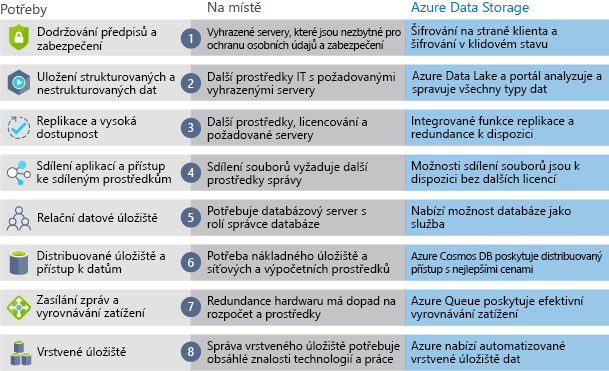

Teď, když znáte výhody a funkce úložiště dat Azure, se podíváme, jak se liší od místního úložiště.

Pojem „místní“ se vztahuje k úložišti a údržbě dat na lokálním hardwaru a serverech. Existuje několik faktorů, které je potřeba zvážit při porovnávání místního úložiště s úložištěm dat Azure.

:::row:::
  :::column:::
    
  :::column-end:::
    :::column span="3":::
**Efektivita nákladů**

Místní úložiště vyžaduje vyhrazený hardware, který je třeba zakoupit, nainstalovat, nakonfigurovat a udržovat. To může představovat vysoké počáteční výdaje (nebo kapitálové náklady). Změna v požadavcích může vyžadovat investice do nového hardwaru. Hardware musí být schopen zpracovávat poptávku ve špičce, což znamená, že mimo špičku může jen „nečinně sedět“ a být nevyužitý.

Úložiště dat Azure poskytuje cenový model průběžných plateb, který je často pro firmy zajímavý, protože se jedná spíše o provozní náklady než o počáteční kapitálové náklady. Služba je také škálovatelná a umožňuje vertikálně a horizontálně navyšovat kapacitu podle měnící se poptávky a zase ji snižovat v době poklesu poptávky. Datové služby vám budou účtovány podle skutečné potřeby.

:::column-end:::
:::row-end:::
:::row:::
  :::column:::
    
  :::column-end:::
    :::column span="3":::
**Spolehlivost**

Místní úložiště vyžaduje strategie zálohování dat, vyrovnávání zatížení a zotavení po havárii. To může být časově náročné a finančně nákladné, protože každá ze strategií často potřebuje vyhrazený server, což zase vyžaduje výrazné investice jak do hardwaru, tak i IT prostředků.

Úložiště dat Azure poskytuje zálohování dat, vyrovnávání zatížení, zotavení po havárii a replikaci dat jako služby, které zajišťují bezpečnost a vysokou dostupnost dat.

:::column-end:::
:::row-end:::
:::row:::
  :::column:::
    
  :::column-end:::
    :::column span="3":::
**Typy úložiště**

V některých případech řešení vyžaduje více různých typů úložiště, například souborové a databázové úložiště. Místní přístup často vyžaduje pro jednotlivé typy úložiště bezpočet serverů a nástrojů pro správu.

Úložiště dat Azure poskytuje řadu různých možností úložiště, včetně úložiště pro distribuovaný přístup a vrstveného úložiště. Tím umožňuje integrovat kombinaci technologií úložiště a poskytuje pro jednotlivé části řešení nejlepší volbu úložiště.

:::column-end:::
:::row-end:::
:::row:::
  :::column:::
    
  :::column-end:::
    :::column span="3":::
**Flexibilita**

Požadavky a technologie se mění. U místního nasazení to může znamenat zřizování a nasazování nových serverů a částí infrastruktury, což je časově a finančně náročná činnost.

Flexibilita úložiště dat Azure vám umožňuje vytvářet služby během několika minut. Můžete rychle změnit back-endy úložiště, aniž byste museli investovat vysoké částky do hardwaru.

Následující obrázek ukazuje rozdíly mezi místním úložištěm a úložištěm dat Azure.

  :::column-end:::
:::row-end:::