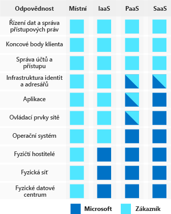

S přesunem výpočetních prostředí z datacenter řízených zákazníkem do cloudových datacenter se přesouvá i odpovědnost za zabezpečení. Za zabezpečení teď odpovídá jak poskytovatel cloudových služeb, tak i zákazníci. U každé aplikace a každého řešení je důležité pochopit, za co máte odpovědnost vy a za co Azure.

#### Pochopení bezpečnostních hrozeb

> [!VIDEO https://www.microsoft.com/videoplayer/embed/RWkotg]

#### Zabezpečení Azure: vy a cloud

> [!VIDEO https://www.microsoft.com/videoplayer/embed/RE2yEvj]

## Sdílení odpovědnosti za zabezpečení s Azure

Prvním vaším přesunem bude přesun z místních datacenter na infrastrukturu jako službu (IaaS). V případě IaaS využíváte nejnižší úroveň služby a požadujete po Azure vytváření virtuálních počítačů a virtuálních sítí. Na této úrovni máte stále odpovědnost za opravy a zabezpečení svých operačních systémů a softwaru i za konfiguraci zabezpečení své sítě. Ve společnosti Contoso Shipping využíváte IaaS, když začnete používat virtuální počítače Azure místo vlastních místních fyzických serverů. Kromě provozních výhod získáte bezpečnostní výhodu díky tomu, že se starost o ochranu fyzických částí sítě přenese na externího dodavatele.

Přechodem na platformu jako službu (PaaS) se řada starostí o zabezpečení přenese na externího dodavatele. Na této úrovni se Azure stará o operační systém a většinu základního softwaru, jako jsou systémy správy databází. Vše se aktualizuje s použitím nejnovějších oprav zabezpečení a vše je také možné integrovat s Azure Active Directory za účelem zajištění řízení přístupu. PaaS přináší také řadu provozních výhod. Místo ručního vytváření celých infrastruktur a podsítí pro vaše prostředí můžete prostřednictvím klikání na webu Azure Portal nebo spouštění automatizovaných skriptů zapínat a vypínat složité zabezpečené systémy a podle potřeby je škálovat. Společnost Contoso Shipping používá Azure Event Hubs k ingestování telemetrických dat z dronů a nákladních vozů a stejně tak používá i webovou aplikaci s back-endem Azure Cosmos DB a jeho mobilními aplikacemi – to vše jsou příklady PaaS.

V případě softwaru jako služby (SaaS) přenášíte na externího dodavatele téměř vše. SaaS je software, který běží pomocí internetové infrastruktury. Kód řídí dodavatel, ale je nakonfigurovaný tak, aby ho používal zákazník. Společnost Contoso Shipping stejně jako mnoho společností využívá Office 365, což je skvělý příklad modelu SaaS!

## Vícevrstvý přístup k zabezpečení

*Hloubková ochrana* je strategie, která využívá řady mechanismů ke zpomalení postupu útoku s cílem získat neoprávněný přístup k informacím. Každá vrstva poskytuje ochranu, takže pokud dojde k prolomení jedné vrstvy, zabrání dalšímu ohrožení následující vrstva. Microsoft používá vícevrstvý přístup zabezpečení jak u fyzických datových center, tak i napříč službami Azure. Cílem hloubkové ochrany je chránit informace a bránit jejich krádeži někým, kdo k nim nemá oprávnění přistupovat.

Hloubkovou ochranu si můžete představit jako sadu soustředných kruhů, v jejichž středu jsou data, která potřebujete zabezpečit. Každý kruh přidává kolem dat další vrstvu zabezpečení. Tento přístup ruší závislost na jedné vrstvě ochrany, slouží ke zpomalení útoku a poskytuje telemetrii výstrah, na kterou můžete reagovat ručně nebo automaticky. Pojďme se podívat na jednotlivé vrstvy.

:::row:::
  :::column:::
    
  :::column-end:::
    :::column span="3":::  
**Data**

Téměř ve všech případech jdou útočníci po datech:

- Uložených v databázi
- Uložených na disku virtuálních počítačů
- Uložených v aplikaci SaaS jako Office 365
- Uložených v cloudovém úložišti

Za zajištění vhodného zabezpečení zodpovídají ti, kteří data ukládají a řídí k nim přístup. Často existují zákonné požadavky předepisující mechanismy a procesy, které musí být splněné, aby se zajistila důvěrnost, integrita a dostupnost dat.
  :::column-end:::
:::row-end:::

:::row:::
  :::column:::
    
  :::column-end:::
    :::column span="3":::  
**Aplikace**

- Zajistěte, aby aplikace byly zabezpečené a neobsahovaly chyby zabezpečení.
- Ukládejte citlivé tajné kódy aplikací do zabezpečeného úložného média.
- Vytvořte ze zabezpečení požadavek, který se musí při návrhu všech aplikací zohlednit.

Integrace zabezpečení do životního cyklu vývoje aplikací vám pomůže snížit počet ohrožení zabezpečení zavedených do kódu. Doporučujeme vyzvat všechny vývojové týmy, aby u svých aplikací ve výchozím stavu zajistili zabezpečení a zavedli povinné požadavky na zabezpečení.
  :::column-end:::
:::row-end:::

:::row:::
  :::column:::
    
  :::column-end:::
    :::column span="3":::  
**Výpočetní služby**

- Zabezpečte přístup k virtuálním počítačům.
- Implementujte ochranu koncových bodů a stahujte do svých systémů opravy zabezpečení a aktualizace.

Malware, systémy bez oprav zabezpečení a nesprávně zabezpečené systémy dělají z vašeho prostředí snadný cíl. U této vrstvy se zaměřte na zabezpečení výpočetních prostředků a použití vhodných kontrolních mechanismů, které minimalizují problémy se zabezpečením.
  :::column-end:::
:::row-end:::

:::row:::
  :::column:::
    
  :::column-end:::
    :::column span="3":::  
**Sítě**

- Omezte komunikaci mezi prostředky.
- Ve výchozím stavu ji odepírejte.
- Omezte příchozí a odchozí internetový přístup (kde je to žádoucí).
- Implementujte zabezpečené připojení k místním sítím.

U této vrstvy se zaměřte na omezení síťového připojení napříč všemi prostředky a povolte ho pouze v nutných případech. Omezením této komunikace snižujete riziko laterálního pohybu v celé síti.
  :::column-end:::
:::row-end:::

:::row:::
  :::column:::
    
  :::column-end:::
    :::column span="3":::  
**Hranice**

- Použijte ochranu před útoky DDoS, abyste odfiltrovali rozsáhlé útoky předtím, než způsobí odepření služeb koncovým uživatelům.
- Použijte hraniční brány firewall k identifikaci škodlivých útoků na vaši síť a k upozornění na ně.

Na hranici sítě jde o ochranu před síťovými útoky na prostředky. Identifikace těchto útoků, eliminace jejich důsledků a upozorňování na ně, když k nim dojde, jsou důležité způsoby zabezpečení sítě.
  :::column-end:::
:::row-end:::

:::row:::
  :::column:::
    
  :::column-end:::
    :::column span="3":::  
**Identita a přístup**

- Využívejte řízení přístupu k infrastruktuře a řízení změn.
- Používejte jednotné přihlašování a vícefaktorové ověřování.
- Auditujte události a změny.

U vrstvy identity a přístupu jde hlavně o zajištění zabezpečení identit, udělení přístupu pouze tomu nejnutnějšímu a protokolování změn.
  :::column-end:::
:::row-end:::

:::row:::
  :::column:::
    
  :::column-end:::
    :::column span="3":::  
**Fyzické zabezpečení**

- První linii obrany představuje fyzické zabezpečení budovy a řízení přístupu k výpočetnímu hardwaru v datacentru.

U fyzického zabezpečení jde o zajištění fyzické ochrany majetku proti nedovolenému přístupu. Tím se zajistí, že další vrstvy nebude možné obejít a že v případě ztráty nebo odcizení se bude postupovat odpovídajícím způsobem.
  :::column-end:::
:::row-end:::

## Shrnutí

Ukázali jsme si, že Azure ve velké míře pomáhá se zabezpečením. Zabezpečení je však stále **sdílenou odpovědností**. Jak velká část odpovědnosti na nás připadne záleží na modelu, který v Azure používáme.

Jako vodítko při zvažování, jaké způsoby ochrany jsou pro naše data a prostředí odpovídající, používáme kruhy *hloubkové ochrany*.
