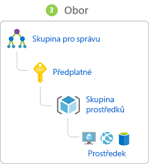
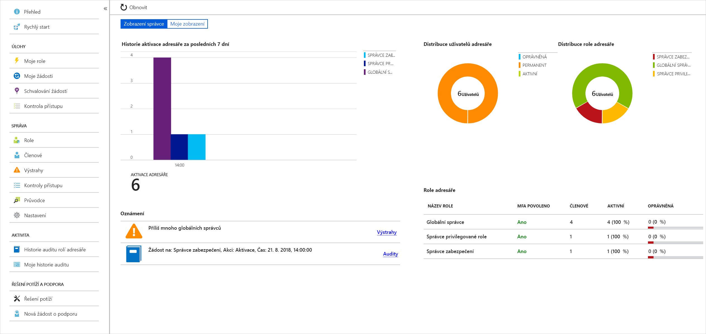

Hraniční sítě, jejich brány firewall a fyzické řízení přístupu představovaly primární ochranu podnikových dat. Obrovský rozmach zařízení BYOD, mobilních aplikací a cloudových aplikací však způsobil, že hraniční sítě jsou stále více propustnější. 

Novou primární hranicí zabezpečení se stala identita. Správné ověření a přiřazení oprávnění je proto pro zachování kontroly nad vašimi daty naprosto zásadní.

Vaše společnost Contoso Shipping se snaží tyto problémy řešit přímo. Nové hybridní cloudové řešení vašeho týmu musí brát v potaz mobilní aplikace, které mají přístup k údajům o tajných kódech, když je přihlášený oprávněný uživatel – jejich přepravní vozidla navíc odesílají konstantní datový proud telemetrických dat, která jsou pro optimalizaci jejich podnikání naprosto zásadní.

## Jednotné přihlašování

Čím více identit musí uživatel spravovat, tím větší je riziko bezpečnostního incidentu souvisejícího s přihlašovacími údaji. Více identit znamená, že uživatel si musí pamatovat a měnit více hesel. Zásady hesel se můžou mezi aplikacemi lišit, a protože požadavky na složitost hesel rostou, je pro uživatele stále obtížnější si hesla pamatovat.

Nyní zvažte logistiku správy všech těchto identit. Zvyšují se nároky na helpdesk, který se musí zabývat problémy s uzamčením účtů a žádostmi o resetování hesel. Pokud uživatel opustí organizaci, může být náročné sledovat všechny tyto identity a zajistit, aby byly zakázané. Pokud se nějaká identita přehlédne, může to umožnit přístup, i když by měl být vyloučený.

Při použití jednotného přihlašování (SSO) si uživatelé musí pamatovat jenom jedno ID a jedno heslo. Jediné identitě vázané na uživatele je umožněný přístup z různých aplikací, což zjednodušuje model zabezpečení. Když uživatelé mění role nebo opouštějí organizaci, jsou změny přístupu vázané na jedinou identitu. Tím se značně snižuje úsilí potřebné ke změně nebo zákazu účtů. Při použití jednotného přihlašování můžou uživatelé spravovat své identity snadněji a zlepší se možnosti zabezpečení ve vašem prostředí.

:::row:::
  :::column:::
    
  :::column-end:::
    :::column span="3":::
**Jednotné přihlašování (SSO) s Azure Active Directory**

Azure Active Directory (AD) je cloudová služba identit. Má integrovanou podporu synchronizace s místní službou Active Directory nebo se dá používat samostatně. To znamená, že všechny aplikace, ať už místní, v cloudu (včetně Office 365) nebo i mobilní, můžou sdílet stejné přihlašovací údaje. Správci a vývojáři můžou řídit přístup k datům a aplikacím pomocí centralizovaných pravidel a zásad nakonfigurovaných v Azure AD.

Využitím Azure AD k jednotnému přihlašování můžete kombinovat různé zdroje dat do systému Intelligent Security Graph. Ten umí poskytnout analýzu hrozeb a ochranu identit v reálném čase všem účtům v Azure AD – i účtům synchronizovaným z místní služby AD. Použitím centralizovaného zprostředkovatele identity budete mít centralizované bezpečnostní prvky, vytváření sestav, upozorňování a správu infrastruktury identity.

Společnost Contoso Shipping integruje svou existující instanci služby Active Directory s Azure AD, čímž zajistíte konzistentní řízení přístupu v celé organizaci. Tím se také výrazně zjednodušuje možnost přihlásit se k e-mailu a dokumentům Office 365 bez nutnosti opětovného ověření.
  :::column-end:::
:::row-end:::

## Vícefaktorové ověřování

Vícefaktorové ověřování (MFA) poskytuje dodatečné zabezpečení pro vaše identity – k úplnému ověření se vyžadují dva nebo více prvků. Tyto prvky spadají do tří kategorií:

- *Něco, co víte*
- *Něco, co máte*
- *Něco, co jste*

**Něco, co víte** může být heslo nebo odpověď na bezpečnostní otázku. **Něco, co máte**, může být mobilní aplikace, která obdrží oznámení, nebo zařízení, které generuje token. **Něco, co jste**, je obvykle nějaký druh biometrické vlastnosti používaný na mnoha mobilních zařízeních, například otisk prstu nebo sken obličeje.

Použití služby Multi-Factor Authentication (MFA) zlepší zabezpečení vaší identity omezením důsledků prozrazení přihlašovacích údajů. Útočník, který má heslo uživatele, by k úplnému ověření musel získat i telefon nebo obličej uživatele. Ověření pomocí jenom jednoho faktoru je nedostatečné a útočník nebude moct prokázat svoji identitu jen pomocí těchto přihlašovacích údajů. Výhody, které to přináší z hlediska zabezpečení, jsou obrovské. Je potřeba zdůraznit, že kdykoli je to možné, je důležité vícefaktorové ověřování (MFA – Multi-Factor Authentication) povolit.

Služba Azure AD má schopnosti MFA integrované a může se integrovat s jinými poskytovateli MFA. Ověřování MFA je poskytováno bezplatně každému uživateli, který má v Azure AD roli globálního správce, protože se jedná o vysoce citlivé účty. U všech ostatních účtů se dá MFA povolit zakoupením licence s touto funkcí a také přiřazením licence k účtu.

Pro Contoso Shipping se rozhodnete povolit vícefaktorové ověřování, kdykoli se uživatel přihlašuje z počítače, který není připojený k doméně, což zahrnuje mobilní aplikace, kterou používají vaši řidiči.

## Poskytování identit službám

Pro služby je obvykle cenné mít identity. Častokrát v rozporu s doporučeními jsou přihlašovací údaje vložené v konfiguračních souborech. Bez zabezpečení konfiguračních souborů se může k těmto přihlašovacím údajům dostat každý, kdo má k systémům nebo úložištím přístup, a riskuje jejich prozrazení.

Azure AD řeší tento problém dvěma způsoby: instančními objekty a spravovanými identitami pro služby Azure.

:::row:::
  :::column:::
    
  :::column-end:::
    :::column span="3":::
**Instanční objekty**

Abyste porozuměli instančním objektům, měli byste nejdřív chápat pojmy **identita** a **objekt zabezpečení** z hlediska toho, jak se používají v prostředí správy identit.

**Identita** je jednoduše něco, co se dá ověřit. Samozřejmě to zahrnuje uživatele s uživatelskými jmény a hesly, ale může jít také o aplikace nebo jiné servery, které se prokazují například pomocí tajných kódů nebo certifikátů. Jako definici navíc uveďme, že **účet** označuje data přidružená k identitě.

**Objekt zabezpečení** je identita jednající s určitými rolemi nebo deklaracemi. Obvykle není vhodné uvažovat o identitě a objektu zabezpečení odděleně, ale pomyslet na použití příkazu `sudo` (na příkazovém řádku Bash v Linuxu) nebo na možnost Spustit jako správce (ve Windows). V obou těchto případech jste dál přihlášení se stejnou identitou jako předtím, ale změnili jste roli, pod kterou něco spouštíte. Skupiny se také často považují za objekty zabezpečení, protože jim lze přiřadit práva.

Název **instanční objekt** je proto výstižný. Je to identita použitá službou nebo aplikací. A stejně jako u jiných identit se instančnímu objektu dají přiřadit role.
  :::column-end:::
:::row-end:::

:::row:::
  :::column:::
    
  :::column-end:::
    :::column span="3":::
**Spravované identity pro služby Azure**

Vytváření instančních objektů je zdlouhavé a jejich údržba může být z mnoha důvodů obtížná. Spravované identity pro služby Azure jsou mnohem jednodušší a většinu práce udělají za vás. 

Spravovaná identita se dá okamžitě vytvořit pro libovolnou službu Azure, která ji podporuje, přičemž tento seznam se neustále rozrůstá. Když pro službu vytváříte spravovanou identitu, vytvoříte účet na tenantovi služby Azure Active Directory. Infrastruktura Azure se automaticky postará o ověřování služby a správu účtu. Tento účet pak můžete používat stejně jako jakýkoli jiný účet Azure AD – například bezpečně nechat ověřenou službu přistupovat k dalším prostředkům Azure.
  :::column-end:::
:::row-end:::

## Řízení přístupu na základě role

Role jsou sady oprávnění, jako je „Jen pro čtení“ nebo „Přispěvatel“, která se dají udělit uživatelům pro přístup k instanci služby Azure.

Identity jsou mapovány na role přímo nebo prostřednictvím členství ve skupinách. Oddělení objektů zabezpečení, přístupových oprávnění a prostředků umožňuje jednoduchou správu přístupu a jemně odstupňovanou kontrolu. Správci jsou schopní zajistit udělení minimálních potřebných oprávnění.

Role lze udělit na úrovni jednotlivých instancí služeb, ale zároveň je mohou přebírat nižší úrovně hierarchie Azure Resource Manageru.

Toto je diagram zobrazující tuto relaci. Role přiřazené ve vyšším oboru, například pro celé předplatné, se dědí do podřízených oborů, jako jsou instance služby.

:::row:::
  :::column:::
    
  :::column-end:::
    :::column span="3":::
**Privileged Identity Management**

Kromě správy přístupu k prostředkům Azure pomocí řízení přístupu na základě role (RBAC) byste při komplexním přístupu k ochraně infrastruktury měli zvážit zahrnutí průběžného auditování členů rolí s tím, jak se jejich organizace mění a vyvíjí. Azure AD Privileged Identity Management (PIM) je další placená nabídka, která poskytuje přehled o přiřazeních rolí, samoobslužnou aktivaci rolí za běhu a kontroly přístupu k prostředkům Azure AD a Azure.

  :::column-end:::
:::row-end:::

## Shrnutí

Identita nám umožňuje udržovat hraniční síť zabezpečení i mimo naši fyzickou kontrolu. S využitím jednotného přihlašování a vhodné konfigurace přístupu na základě rolí si můžeme být vždy jistí tím, kdo může vidět naše data a infrastrukturu a manipulovat s nimi.