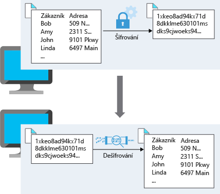
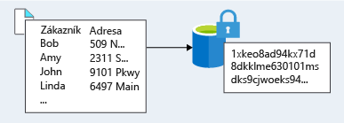

Data jsou pro většinu organizací tím nejcennějším majetkem, který nejde nijak nahradit. Šifrování slouží ve vícevrstvé strategii zabezpečení jako poslední a nejsilnější linie obrany. 

Contoso Shipping ví, že šifrování je tou jedinou ochranou, kterou data po opuštění datacentra na cestě do mobilních aplikací mají.

## Co je šifrování?

Šifrování je proces, kterým se data změní tak, aby se stala pro neautorizované uživatele nečitelnými a nepoužitelnými. K použití nebo čtení šifrovaných dat je nutné je *dešifrovat*, což vyžaduje použití tajného kódu. Existují dva základní typy šifrování: **symetrické** a **asymetrické**.

Symetrické šifrování používá k zašifrování i dešifrování dat stejný klíč. Představte si používání počítačové aplikace pro správu hesel. Zadáte hesla a ta se zašifrují pomocí vašeho osobního klíče (ten se často odvozuje od vašeho hlavního hesla). Když je potřeba data načíst, použije se stejný klíč a data se dešifrují.

Asymetrické šifrování používá pár veřejného klíče a privátního klíče. Každý z klíčů může data zašifrovat, ale nemůže dešifrovat svá vlastní zašifrovaná data. K dešifrování potřebujete druhý klíč z páru. Asymetrické šifrování se používá třeba u protokolu TLS (používaného v protokolu HTTPS) a podepisování dat.

Symetrické i asymetrické šifrování hraje svou roli při řádném zabezpečení dat. 

K šifrování se obvykle přistupuje dvěma způsoby: šifrování neaktivních uložených dat a šifrování během přenosu.

## Šifrování během přenosu

Přenášená data jsou data aktivně přesouvaná z jednoho umístění do druhého, například přes internet nebo prostřednictvím privátní sítě. Zabezpečený přenos může být vyřešen několika různými vrstvami. Může se provádět šifrováním dat v aplikační vrstvě před jejich odesláním přes síť. Příkladem šifrování přenosu v aplikační vrstvě je protokol HTTPS.

Pro přenos dat mezi dvěma systémy také můžete nastavit zabezpečený kanál v síťové vrstvě, například virtuální privátní síť (VPN).

Šifrování dat během přenosu chrání data před vnějšími pozorovateli a poskytuje mechanismus pro přenos dat při současném snížení rizika ohrožení.

Následující diagram zobrazuje tento proces. Zákaznická data se tady při odesílání prostřednictvím sítě šifrují. Tajný kód, který může data dešifrovat do použitelné podoby, má pouze příjemce.

## Šifrování neaktivních uložených dat

Neaktivní uložená data jsou data, která jsou uložená na fyzickém médiu. Můžou to být data uložená na disku serveru, data uložená v databázi nebo data uložená v účtu úložiště. Šifrování neaktivních uložených dat bez ohledu na mechanismus jejich uložení zaručuje, že uložená data jsou nečitelná bez klíčů a tajných kódů potřebných k jejich dešifrování. Pokud by útočník získal pevný disk s šifrovanými daty a neměl přístup k šifrovacím klíčům, bylo by pro něj ohrožení dat značně obtížné.

Samotná zašifrovaná data se můžou lišit v obsahu, použití a důležitosti pro organizaci. Může jít o finanční informace důležité pro podnikání, duševní vlastnictví vyvinuté firmou, osobní údaje zákazníků nebo zaměstnanců, které firma ukládá, nebo dokonce i klíče a tajné kódy pro šifrování samotných dat.

Tento diagram ukazuje, jak mohou zašifrovaná zákaznická data vypadat při uložení do databáze.

## Šifrování v Azure

Pojďme se podívat na některé způsoby, jak Azure umožňuje šifrovat data napříč službami.

:::row:::
  :::column:::
    
  :::column-end:::
    :::column span="3":::  
**Šifrování úložiště nezpracovaných dat**

Šifrování služby Azure Storage pro neaktivní uložená data pomáhá chránit vaše data, aby se splnily závazky organizace související se zabezpečením a dodržováním předpisů. Pomocí této funkce platforma Azure Storage automaticky šifruje vaše data před jejich uložením do Azure Managed Disks, Azure Blob Storage, Souborů Azure nebo úložiště Azure Queue a před načtením je dešifruje. Provádění šifrování, šifrování neaktivních uložených dat, dešifrování a správy klíčů v šifrování služby Storage je pro aplikace, které tyto služby využívají, transparentní.
  :::column-end:::
:::row-end:::

:::row:::
  :::column:::
    
  :::column-end:::
    :::column span="3":::  
**Šifrování virtuálních počítačů**

Šifrování služby Storage poskytuje nízkoúrovňovou šifrovací ochranu pro data zapsaná na fyzický disk, jak ale můžete chránit virtuální pevné disky (VHD) virtuálních počítačů? Co když útočníci se zlými úmysly získají přístup k vašemu předplatnému Azure a exfiltrují virtuální pevné disky vašich virtuálních počítačů? Jak byste zajistili, aby se nemohli dostat k datům uloženým na virtuálním pevném disku?

Azure Disk Encryption je služba, která pomáhá šifrovat disky virtuálních počítačů IaaS se systémy Windows a Linux. Azure Disk Encryption k zajištění šifrování svazků pro operační systém a datové disky používá standardní funkci BitLocker systému Windows a funkci dm-crypt systému Linux. Toto řešení je integrované se službou Azure Key Vault a pomáhá řídit a spravovat klíče a tajné kódy pro šifrování disků (a pro přístup ke službě Key Vault můžete používat identity spravovaných služeb).

Pro společnost Contoso Shipping bylo použití virtuálních počítačů jedním z prvních kroků směrem ke cloudu. Mít všechny virtuální pevné disky zašifrované je velmi snadným a nenáročným způsobem, jak si můžete být jistí, že děláte pro bezpečí svých dat maximum.
  :::column-end:::
:::row-end:::

:::row:::
  :::column:::
    
  :::column-end:::
    :::column span="3":::  
**Šifrování databází**

Transparentní šifrování dat pomáhá chránit Azure SQL Database a Azure Data Warehouse před hrozbou škodlivých aktivit. Provádí šifrování a dešifrování neaktivní uložené databáze, souvisejících záloh a souborů transakčních protokolů v reálném čase a nevyžaduje žádné změny v aplikaci. Ve výchozím nastavení je transparentní šifrování dat povolené pro všechny nově nasazené instance služby Azure SQL Database.

Transparentní šifrování dat šifruje úložiště celé databáze pomocí symetrického klíče nazývaného šifrovací klíč databáze. Ve výchozím nastavení Azure poskytuje jedinečný šifrovací klíč pro každou logickou instanci SQL Serveru a zpracovává všechny podrobnosti. S klíči uloženými ve službě Azure Key Vault je také podporovaná služba Bring Your Own Key (BYOK).

Protože je transparentní šifrování dat ve výchozím nastavení povolené, můžete si být jistí, že Contoso Shipping má data uložená ve firemních databázích řádně ochráněná.
  :::column-end:::
:::row-end:::

:::row:::
  :::column:::
    
  :::column-end:::
    :::column span="3":::  
**Šifrování tajných kódů**

Viděli jsme, že všechny služby šifrování používají klíče pro šifrování a dešifrování dat. Jak tedy zajistíme zabezpečení samotných klíčů? Společnosti můžou mít také hesla, připojovací řetězce nebo jiné citlivé informace, které potřebují mít bezpečně uložené.

Azure Key Vault je cloudová služba, která funguje jako zabezpečené úložiště tajných kódů. Key Vault vám umožní vytvořit několik zabezpečených kontejnerů označovaných jako trezory. Tyto trezory využívají moduly hardwarového zabezpečení (HSM). Trezory pomáhají snížit riziko nechtěné ztráty informací o zabezpečení tím, že centralizují ukládání tajných kódů aplikací. Trezory klíčů také řídí a protokolují přístup ke všem položkám, které jsou v nich uložené. Služba Azure Key Vault může zpracovávat žádosti o certifikáty TLS a jejich obnovování a poskytuje funkce potřebné pro robustní řešení správy životního cyklu certifikátů. Služba Key Vault je navržená tak, aby podporovala všechny typy tajných kódů. Těmito tajnými kódy můžou být hesla, přihlašovací údaje databáze, klíče rozhraní API a certifikáty.

Vzhledem k tomu, že identitám služby Azure AD jde udělit přístup k používání tajných kódů ve službě Azure Key Vault, můžou aplikace s povolenými identitami spravovaných služeb automaticky a hladce získat tajné kódy, které potřebují.
  :::column-end:::
:::row-end:::

## Shrnutí

Jak možná víte, je šifrování často poslední vrstvou obrany proti útokům a je důležitou součástí vícevrstvého přístupu k zabezpečení vašich systémů. Azure poskytuje integrované možnosti a služby pro šifrování a ochranu dat před nechtěným zpřístupněním. Ochrana zákaznických dat uložených ve službách Azure má pro Microsoft nejvyšší význam a měla by být součástí každého návrhu. Základní služby jako Azure Storage, Azure Virtual Machines, Azure SQL Database a Azure Key Vault vám můžou pomoct zabezpečit vaše prostředí pomocí šifrování.
