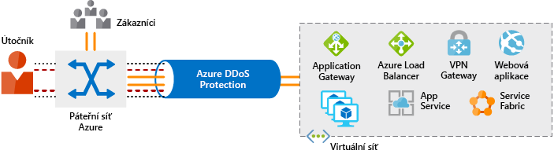

Zabezpečení sítě před útoky a neoprávněným přístupem je důležitou součástí každé architektury. Podíváme se teď na to, jak zabezpečení sítě vypadá, jak do architektury integrovat vícevrstvý přístup a jak vám Azure může pomáhat se zabezpečením sítě pro vaše prostředí.

## Vícevrstvý přístup k zabezpečení sítě

Možná jste si všimli, že společným motivem v rámci tohoto modulu je důraz na vícevrstvý přístup k zabezpečení, a v síťové vrstvě tomu není jinak. Nestačí jenom zaměřit se na zabezpečení hraniční sítě nebo na zabezpečení sítě mezi službami v síti. Vícevrstvý přístup nabízí několik úrovní ochrany, takže pokud útočník pronikne jednou vrstvou, jsou zavedené další ochrany k omezení dalšího útoku.

Pojďme se podívat, jak může Azure poskytnout nástroje pro vícevrstvý přístup k zabezpečení vaší sítě.

:::row:::
  :::column:::
    
  :::column-end:::
    :::column span="3"::::
**Ochrana na internetu**

Pokud začneme v hraniční síti, zaměřujeme se na omezení a vyloučení útoků z internetu. Doporučujeme začít nejdřív vyhodnocením prostředků přístupných z internetu a povolit příchozí a odchozí komunikaci jenom tam, kde je to nezbytné. Identifikujte všechny prostředky, které povolují příchozí síťový provoz jakéhokoli typu, a pak zajistěte, aby byly omezené jenom na požadované porty a protokoly. Skvělým místem, kde tyto informace hledat, je Azure Security Center, protože identifikuje prostředky přístupné z internetu, ke kterým nejsou přidružené skupiny zabezpečení sítě, a také prostředky, které nejsou zabezpečené za bránou firewall.

K zajištění ochrany u příchozích přenosů v hraniční síti máte několik možností:

* Azure Application Gateway je nástroj pro vyrovnávání zatížení zahrnující firewall webových aplikací, který poskytuje ochranu před běžnými známými chybami zabezpečení.

* Síťová virtuální zařízení jsou ideální možností pro služby bez HTTP nebo pokročilé konfigurace a jsou podobné hardwarovým zařízením brány firewall.

Jakýkoli prostředek přístupný z internetu je vystavený riziku napadení prostřednictvím útoku na dostupnost služby. Tyto typy útoků se snaží zahltit síťový prostředek zasíláním tolika požadavků, že se prostředek zpomalí nebo přestane reagovat. Ke zmírnění těchto útoků poskytuje ochrana Azure před útoky DDoS základní ochranu všech služeb Azure a vylepšenou ochranu, kterou je možné dál přizpůsobit vašim prostředkům. Ochrana Azure před útoky DDoS blokuje provoz útoku a zbývající provoz přesměrovává do zamýšleného cíle. Během několika minut od detekce útoku budete upozorněni pomocí metrik Azure Monitoru.

Tento diagram znázorňuje síťový provoz směřující od zákazníků a útočníka do Azure. Služba Azure DDoS Protection identifikuje pokus útočníka o zahlcení sítě a brání dalšímu provozu v dosažení služeb Azure. Legitimní provoz pocházející od zákazníků směřuje do Azure i nadále bez jakéhokoli přerušení služby.

 :::column-end:::
:::row-end:::

:::row:::
  :::column:::
    
  :::column-end:::
    :::column span="3"::::
**Zabezpečení virtuální sítě**

Ve virtuální síti (VNet) je velmi důležité omezit komunikaci mezi prostředky na nezbytné minimum.

Důležitou součástí k omezení zbytečné komunikace mezi virtuálními počítači jsou skupiny zabezpečení sítě. Poskytují seznam povolené nebo zamítnuté komunikace do a ze síťových rozhraní a podsítí a dají se plně přizpůsobit.

Když omezíte přístup ke koncovým bodům služby, můžete úplně odebrat veřejný internetový přístup k vašim službám. Pomocí koncových bodů služby je možné omezit přístup ke službě Azure na vaši virtuální síť.
 :::column-end:::
:::row-end:::

:::row:::
  :::column:::
    
  :::column-end:::
    :::column span="3"::::
**Integrace sítě**

Je běžné mít existující síťovou infrastrukturu, která se musí integrovat, aby zajistila komunikaci z místních sítí nebo zajistila lepší komunikaci mezi službami v Azure. Existuje několik klíčových způsobů, jak tuto integraci zvládnout a zlepšit zabezpečení vaší sítě.

Připojení virtuální privátní sítě (VPN) představují běžný způsob, jak vytvořit zabezpečené komunikační kanály mezi sítěmi. Připojení mezi virtuální sítí Azure a místním zařízením VPN je skvělý způsob, jak zajistit zabezpečenou komunikaci mezi vaší sítí a virtuální sítí v Azure.

Pokud chcete poskytnout vyhrazené soukromé připojení mezi vaší sítí a Azure, můžete použít Azure ExpressRoute. ExpressRoute umožňuje rozšířit vaše místní sítě do cloudu Microsoftu přes soukromé připojení zajišťované poskytovatelem připojení. Pomocí ExpressRoute můžete vytvořit připojení ke cloudovým službám Microsoftu, jako je například Microsoft Azure, Office 365 nebo Dynamics 365. Tím se vylepšuje zabezpečení místní komunikace díky odesílání tohoto provozu přes privátní okruh místo přes internet. Nemusíte povolovat přístup k těmto službám pro vaše koncové uživatele přes internet a můžete tento provoz odesílat prostřednictvím zařízení pro další kontroly provozu.
 :::column-end:::
:::row-end:::

## Shrnutí

Vícevrstvý přístup k zabezpečení sítě pomáhá snižovat riziko ohrožení prostřednictvím síťových útoků. Azure poskytuje několik služeb a funkcí pro zabezpečení prostředků přístupných z internetu, interních prostředků a komunikaci mezi místními sítěmi. Tyto funkce umožňují vytvářet bezpečná řešení v Azure.