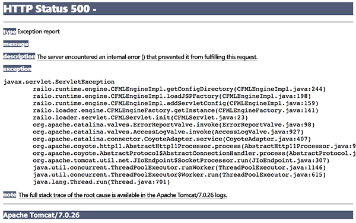

Nejlepší je začít od začátku. Nejprve si položme základní otázku: „Co je SRE (Site Reliability Engineering)?“
Na to otázku existuje celá řada odpovědí, včetně [často citované definice](https://landing.google.com/sre/book/chapters/introduction.html) od člověka, který tento termín poprvé použil (Ben Treynor Sloss v Google). Tohle je ale ta nejpraktičtější odpověď, kterou můžeme nabídnout:

> Site Reliability Engineering (SRE) je technická disciplína, která pomáhá organizaci k dosažení odpovídající úrovně spolehlivosti jejích systémů, služeb a produktů.

Později můžeme rozebrat další definice, ale teď pojďme začít s touto. V této definici jsou dvě zásadní části, které nás po rozklíčování dovedou k otázce: „Proč je to důležité?“.

## Spolehlivost

Klíčové je slovo „spolehlivost“ („Reliability“ uprostřed zkratky SRE). Definice nehovoří o „odpovídající úrovni výkonu“, „odpovídající úrovni efektivity“, „odpovídající úrovni stability“ nebo dokonce „dosažení odpovídající úrovně příjmu“. Mluví o „odpovídající úrovni spolehlivosti“. Proč?

Pojďme si něco předvést. Tady je snímek obrazovky. Co myslíte, že ukazuje? Zkuste nepokračovat, dokud vás něco nenapadne, nebo dokud to nevzdáte. Poznámka: Pokud máte problém s rozpoznáním podrobností v obrázku, je to v pořádku – obrázek je v prohlížeči vykreslený správně.

   

Tento obrázek ukazuje, jak vypadá obrazovka, když selže aplikace v jazyce PHP (bez další přidané podpory ladění). U aplikace v jazyce Java můžete vidět něco podobného:

   

Proč se díváme na tyto příklady? Každý z nich představuje aplikaci, na jejíž vytvoření mohlo být spotřebováno obrovské množství času, energie a zdrojů. Ale pokud tato aplikace není ve fungujícím stavu (když jí zákazník zrovna potřebuje, tak se nedočká odpovědi – není tedy spolehlivá), tak nepřináší žádný užitek. Naopak může nespolehlivosti způsobit firmě újmu (ztrátu reputace, zisku, smluvní škody, pokles morálky atd.).

Proto je spolehlivost tak důležitá a proto se na ní SRE zaměřuje jako na klíčovou vlastnost služby, systému nebo produktu. Spolehlivost může zahrnovat celou řadou věci (o tom ještě budeme mluvit později), ale přejděme k druhé hlavní součásti definice.

## Odpovídající úrovně spolehlivosti

Pojďme zdůraznit další důležité slovo v definici:

> Site Reliability Engineering (SRE) je technická disciplína, která pomáhá organizaci k dosažení *odpovídající* úrovně spolehlivosti jejích systémů, služeb a produktů.

Proč je tohle slovo tak důležité?

Důležitým zjištěním ze světa SRE je, že jen velmi málo systémů a služeb musí být spolehlivých opravdu na 100 %. Podstatnou výjimkou jsou samozřejmě situace, kdy se rozhoduje mezi životem a smrtí, například v letectví nebo medicíně.

Dokonce je jen velmi málo situací, kdy je to 100% spolehlivost vůbec žádoucí. Čím vyšší je požadovaná spolehlivost, tím více úsilí a zdrojů je nutné investovat. A s přibližováním 100 % ty nároky rostou velmi strmě. Jinými slovy, pokud se honíte za takovou spolehlivostí, kterou ve skutečnosti nepotřebujete, plýtváte časem a penězi. _Chcete dosáhnout odpovídající úrovně spolehlivosti systému, služeb a produktů._ 

Tato úroveň musí být účelná a odpovídat reálným obchodním potřebám. Pokud se například vaši zákazníci připojují přes síť, která není 100% spolehlivá (řekněme, že je v provozu 90 % času), snaha o zajištění 95 % spolehlivosti vaší služby je už z definice plýtvání časem a penězi. _Chcete dosáhnout odpovídající úrovně spolehlivosti systému, služeb a produktů._

SRE posouvá tuto účelnost ještě o krok dál. Když teď uvažujeme o tom, že existuje určitá žádoucí úroveň spolehlivosti, co bychom měli dělat, pokud této úrovně dosahujeme nebo ji překračujeme? A podobně - co dělat, když jí nedosahujeme? Na tyto otázky odpovíme později v modulu.

