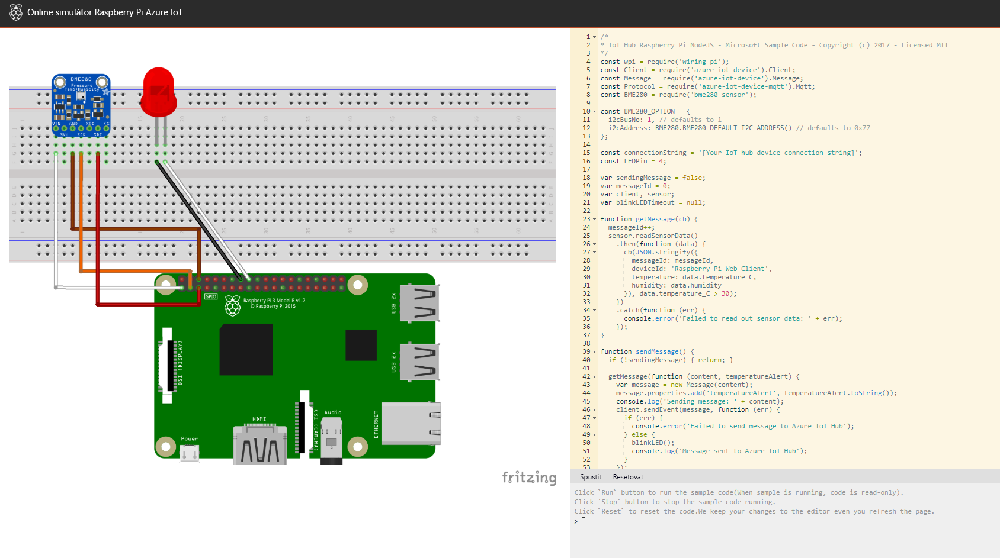

Zařízení Raspberry Pi si v poslední době získala hodně zájmu a používají se pro testování teorií a další zajímavé věci. Zařízení Raspberry Pi jsou sice poměrně levná, ale někteří lidé by si možná rádi vyzkoušeli jejich funkce, než si nějaké koupí.

Microsoft vytvořil online [simulátor Raspberry Pi Azure IoT](https://azure-samples.github.io/raspberry-pi-web-simulator?azure-portal=true), který uživatelům umožňuje ovládat emulovaný hardware prostřednictvím kódu. Emulátor zobrazuje zařízení Raspberry Pi připojené k senzoru teploty, vlhkosti a tlaku a k červené diodě LED prostřednictvím nepájivého pole, které umožňuje pokusné spojení obvodů. Zobrazený boční panel umožňuje uživatelům zadat javascriptový kód Node.js pro ovládání diody LED a shromažďování zkušebních dat ze simulovaného senzoru.

## Online simulátor Raspberry Pi Azure IoT

Při prvním spuštění simulátor spustí ukázkový program pro zaznamenávání teploty, který se zobrazí na příkazovém řádku. Stejnou ukázkovou aplikaci jde také spustit na skutečném zařízení Raspberry Pi, protože simulátor je navržený tak, aby lidem umožňoval testování kódu před jeho přenesením do skutečného zařízení.

Webový simulátor se skládá ze tří oblastí:

1. **Oblast sestavení**. Jedná se o místo, kde můžete sledovat stav zařízení. Ve výchozím nastavení se jedná o Pi propojené se snímačem BME280 a indikátorem LED. Tato konfigurace není v tuto chvíli přizpůsobitelná.
2. **Oblast psaní kódu**. Editor online kódu, ve kterém si můžete vytvořit aplikaci na Raspberry Pi s Node.js. Výchozí ukázková aplikace vám pomůže shromažďovat data ze senzoru BME280 a odesílat je do vaší instance služby Azure IoT Hub.
3. **Okno integrované konzole**. To je místo, kde můžete vidět výstup aplikace. V konzole se nachází tři funkce:
    - `run` - Spuštění vzorového kódu (při spuštění ukázky je kód jen pro čtení).
    - `Stop` - Zastavení spuštění vzorového kódu.
    - `Reset` - Resetování kódu.

Teď, když máte přehled o simulátoru Raspberry Pi prozkoumáme centrum IoT v Azure, ve kterém vytvoříte nový prostředek k zachytávání dat ze simulátoru.

<!-- Reference links 
-   Online Raspberry Pi Emulator:
    <https://docs.microsoft.com/azure/iot-hub/iot-hub-raspberry-pi-web-simulator-get-started>
-   <https://azure-samples.github.io/raspberry-pi-web-simulator/#GetStarted>-->