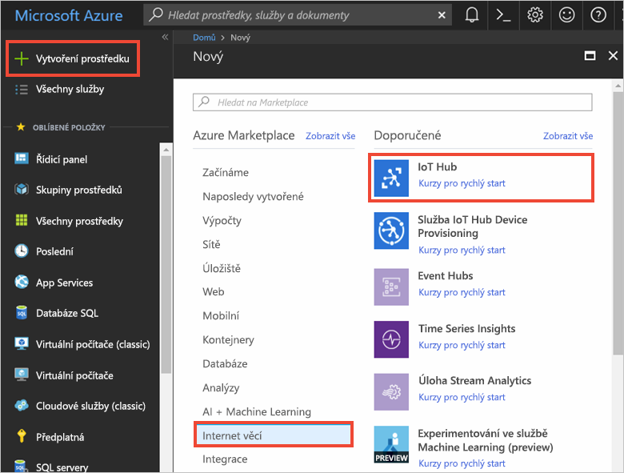
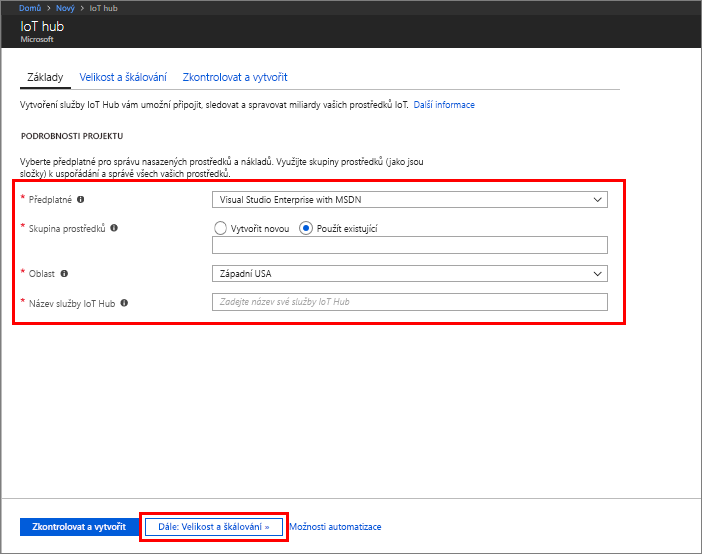
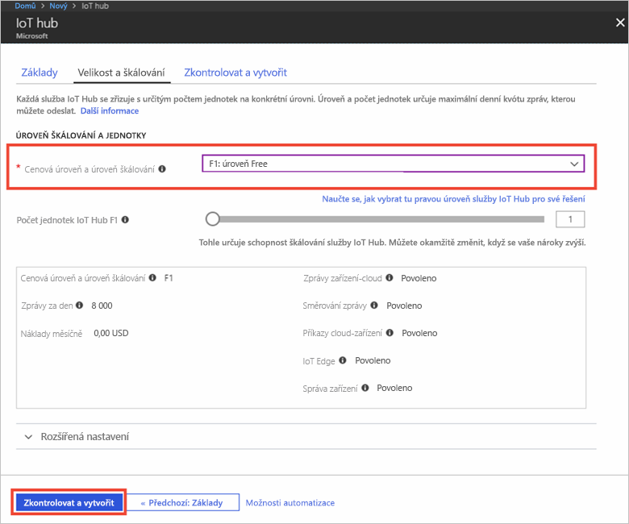
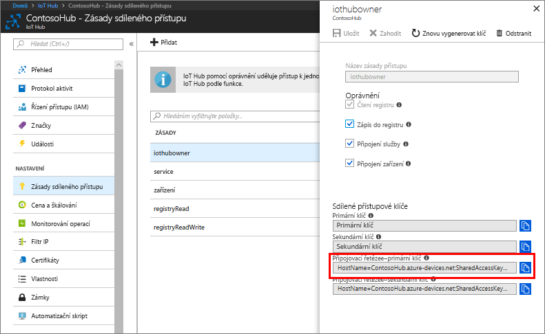
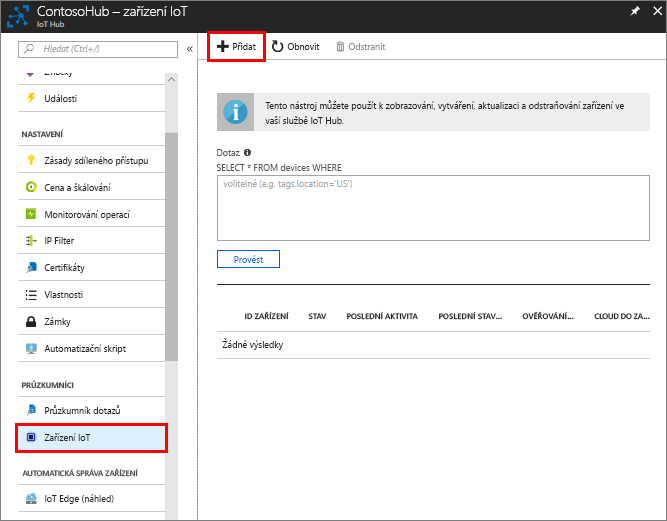
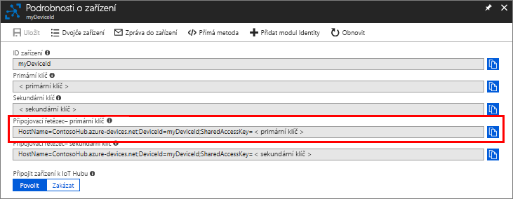
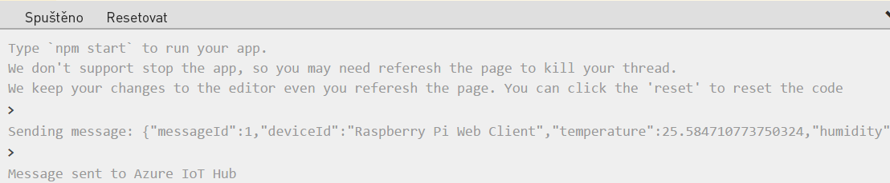

Záznam meteorologických dat je důležitý úkol, protože počasí ovlivňuje všechno, od provozu na silnicích až po ovládání systémů topení, ventilace a klimatizace (HVAC) v maloobchodních prodejnách. V tomto cvičení použijete online simulátor Raspberry Pi, o kterém jste se učili v předchozí lekci, k zachycení simulovaných meteorologických dat prostřednictvím IoT Hubu.

[!include]

I když k tomuto cvičení používáme simulované prostředí, můžete aplikaci spuštěnou na simulovaném zařízení v budoucnosti přesunout na skutečné zařízení.

## Vytvoření centra IoT Hub
Azure IoT Hub poskytuje funkce a model rozšiřitelnosti, pomocí kterých mohou vývojáři zařízení a back-endů vytvářet robustní řešení pro správu zařízení IoT. Zařízení sahají od jednoduchých senzorů a jednoúčelových mikrokontrolerů po výkonné brány, které směrují komunikaci pro skupiny zařízení. Kromě toho se způsoby použití a požadavky na operátory IoT výrazně liší v jednotlivých odvětvích. Navzdory této variabilitě poskytuje správa zařízení pomocí IoT Hub takový rozsah možností, schémat a knihoven kódu, aby bylo možné naplnit potřeby této různorodé množiny zařízení a koncových uživatelů.

Abyste mohli začít shromažďovat data ze simulátoru Raspberry Pi, musíte nejdřív vytvořit centrum IoT Hub.

1. Pomocí stejného účtu, kterým jste aktivovali sandbox, se přihlaste k [portálu Microsoft Azure](https://portal.azure.com/learn.docs.microsoft.com?azure-portal=true).

2. V levém horním rohu webu Azure Portal zvolte **Vytvořit prostředek**.

3. Vyberte **Internet věcí**a pak vyberte **IoT Hub**.

4. V podokně **IoT Hub** zadejte následující informace o IoT Hubu:

   - **Předplatné**: V tomto příkladu použijte výchozí předplatné.
   - **Skupina prostředků**: Použijte existující skupinu prostředků. Když umístíte všechny související prostředky do stejné skupiny, můžete je spravovat všechny společně. Například odstraněním skupiny prostředků se odstraní všechny prostředky, které tato skupina obsahuje.
   - **Název:** Vytvořte jedinečný název IoT Hubu. Pokud je zadaný název dostupný, zobrazí se zelené zaškrtnutí.
   - **Umístění**: Vyberte umístění, které je vám nejblíže.

    [!include]

    > [!IMPORTANT]
    > Služba IoT Hub bude veřejně zjistitelná jako koncový bod DNS, takže se ujistěte, že při jeho pojmenování nepoužíváte žádné citlivé údaje.

    

1. Pokračujte ve vytváření centra IoT Hub výběrem možnosti **Další: Velikost a škálování**.
2. Zvolte si **Úroveň ceny a škálování**. V tomto příkladu vyberte **F1 – úroveň Free**.

    

3. Vyberte **Zkontrolovat a vytvořit**.

4. Zkontrolujte informace o centru IoT a klikněte na **Vytvořit**. Vytvoření centra IoT může trvat několik minut. Průběh můžete sledovat v podokně **Oznámení**.

<!--STOPPED HERE-->
<!--
Now that you have created an IoT hub, it's time to locate the important information that you use to connect devices and applications to your IoT hub. In your IoT hub navigation menu, open **Shared access policies**. Select the **iothubowner** policy, and then copy the **Connection string---primary key** of your IoT hub. For more information, see [Control access to IoT Hub](https://docs.microsoft.com/azure/iot-hub/iot-hub-devguide-security).

> [!NOTE]
> You do not need this iothubowner connection string for this set-up exercise. However, you may need it for some of the tutorials or different IoT scenarios after you complete this set-up.

-->

## Registrace zařízení
Zařízení musí být zaregistrované ve vašem centru IoT Hub, aby se mohlo připojit.

1. V navigační nabídce svého centra IoT Hub otevřete **Zařízení IoT**, klikněte na **Přidat** a zaregistrujte zařízení v centru IoT Hub.

   

2. Zadejte **ID** nového zařízení. V ID zařízení se rozlišují malá a velká písmena.

    > [!IMPORTANT]
    > ID zařízení může být viditelné v protokolech shromažďovaných pro účely zákaznické podpory a řešení potíží. Proto jako název nepoužívejte citlivé údaje.

3. Klikněte na **Uložit**.
4. Vytvořené zařízení otevřete v seznamu v podokně **Zařízení IoT**.
5. Zkopírujte si **Připojovací řetězec – primární klíč**. Budete ho potřebovat později.

   

## Odesílání simulovaných telemetrických dat

1. Otevřete [simulátor Raspberry Pi Azure IoT](https://azure-samples.github.io/raspberry-pi-web-simulator?azure-portal=true).
1. Zástupný text na řádku 15 nahraďte připojovacím řetězcem zařízení v centru Azure IoT Hub, který jste právě zkopírovali.
1. Kliknutím na `Run` tlačítko nebo typ `npm start` v okně konzoly spustíte aplikaci.

    

1. Měl by se zobrazit následující výstup s daty snímače a zprávami posílanými do vašeho centra IoT Hub.

    

## Čtení telemetrických dat z centra
Co se tedy děje? Centrum IoT přijímá zprávy typu zařízení-cloud odeslané ze simulovaného zařízení. Abychom to mohli zobrazit, podívejme se rychle na to, jak Azure IoT Hub zpracovává příchozí data. Ve svém IoT Hubu v nabídce **Sledování**vyberte možnost **Metrika**. Vydržte několik minut a počkejte, než se data promítnou do obrázku.

<!--Reference links
https://docs.microsoft.com/azure/iot-hub/iot-hub-raspberry-pi-web-simulator-get-started-->
